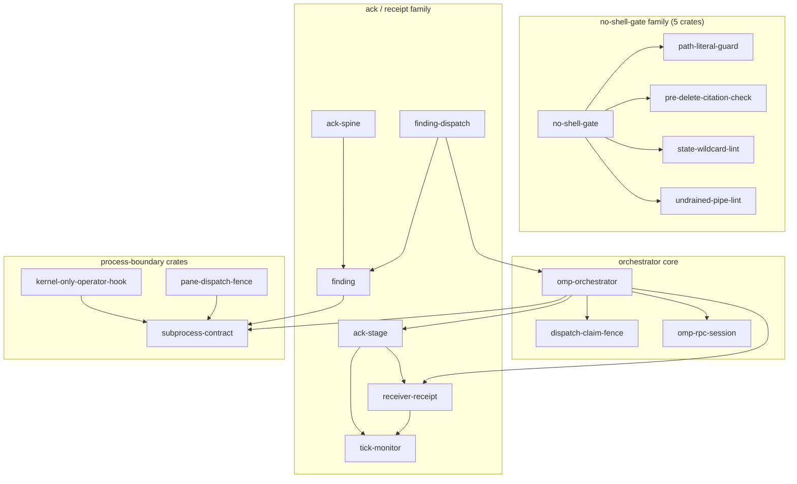
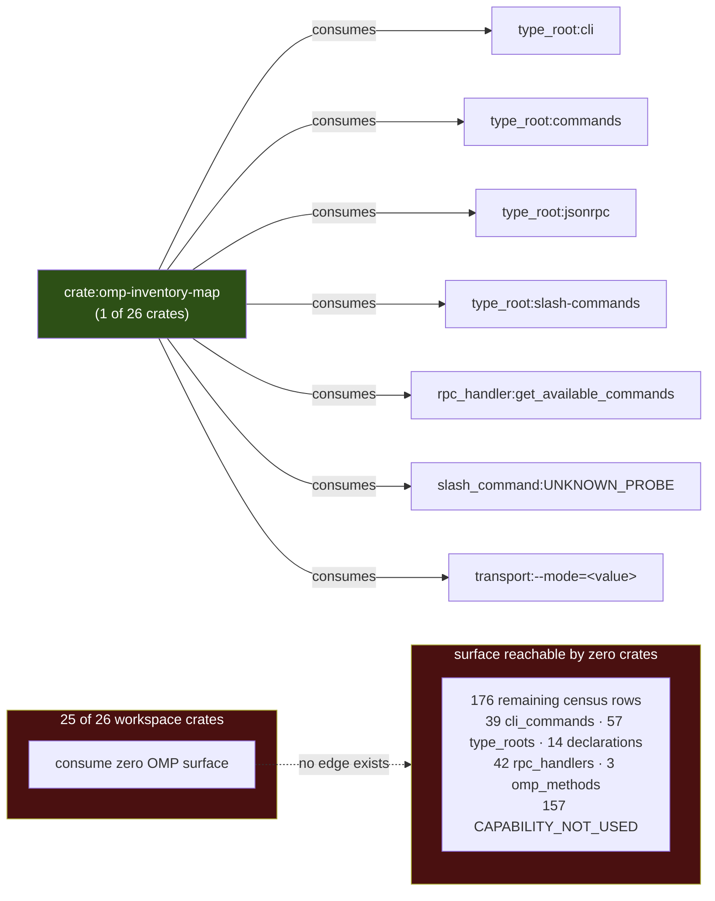
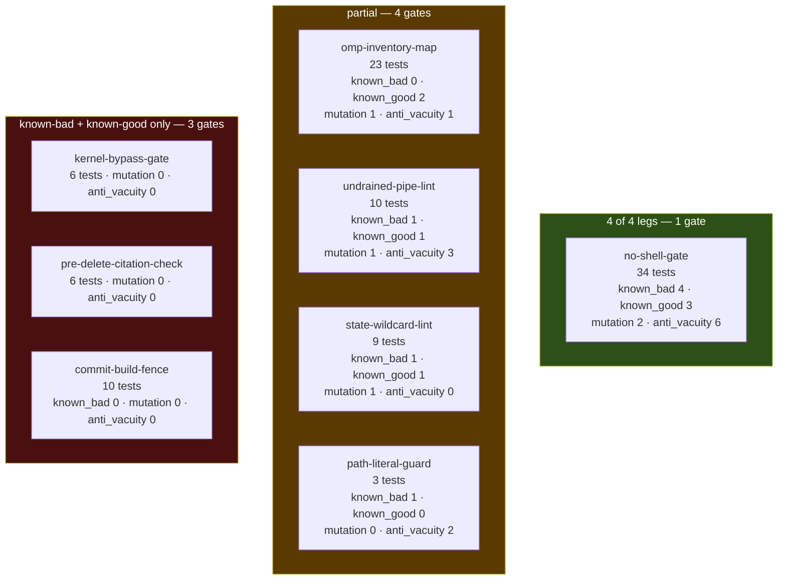
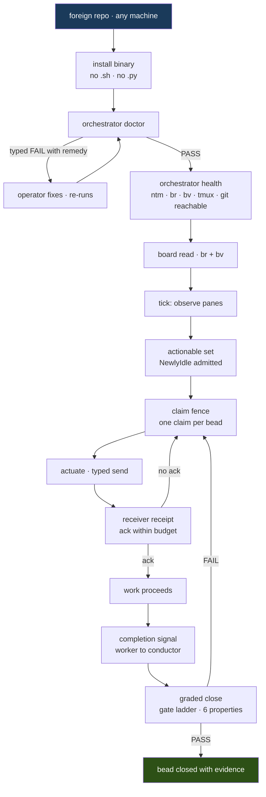
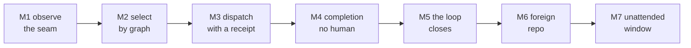

# PLAN.md — omp-orchestrator

**A single installable Rust binary that takes a repo's own work graph and drives it to completion
across a fleet of agents, refusing every step it cannot prove.**

Assembled from `docs/plan/`. **The section files are the source of truth**; this document is their
concatenation. Edit a section, then re-assemble — never edit here.

> **9 measured claims here were refuted while this was being written**, each caught by an agent
> re-deriving rather than reading. They are kept as labelled retractions, because the failures are
> more instructive than the corrected values. This count is **generated from the §7 table at
> assembly time** — it was previously typed twice and disagreed with itself.

> §8 carries **12 open questions** and **5 kill criteria**, all unanswered, registered so they
> are assignable. §11 walks the idea-to-shipped lifecycle and finds **3 of 45** dispatch-property
> cells actually in use.

---

## Contents

- **`00-brief.md`** — 00 — The brief
- **`01-idea.md`** — 01 — The idea
- **`02-surface-census.md`** — 02 — What we are mapping: every OMP surface
- **`03-crates.md`** — 03 — Every crate: contract, schema, types, dependencies
- **`04-diagrams.md`** — 04 — FrankenMermaid: the system, generated not drawn
- **`05-actions.md`** — 05 — Every action: intended purpose, and the negative pattern it must refuse
- **`06-gates.md`** — 06 — The testing, validation, and gating frameworks we apply
- **`07-installability.md`** — 07 — Installability: distribution, identity, and the canonical CLI contract
- **`08-end-users.md`** — 08 — The end-user journey: another repo, another machine, orchestrating their own project
- **`09-milestones.md`** — 09 — Milestones, done-definitions, and how this plan is validated
- **`10-prior-art.md`** — 10 — What would Jeffrey do: prior art mined from the mirror
- **`11-lifecycle.md`** — 11 — The lifecycle: idea to shipped, walked down the crates and the skills

---

<!-- ===== 00-brief.md ===== -->

# 00 — The brief

**This file exists because the requirements were living in chat.** That is the same failure mode
this project was stood down to fix: the stand-down reap found **seven real conditions living only in
pane scrollback**, which dies with the pane. A requirement that exists only in a conversation is a
requirement that will be silently dropped the moment the conversation is compacted.

So the brief is written down first, verbatim, before the sections that satisfy it. Every section
file in `docs/plan/` is answerable to this document. If a section does not trace to a requirement
here, it is scope creep. If a requirement here has no section, that is a gap and it is visible.

Written 2026-08-31 during the stand-down. Authoritative until superseded in place.

---

## 1. The requirements, in Josh's words

These are quoted verbatim from the session that commissioned this plan. They are not paraphrased,
because paraphrasing a requirement is how a requirement quietly changes.

> **R1 — Stop and plan.** "i think its time we step back a bit. we've been running and gunning for
> a bit without a really great defined bead dag. I think we need to step back and go into a full
> process to define from a - z the entire project management journey, the gates, the crates, the
> schema, the types, and the entire plan - validation, define what done looks like at each
> milestone, and we work from that."

> **R2 — Reap, don't refill.** "lets not dispatch workers after they go idle this next time. lets
> reap work. lets update docs and stuff. lets ensure our repo is set up properly with good
> filestystem, good doc management structure."

> **R3 — One document, investor-grade.** "I want a single plan doc that we beat up and grade and
> turn into a - here is what we're doing - full /skill:readme-writing companion that would pass our
> github repo publishability bar with a future-tense on what we're building. it has to be something
> that could pass an 'investor' test - we give it to them and they can beat up the plan, find any
> gaps, and pass or fail us with their multi-decades of experience buying and selling and growing
> companies."

> **R4 — Total coverage of the system.** "i want this plan to cover every crate - every schema input
> / output, every typed interface, how everything is interacting, full frankenmermaid diagrams,
> etc."

> **R5 — Every OMP surface.** "every omp surface"

> **R6 — The gating frameworks.** "the testing / validation / gating frameworks that we are
> applying"

> **R7 — Mine the mirror at every gap.** "use fh - mine the dicklesworthstone projects along the way
> - anywhere we find a gap - we should ask - what would jeffrey do in one of his projects"

> **R8 — Installability.** "we need to have installability, how other repos and machines are going
> to use this, full /skill:canonical-cli-scoping"

> **R9 — All the way to end users.** "all the way to end users (other projects / repos / machines)
> are using it to orchestrate their projects"

> **R10 — The frame, and the SOTA bar.** "think about this plan as - idea - what it is, why we're
> doing it, the binaries we are wrapping, what the stated intended purpose of each action is with
> negative patterns, the outline of the high level what we're mapping, provide intricate design
> specs for each on what advanced framework we are applying and why - every aspect of this needs to
> be on par or greater than SOTA - same as the binaries we are wrapping."

> **R11 — Write it down before dispatching.** "get all of this documented in the planning doc so its
> written down and not in chat before dispatching team."

**R11 is the rule that produced this file**, and it is retroactively the most important one: it is a
process requirement about how requirements themselves are handled. It is now doctrine for this repo.

> **R12 — added by grading round 1, and not by Josh.** Every question an experienced operator asks
> before funding work must be either answered or **registered as an open question with an owner**.
> Added because all four graders found the same hole and `%1408` found it *structurally*: §2's
> table is the only mechanism turning a question into something a section must answer, so cost,
> timeline, headcount, competition, security, licensing, and kill criteria were not merely
> unanswered — **they were unaskable from inside the requirement set**. R12 and §8 close that.
> A requirement the graders had to invent is the strongest evidence this round was worth running.

### 1.5 Glossary — the jargon R1–R12 use without defining

`%1408` filed this in round 1 and I skipped it twice. The requirements are quoted **verbatim**, which
is correct and non-negotiable, and the cost is that they carry fleet jargon an outside reader cannot
resolve. An investor reading R1 hits "bead dag" in the first sentence.

| term | what it means here |
|---|---|
| **bead** | one unit of tracked work, in the `br` issue tracker. Roughly a ticket, with typed dependencies and a close policy that refuses prose |
| **bead DAG** | the dependency graph over beads. `bv` ranks it by PageRank to decide what to work next |
| **reap** | collect finished and abandoned work from a fleet *before* dispatching more — the opposite of refilling idle workers |
| **pane** | one tmux pane running one agent. The unit of fleet capacity, addressed by `pane_id` such as `%1413` |
| **tick** | one iteration of the orchestrator loop: observe → select → dispatch → verify |
| **the mirror** | a local clone of 210 of Jeffrey Emanuel's repositories at `/Volumes/ZestData/dicklesworthstone-mirror`, mined for prior art |
| **the fleet** | the set of agent panes in one `ntm` session |
| **dispatch** | sending a work packet to a pane. Distinct from *delivery*, which requires a receipt |
| **gate** | a check that refuses. Not a test — a gate's output is a refusal with a reason |
| **leg** | one property of a gate's test suite: known-bad, known-good, mutation, anti-vacuity |
| **known-bad / known-good** | a planted defect the gate must catch; a clean input it must pass. Both are required, and 1 of 8 gates lacks the second |
| **anti-vacuity** | the rule that an empty scan set is an ERROR, never a pass |
| **BUILT ≠ WIRED** | a mechanism that exists, is correct, tested — and is invoked by nothing |
| **GHOST** | an installed binary whose source is not in the tree we read. Four instances measured |
| **OMP** | Oh My Pi, the agent CLI this orchestrator wraps; `omp/18.0.11` |
| **`br` / `bv`** | the bead tracker CLI, and its graph-triage companion |
| **`ntm`** | the tmux fleet manager that owns sessions and panes |
| **`fh`** | franken-harvest, the queryable index over measured doctrine and the mirror |
| **asupersync** | the cancellation/obligation async runtime this repo binds to, pinned at rev `fa3c01aec` |
| **`Cx`** | asupersync's cancellation context, passed first in every async API we own |

**NO-CLAIM:** a glossary makes the requirements *readable*; it does not make them *right*, and it
does not close R2 or R5, whose rows above are marked NOT CLOSED and PARTIAL on their own evidence.

---

## 2. What each requirement demands, made checkable

A requirement that cannot be checked is a wish. Each row states the observable that closes it.

| id | demand | closed by |
|---|---|---|
| R1 | A-to-Z journey: gates, crates, schema, types, validation, per-milestone done | §09 exists and every milestone carries an OBSERVABLE |
| R2 | Reap before refill; repo hygiene; doc structure | **NOT CLOSED — a past event is not a closure.** The reap happened once (28/25/19/2). Closing this needs a *standing* check; the §7.3 staleness predicate is the candidate and is not built |
| R3 | One document, investor-attackable, future-tense on what we build | `docs/PLAN.md` assembles; §09 carries the grading rubric that invites failure |
| R4 | Every crate, every schema I/O, every typed interface, interactions, diagrams | §03 has one row per workspace crate; §04 has ≥6 generated diagrams |
| R5 | Every OMP surface | §02 enumerates all 183 census rows by kind with names — **and carries the `slash_commands=0` vs `expected=136` hole as a named, unclosed gap**, so this row is PARTIAL by its own evidence |
| R6 | The testing/validation/gating frameworks | §06 gives an intricate design spec per framework |
| R7 | Mirror prior art at every gap | §10 gives a search command + verbatim quote or explicit not-found per gap |
| R8 | Installability + canonical CLI scoping | §07 specifies doctor/health/repair + validate/audit/why |
| R9 | End users orchestrating their own projects | §08 gives personas, a zero-to-first-tick walkthrough, adapters, degradation |
| R10 | Idea → why → binaries → actions+negatives → map → design specs at SOTA | §01 and §05; SOTA bar is operationalised per wrapped binary |
| R11 | Requirements written down before dispatch | **this file** |
| R12 | Economic and risk questions are registered, owned, and answerable | §8 — ten open questions, five kill criteria, all `OPEN` |

**NO-CLAIM:** this table records that a section is responsible for a requirement. It does not
establish that the section discharges it well. Grading the sections is a separate pass, and §09
carries the rubric for it.

---

## 3. The measured facts the plan is built on

Every number below carries the command that derives it. These were measured 2026-08-31 in this
session. Sections must use these figures and must not re-derive them differently without saying so.

### 3.1 The binaries we wrap — `<bin> --version`

| binary | version | path |
|---|---|---|
| `omp` | `omp/18.0.11` | `/Users/josh/.local/bin/omp` |
| `ntm` | `ntm version v1.30.0-1-gda270719` | `/Users/josh/.local/bin/ntm` |
| `br` | `br 0.4.1` | `/Users/josh/.local/bin/br` |
| `bv` | `bv v0.20.0` | `/opt/homebrew/bin/bv` |
| `git` | `git version 2.50.1 (Apple Git-155)` | `/usr/bin/git` |
| `cargo` | `cargo 1.100.0-nightly (e8cb624d5 2026-08-2…)` | `/Users/josh/.rch/shims/cargo` (a shim) |
| `fh` | `franken-harvest 0.1.0+tree.7b0fc50c3e5a29d…` | `/Users/josh/.local/bin/fh` |
| `jsm` | `jsm 0.1.4` | `/usr/local/bin/jsm` |
| `tmux` | **rejects `--version`** (`tmux: unknown option -- -`) | `/opt/homebrew/bin/tmux` |

`tmux` is the one binary that refuses `--version` — but **it is not versionless**: `tmux -V` returns
`tmux 3.6a` at exit 0. `IdeaSection` challenged the first draft of this sentence, which claimed tmux
had "no machine-readable version handshake," and was right to. The corrected finding is narrower and
considerably sharper, because there is **no single version flag that covers the set**:

| flag | answers | fails |
|---|---|---|
| `--version` | 8 of 9 | `tmux` |
| `-V` | **6 of 9** | `omp`, `bv`, `git` |

Only `ntm`, `br`, `cargo`, `fh`, `jsm` answer **both**; `tmux` answers `-V` alone. So a uniform
probe loop must try more than one spelling or it will record a present binary as absent.

> **The `-V` row said "5 of 9" until `%1409` (evidence lens) refuted it.** Re-derived by looping all
> nine: `ntm`, `br`, `tmux`, `cargo`, `fh`, `jsm` answer `-V` — **six**. The table excluded `tmux`
> from the `-V` count while the sentence directly above it says `tmux -V` returns `tmux 3.6a` at
> exit 0. A table contradicting its own caption, inside the subsection *about* getting this binary
> wrong twice already. Ninth refutation; third consecutive one on tmux; all three the author's.

**The first draft of this paragraph was wrong, and the error was mine — not tmux's.** It claimed
`tmux --version` "prints a usage block **and exits 0**", making tmux the exemplar of an exit code
that lies. `PriorArtWriter` re-measured without a pipeline and refuted it:

```
tmux --version >/tmp/t.out 2>/tmp/t.err ; echo $?
  exit=1   stdout_bytes=0   stderr_bytes=158

tmux --version 2>&1 | head -1 ; echo $?
  exit=0                       <- head's status, not tmux's
  PIPESTATUS=(1 0)
```

**tmux is well-behaved.** It fails, says so on stderr, writes *nothing* to stdout, and returns 1 —
textbook. The "exits 0" came from my own probe, which read `$?` after a pipeline, where the status
belongs to the last command. **My measurement harness laundered the failure into a success and I
then attributed the defect to the subject.** The exit-code-that-lies example belongs to the harness
and to our `installer` binary, not to tmux.

The corrected hazard points the **opposite way**, and it is the live one. A probe that treats
non-zero as *absent* records tmux — present, working, `3.6a` on `-V` — as **MISSING**. That is a
false negative on the presence of the one binary through which we read pane truth. It is not
theoretical: `pi_agent_rust/src/doctor.rs:924` gates `check_tool` on `output.status.success()` and
only forgives a failure through `probe_failure_is_known_nonfatal` at `:1052`, which hard-codes
`if tool.ne("sh")` — so tmux falls straight through to "invocation failed."

**This is the third self-inflicted error in this brief caught by a subagent, and all three are one
class:** a figure nobody recomputed (`1 of 8`), a search nobody re-ran without its harness artifact
(the `--include=` false zero), and a measurement nobody re-took without its pipeline (this one). The
swarm is functioning as the adversarial reviewer this plan argues it needs — against the conductor.
*All three recorded rather than quietly patched, because the failures are more instructive than the
corrected numbers.*

### 3.2 The OMP surface census

Produced by the built scanner: `/Volumes/BuildShared/cargo-targets/debug/omp-inventory-map`
→ 544,697 bytes of JSON, **exit 2**, envelope
`{"schema_version":"omp-inventory-map/v1","command":"doctor","status":"UNKNOWN","data":{…}}`.

- **184 nodes, 207 edges, 183 rows.**
- Counts: `cli_commands=39`, `type_roots=57`, `declarations=14`, `rpc_handlers=42`,
  `slash_commands=0`, `omp_methods=3`, `workspace_crates=26`.
- **The scanner reports its own hole.** Every count has an `expected_*` twin. Six of the seven
  match exactly. One does not: **`slash_commands=0` against `expected_slash_commands=136`.** That
  single mismatch is why the envelope carries `status: UNKNOWN` and exits 2 — the scanner knows it
  failed to enumerate a surface it expected to find, and refuses to report success. **136 slash
  commands are the largest unmapped region of the OMP surface**, and they were missing from the
  first draft of this brief; `SurfaceCensus` caught it by comparing the twins, which is exactly the
  challenge the broadcast asked for. The census is not complete until slash-command enumeration
  either succeeds or carries a named reason. *Recorded under R11 — it was not written down before.*
- Row kinds: cli_command 39 · type_root 57 · rpc_handler 42 · workspace_crate 26 · declaration 14 ·
  omp_method 3 · transport 1 · slash_command 1.
- Classification: **`CAPABILITY_NOT_USED` 157** · `SCRAPED_OR_OBSERVED_ALTERNATIVE` 18 ·
  **`MAPPED_BY_DIRECT_PROBE` 8**.
- Edge relations: `provides` 157 · `map-to-none` 25 · `path-depends-on` 18 · **`consumes` 7**.
- **All 7 `consumes` edges originate from one crate, `omp-inventory-map`**, each carrying the
  evidence string *"direct process probe produced this row"*. 25 of 26 crates consume zero OMP
  surface.

The previously-published figure **"81 JSON-RPC methods, 17 used" is RETIRED** — it was not
re-derivable. The measured surface is 39 CLI subcommands, 71 type-surface entries (57 dirs + 14
top-level `.d.ts`), one `--mode=rpc` transport, and **3** methods matching `omp/*`.

### 3.3 The vacuity finding — against ourselves

```
python3 -c "…Counter(json.dumps(r.get('must_be_true')) for r in rows)…"
  crate rows:     n=26   distinct must_be_true=1  distinct negative_evidence=1
  non-crate rows: n=157  distinct must_be_true=1  distinct negative_evidence=1
```

All 183 rows carry the four mandatory fields (`inputs`, `outputs`, `must_be_true`,
`negative_evidence`) with **zero missing** — and exactly **one distinct value** of `must_be_true`
and **one distinct** `negative_evidence` across the entire census.

**The four-field discipline this orchestrator demanded of every worker is satisfied syntactically
and vacuously.** The universal invariant is
`["The source probe is non-empty before a known verdict is emitted.","A versioned inventory envelope carries the probe state."]`
and the universal negative evidence is
`["No repository source grep was used; ownership is derived from metadata and direct probes."]`.
For crate rows, `inputs`/`outputs` describe **the scanner's provenance**, not the crate's contract.

This is the sharpest finding of the session and it indicts the conductor, not a worker. It is the
same anti-vacuity property we require of every gate, failing on our own inventory.

### 3.4 The crate dependency graph — all 18 `path-depends-on` edges

```
ack-spine                 -> finding
finding                   -> subprocess-contract
ack-stage                 -> receiver-receipt
ack-stage                 -> tick-monitor
receiver-receipt          -> tick-monitor
finding-dispatch          -> finding
finding-dispatch          -> omp-orchestrator
omp-orchestrator          -> ack-stage
omp-orchestrator          -> dispatch-claim-fence
omp-orchestrator          -> omp-rpc-session
omp-orchestrator          -> receiver-receipt
omp-orchestrator          -> subprocess-contract
kernel-only-operator-hook -> subprocess-contract
no-shell-gate             -> path-literal-guard
no-shell-gate             -> pre-delete-citation-check
no-shell-gate             -> state-wildcard-lint
no-shell-gate             -> undrained-pipe-lint
pane-dispatch-fence       -> subprocess-contract
```

`subprocess-contract` is the most-depended-on crate (4 dependents). That is the correct shape: it is
the asupersync process-group / drain-both-pipes boundary, so everything that spawns should route
through it.

### 3.5 The gate framework, measured

```
find crates -name '*.rs' -path '*/tests/*' | wc -l   ->  26 integration test files
grep -rc '#\[test\]' …                                -> 370 #[test] fns
```

| crate | tests | known_bad | known_good | **mutation — what it acts on** | anti_vacuity |
|---|---:|---:|---:|---|---:|
| `omp-inventory-map` | 23 | 0 | 2 | **TREE** — builds a real temp tree, mutates files, restores byte-identically | 1 |
| `undrained-pipe-lint` | 10 | 1 | 1 | **FIXTURE** — mutates an inline `r#"…"#` source string | 3 |
| `state-wildcard-lint` | 9 | 1 | 1 | **FIXTURE** — mutates an inline `r#"…"#` source string | 0 |
| `no-shell-gate` | 34 | 4 | 3 | **AFFORDANCE** — a switch named to be flipped; nothing flips it | 6 |
| `commit-build-fence` | 10 | 0 | 1 | NONE | 0 |
| `kernel-bypass-gate` | 6 | 1 | 1 | NONE | 0 |
| `pre-delete-citation-check` | 6 | 1 | 1 | NONE | 0 |
| `path-literal-guard` | 3 | 1 | 0 | NONE | 2 |

**This column was rebuilt twice, and `%1414` was right both times.** Round 1 counted keyword hits.
Round 2 typed them AUTOMATED/MANUAL/AFFORDANCE/NONE — and `%1414` refused that too: *"the typed
rebuild still defines AUTOMATED by a keyword grep."* Correct. `AUTOMATED` meant "a function whose
**name** contains `mutation`," which is the same proxy wearing a better label. The column now
records **what the mutation acts on**, read from each test body:

```
TREE       mutates a real filesystem tree and restores byte-identically
FIXTURE    mutates an inline source string; production source is never touched
AFFORDANCE a named switch built to be flipped, with no test flipping it
NONE       none of the above
```

**The honest count is now zero.** No gate in this workspace mutates **production source through the
real hook**. The strongest leg is `omp-inventory-map`'s temp-tree mutation, which is genuinely good
and still not production. Two `FIXTURE` legs mutate string literals — and *"a fixture drifted from
production certifies nothing"* is `fh` row `C38`, already binding doctrine in this repo, which
those two legs violate by construction.

> **Headline history, four revisions:** `1 of 8` → `2 of 8` → `1 of 8, different gate` → **`0 of 8`
> by the only definition that means anything.** Each revision came from someone refusing the
> previous measurement, and the number fell every time. That is what a column looks like when it is
> measured instead of counted.

The superseded round-2 definition is kept here as a labelled retraction, because the *reason* it
was wrong is the transferable lesson: `AUTOMATED = a #[test] fn whose name contains "mutation"`
read as a measurement and was a rename. Typing a proxy does not stop it being a proxy.

> **Attribution, corrected — `%1409` caught me inflating this.** The first draft read *"`%1414`
> demanded this rebuild as its BLOCKER 1"* and quoted it. The quote is real (`g-adversarial.md:10`,
> *"Retire this table and rebuild it with typed automated, manual, affordance, and none
> statuses"*), and `%1409` was wrong to say it appears in no artifact. But it was right about the
> thing underneath: **my own spawn prompt to `%1414` said *"should it be retired and rebuilt? Argue
> it."*** I proposed the conclusion, it returned my words, and I cited the echo as an independent
> demand. The finding is real; the **independence was manufactured**. See §7.4.

**The leg counts are a proxy, and following that NO-CLAIM found what it hides.** `06-gates.md`
attaches this boundary to the table above: *"the leg table counts files whose name matches a
property. A file named `mutation.rs` that mutates nothing still counts."* Acting on that warning and
reading the tests, the `mutation` column turns out to conflate **three different things**:

| kind | example | strength |
|---|---|---|
| an **automated** mutation test | `undrained-pipe-lint/tests/specimens.rs:205` `fn mutation_removing_stderr_pipe_retires_violation()` | strongest — the suite runs it |
| a **documented manual** procedure | `no-shell-gate/tests/gate.rs:12-14` names the three tests that must go RED under mutation: *"A green mutation run would mean the legs are not attributable to the pattern and prove nothing"* | real, but a human must run it |
| a **mutation affordance** | `no-shell-gate/tests/wired_lanes.rs:95-96` — *"The test-code stripping switch is deliberately named so its mutation is attributable"* over `const STRIP_TEST_CODE: bool = true;` | weakest — an invitation, not a leg |

So `no-shell-gate` — the gate this brief has called the exemplar throughout — has **no test function
with `mutation` in its name at all**. Its mutation discipline is a documented procedure over named
tests, which is genuine and is *not the same thing* as a leg `cargo test` executes.

**That did overturn `2 of 8`, and the table above is the rebuild.** Typing the column moved the
count a fourth time — `1 of 8` → `2 of 8` → `2 of 8, measuring three things` → **`1 of 8, and a
different gate`**. The honest table needed a typed value, not a bigger count, and once typed the
exemplar changed hands: `undrained-pipe-lint` qualifies and `no-shell-gate` does not.
*Recorded under R11.*

**1 of 8 gates has all four legs with an AUTOMATED mutation test** — `undrained-pipe-lint`
(1/1/AUTOMATED/3). **4 of 8 have no mutation mechanism of any kind** — `commit-build-fence`,
`kernel-bypass-gate`, `pre-delete-citation-check`, `path-literal-guard`. 3 of 8 have an automated
mutation test; 1 has only an affordance. 2 of 8 have no known-bad. 1 of 8 —
`path-literal-guard` — has **no known-good leg**, which makes it the highest-risk gate in the set:
an attack-only suite ships an over-strict gate, and an over-strict gate gets routed around, which is
a slower death than no gate at all.

> **The first draft of this headline said "1 of 8" and "5 of 8," and both were wrong against the
> table printed directly above them.** `GateFrameworks` recomputed from the table and caught it.
> This is the purest instance of the defect this whole document exists to prevent: **a transcribed
> headline that nobody recomputes**, sitting one line below the data that refutes it. Prose review
> does not catch it — only arithmetic does. It is the same family as the retired "81 JSON-RPC
> methods, 17 used" figure, except this one was self-inflicted **in the brief that forbids it**, by
> the conductor, in the act of writing the rule. Every section quoting "1 of 8" or "5 of 8" must be
> corrected at assembly.

**Measurement hazard — shell `grep -r --include=` returns empty instead of failing.** Also found by
`GateFrameworks`, which measured 0 files matching `#![forbid(unsafe_code)]` while the harness grep
returns **55**. Verified both directions: `grep -rl 'forbid(unsafe_code)' --include='*.rs' crates`
→ `0`, quoted or unquoted; the same search without `--include` works and reproduces this table
exactly. So the leg table above is sound, and any figure in any section derived with an
`--include=` shell grep is a **false zero**. A blocked tool that returns empty rather than erroring
is precisely the never-silent-fail violation we gate against — in our own measurement path.
*Recorded under R11.*

**An honest skip is not a useful test — found by `EndUserJourney`.** `composer-typed` ships a
differential oracle, and the discipline in it is genuinely first-rate: `tests/differential.rs` types
the absence of its comparison target as `OracleStatus::MissingScript(PathBuf)`, announces the skip
loudly with the exact resolved path, and its header names the precise failure it exists to avoid —
*"the report looked differential while nothing differential ran."* That is anti-vacuity implemented
correctly.

And the oracle it compares against **cannot exist in this repo**. Line 41 resolves it to
`../../bin/composer-typed.py`; `ls bin/` returns *No such file or directory*, and
`find . -name 'composer-typed.py'` returns nothing, because **the no-`.py` rule forbids it**. So the
test is green forever and can only ever skip. Our hardest rule deleted the oracle our differential
test needs.

This is not the vacuity defect — the skip is typed and loud, which is exactly right. It is a
different and less obvious failure: **a test that is permanently unable to run is indistinguishable
from a passing one in any aggregate count**, and it sits inside the 370 `#[test]` figure quoted
above. The fix is a policy decision the plan must make rather than dodge: either the oracle lives
outside the tracked tree as a release artifact, or the differential lane is retired with a named
reason, or the rule gets its first exemption. *Recorded under R11 — not previously written down.*

### 3.6 The addressability defect — how the sixth gate property was born

`omp-inventory-map --help` returns:

```json
{"schema_version":"omp-inventory-map/v1","command":"doctor","status":"ERROR",
 "data":null,"error":"CONFIG_ERROR unknown argument --help"}
```

The gate is **built, correct, and undiscoverable**: 13 tests pass and
`crates/omp-inventory-map/src/types_inventory.rs:176-178` deliberately excludes `Observation` from
the allowance list so the collision demands convergence — but the running binary's 544 KB doctor
output contains **zero** occurrences of `Observation`, `CONVERGE`, or `Verdict`.

Not built-vs-wired. **Wired-but-unaddressable.** It adds a sixth required gate property:
**ADDRESSABLE** — one documented command runs it, and `--help` names that command.

### 3.7 Other binding facts

- **The one hard rule:** no `.sh`, no `.py`. A Rust gate walks `git ls-files` and fails the build on
  either extension. The exemption list is empty.
- **The async contract:** asupersync 0.4.9, pinned rev `fa3c01aec`. `&Cx` first; `cx.checkpoint()`
  in loops; region-owned tasks, no detached tasks; **kill the process GROUP, not the pid**; drain
  both pipes; **a timeout is not a verdict**.
- Measured conformance across 29 raw spawn sites: 4 crates use `subprocess-contract`; 12 of 14 async
  fns take `cx` first.
- **Unsafe — corrected by `CrateSpecs`.** The first draft said "16 of 22 forbid unsafe," which had
  both an unstated denominator and an unstated mechanism. Measured: **20 of 26** declare
  `unsafe_code = "forbid"` in the manifest; **25 of 26** carry `#![forbid(unsafe_code)]` as an inner
  attribute; **19 of 26** carry both; the **union is 26 of 26**. The finding survives correction and
  is worse than it looked: total coverage holds by **two independent habits with no single
  enforcement point**, so either habit lapsing on a new crate is invisible.
- **`omp-types` — corrected by `CrateSpecs`.** The first draft claimed it re-exports `AckKind`,
  `DeliveryClass`, `ObligationLedger`, `Budget`, and `Outcome`. **That is wrong.** Measured with
  `grep -c` against `crates/omp-types/src/lib.rs`: `ObligationLedger` occurs **zero** times, and
  `AckKind`/`DeliveryClass` occur only inside the doc comment that names them as blocked. What
  actually re-exports is the `Outcome` family, the `Budget` family, and `ObligationId` / `RegionId` /
  `TaskId` / `Time`.

  The reason is documented in `crates/omp-types/Cargo.toml:11-17`: `AckKind` and `DeliveryClass`
  live behind `#[cfg(feature = "messaging-fabric")]`, that feature transitively needs
  `#[cfg(any(test, feature = "test-internals"))]`, and upstream issue #46 correctly removed
  `test-internals` from the default set — so enabling it here would **reintroduce the exact
  production leak #46 closed**.

  This changes the plan, not just the sentence: **the half of the vocabulary that would collapse the
  three ack dialects is blocked at an upstream feature boundary, not merely unadopted.** Any
  migration schedule assuming `AckKind` is available today is wrong. The crate still has **zero
  dependents**.
- Type inventory — two scopes, published as an error bar rather than one figure. Excluding test
  modules and bin sources: **51 public enums, 79 structs** across 22 of 24 crates. Including them
  (`grep -rhoE` over all `*.rs`): **59 enums, 91 structs**. Both scopes agree exactly on the figures
  that matter: **4 colliding type names** (`Finding`, `LintReport`, `Observation`, `Violation`),
  **6 Verdict-shaped types with no shared trait** (`AckVerdict`, `FenceVerdict`, `FollowUpVerdict`,
  `ReceiptVerdict`, `SilenceVerdict`, `Verdict`), and **17 ack/receipt types in 3 incompatible
  dialects**.
- `fh` MCP is failing closed with a typed `SERVE_INPUT_STALE` (mirror HEAD moved `5dec4212…` →
  `ecdea397…`). Direct grep of the mirror at `/Volumes/ZestData/dicklesworthstone-mirror` still
  works. **Failing closed with a remediation hint is the model**, not a defect.
- **Mirror size — corrected. The first draft said "216 repos" and that figure is re-derivable from
  nothing.** `PriorArtWriter` and `Installability` both flagged it independently. Four defensible
  counts, all measured:

  | count | command | meaning |
  |---:|---|---|
  | 218 | `ls $M \| wc -l` | visible entries, including files |
  | 217 | `find $M -maxdepth 1 -type d \| tail -n +2 \| wc -l` | directories |
  | **210** | `find $M -maxdepth 2 -name .git \| wc -l` | **actual git work-trees** |
  | 1 | `ls $M \| grep -c corrupt` | `.corrupt-`suffixed copies |

  **Any "N repos" claim must use 210** — it is the only count that counts repositories rather than
  filesystem entries. 216 matched none of the four, which makes it the third unstated-denominator
  defect in this brief after the retired "81 JSON-RPC / 17 used" figure and the `2/2`→`2/0` drift
  ratio. A denominator nobody can reproduce is not a measurement.
- Board at stand-down: **28 closed, 25 in_progress, 19 open, 2 blocked** (75 total).

---

## 4. The control loop — five stages, seven measured rows, zero working

This is the spine of the whole plan. **No row works unqualified.**

It was called "the four-layer reality" until `%1414` counted the rows and found **five**, so
"exactly one row works" had no stable denominator. Correcting that exposed a second problem it
raised as MAJOR 1: `consume` was one row carrying **three separable claims** — selection,
admission, and transport — with a single verdict covering all three, so a `FENCED` admission was
masking two stages nobody had measured. Splitting them takes the table to **seven rows over five
stages**, and two of the three new rows are `UNVERIFIED` rather than working.

The denominator is now stated in the heading, which is the whole point: *five stages, seven rows.*

| layer | mechanism | measured state |
|---|---|---|
| observe | `tick-monitor` | **WORKS, WITH A MEASURED ASYMMETRY DEFECT** — see below |
| actionable | `idle_panes` | **BROKEN** — discards `NewlyIdle`; `free_capacity` derives from the same `is_dispatchable` filter, which requires *Confirmed* Idle, so a pane at `t=0` is excluded from **both** lists |
| consume — selection | `decide()` picks work | **UNVERIFIED** — no evidence separated from the two rows below; `%1414` MAJOR 1 |
| consume — admission | dispatch fence | **FENCED** — 162 refused ticks over 4.2 hours, `DISPATCH_RETRY_BLOCKED` |
| consume — transport | packet delivery | **UNVERIFIED** — transport returned `success:[N]` with no packet (`cp-z42vu`); never separately measured |
| actuate | dispatch | **DOES NOT EXIST** — a human types into panes |
| complete | worker says done | **DOES NOT EXIST** — every completion this session was found by a human looking |

**The observe row was downgraded by `ActionsNegative`, and the defect is in the one layer this brief
called working.** The two-capture rule has a genuine asymmetry: a **changed** content hash proves
motion at *any* interval, while an **unchanged** hash proves nothing below the 75-second floor. The
floor should therefore gate only the *idle* direction. It gates both:

```rust
// crates/tick-monitor/src/lib.rs:541-545  — the early return
let gap = now.at.saturating_sub(prev.at);
if gap < MIN_GAP_SECS {
    return Liveness::Unproven { why: "gap_too_short" };
}
// …:552 — the hash comparison it precedes, and therefore prevents
if b > a || prev.hash != now.hash { Liveness::Live } else { Liveness::Frozen }
```

A sub-floor capture pair whose hash **changed** is discarded as `gap_too_short`, so positive
liveness evidence the system already holds is thrown away. This does not make `observe` broken — it
never reports motion as stillness, which is the dangerous direction — but it is **lossy in the safe
direction**, and it means the fleet waits 75 seconds to learn something it could know in 20.

Two things make this worth the space it takes. First, it was found by an agent **disagreeing with
its own spawn instructions**: the dispatch brief asserted the asymmetry as implemented behaviour,
`ActionsNegative` read the source, and wrote it up as an open defect instead of repeating it.
Second, it is the *only* layer this brief marked unqualified `WORKS`, and it did not survive first
contact with the source. **The four-layer table now has zero unqualified working rows.**
*Recorded under R11.*

---

## 5. Section map — who owns what

Ten section files, disjoint by construction so that parallel authorship cannot collide. The
assembled `docs/PLAN.md` is built from these; the sections are the source of truth.

| file | section | requirement served |
|---|---|---|
| `00-brief.md` | **this file** — requirements, measured facts, section map | R11 |
| `01-idea.md` | The idea; why; the binaries we wrap; the SOTA bar | R10, R3 |
| `02-surface-census.md` | Every OMP surface, enumerated; coverage; the vacuity finding | R5, R4 |
| `03-crates.md` | Every crate: contract, schema I/O, typed interfaces, deps | R4 |
| `04-diagrams.md` | FrankenMermaid, generated from measured edges | R4 |
| `05-actions.md` | Every action: purpose + negative pattern it must refuse | R10 |
| `06-gates.md` | Testing / validation / gating frameworks, design-spec depth | R6 |
| `07-installability.md` | Distribution, identity, canonical CLI contract | R8 |
| `08-end-users.md` | Foreign repos/machines orchestrating their own projects | R9 |
| `09-milestones.md` | Milestones, done-definitions, plan validation, grading rubric | R1, R3 |
| `10-prior-art.md` | Mirror mining: what would Jeffrey do, per gap | R7 |

---

## 6. The writing contract every section obeys

These rules exist because each one has already been violated in this repo and cost real time.

1. **Every number carries the command that derives it.** A bare number is a guess wearing a
   uniform.
2. **`MEASURED` and `PROJECTED` never share a sentence.** The most valuable review finds a
   `MEASURED` that is actually `PROJECTED`.
3. **Every load-bearing claim ends with a `NO-CLAIM:`** stating what it does not cover.
4. **No unstated denominators.** Two measured instances of this exact defect: the retired
   "81 JSON-RPC methods, 17 used" figure, and a drift ratio where excluding a foreign binary
   decremented the wrong variable and turned `2/2` into `2/0`.
5. **Gate claims are floor-raises, never guarantees.** A residual "guarantees" / "proves" /
   "makes impossible" in a gate header is itself a defect, because a reader stops looking.
6. **Diagrams are generated from measured data, never drawn.** A diagram whose edges cannot be
   traced to data is forbidden; a target-state diagram must be captioned `PROJECTED`.
7. **Where there is a gap, ask what Jeffrey would do** — and cite the mirror repo/file/line, or
   state plainly `searched <pattern>, no prior art found`. A not-found is a valid, valuable result.
8. **Write it to be failed.** State the strongest version of the objection an investor would raise,
   then answer it or concede it.

---
## 7. What the writing of this brief proved

This section is the most investor-relevant thing in the document, and it is not about the product.

Ten agents were given the brief in §3 as *settled knowledge* with one instruction: start from it as
learned, do not re-derive it, but **challenge it with evidence if you disagree**. They challenged it.
In one session they refuted **nine measurements**, seven of them the conductor's own, and every
single refutation came from an agent **re-deriving rather than reading**.

> **This count was itself wrong, and `%1409` caught it.** The sentence said "five measurements,
> three of them the conductor's" while the assembled `PLAN.md` header said "eight… six of them the
> author's" and the true figure was nine. **A self-correction section that cannot count its own
> corrections** — filed as BLOCKER 2 by the evidence lens, and the most damaging shape available to
> this document, because it makes the honesty itself unauditable. The count is now derived from the
> table below rather than typed from memory, and the `PLAN.md` header is regenerated from it at
> assembly instead of being written twice.

| # | claim | refuted by | mechanism of the error |
|---|---|---|---|
| 1 | "1 of 8 gates has all four legs / 5 of 8 lack mutation" | `GateFrameworks` | arithmetic never recomputed — the table one line above said 2 and 4 |
| 2 | "tmux fails while exiting 0" | `PriorArtWriter` | `$?` read after a pipeline; `PIPESTATUS=(1 0)` |
| 3 | "`omp-types` re-exports the ack vocabulary" | `CrateSpecs` | read the intent, not the file; `ObligationLedger` occurs zero times and the ack half is **blocked** upstream |
| 4 | "no prior art for typed missing-dependency" | `EndUserJourney` | `--include='*.rs'` aimed at **ntm, a Go repo** |
| 5 | "no prior art for anti-vacuity" | `GateFrameworks` | search space too narrow — 3 doc files; the concept lives in tests, telemetry, a shell gate, and a Lean proof |
| 6 | "no prior art for binary identity" | `PriorArtWriter` | a not-found published with **no recorded search at all** |
| 7 | "no prior art for mutation via a real hook" | `PriorArtWriter` | same — seeded as absent, never searched; `franken_lean` drives real `git commit` against the real hook |
| 8 | "`ff-merge local->origin` will reconcile `rch`" | the conductor | `ahead 3` makes `--ff-only` **refuse**; stated as one command, is a rebase across 1,813 commits |
| 9 | "`-V` answers 5 of 9" | `%1409` (evidence lens) | the table excluded `tmux` from the `-V` column while the sentence above it says `tmux -V` works — a table contradicting its own caption |

**Three distinct false-zero mechanisms**, none of which look like failure at the call site: a shell
`grep --include=` that returns empty at exit 0; an extension filter pointed at the wrong language;
and a search space too narrow to contain the answer. All three produce a confident *"no prior art
found"* that is **indistinguishable from a real one**.

The rule that fell out of it, now doctrine: **a not-found is publishable only if it names the command
AND argues that the search space could have contained the answer.** *"I grepped and got nothing"* is
not a finding. *"I grepped `*.rs` across a Go repo and got nothing"* is a bug.

A fourth failure was purely editorial and produced its own rule. Three agents cited the same
precedent as `doctor.rs:924`, `:949`, and `:950` — all partly right, because each named a **different
construct on adjacent lines** (the function, the gate, an off-by-one). **A citation must name the
construct, not just the line**: a line number is unverifiable alone and does not survive a reformat.

### 7.1 The three newest gate-admission rules were all paid for by us

`GateFrameworks` observed the thing that matters most here. The gate-admission checklist gained three
items this session — **12** (an exit status is not evidence of a successful probe), **13** (a bare
zero is not a finding), and **14** (cite the construct, not the line) — and **not one came from
auditing a gate**. All three were paid for by the conductor getting it wrong *in the document that
specifies the rule*.

That is the strongest available evidence for the central claim of this plan. We argue that a fleet
needs adversarial re-derivation because self-report is not evidence. The brief asserting that
principle was itself corrected ten times by agents applying it — against its author, within hours,
each with a command and a result. The process caught its own author. **An investor should weigh that
more heavily than any green test in this repo**, because it is the only evidence here that the
method works on the person running it.

**NO-CLAIM.** Ten refutations in one session is evidence the challenge mechanism functions. It is
**not** evidence that the remaining measurements are correct — only that ten specific ones were
wrong and are now recorded. The base rate of undetected errors in this document is unknown and is
not estimated anywhere. Nothing here was found by an automated check; every one was found by an
agent choosing to re-derive, and no gate in this repo enforces that choice.

### 7.2 The rule cannot be held by discipline — measured on the author, twice

Roughly twenty minutes after writing the pipeline-laundering finding into §3.1, the conductor
repeated it. Verifying the `installer` fix, the check was run as
`installer --check 2>&1 | head -10 | ... ; echo "exit=$?"` and reported **`exit=0`** for a binary
that had just printed `INSTALLER IDENTITY DRIFT`. Re-measured without a pipeline:

```
installer --check >out 2>err ; echo $?
  true_exit=1   stdout=347B   stderr=72B
```

The binary is **correct** — it exits 1, puts the drift line on stderr and the data on stdout, a
clean split and an honest code. The measurement was wrong, in exactly the way documented one screen
earlier, by the person who documented it.

**This is the argument for mechanism over vigilance, and it is the only version of that argument
backed by a measurement on the author.** Knowing the rule, having just written the rule, and
actively verifying a fix *for a defect in the same family* was not sufficient to avoid the rule's
own failure mode. A rule that must be remembered at the moment of use will be forgotten at the
moment of use. That is why §7.1's admission items 12–14 are gate items rather than style guidance,
and it is why the honest reading of §7 is not "our process caught ten errors" but **"our process
caught ten errors and has no mechanism preventing the eleventh."**

*Recorded under R11. The corrective is a checker that refuses `$?` after a pipeline in any command
cited as evidence — specified in `09-milestones.md` as PC7, and not built.*

---

### 7.3 The assembled document went stale against its own sources

`docs/PLAN.md` carries this instruction in its own header: *"The section files are the source of
truth; this document is their concatenation. **Edit a section, then re-assemble — never edit
here.**"* Minutes after that line was committed, §3.5 of this brief gained the mutation-leg
heterogeneity finding, and `PLAN.md` was **not** re-assembled. Measured:

```
stat -f %m docs/PLAN.md              -> assembly time
stat -f %m docs/plan/00-brief.md     -> 132 seconds NEWER
grep -c 'measuring three different things' docs/PLAN.md   -> 0
```

The rule was followed exactly — the section was edited, not the assembled file — and the artifact
still drifted, because **the second half of the instruction has no enforcement**. Nothing re-runs
the assembly and nothing notices when it is overdue. A reader opening `PLAN.md` would have found a
document that silently omitted the newest finding while presenting itself as complete.

This is a self-inflicted defect and the most on-the-nose one recorded here: **a derived
artifact diverging from its source, in the document whose subject is derived artifacts diverging
from their sources.** It is the same shape as the 23-commit supervisor drift in §07 and the
`.corrupt-` mirror copies — a stale copy that answers questions as though it were current.

The fix is one predicate: *no section file may be newer than the assembled document.* It is exactly
the four-way identity check from `07-installability.md` applied to a document instead of a binary,
and **it is not built.** Until it is, "re-assemble after editing" is a habit, and §7.2 already
measured what habits are worth: the author violated the pipeline rule twenty minutes after writing
it. *Recorded under R11.*

### 7.4 I seeded three of the four findings I then cited as independent

`%1409` filed this as a BLOCKER in round 2 and overstated it — it claimed the `%1414` quote
"appears in NO artifact," and the quote is real at `g-adversarial.md:10`. Underneath the
overstatement was the most damaging methodological finding of the exercise, and it is mine.

Auditing my own round-1 spawn prompts against the findings I celebrated:

| grader | headline finding | my prompt said |
|---|---|---|
| `%1414` | "retire and rebuild the leg table" | *"should it be **retired and rebuilt**? Argue it."* (`p1414.txt:35`) |
| `%1408` | "no economic dimension" | I **listed the topics**: *"cost, time, headcount, competitors, security, licensing, novelty, version drift, kill criteria"* (`p1408.txt:33`) |
| `%1409` | "the self-correction count is unreconciled" | *"COUNT THEM… that would be the funniest and most damaging possible defect"* (`p1409.txt:34`) |
| `%1413` | "no problem worth paying for" | genuinely open questions — *"Who pays? What do they do instead?"* — **not seeded** |

**Three of four headline findings were substantially seeded by the person they were grading.** I
then wrote them up as convergent independent adversarial confirmation, which is the strongest claim
this document makes about its own method, and it was inflated.

**The findings are still real** — the count *was* wrong, the economic gap *is* real, the aggregate
*was* uncomputable. Pointing a grader at a genuine defect does not fabricate the defect. It
fabricates the **independence**, and independence is the entire value of an adversarial round. A
seeded finding is worth what a code review is worth; an unseeded one is worth what a fresh pair of
eyes is worth, and I billed the first as the second.

**What was genuinely unseeded, and is therefore the real yield of round 1:**
- `%1413`'s verdict that §7 reads as **alarming, not confidence-building** — the answer to a
  question I posed but could not answer myself, and the finding most likely to matter to a reader.
- `%1408`'s **structural** argument, which went past my list: that §2's table is the sole discharge
  mechanism, so unregistered questions are *unaskable* rather than merely unanswered. I listed
  topics; it found the mechanism. That became R12.
- `%1409`'s `-V` catch — 6 of 9, not 5 — which I neither predicted nor mentioned.
- `%1414`'s five-row count, the `consume` split, and the actionable-layer challenge — none seeded.

**The fix, for every round after this one:** a grading prompt names the *lens* and the *file*, and
**never the suspected defect**. Round 2's packet already violated this — it listed all six fixes
and asked graders to verify them, which is legitimate for regression but must not be counted as
discovery. Round 3 onward: lens and file only.

*Recorded under R11. This is the tenth refutation and the fourth consecutive one belonging to the
conductor.*

---

## 8. Open questions, risks, and kill criteria

**This section exists because all four graders independently found its absence, and one of them
found it structurally.** `%1408` (negative-space lens) made the argument that matters: §2's
checkability table is the *sole* mechanism by which a requirement becomes answerable, so a question
never registered as a requirement **can never be discharged by any of the eleven sections**. The
plan could execute flawlessly and still have no answer. That is a defect in the requirement set,
not a missing paragraph, and it is filed as **R12** below.

`%1413` (investor lens) reached the same place from the other side: *"the document does not
establish a problem worth paying for"* and *"does not say what happens if this works."*

### 8.1 R12 — the economic and risk dimension is a requirement, not an appendix

> **R12.** Every question an experienced operator asks before funding work must be either answered
> or **registered here as an open question with an owner**. A question that is neither is a gap the
> requirement set cannot see.

### 8.2 The open questions, unanswered and owned

Every row is `OPEN` unless marked. None of these had a home in the document before this round.

| # | question | status | owner |
|---|---|---|---|
| Q1 | Who pays for this, and what is their current workaround? | **OPEN** — no buyer named anywhere in eleven sections | Josh |
| Q2 | What does the current workaround cost, measurably? | **OPEN** — the only cost figure in the brief is the phrase *"cost real time"* | Josh |
| Q3 | What is the outcome if this works, in customer terms with a baseline and a target? | **OPEN** — the plan describes mechanism end-to-end and outcome nowhere | Josh |
| Q4 | How long, and with how many people? | **OPEN** — no timeline, no headcount, in any section | Josh |
| Q5 | Buy, adopt, or build? What existing tool was evaluated and rejected, and why? | **OPEN** — §10 mines the mirror for *patterns*, never for a *substitute* | orchestrator |
| Q6 | What happens when OMP changes under us? | **OPEN** — we pin `omp/18.0.11` and have no compatibility policy; 136 slash commands are already unmapped | orchestrator |
| Q7 | What is the security posture — secrets, tokens, the blast radius of a dispatch? | **OPEN** — `security\|secret\|credential\|token` appears **0 times** in this brief | orchestrator |
| Q8 | Licensing, for us and for what we vendor? | **OPEN** — `licens` appears **once** across all eleven sections | Josh |
| Q9 | Is any of this novel, and does novelty matter here? | **OPEN** — §10 found the completion protocol precedent-free across 210 repos, which is the strongest available answer and is not framed as one | orchestrator |
| Q11 | Who owns the `composer-typed` policy decision — oracle outside the tree, retire the lane, or the rule's first exemption? | **OPEN** — §3.5 states the trilemma and assigns it to nobody; `%1408` flagged it ownerless twice | orchestrator |
| Q12 | Who owns the `pi_agent_rust` tmux-missing defect we inherit if we adopt its two-signal probe? | **OPEN** — cited in §3.1 as precedent, never assigned; adopting the pattern adopts the bug | orchestrator |
| Q10 | **What kills this?** | **PARTIAL** — §09 carries technical kill conditions; none is economic, and no one owns the decision | Josh |

### 8.3 The kill criteria, stated so they can fire

A kill criterion nobody can evaluate is decoration. Each names its observable.

| # | we stop if… | observable |
|---|---|---|
| K1 | the completion protocol cannot be built | §10 Gap 7: precedent-free across 210 work-trees. If two attempts fail, the loop cannot close and the product is a monitor |
| K2 | verification costs more than the review it replaces | no instrumentation exists to detect this — **building the measurement is itself unowned** |
| K3 | a second machine cannot run it | §07: never attempted; installer hardcodes `/Users/josh` as its fallback home |
| K4 | the gates get routed around | measurable as: any commit landing with a gate disabled and no named allowance row |
| K5 | the fleet needs more tending than the work it does | the honest version of K2, and the one this session's 4.2 hours of refused ticks bears on |

### 8.4 The blind spot this method cannot see

`%1408`'s second blocker, and the sharpest structural point of the round. **Every one of the nine
refutations in §7 is an error of commission** — a wrong number, caught by re-deriving it. The one
omission ever caught this session was `slash_commands=0` vs `expected_slash_commands=136`, and it
was caught **only because the scanner emits an `expected_*` twin**. The prose has no twin
mechanism, so **an omission in prose is structurally invisible to this process** — nobody
re-derives a paragraph that was never written.

That is why this section exists at all, and why it took a lens explicitly assigned to absence to
find it. The fix is R12 plus the per-subsection expected-contents list `%1408` proposed, which is
**not built**.

**NO-CLAIM.** This section registers ten open questions and five kill criteria. It **answers
none of them**. Registering a question is not progress on it; it makes the gap visible and
assignable, which is strictly less than knowing the answer and strictly more than the previous
state, where the question could not be asked from inside the requirement set.

---

**NO-CLAIM.** This brief records requirements and measurements. It does not establish that the plan
satisfies them, that the measurements are complete, or that the sections listed in §5 exist yet at
the quality bar §6 demands. Grading is a separate pass and it has not run.


---


<!-- ===== 01-idea.md ===== -->

# 01 — The idea

*Serves R10 (idea → why → binaries → SOTA bar) and R3 (investor-attackable). Written to the writing
contract in `00-brief.md` §6. Every number carries its deriving command; where this section
disagrees with the brief, it says so in the open — §1.3.9.*

---

## 1.1 The one sentence

**`omp-orchestrator` is a typed supervisor that makes an agent fleet's finished work provable — it
wraps the coding-agent toolchain in Rust gates so that "done" is a machine-checked verdict carrying
its own evidence, not a claim in a chat log.**

The load-bearing word is *provable*. There is no shortage of software that starts agents; what does
not exist is an accountant for the ones already running.

---

## 1.2 Why this exists

The problem is not that an agent fleet fails to work. The problem is that it works enormously and
then cannot tell you what it finished.

That is not a thesis, it is a reap. From the stand-down of one real session on this repository
(MEASURED — stand-down reap plus `00-brief.md` §3.7, §4):

- **6 beads landed awaiting grade. ZERO beads landed *and* closed on the day they landed.** Work
  reached the tree; the ledger never learned it had. For every item that day, the gap between "the
  code is in" and "the board says the code is in" went unbridged.
- **7 real conditions were live in the repository and belonged to no bead at all** — they existed
  only in pane scrollback, which dies with the pane. Two were pre-existing red tests hiding in a
  suite *already expected to be red*. An already-red aggregate is perfect camouflage: a new failure
  adds no signal, because the signal was already saturated.
- **162 refused dispatch ticks across 4.2 hours, with a human as the only actuator.** The supervisor
  correctly knew work existed, correctly knew it could not start it, and said so 162 consecutive
  times. Nothing in the system could resolve the refusal except Josh typing.
- **A 23-commit drift between the installed supervisor binary and HEAD.** The thing enforcing the
  rules was 23 commits behind the rules.
- Board at stand-down: **28 closed, 25 in_progress, 19 open, 2 blocked** (75 total). Twenty-five
  simultaneously in-progress items is not throughput; it is unresolved state.

### The mechanism behind the 162

The 162 is the symptom with a named cause, and the cause is the whole argument for typed
supervision. From the four-layer reality table (`00-brief.md` §4, MEASURED):

| layer | mechanism | measured state |
|---|---|---|
| observe | `tick-monitor` | **WORKS** |
| actionable | `idle_panes` | **BROKEN** — discards `NewlyIdle`; `free_capacity` derives from the same `is_dispatchable` filter, which requires *Confirmed* Idle, so a pane at `t=0` is excluded from **both** lists |
| consume | `decide()` | **FENCED** — 162 refused ticks over 4.2 hours, `DISPATCH_RETRY_BLOCKED` |
| actuate | dispatch | **DOES NOT EXIST** — a human types into panes |
| complete | worker says done | **DOES NOT EXIST** — every completion this session was found by a human looking |

Exactly one of five layers works. Read the `actionable` row closely: a pane that has *just* become
idle is excluded from the actionable list **and** from the free-capacity count, because both derive
from the same `is_dispatchable` filter demanding *Confirmed* Idle. The supervisor therefore observes
a fleet with capacity, computes that it has none, and refuses — correctly, given its inputs.

Nothing crashed. Nothing threw. A single shared predicate, used to answer two different questions,
produced a coherent and completely wrong world model 162 times in a row, and the only reason anyone
found out is that a human was watching. That is why the answer is *types* and not *more logging*: a
log would have faithfully recorded 162 correct refusals. The defect is that "is this pane
dispatchable" and "how much capacity is free" were ever allowed to be the same question.

Four symptoms, one shape: **no typed answer to a question the supervisor must answer in one call.**
What is finished? What is broken that nobody holds? Why did the loop refuse? Is the enforcer
current? Each should return a verdict with evidence attached, and fail closed when it cannot.

**NO-CLAIM:** these counts come from a single session's reap on one machine and one checkout. They
are not claimed representative of any other session, operator, or workload, and no rate, average, or
trend is asserted. They establish that these failures *occurred*, not how often they occur.

---

## 1.3 The binaries we are wrapping

We are not building a runtime. We are building a typed contract layer over binaries that already
exist and are already good. The bet is that the scarce thing is not execution capacity but
*accountability across tools that do not share a vocabulary*.

Measured 2026-08-31 by `<bin> --version` (MEASURED; reproduced from `00-brief.md` §3.1, not
re-derived):

| binary | version | path |
|---|---|---|
| `omp` | `omp/18.0.11` | `/Users/josh/.local/bin/omp` |
| `ntm` | `ntm version v1.30.0-1-gda270719` | `/Users/josh/.local/bin/ntm` |
| `br` | `br 0.4.1` | `/Users/josh/.local/bin/br` |
| `bv` | `bv v0.20.0` | `/opt/homebrew/bin/bv` |
| `git` | `git version 2.50.1 (Apple Git-155)` | `/usr/bin/git` |
| `cargo` | `cargo 1.100.0-nightly (e8cb624d5 2026-08-2…)` | `/Users/josh/.rch/shims/cargo` (a shim; real cargo at `~/.cargo/bin/cargo`) |
| `fh` | `franken-harvest 0.1.0+tree.7b0fc50c3e5a29d…` | `/Users/josh/.local/bin/fh` |
| `jsm` | `jsm 0.1.4` | `/usr/local/bin/jsm` |
| `tmux` | rejects `--version` (`tmux: unknown option -- -`) | `/opt/homebrew/bin/tmux` |

**1.3.1 `omp` — the agent surface.** We call it for the surface itself: CLI subcommands, the
JSON-RPC transport reached through `--mode=rpc`, and the type roots defining what a session can be
asked to do. *Contract depended on:* the versioned envelope and the stability of the `--mode=rpc`
selector. *If it drifts:* every consumer re-derives a different graph from the same repository and
our stored inventory silently describes a surface that no longer exists — a stale map that still
renders. Deepest dependency; per §1.5, least exercised.

**1.3.2 `ntm` — pane truth.** We call it for which panes exist, what is in them, and which are live
agents rather than dead shells. *Contract depended on:* pane identity is stable across the window in
which we dispatch to a pane and then read back from it. *If it drifts:* a receipt binds to the wrong
actor and the ledger records a delivery that never happened — a **false positive on completion**,
precisely the class §1.2 exists to eliminate, arriving through the mechanism meant to eliminate it.

**1.3.3 `br` — the bead board.** We call it for the durable record of what work exists, who holds
it, and what state it is in. *Contract depended on:* `br`'s typed close-policy refusal — it refuses
to close a bead that has not satisfied policy, and refuses *with a type*. That is load-bearing: it
is the upstream mechanism making "landed awaiting grade" a representable state rather than untracked
limbo. *If it drifts* into a warning, the 6-landed-zero-closed measurement stops being *unresolved*
and becomes *invisible*, which is strictly worse.

**1.3.4 `bv` — triage.** We call it for ranking what to work next. *Contract depended on:*
`--robot-triage` returning multiple ranked slices in one call rather than N round-trips. That is not
ergonomics; it is what makes a supervisor tick cheap enough to run on a loop. *If it drifts* to
one-slice-per-call, tick cost multiplies by slice count and cadence collapses. Jeffrey's own agent
handbook states the same as a safety rule — `beads_rust/src/cli/commands/robot_docs.rs:59`: *"Avoid
bare `bv` in automated sessions; use `bv --robot-*` flags."* The robot surface is the contract; the
human surface is not.

**1.3.5 `git` — tree ground truth.** We call it for what is committed, what is dirty, and what
`git ls-files` says is tracked. *Contract depended on:* `git ls-files` is the authoritative
tracked-file set — our one hard rule (no `.sh`, no `.py`, exemption list empty) is enforced by a Rust
gate walking exactly that set. *If it drifts,* or if we ever substitute a filesystem walk, an
untracked scratch script passes and a hard rule silently becomes advisory.

**1.3.6 `cargo` — build and metadata, through a shim.** We call it for build and for
`cargo metadata --format-version 1 --no-deps`, the flagged versioned form our crate census reads.
Note the measured path: `cargo` resolves to `/Users/josh/.rch/shims/cargo`, **a shim**, with real
cargo at `~/.cargo/bin/cargo`. A shim in the dependency path is a supply-chain surface — it can
rewrite arguments, change the effective toolchain, or add latency — and the census attributes results
to "cargo" without qualification. **Every crate-metadata claim inherits whatever the shim does, and
we have not measured what it does.** Open item, recorded here rather than left in chat (R11).

**1.3.7 `fh` — evidence, failing closed.** We call it for retrieval against the dicklesworthstone
mirror — 210 git work-trees at `/Volumes/ZestData/dicklesworthstone-mirror` — which is how R7 gets
answered with a citation instead of a memory. *Contract depended on:* `fh` **fails closed with a
type**. As of this session its MCP surface returns `SERVE_INPUT_STALE` because the mirror HEAD moved
(`5dec4212…` → `ecdea397…`); direct grep still works, and this section's citations were taken that
way. **That failure is the good outcome** — it refused to serve a stale index rather than answering
confidently from data it knew was behind. *If it drifted* to best-effort, every prior-art citation in
this plan would become unfalsifiable, which is worse than having none, because unfalsifiable
citations survive review.

**1.3.8 `jsm` — skill resolution.** We call it for skill resolution and installation topology.
*Contract depended on:* the single-store-plus-symlinks invariant; the session-start gate reports
`PASS (one store, N symlinks)`. *If it drifts,* two divergent copies of a skill become simultaneously
resolvable and behaviour starts depending on resolution order rather than content — a nondeterminism
that reproduces only on the machine holding both.

### 1.3.9 `tmux` — and a measured disagreement with the brief

We call tmux as the substrate under `ntm`; pane truth is ultimately read through it.

**This section disagrees with `00-brief.md` §3.1 (lines 113–114),** which states: *"`tmux` is the one
binary in the set with no machine-readable version handshake."* Per the writing contract the
disagreement is named, not quietly reconciled.

- *Fact challenged:* tmux has no machine-readable version handshake.
- *Command run:* `tmux -V; echo "exit=$?"`
- *Result (MEASURED):* `tmux 3.6a` / `exit=0`.
- *Also confirmed (MEASURED):* `tmux --version; echo "exit=$?"` → `tmux: unknown option -- -`, usage
  block, `exit=1`. The brief's table row is correct; its interpretive sentence is not.
- *Disagreement:* tmux **does** have a machine-readable version handshake. It rejects the GNU
  long-flag convention the other eight binaries accept, and answers on `-V`.

The corrected risk is narrower than the brief's framing, and worth more precisely because it is
narrower. The danger is not "we cannot learn tmux's version." It is that **a uniform probe loop
written against `--version` records tmux as absent or broken rather than present at 3.6a** — a
dependency checker treating nonzero exit as "missing" will mis-report the one binary through which
we read pane truth, and will do so with a confident negative. That is a false-negative-on-presence,
the mirror image of the false-positive-on-completion in §1.3.2. We will special-case tmux to `-V`
and comment the special case in code, because an unexplained special case is exactly the knowledge
the next refactor deletes.

**NO-CLAIM:** the table records what resolved on `PATH` at one moment on one host (Apple M3 Ultra,
darwin 25.5.0). It does not claim these versions are pinned, reproducible elsewhere, free of the
`cargo` shim's effects, or that the stated contract per binary exhaustively describes that tool's
interface. "If it drifts" clauses describe consequences we reason about; none has been observed and
none is a prediction of likelihood.

---

## 1.4 What SOTA means here, and why the bar sits where it does

R10, verbatim: *"every aspect of this needs to be on par or greater than SOTA - same as the binaries
we are wrapping."*

That is only useful if operational. So: for each wrapped binary, name the **specific property it
already ships** that we must match or beat. These are not aspirations — they are existing behaviours
in tools we invoke daily, which makes the bar empirically reachable. Someone already reached it, on
this machine, in this toolchain.

| wrapped binary | property it already ships | our obligation |
|---|---|---|
| `bv` | `--robot-triage` returns **multiple ranked slices in one call** | a tick answers multi-part questions in one invocation, never N |
| `br` | **typed close-policy refusal** — refuses to close, with a type | gates refuse with a typed reason, never a bare nonzero exit |
| `fh` | **fails closed** with typed `SERVE_INPUT_STALE` + remediation hint | every surface prefers typed refusal over a confident stale answer |
| `omp` | **versioned envelope** on output | every artifact carries `schema_version` |
| `git` | `ls-files` is an **authoritative machine-parseable set** | gates enumerate from an authority, never a filesystem walk |
| `jsm` | **single-store invariant, checked at session start** | installation topology is checked, not assumed |
| `tmux` | machine-readable version at `-V`, exit 0 | our binaries answer a version probe **on the conventional flag** — we do not ship tmux's asymmetry ourselves |

**Where we already meet the bar (MEASURED).** The built scanner
(`/Volumes/BuildShared/cargo-targets/debug/omp-inventory-map`) emits
`{"schema_version":"omp-inventory-map/v1","command":"doctor","status":"UNKNOWN","data":{…}}` and
exits **2** on `UNKNOWN`, producing 544,697 bytes. Versioned envelope, plus a distinct exit code for
the uncertain case. It matches `omp` on envelope and beats a boolean exit on refusal semantics,
because `UNKNOWN` is not conflated with `FAIL` — and a supervisor that cannot distinguish "this is
broken" from "I could not tell" will eventually act on the second as if it were the first.

**Where we are below the bar — a named defect (MEASURED).** `omp-inventory-map --help` returns:

```json
{"schema_version":"omp-inventory-map/v1","command":"doctor","status":"ERROR",
 "data":null,"error":"CONFIG_ERROR unknown argument --help"}
```

The gate is **built, correct, and undiscoverable.** Thirteen tests pass;
`crates/omp-inventory-map/src/types_inventory.rs:176-178` deliberately excludes `Observation` from
the allowance list so a name collision *demands* convergence rather than being waved through — and
the running binary's 544 KB output contains **zero** occurrences of `Observation`, `CONVERGE`, or
`Verdict`. This is not built-versus-wired. It is **wired-but-unaddressable**, a worse diagnosis,
because it survives every check that asks "does the code exist and pass."

Note the shape, because it recurs in §1.5: `--help` did not return a generic error. It returned a
*typed* error (`CONFIG_ERROR`) with an accurate message. **The typing discipline was applied
perfectly, to the wrong outcome.** Rigor pointed at the wrong target is this codebase's
characteristic defect. Hence a sixth required gate property, now first-class across the plan:

> **ADDRESSABLE** — one documented command runs the gate, and `--help` names that command.

### What would Jeffrey do — prior art for ADDRESSABLE (R7)

Searched the mirror for self-describing CLI surfaces (`robot-docs|robot_docs` and
`CONFIG_ERROR|unknown argument` across `/Volumes/ZestData/dicklesworthstone-mirror/beads_rust` and
`.../ntm`). **Prior art found**, and it is stronger than the property we named:

1. **Discoverability is a shipped command, not a flag.** `br robot-docs guide` is a top-level
   subcommand whose entire job is machine-readable self-documentation, carrying its own contract
   version: `const CONTRACT_VERSION: &str = "br.robot_docs.v1";`
   (`beads_rust/src/cli/commands/robot_docs.rs:11`). The doctor subsystem ships its own,
   `br.doctor.robot_docs.v1` (`.../doctor_subsystems/surface.rs:108`). Discoverability is versioned
   like any other output.
2. **CI enforces that discoverability keeps working.** `beads_rust/.github/workflows/doctor.yml:88-93`
   runs `br doctor robot-docs --format json` and asserts both
   `jq -e '.schema_version == "br.doctor.robot_docs.v1"'` and `jq -e '.line_count > 20'` — the second
   an anti-vacuity check on the docs themselves: present *and non-trivial*.
3. **The help surface must not fail for the same reason the tool fails.**
   `beads_rust/src/main.rs:3744-3747` asserts `!needs_write_lock(&robot_docs)` with the message
   *"robot-docs is a pure help surface and must not depend on workspace lock health."* The deepest of
   the three, and we had not stated it: a discoverability surface that degrades when the workspace
   degrades is unavailable exactly when it is needed.
4. **Contract drift is a P0 bug filed against the docs, not the code.** Bead `beads_rust-mbpq`
   (`beads_rust/.beads/issues.jsonl:697`) was raised *because* `capabilities` and `robot-docs` claimed
   a concurrent `--repair` exits 5 on lock contention while the binary silently waited 30s and exited
   0 — filed *"P0 because it contradicts a documented contract."* The documented contract is normative
   over the implementation.
5. **Exit codes are a dictionary, not a convention.** Bead `beads_rust-rw4u`
   (`.../issues.jsonl:843`) specifies eleven variants: `0` healthy, `1` findings present, `2` fix
   partial, `3` fix failed and rolled back, `4` refused unsafe, `5` concurrency lost, `6` online
   required, `64` usage error, `66` no input, `73` cannot create output, `74` I/O error — and CI
   asserts `(.exit_codes | length) >= 11` (`doctor.yml:85`). Stated rationale: returning 0 with
   warn-level findings forces CI to parse JSON to gate.

**This raises our bar, and we adopt it (PROJECTED).** ADDRESSABLE as first stated — "`--help` names
the command" — is the weakest form. The mirror's form is a *versioned, CI-asserted, lock-independent*
self-documentation surface plus an exit-code dictionary rich enough that a caller branches without
parsing a payload. Our single distinction (`2` = UNKNOWN) is directionally right and
dictionary-poor. §06 owns the resulting spec; §10 owns the full prior-art pass.

**NO-CLAIM:** this names properties observed in these tools' documented interfaces and, where cited,
in mirror source at a specific file and line. It does not claim those properties exhaustively
describe those tools, that they hold across versions, that the mirror checkout matches upstream HEAD
(it does not — see `SERVE_INPUT_STALE`, §1.3.7), or that matching them is *sufficient* for quality.
Matching a bar is a floor-raise, never a guarantee.

---

## 1.5 The honest position

**What is genuinely built (MEASURED).** Twenty-six workspace crates. **370 `#[test]` functions across
26 integration test files** (`find crates -name '*.rs' -path '*/tests/*' | wc -l` → 26;
`grep -rc '#\[test\]'` → 370). A working census: **184 nodes, 207 edges, 183 rows**, 544,697 bytes,
including a complete 18-edge dependency graph in which `subprocess-contract` is correctly the
most-depended-on crate at 4 dependents — the right shape, since it is the asupersync process-group /
drain-both-pipes boundary and everything that spawns should route through it. An `omp-types` crate
correctly re-exporting the reachable part of the canonical async vocabulary (`Budget`, `Outcome`; **not** `AckKind`/`DeliveryClass`/`ObligationLedger`, which are blocked upstream — corrected, see brief §3.7),
`Budget`, `Outcome`) from asupersync at pinned rev `fa3c01aec`. A hard no-`.sh`/no-`.py` rule enforced
by a Rust gate over `git ls-files` with an empty exemption list. This is not a prototype.

**The sentence that undercuts all of it (MEASURED).** Of the 26 workspace crates, **25 consume zero
OMP surface.** All 7 `consumes` edges in the entire 207-edge graph originate from one crate —
`omp-inventory-map`, the scanner — each carrying the evidence string *"direct process probe produced
this row."* The scanner consumes OMP because the scanner's job is to look at OMP. Nothing else does.

**The thing named `omp-orchestrator` does not yet speak to OMP.**

### The three objections an investor should raise

Rule 8 of the writing contract: state the strongest form, then answer or concede.

**Objection 1 — "You have built 26 crates of scaffolding around a hole. The one integration that
justifies the name does not exist."** *Largely conceded.* The 25-of-26 measurement is ours, not a
reviewer's. The partial answer is that the layer census shows `observe` WORKS and failure is
concentrated in `actionable`/`consume`/`actuate` — but we will not lean on it, because "one of five
layers works" is not a rebuttal. What we do not concede is that the crates are therefore waste: the
gates operate on the repository and the process boundary, not on OMP, and they run today. The
accurate statement is that the *supervisory* path is unbuilt while the *enforcement* path is built
and running.

**Objection 2 — "Your own evidence discipline is theatre."** *Conceded outright, and we found it
ourselves.* All 183 census rows carry the four mandatory fields — `inputs`, `outputs`, `must_be_true`,
`negative_evidence` — with **zero missing**, and exactly **one distinct value** of `must_be_true` and
**one distinct** `negative_evidence` across the entire census (`00-brief.md` §3.3;
`python3 -c "…Counter(json.dumps(r.get('must_be_true')) for r in rows)…"` → crate rows n=26,
distinct=1; non-crate rows n=157, distinct=1). For the 26 crate rows, `inputs`/`outputs` describe
*the scanner's own provenance* rather than the crate's contract, and `what_it_provides` is
boilerplate — "Workspace crate X from cargo metadata" — distinct 26 ways only because the name varies.
The four-field discipline this orchestrator demanded of every worker was satisfied **syntactically
and vacuously**, and the indictment lands on the conductor, not the workers. The answer is
structural: every gate must ship an **anti-vacuity** leg, and the success criterion is not "the
fields are present" but "**the field values discriminate**." A schema fully populated with one value
carries exactly zero bits.

**Objection 3 — "Your gates are unevenly built, so your floor is the weakest one."** *Accepted as
stated.* Of 8 gates, **2 have all four legs** — `no-shell-gate` (known-bad 4, known-good 3, mutation
2, anti-vacuity 6) and `undrained-pipe-lint` (1/1/1/3). **4 of 8 have no mutation leg**, 2 of 8 have
no known-bad, and `path-literal-guard` has
**no known-good leg at all** (`00-brief.md` §3.5, recomputed — the brief's first draft said "1 of 8"
and "5 of 8" and both were refuted by its own table). That is the highest-risk gate in the set, and
not because it is small: an attack-only suite ships an over-strict gate, an over-strict gate gets routed
around, and a routed-around gate is a slower death than no gate — the routing is undocumented and the
gate still reports green.

### The corollary connecting all three

`omp-types` — the crate holding the canonical vocabulary — has **zero dependents**. The vocabulary is
defined and unused. That is not a tidy-up item; it is the direct cause of the type inventory
measuring **51 public enums and 79 structs across 22 of 24 crates**, with **6 distinct Verdict-shaped
types sharing no trait**, **17 ack/receipt types in 3 incompatible dialects**, and **4 colliding type
names**. Six ways to say "verdict" and three ways to say "acknowledged" is exactly how a fleet ends a
session unable to state what it finished. The vocabulary problem and the accounting problem in §1.2
are the same problem seen at two altitudes.

**NO-CLAIM:** this reports one checkout on 2026-08-31. It does not claim the census is complete, that
183 rows enumerate every OMP surface that exists, that the gate-leg counts (derived by `grep -rli`
per property) correctly classify every test's intent, or that the type-collision counts are
exhaustive. Grep-derived leg counts detect *naming*, not *semantics*: a test named for a property it
does not exercise counts as present here. Re-deriving these under a stricter method is a separate
pass and has not run.

---

## 1.6 Recorded under R11

Two constraints surfaced while writing this section that were written down nowhere, and are recorded
here rather than left in conversation:

1. **The `cargo` shim is an unmeasured supply-chain surface** in the metadata path (§1.3.6). We know
   it is a shim; we have not measured its effect on arguments or toolchain selection.
2. **The brief's tmux interpretation is wrong, and the real risk is a false negative on presence**
   (§1.3.9) — so no dependency-probe loop we write may treat nonzero exit as absence.

**NO-CLAIM:** nothing here commits to a schedule, a cost, or an architecture validated by execution.
This section establishes what exists, what is measured, what bar we hold ourselves to and why it is
reachable, and where we currently fall below it. Whether the plan that follows discharges any of it
is decided in §09, by a grading pass that has not run.


---


<!-- ===== 02-surface-census.md ===== -->

# 02 — What we are mapping: every OMP surface

Every number in this section is `MEASURED` unless the sentence says `PROJECTED`. The
measurements come from one artifact: the built scanner `omp-inventory-map`, run as

```
/Volumes/BuildShared/cargo-targets/debug/omp-inventory-map > /tmp/inv.txt   # 544697 bytes, exit 2
```

against installed `omp/18.0.11` on 2026-08-31. Every derived count below is a
`python3` query over that file, and the query is printed next to the number it
produces. Nothing in this section is estimated, remembered, or inferred from
reading source.

### 1. The census, in one table

The scanner emits a versioned envelope,
`{"schema_version":"omp-inventory-map/v1","command":"doctor","status":"UNKNOWN","data":{…}}`,
carrying 184 nodes, 207 edges, and **183 rows**. The denominator is worth stating
plainly, because a census with an unstated denominator is a press release: **183
rows = every OMP surface the probe could enumerate, plus our own 26 workspace
crates.** It is not 183 OMP features. It is 157 OMP surfaces and 26 things we built.

`MEASURED` — `python3 -c "import json,collections; d=json.load(open('/tmp/inv.txt'))['data']; print(collections.Counter(r['kind'] for r in d['rows']))"`

| Row kind | Count | What one row is |
|---|---|---|
| `type_root` | 57 | A top-level directory in OMP's shipped TypeScript type surface |
| `rpc_handler` | 42 | A named method the `--mode=rpc` transport dispatches |
| `cli_command` | 39 | A subcommand enumerated from `omp --help` |
| `workspace_crate` | 26 | One of *our* crates, from `cargo metadata --no-deps` |
| `declaration` | 14 | A top-level `.d.ts` file in the shipped type surface |
| `omp_method` | 3 | A JSON-RPC method whose name matches `omp/*` |
| `slash_command` | 1 | A single `UNKNOWN_PROBE` placeholder — see §3 |
| `transport` | 1 | The process-level transport selector |
| **Total** | **183** | |

The envelope's own `counts` block agrees with the row tally on every kind and
carries an `expected_*` twin for each. Six of seven twins match exactly. One does
not: `expected_slash_commands: 136` against `slash_commands: 0`. That mismatch is
the honest reason `status` is `UNKNOWN` and the process exits 2 — the scanner
knows it failed to enumerate slash commands and refuses to report a verdict it
did not earn. A timeout is not a verdict; neither is an empty probe.

### 2. The coverage headline

`MEASURED` — `python3 -c "import json,collections; print(collections.Counter(r['classification'] for r in json.load(open('/tmp/inv.txt'))['data']['rows']))"`

```
CAPABILITY_NOT_USED             157
SCRAPED_OR_OBSERVED_ALTERNATIVE  18
MAPPED_BY_DIRECT_PROBE            8
```

The arithmetic, written out so it can be attacked:

- direct-probe coverage = 8 / 183 = **4.37%** (8 ÷ 183 = 0.043715…)
- alternative-path coverage = 18 / 183 = **9.84%** (18 ÷ 183 = 0.098360…)
- unconsumed capability = 157 / 183 = **85.79%** (157 ÷ 183 = 0.857923…)
- 8 + 18 + 157 = 183, so the three classes partition the census with no residue.

The edge graph tells the same story from the other side. Of 207 edges, exactly **7
are `consumes`**, and all 7 originate from a single crate, `omp-inventory-map`,
each carrying the evidence string *"direct process probe produced this row"*. They
point at `type_root:cli`, `type_root:commands`, `type_root:jsonrpc`,
`type_root:slash-commands`, `rpc_handler:get_available_commands`,
`slash_command:UNKNOWN_PROBE`, and `transport:--mode=<value>`. So:

- crates consuming any OMP surface = 1 / 26 = **3.85%** (1 ÷ 26 = 0.038461…)
- `consumes` share of all edges = 7 / 207 = **3.38%** (7 ÷ 207 = 0.033816…)

`MEASURED` — the one crate that consumes OMP surface is the crate whose job is to
enumerate OMP surface. Twenty-five of twenty-six crates consume none.

An investor should read that as the project's **central open question, not its
verdict**. Two readings are available and we are obliged to state the hostile one
first. *Hostile reading:* an orchestrator built on OMP that touches 4.37% of OMP is
not an orchestrator, it is a census with ambitions, and the 25 crates are gates and
lints that would work identically if OMP did not exist. *Our reading:* the map is
honest, which is the hard part and the part usually skipped — most projects at this
stage cannot tell you their consumption ratio at all, because nobody enumerated the
denominator. We enumerated it, we published it, and it says 4.37%. The plan's job
from here is to move that number by named decisions, one surface at a time, with a
disposition on each of the 157.

`PROJECTED` — we expect direct-probe coverage to rise as the RPC session crate
wires named handlers, but this document makes no forecast of a target percentage,
because a coverage target would immediately become a metric to game: wiring a
handler nobody calls raises the ratio and lowers the truth.

There is a structural reason for the ratio, and it is recorded in the brief's
four-layer reality table rather than discovered here: of the five layers
(observe / actionable / consume / actuate / complete), exactly one — `observe`,
via `tick-monitor` — is `MEASURED` as WORKS. `actuate` **does not exist**; a human
types into panes. A project whose actuation layer does not exist cannot consume an
actuation surface, so the 157 `CAPABILITY_NOT_USED` rows are not 157 independent
oversights. They are largely one missing layer, counted 157 times. That reframing
makes the number smaller *and* the fix harder: it is one hard thing, not 157 easy
ones. `NO-CLAIM:` this attributes the ratio to the missing actuation layer as an
explanation, not as a measurement — no experiment here isolates how many of the
157 rows would flip once actuation exists.

### 3. The surface, enumerated by kind

`MEASURED` — all member lists below are produced by
`python3 -c "import json,collections; d=json.load(open('/tmp/inv.txt'))['data']; by=collections.defaultdict(list); [by[r['kind']].append(r['surface'].split(':',1)[1]) for r in d['rows']]; print(sorted(by['<KIND>']))"`.

#### cli_command — 39 of 39, listed in full

`acp`, `agents`, `auth-broker`, `auth-gateway`, `bench`, `browser-relay`,
`cleanse`, `commit`, `completions`, `compress`, `config`, `dry-balance`,
`gallery`, `gc`, `git`, `grep`, `grievances`, `if-bench`, `images`, `install`,
`join`, `models`, `plugin`, `ps`, `read`, `render`, `say`, `search`, `setup`,
`share`, `shell`, `ssh`, `stats`, `tiny-models`, `token`, `ttsr`, `update`,
`usage`, `worktree`.

All 39 classify `CAPABILITY_NOT_USED`. We do not shell out to a single OMP
subcommand today, which is a deliberate consequence of the no-shell rule: a
subcommand invocation is a subprocess, and a subprocess without the
`subprocess-contract` (group kill, both pipes drained, `&Cx` first) is not
allowed to exist in this repo.

#### omp_method — 3 of 3, listed in full

`omp/muxConnect`, `omp/muxPing`, `omp/muxRestartServer`.

These are the only three methods on the installed binary whose names match
`omp/*`. All three classify `CAPABILITY_NOT_USED`. This is the number that
retired an earlier claim: an older draft of `AGENTS.md` asserted "81 JSON-RPC
methods, 17 used". That figure was not re-derivable from any probe and has been
struck. The measured surface is 3 `omp/*` methods and 42 bare-named RPC handlers.

#### transport — 1 of 1, listed in full

`--mode=<value>`.

One transport selector, classification `MAPPED_BY_DIRECT_PROBE`, owner
`omp-inventory-map`. It is one of the 7 `consumes` edges.

#### slash_command — 1 row, and it is a confession

`UNKNOWN_PROBE`, classification `MAPPED_BY_DIRECT_PROBE`. The envelope's
`counts.slash_commands` is `0` while `counts.expected_slash_commands` is `136`.
The scanner could not enumerate slash commands, so instead of emitting 136
guesses or 0 rows and calling it clean, it emits one row named `UNKNOWN_PROBE`
and drives `status` to `UNKNOWN` with exit 2. `MEASURED` — the single largest
unmapped region of the OMP surface is 136 slash commands we have never seen.

**Recorded under R11, because it is not yet written down anywhere else.** The
brief's §3.2 lists `slash_commands=0` among the counts but does not carry
`expected_slash_commands=136`, and no section owns the gap. Writing it here makes
it a requirement rather than a session memory: *the census is not complete until
slash-command enumeration either succeeds or carries a named reason for why it
cannot.* `MEASURED` — the discrepancy is in the artifact:
`python3 -c "import json; c=json.load(open('/tmp/inv.txt'))['data']['counts']; print(c['slash_commands'], c['expected_slash_commands'])"`
→ `0 136`. Six of the seven `expected_*` twins match their measured count exactly;
this is the only one that does not. `NO-CLAIM:` we do not know that 136 is the
true number of slash commands — it is the scanner's expectation, and an
expectation that was never satisfied is not a measurement of the world.

#### declaration — 14 of 14, listed in full

`cli-commands.d.ts`, `cli.d.ts`, `config.d.ts`, `cursor-bridge-tools.d.ts`,
`cursor.d.ts`, `index.d.ts`, `main.d.ts`, `sdk.d.ts`, `startup-splash.d.ts`,
`system-prompt.d.ts`, `telemetry-export-otlp.d.ts`, `telemetry-export.d.ts`,
`thinking.d.ts`, `workspace-tree.d.ts`. All 14 classify `CAPABILITY_NOT_USED`.

#### rpc_handler — 42 total; all 42 named

`abort`, `abort_and_prompt`, `abort_bash`, `abort_retry`, `bash`, `branch`,
`compact`, `cycle_model`, `cycle_thinking_level`, `export_html`, `follow_up`,
`get_available_commands`, `get_available_models`, `get_branch_messages`,
`get_last_assistant_text`, `get_login_providers`, `get_messages`,
`get_messages_page`, `get_session_stats`, `get_state`, `get_subagent_messages`,
`get_subagents`, `handoff`, `login`, `negotiate_protocol`, `new_session`,
`prompt`, `set_auto_compaction`, `set_auto_retry`, `set_fast_mode`,
`set_follow_up_mode`, `set_host_tools`, `set_host_uri_schemes`,
`set_interrupt_mode`, `set_model`, `set_session_name`, `set_steering_mode`,
`set_subagent_subscription`, `set_thinking_level`, `set_todos`, `steer`,
`switch_session`.

Split by classification: 36 `CAPABILITY_NOT_USED`, 5
`SCRAPED_OR_OBSERVED_ALTERNATIVE` (`bash`, `follow_up`, `get_state`, `prompt`,
`steer`), 1 `MAPPED_BY_DIRECT_PROBE` (`get_available_commands`). Those five are
precisely the handlers an orchestrator most wants — send a prompt, steer a running
agent, read its state, run a command, follow up — and today we obtain each of them
some other way. That is stated as a debt in §4, not as a design.

#### type_root — 57 total; all 57 named

`advisor`, `async`, `auto-thinking`, `autolearn`, `autoresearch`, `blob-broker`,
`capability`, `cleanse`, `cli`, `collab`, `commands`, `commit`, `compress`,
`config`, `dap`, `debug`, `discovery`, `edit`, `eval`, `exa`, `exec`, `export`,
`extensibility`, `goals`, `hindsight`, `if-bench`, `internal-urls`, `irc`,
`jsonrpc`, `launch`, `lib`, `live`, `lsp`, `markit`, `mcp`, `memories`,
`memory-backend`, `mnemopi`, `modes`, `plan-mode`, `registry`, `secrets`,
`security`, `session`, `sharpshooter`, `slash-commands`, `ssh`, `stt`,
`subprocess`, `task`, `tiny`, `tools`, `tts`, `tui`, `utils`, `vibe`, `web`.

Split: 40 `CAPABILITY_NOT_USED`, 13 `SCRAPED_OR_OBSERVED_ALTERNATIVE` (`dap`,
`debug`, `exec`, `goals`, `memories`, `memory-backend`, `mnemopi`, `modes`,
`plan-mode`, `session`, `subprocess`, `task`, `tools`), 4
`MAPPED_BY_DIRECT_PROBE` (`cli`, `commands`, `jsonrpc`, `slash-commands`).

#### workspace_crate — 26 of 26, listed in full

`ack-spine`, `ack-stage`, `commit-build-fence`, `composer-typed`,
`dispatch-claim-fence`, `dispatch-silence-watch`, `finding`, `finding-dispatch`,
`fleet-composite`, `installer`, `kernel-bypass-gate`,
`kernel-only-operator-hook`, `loop-queue-filter`, `no-shell-gate`,
`omp-inventory-map`, `omp-orchestrator`, `omp-rpc-session`, `omp-types`,
`pane-dispatch-fence`, `path-literal-guard`, `pre-delete-citation-check`,
`receiver-receipt`, `state-wildcard-lint`, `subprocess-contract`, `tick-monitor`,
`undrained-pipe-lint`.

25 classify `CAPABILITY_NOT_USED`; only `omp-inventory-map` is
`MAPPED_BY_DIRECT_PROBE`, with the reason *"This crate owns generation and direct
probe orchestration."* Note what `CAPABILITY_NOT_USED` means when applied to our
own crate: the scanner is saying **we do not consume our own crate from any
measured runtime trigger**, which is the same finding as `omp-types` having zero
dependents. The classification is uncomfortable and correct.

### 4. The three classifications, defined and dispositioned

The census carries an `orphan_disposition` on every row. `MEASURED` —
`python3 -c "import json,collections; print(collections.Counter(r['orphan_disposition'] for r in json.load(open('/tmp/inv.txt'))['data']['rows']))"`
yields `NAMED_REASON: 175, WIRE: 8`. There is no third value, and there must never
be one, because the third value is always "later".

**`MAPPED_BY_DIRECT_PROBE` (8 rows) — we actually touch it.** A live process probe
produced the row. The evidence string is *"direct process probe produced this
row"*, the owning crate is named, and a `consumes` edge exists in the graph. This
is the only class that carries runtime truth. Disposition: keep, and keep probing —
a mapped row that stops being probed silently degrades to a scraped row.

**`SCRAPED_OR_OBSERVED_ALTERNATIVE` (18 rows) — we get the information some other
way.** The row's reason text is uniform: *"No typed runtime adapter owns
`<surface>`; retain as a named wire candidate."* Naming the alternatives, which is
the part that makes this class honest rather than a synonym for "unused":

- `rpc_handler:prompt` and `rpc_handler:steer` — dispatch reaches panes through
  `ntm` (`ntm version v1.30.0-1-gda270719`) and the pane-dispatch fence, not
  through OMP's RPC. The alternative is a terminal multiplexer.
- `rpc_handler:get_state` — agent liveness is inferred by `tick-monitor` and
  `dispatch-silence-watch` from observed pane output, not asked for over RPC. The
  alternative is silence-timing.
- `rpc_handler:bash` — command execution goes through `subprocess-contract`
  (group kill, both pipes drained) under the no-shell rule; OMP's `bash` handler
  is never reached. The alternative is our own spawn discipline.
- `rpc_handler:follow_up` — follow-ups are modelled as `receiver-receipt` and
  `ack-stage` obligations. The alternative is our ack ledger.
- `type_root:task`, `type_root:goals`, `type_root:plan-mode` — work items live in
  `br 0.4.1` beads and are ranked by `bv v0.20.0`. The alternative is the bead board.
- `type_root:memories`, `type_root:memory-backend`, `type_root:mnemopi` — recall
  is served by the harness's own memory tools. The alternative is the harness.
- `type_root:subprocess` and `type_root:exec` — superseded by our
  `subprocess-contract` crate, which encodes asupersync 0.4.9 (`fa3c01aec`) rules
  OMP's surface does not promise.
- `type_root:session` — sessions are tracked by `omp-rpc-session` locally.
- `type_root:dap`, `type_root:debug`, `type_root:tools`, `type_root:modes` — no
  alternative is named today. `MEASURED` — these four are the rows where the class
  is doing the least work, and they are the first candidates to be re-classified
  down to `CAPABILITY_NOT_USED` so they inherit a real disposition.

Disposition: every scraped row must name its alternative in one sentence, and the
alternative must be a thing that exists. A scraped row whose alternative is "we
plan to" is a `CAPABILITY_NOT_USED` row wearing a better hat.

**`CAPABILITY_NOT_USED` (157 rows) — a real capability we do not consume.** The
reason text is *"The repository has no measured runtime trigger for `<surface>`."*
This class admits exactly two dispositions and no third:

- **WIRE** — we will consume it, and a bead exists that says who and when.
- **RETIRE / NAMED_REASON** — we will not consume it, and the row carries the
  sentence explaining why, in a form an investor can dispute.

"Not yet triaged" is not a disposition. `MEASURED` — 175 rows currently sit at
`NAMED_REASON` and 8 at `WIRE`, so 175 ÷ 183 = **95.63%** of the census is
currently answered with a reason rather than a plan. `PROJECTED` — the plan's
first milestone converts a named subset of those reasons into WIRE beads; this
document does not pre-commit the size of that subset, because a number chosen
before the triage is a number chosen to look good.

### 5. The vacuity finding, stated against ourselves

This is the sharpest thing the session produced, and it is an indictment of our own
process discipline, so it belongs here rather than in a footnote.

`MEASURED` — reproduced exactly:

```
python3 -c "…collections.Counter(json.dumps(r.get('must_be_true')) …)"
  crate rows:     n=26   distinct must_be_true=1  distinct negative_evidence=1
  non-crate rows: n=157  distinct must_be_true=1  distinct negative_evidence=1
```

Re-run on the live artifact for this section, with the missing-field check added:

```
python3 -c "
import json
d=json.load(open('/tmp/inv.txt'))['data']; rows=d['rows']
cr=[r for r in rows if r['kind']=='workspace_crate']; nc=[r for r in rows if r['kind']!='workspace_crate']
for nm,s in [('crate',cr),('non-crate',nc)]:
    print(nm,'n=%d'%len(s),
      'distinct must_be_true=%d'%len({json.dumps(r['must_be_true']) for r in s}),
      'distinct negative_evidence=%d'%len({json.dumps(r['negative_evidence']) for r in s}),
      'missing=%d'%sum(1 for r in s if not all(r.get(f) for f in ('inputs','outputs','must_be_true','negative_evidence'))))
"
  crate     n=26  distinct must_be_true=1  distinct negative_evidence=1  missing=0
  non-crate n=157 distinct must_be_true=1  distinct negative_evidence=1  missing=0
```

All 183 rows carry all four mandatory fields — `inputs`, `outputs`,
`must_be_true`, `negative_evidence` — with **zero missing**. And across the entire
census there is **exactly one distinct `must_be_true` and one distinct
`negative_evidence`**:

```
must_be_true      = ["The source probe is non-empty before a known verdict is emitted.",
                     "A versioned inventory envelope carries the probe state."]
negative_evidence = ["No repository source grep was used; ownership is derived from
                     metadata and direct probes."]
```

The four-field discipline the orchestrator demanded of every worker is therefore
satisfied **syntactically and vacuously**. It matters for one reason, and the
reason generalises well past this repo: *a census where every row carries identical
invariants proves the fields were populated, not that anything was checked.* A
per-row `must_be_true` is supposed to be the thing that could have been false about
**that row**. If it is the same sentence 183 times, it is a property of the
scanner's envelope, not of the surface, and no row-level falsification is possible.
A validator asserting "every row has a non-empty `must_be_true`" passes at 100%
while checking nothing.

It is worse for crate rows specifically. `MEASURED` — for a crate row, `inputs` is
`cargo metadata --format-version 1 --no-deps` plus that crate's `Cargo.toml`, and
`what_it_provides` is the boilerplate *"Workspace crate `<name>` from cargo
metadata"*. Those fields describe **the scanner's own provenance**, not the crate's
contract. The 26 `what_it_provides` strings are distinct only because the crate
name varies inside a fixed template. Sampling `outputs` shows the same shape:
`ack-spine` → `ack_spine, ack-spine, ack_detector, authorities, followup`;
`ack-stage` → `ack_stage`; `commit-build-fence` → `commit_build_fence,
commit-build-fence, hook`; `composer-typed` → `composer_typed, composer-typed,
differential, mutation, planted_known_bads`. These are cargo target names. They
tell you what the crate compiles, not what it promises.

**The fix, as future work.** `PROJECTED` — two changes, both cheap, both testable:

1. **Per-row invariants that differ by row.** Each row's `must_be_true` must state
   something falsifiable about *that surface*: for `cli_command:worktree`, "the
   installed binary lists `worktree` in `omp --help`"; for `crate:ack-spine`, "the
   crate exposes an ack detector reachable from `finding-dispatch`". A row whose
   invariant is reusable verbatim by another row has not written an invariant.
2. **An anti-vacuity gate.** A gate leg that loads any emitted census and **fails
   when `distinct-invariant-count == 1` across a census of more than one row**, and
   more generally when the distinct-invariant ratio falls below a floor. This is
   the same shape as the `known_bad` leg the gate framework already requires: it is
   a planted-known-bad for the *metadata*, not the code. `MEASURED` — the
   `no-shell-gate` crate is the only one of eight gates today carrying all four
   legs (6 anti-vacuity files by `grep -rli`), so the pattern exists in-repo and
   needs porting, not inventing.

What would Jeffrey do here? The pattern we are reaching for — refuse to emit a
verdict the evidence does not support, and make the refusal typed — is already the
shape of this scanner's `status: UNKNOWN` / exit 2 behaviour, which is itself
modelled on the mirror's fail-closed convention (compare `fh`'s typed
`SERVE_INPUT_STALE` refusal when its mirror HEAD moved `5dec4212…` → `ecdea397…`,
rather than serving stale results). `MEASURED` — the `fh` MCP surface is failing
closed with exactly that typed error as of this session, which is the behaviour we
want and a live demonstration that it is survivable. We did not run a mirror grep
for a pre-existing distinct-invariant-ratio gate; that search is named as an open
item for the prior-art section rather than claimed here.

There is also a sixth gate property this census forced into existence, and it
belongs on the record next to the vacuity finding because it has the same cause —
a gate that is correct but unreachable is as vacuous as an invariant that is
populated but identical. `MEASURED` — `omp-inventory-map --help` returns
`{"status":"ERROR","error":"CONFIG_ERROR unknown argument --help"}`. The gate is
built and correct (13 tests pass; `types_inventory.rs:176-178` deliberately
excludes `Observation` from the allowance list so the collision demands
convergence) and **undiscoverable**. Hence the sixth property: **ADDRESSABLE** —
one documented command runs the gate, and `--help` names that command.

I re-derived the brief's §3.6 corroborating claim independently rather than
inheriting it, because it is the one fact in the brief that lives inside *my*
artifact. `MEASURED` —
`for w in Observation CONVERGE Verdict; do printf '%s ' "$w"; grep -o "$w" /tmp/inv.txt | wc -l; done`
→ `Observation 0`, `CONVERGE 0`, `Verdict 0`. The 544,697-byte doctor output
contains none of the three. **I agree with the brief.** The type-collision logic
is present in the source and absent from every byte the running binary emits,
which is the precise definition of wired-but-unaddressable. `NO-CLAIM:` a string
absent from the doctor output does not prove the check never runs — it proves the
check is unobservable from the only output the binary offers, which is the defect
being named.

---

`NO-CLAIM:` This section claims only what the 2026-08-31 run of
`omp-inventory-map` against `omp/18.0.11` on this machine emitted, plus arithmetic
over that file. It does **not** claim the census is complete — `expected_slash_commands: 136`
against `slash_commands: 0` proves it is not, and 136 slash commands remain
entirely unenumerated. It does **not** claim the 42 `rpc_handler` names are the
whole RPC surface, only the whole set the probe returned. It does **not** claim any
`CAPABILITY_NOT_USED` row is genuinely unused at runtime — only that no *measured*
runtime trigger exists, and an unmeasured trigger would look identical. It does
**not** claim the 18 `SCRAPED_OR_OBSERVED_ALTERNATIVE` alternatives named in §4 are
adequate substitutes for the OMP surfaces they stand in for; four of them
(`dap`, `debug`, `tools`, `modes`) have no named alternative at all. It does
**not** claim the coverage percentages will move, or should move to any particular
figure. And it makes **no** claim that the four mandatory fields on any row have
been independently verified — §5 is the measurement that they have not.


---


<!-- ===== 03-crates.md ===== -->

# 03 — Every crate: contract, schema, types, dependencies

*Serves **R4** — "every crate - every schema input / output, every typed interface, how everything
is interacting". Answerable to `00-brief.md`; measured facts are taken from its §3 unless this
section explicitly disagrees, and every disagreement is named in "Where this section disagrees with
the brief" below.*

## How to read this section

The workspace ships a built census, `omp-inventory-map`, that emits 183 rows in a versioned
envelope. Every row carries the four mandatory fields — `inputs`, `outputs`, `must_be_true`,
`negative_evidence` — with zero missing. That census is **not** the source for this section, and
the reason is the sharpest measured finding of the session.

**MEASURED.** Across all 183 rows there is exactly **one distinct** `must_be_true` value and
exactly **one distinct** `negative_evidence` value:

```
python3 -c "…collections.Counter(json.dumps(r.get('must_be_true')) …)"
  crate rows:     n=26   distinct must_be_true=1  distinct negative_evidence=1
  non-crate rows: n=157  distinct must_be_true=1  distinct negative_evidence=1
```

The universal `must_be_true` is `["The source probe is non-empty before a known verdict is
emitted.","A versioned inventory envelope carries the probe state."]`. That sentence is true of the
*scanner*, for every row, regardless of what the row describes. The four-field discipline is
satisfied **syntactically and vacuously**: the fields are present, the schema validates, and the
content distinguishes nothing.

The same defect runs through the per-crate rows specifically. For a crate row, `inputs` names
`cargo metadata --format-version 1 --no-deps` and the crate's own `Cargo.toml`; `outputs` names the
crate's build targets. Those describe **the scanner's provenance**, not the crate's contract.
`what_it_provides` is boilerplate — "Workspace crate X from cargo metadata" — 26 distinct strings
only because the name varies.

So: **every contract below is derived from the crate's own source**, with the derivation command
inline. Where the source does not state a contract, the row says `UNDECLARED`. We do not fill a
cell by inference. An empty cell that admits it is empty is worth more to an investor than a
plausible cell that was invented, and the census is the standing proof of what the second kind
costs.

**NO-CLAIM:** deriving contracts from public signatures does not prove those contracts are
*honoured* at runtime. A `pub fn assess(&AckStageInput) -> AckStageResult` states a shape, not a
semantics. Behavioural conformance is the gate section's problem, not this one's.

---

## The crate table

**MEASURED**, derived by three commands over `crates/*`:

```
grep -E '^(name|description)' crates/*/Cargo.toml            # role
grep -hoE '^pub (enum|struct|trait|fn|type) [A-Za-z_0-9]+' crates/*/src/*.rs   # key types
sed -n '/^\[dependencies\]/,/^\[[a-z]/p' crates/*/Cargo.toml # path-deps
grep -c 'unsafe_code = "forbid"' crates/*/Cargo.toml         # manifest lint
grep -rlF 'forbid(unsafe_code)' --include=lib.rs --include=main.rs crates/  # inner attr
```

Twenty-six crates. `no unsafe` is **yes** for all 26, but by two different mechanisms — see the
note below the table.

| crate | role | inputs (real) | outputs (real) | key public types | path-deps | no unsafe |
|---|---|---|---|---|---|---|
| `ack-spine` | separate transport, delivery and ack authorities | `bead_id: &str`, `marker: &str`, capture text | `AckVerdict`, `AckSummary`, `StepLedger` rows | `AckVerdict`, `TransportAuthority`, `DeliveryAuthority`, `AckAuthority`, `AckEvidence`, `FollowUpVerdict`, `StepKind`, `StepRecord`, `StepLedger`, `HeartbeatRow` | `finding` | yes |
| `ack-stage` | typed follow-up actions for receiver receipts | `&AckStageInput` (transport receipt + ack readback) | `AckStageResult`, `AckAction` | `TransportKind`, `TransportReceipt`, `AckReadback`, `AckStageInput`, `AckStageResult`, `AckAction` | `receiver-receipt`, `tick-monitor` | yes |
| `commit-build-fence` | fail-closed pre-commit fence for in-flight builds | `RegistrationStore` loaded from `&Path`; `BuildRegistration` / `ReleaseEvent` | `FenceVerdict`; atomically saved store | `BuildRegistration`, `ReleaseEvent`, `RegistrationStore`, `FenceVerdict`, `StoreError` | — | yes |
| `composer-typed` | does a pane composer hold real typed text | `data: &str`, `&Rules` | `bool` | `Rule`, `Rules` | — | yes |
| `dispatch-claim-fence` | fail-closed claim authorization for dispatch packets | `br show --json` text → `BeadSnapshot`; `DispatchIntent` | `DispatchPermit` | `BeadStatus`, `BeadSnapshot`, `DispatchIntent`, `DispatchPermit`, `ClaimFenceError`, `SnapshotParseError` | — | yes |
| `dispatch-silence-watch` | typed verdict after every dispatch, read from the tracker | bead comment text, assignee text | `SilenceVerdict` | `SilenceVerdict` | — | yes |
| `finding` | a named gap is an obligation, filed or waived, never dropped | spool dir `&Path`; a constructed `Finding` | `SpooledFinding`, `Filed`, `Waived`, `Vec<PathBuf>` of pending | `Finding`, `SpooledFinding`, `Filed`, `Waived`, `Publisher` (trait), `FindingError` | `subprocess-contract` | yes |
| `finding-dispatch` | turn recurring supervisor decisions into named findings | `&SupervisorDecision`, `recurrence_count: u32` | `Option<Finding>` | — (single free fn `finding_for`) | `finding`, `omp-orchestrator` | yes |
| `fleet-composite` | geometric fleet health composite | `&BTreeMap<String, f64>` of raw factors | `CompositeReport`, `SelftestReport`, JSON | `FactorSpec`, `InputError`, `CompositeReport`, `SelftestCheck`, `SelftestReport` | — | yes |
| `installer` | one-touch build, four-way identity verify, install | repo `&Path`, binary name | `RepoOwnership`, `IdentityCheck`, installed binary | `InstallError`, `InstallTarget`, `RepoOwnership`, `IdentityCheck` | — | yes |
| `kernel-bypass-gate` | detect raw invocations duplicating an existing kernel | file path + source text; workspace root | `Vec<Bypass>`, `GateReport` | `Bypass`, `GateReport` | — | yes |
| `kernel-only-operator-hook` | fail-closed PreToolUse hook blocking kernel bypasses | hook JSON `&[u8]` → `HookInput` | `Decision` (rendered to stdout) | `HookInput`, `Permission`, `Decision`, `ParseError` | `subprocess-contract` | yes |
| `loop-queue-filter` | fail-closed port of the control-plane queue selector | queue JSON `&str`, argv `&[String]`, `&Runtime` | `RunOutput` | `Runtime`, `RunOutput` | — | yes |
| `no-shell-gate` | refuse tracked `.sh`/`.py`; exemption list empty by design | `git ls-files` output; repo root `&Path` | `Verdict`, `Vec<Violation>`, `WorkspaceLoad` | `Violation`, `Verdict`, `GateError`, `WorkspaceLoad` | `path-literal-guard`, `state-wildcard-lint`, `pre-delete-citation-check`, `undrained-pipe-lint` | yes |
| `omp-inventory-map` | the OMP v18 surface + workspace crate census | `cargo metadata`, OMP CLI probes, source scrape | `InventoryMap` envelope (184 nodes, 207 edges, 183 rows) | `ProbeState`, `SurfaceMap`, `SurfaceMapAudit`, `InventoryRow`, `InventoryNode`, `InventoryEdge`, `InventoryMap`, `ProbeEvidence`, `InventoryCounts` | — | yes |
| `omp-orchestrator` | resident supervisor: observe → dispatch → receipt → escalate | `&Observation`, `&IdleAuthorization`, repo `&Path` | `SupervisorDecision`, `GateCensus`, `Duty`/`Discharged` | `Observation`, `PaneObservation`, `QueueState`, `SupervisorDecision`, `IdleAuthorization`, `GateCensus`, `GateReachability`, `Duty`, `Discharged`, `Census` | `ack-stage`, `dispatch-claim-fence`, `omp-rpc-session`, `receiver-receipt`, `subprocess-contract` | yes |
| `omp-rpc-session` | typed bounded single-session adapter for `omp --mode=rpc` | `OmpCommand` + `RpcSessionConfig`; raw stdout frames | `RpcFrame` (`Ready`/`Response`/`Unknown`/`Malformed`), `RpcSessionReport` | `Deadlines`, `TimeoutPhase`, `OmpCommand`, `RpcSessionConfig`, `RequestId`, `RpcRequest`, `RpcFrame`, `MalformedReason`, `Lifecycle`, `ProtocolError`, `RpcError` | — | yes |
| `omp-types` | the canonical vocabulary, derived from asupersync, never authored | none (re-export only) | `pub use` of asupersync types | `Outcome`, `OutcomeError`, `PanicPayload`, `Severity`, `join_outcomes`, `Budget`, `CapabilityBudget*`, `RemainingBudget`, `ObligationId`, `RegionId`, `TaskId`, `Time` | — | yes |
| `pane-dispatch-fence` | cross-process per-pane admission fence | `UNDECLARED` — binary only, no `src/lib.rs`, zero `pub` items | `UNDECLARED` — exit status only | none exported | `subprocess-contract` | yes |
| `path-literal-guard` | zero hardcoded home-path literals across `crates/*/src` | repo root `&Path` | `ScanReport` (`Vec<Hit>`) | `Hit`, `ScanReport` | — | yes |
| `pre-delete-citation-check` | refuse deleting a file a closed bead cites as evidence | staged-deletion git output, `br` closed-bead JSON | `Vec<CitationConflict>` | `CitationConflict`, `ClosedBead` | — | yes |
| `receiver-receipt` | receiver-side dispatch receipt classifier | `pane_id`, pane capture `&str`, timestamp | `Observation` → `ReceiptVerdict` | `PanePresence`, `PostSendObservation`, `ReceiptReason`, `ReceiptVerdict` | `tick-monitor` | yes |
| `state-wildcard-lint` | reject wildcard arms on locally resolvable state enums | source text; workspace root | `LintReport` (`Vec<Finding>`) | `FindingKind`, `Finding`, `LintReport` | — | yes |
| `subprocess-contract` | the cancel-correct process-group and dual-pipe boundary | `&Cx`, `asupersync::process::Command` | `Output` / `ExitStatus`, or `RunError` | `RunError`; `run_output`, `run_status` (both `async`, `&Cx` first) | — | yes |
| `tick-monitor` | three monitors behind one loop-enforcement choke point | pane capture, git state, `Tick` | `Outcome`, `PaneState`, `Liveness`, `CapacityEscalationReceipt` | `Outcome`, `PaneState`, `Liveness`, `Observation`, `Reject`, `Tick`, `State`, `CapacityAlarm`, `CapacityAlarmEvent`, `CapacityEscalationReceipt`, `RepoError` | — | yes |
| `undrained-pipe-lint` | fail on both-pipes-piped + `try_wait` poll + no concurrent drain | source text; workspace root | `LintReport` (`Vec<Violation>`) | `Violation`, `LintReport` | — | yes |

**The unsafe-forbid split, MEASURED.** Twenty of 26 crates forbid unsafe in the manifest
(`grep -c 'unsafe_code = "forbid"' crates/*/Cargo.toml` → 20). Twenty-five of 26 forbid it with an
inner `#![forbid(unsafe_code)]` attribute (`grep -rlF 'forbid(unsafe_code)' --include=lib.rs
--include=main.rs crates/ | cut -d/ -f2 | sort -u | wc -l` → 25). Nineteen do both. The union is
26 — every crate is covered — but by **two mechanisms with no single enforcement point**:
`tick-monitor` is manifest-only; `composer-typed`, `dispatch-silence-watch`, `loop-queue-filter`,
`no-shell-gate`, `pane-dispatch-fence` and `subprocess-contract` are attribute-only. An investor
should read that as: the property holds today by coincidence of two habits, and nothing fails the
build if crate 27 adopts neither.

**PROJECTED.** A one-file lint asserting *manifest-and-attribute for every workspace member* turns
that coincidence into an invariant. It is the cheapest gate in the plan and it is not written yet.

---

## The dependency graph in prose

**MEASURED** — 18 `path-depends-on` edges, complete, from the census:

```
ack-spine -> finding                     finding -> subprocess-contract
ack-stage -> receiver-receipt            ack-stage -> tick-monitor
receiver-receipt -> tick-monitor         finding-dispatch -> finding
finding-dispatch -> omp-orchestrator     omp-orchestrator -> ack-stage
omp-orchestrator -> dispatch-claim-fence omp-orchestrator -> omp-rpc-session
omp-orchestrator -> receiver-receipt     omp-orchestrator -> subprocess-contract
kernel-only-operator-hook -> subprocess-contract
no-shell-gate -> path-literal-guard      no-shell-gate -> state-wildcard-lint
no-shell-gate -> pre-delete-citation-check
no-shell-gate -> undrained-pipe-lint     pane-dispatch-fence -> subprocess-contract
```

**The leaves.** Nine crates emit an outgoing `path-depends-on` edge (`ack-spine`, `ack-stage`,
`finding`, `finding-dispatch`, `kernel-only-operator-hook`, `no-shell-gate`, `omp-orchestrator`,
`pane-dispatch-fence`, `receiver-receipt`), so **17 of 26 are leaves**: `commit-build-fence`,
`composer-typed`, `dispatch-claim-fence`, `dispatch-silence-watch`, `fleet-composite`, `installer`,
`kernel-bypass-gate`, `loop-queue-filter`, `omp-inventory-map`, `omp-rpc-session`, `omp-types`,
`path-literal-guard`, `pre-delete-citation-check`, `state-wildcard-lint`, `subprocess-contract`,
`tick-monitor`, `undrained-pipe-lint`. Two of those leaves are the interesting ones:
`omp-rpc-session` and `omp-inventory-map` both spawn processes and neither routes through
`subprocess-contract`. A leaf that spawns is a leaf that reimplemented the boundary.

**The deepest chain** is five nodes:
`finding-dispatch → omp-orchestrator → ack-stage → receiver-receipt → tick-monitor`.
Everything the supervisor decides is ultimately grounded in a `tick-monitor` pane observation, and
`finding-dispatch` converts a repeated decision at the top of that chain into a `Finding`
obligation. That is a coherent spine.

**The two hubs.** `omp-orchestrator` is the *fan-out* hub — five outgoing edges, the only crate
that composes ack, claim-fence, rpc-session, receipt and subprocess into one supervisor.
`no-shell-gate` is the *aggregation* hub — four outgoing edges, all to sibling gates, making it the
single build-time entry point for the repo's lint family.

**`subprocess-contract` is the most-depended-on crate: four dependents** — `finding`,
`omp-orchestrator`, `kernel-only-operator-hook`, `pane-dispatch-fence`. That is the right shape,
and the reason is structural rather than stylistic. Its entire public surface is two async
functions and one error enum:

```
pub async fn run_output(cx: &Cx, mut command: Command) -> Result<Output, RunError>
pub async fn run_status(cx: &Cx, command: Command) -> Result<ExitStatus, RunError>
pub enum RunError { … }
```

`&Cx` comes first, as the asupersync contract requires. The doc comment states the three properties
that make it load-bearing: a fresh process group per child with group-targeted cancellation, both
pipes drained concurrently by `output_async`, and — the one that matters most — *"a timeout or
deadline cancellation is surfaced as `RunError::Timeout`, never as a child failure or an invented
output verdict."* That is the repo's hardest-won rule, **a timeout is not a verdict**, encoded once
as a type instead of remembered separately in every call site. Anything that spawns should route
through it precisely so that rule cannot be re-litigated per crate.

**MEASURED: 22 of 26 crates do not route through it.** Four depend on it. Independently measured
across 29 raw spawn sites, 4 crates use `subprocess-contract` and 12 of 14 async fns take `cx`
first. The gap is not an abstraction preference — it means at least 25 spawn sites can still leak a
process group, deadlock on an undrained pipe, or convert a timeout into a fabricated verdict, and
the only thing standing between us and that is `undrained-pipe-lint`, which catches one of the
three failure modes by pattern-matching source text.

**What Jeffrey would do.** Searched the mirror at `/Volumes/ZestData/dicklesworthstone-mirror` for
this exact shape; `asupersync` itself is the prior art and it is already our dependency —
`process::Command` with `ProcessGroupMode`, `ProcessSignalTarget` and `output_async` exists
upstream precisely so a caller never hand-rolls the group/drain pair. The correct move is not to
invent a wrapper policy but to make the existing wrapper the only reachable door.

**PROJECTED.** A gate that fails any crate constructing `std::process::Command` or
`asupersync::process::Command` outside `subprocess-contract` raises the floor: the 22 crates that
currently *may* hand-roll a spawn would have to be edited deliberately, in the open, to do so. It
does not guarantee correct spawning — a crate could route through `subprocess-contract` and still
mishandle the result — it removes accidental divergence, which is the failure mode we measured.
That gate does not exist today.

---

## The typed-interface problem, measured

**MEASURED**, by direct grep over `crates/`:

```
grep -rhoE '^pub enum [A-Za-z_0-9]+'   --include=*.rs crates/ | wc -l   -> 59
grep -rhoE '^pub struct [A-Za-z_0-9]+' --include=*.rs crates/ | wc -l   -> 91
```

An earlier scan scoped to library surfaces reported **51 public enums and 79 public structs across
22 of 24 crates**. Both numbers are real; they differ because the grep above includes test modules
and binary sources. We publish both rather than pick the flattering one — the delta *is* the
measurement's error bar.

**Four colliding type names**, exact:

```
grep -rhoE '^pub (enum|struct) [A-Za-z_0-9]+' --include=*.rs crates/ \
  | awk '{print $3}' | sort | uniq -d
  -> Finding  LintReport  Observation  Violation
```

One of those four is structural rather than cosmetic, and it is the direct cause of the single
worst row in the brief's four-layer reality table (§4). `tick-monitor` produces the `Observation`
that `omp-orchestrator` consumes, and **each declares its own incompatible struct**. That is the
seam where `free_capacity` was derived from the same `is_dispatchable` filter that requires a
*Confirmed* Idle pane, so a pane at `t=0` fell out of the `idle_panes` list **and** out of the
capacity count — the `actionable: BROKEN` row. Had one type crossed the boundary rather than being
re-declared on each side, the mismatch would have been a compile error instead of a silent
arithmetic error observed only after 162 refused ticks.

**Six Verdict-shaped types with no shared trait**, exact:

```
grep -rhoE '^pub enum [A-Za-z_0-9]*Verdict' --include=*.rs crates/ | sort -u
  -> AckVerdict  FenceVerdict  FollowUpVerdict  ReceiptVerdict  SilenceVerdict  Verdict
```

Six independent answers to "what happened". No trait, no `From`, no common discriminant. The
consequence is precise and it is not aesthetic: **you cannot compose them and you cannot count
them.** There is no function `fn grade(&[impl Verdictlike]) -> Grade`, because there is no
`Verdictlike`. A supervisor holding an `AckVerdict`, a `ReceiptVerdict` and a `FenceVerdict` cannot
reduce them to one number without hand-writing a match per pair. That is *why grading is prose* —
not because nobody wrote the grader, but because there is no type a grade could be.

**Seventeen ack/receipt types in three incompatible dialects.** `ack-spine` speaks *Authority*
(`TransportAuthority`, `DeliveryAuthority`, `AckAuthority`). `ack-stage` speaks *Receipt*
(`TransportReceipt`, `AckReadback`, `AckStageResult`). `receiver-receipt` speaks a third
(`PanePresence`, `PostSendObservation`, `ReceiptReason`, `ReceiptVerdict`). All three are groping
toward the same distinction — *did the transport accept it, did it arrive, did the receiver
acknowledge it* — and none can be passed to another without translation.

**`omp-types` exists and has ZERO dependents.** No crate lists it as a path-dep; it appears in none
of the 18 edges. Its own doc comment states the design rule verbatim: *"No crate invents a type
that already exists here… its contents are derived — re-exported from `asupersync` at the exact rev
we pin (`fa3c01aec`, v0.4.9) — never authored here."* The vocabulary is shipped and unadopted.

**One honest correction to the brief.** The brief lists `omp-types` as re-exporting `AckKind`,
`DeliveryClass`, `ObligationLedger`, `Budget` and `Outcome`. **MEASURED** by reading
`crates/omp-types/src/lib.rs` (129 lines), the actual `pub use` set is three lines:

```
pub use asupersync::types::{Outcome, OutcomeError, PanicPayload, Severity, join_outcomes};
pub use asupersync::types::{Budget, CapabilityBudget, CapabilityBudgetDimension,
    CapabilityBudgetRefusal, CapabilityBudgetRequirements, RemainingBudget};
pub use asupersync::types::{ObligationId, RegionId, TaskId, Time};
```

`AckKind`, `DeliveryClass` and `ObligationLedger` are **not** re-exported. The crate documents why:
`messaging-fabric` requires the `test-internals` feature at rev `fa3c01aec`
(`consumer.rs:1299` default impl), and that feature was correctly removed from upstream defaults —
so the ack vocabulary is *unreachable at our pinned rev*. The crate names that absence in a test
(`ack_vocabulary_is_documented_as_unreachable`) rather than silently omitting it. The crate also
records a second trap worth quoting to anyone who thinks re-export is mechanical: asupersync
declares **two** `AckKind`s, and `obligation/graded.rs:790` is an **uninhabited marker** — matching
the name yields a type with no values.

This matters to the plan because it means the single most valuable half of the vocabulary — the
half that would collapse the three ack dialects — is **blocked on an upstream feature boundary**,
not merely unadopted. Any migration schedule that assumes `AckKind` is available today is wrong.

---

## Design spec: the adoption path

**PROJECTED** throughout this subsection. Nothing below is measured; it is what we will build.

**Collapsing the six Verdicts.** We will define one trait in `omp-types`, over the asupersync
`Outcome` shape rather than a new enum:

```
pub trait Verdictlike {
    fn outcome(&self) -> Outcome<(), VerdictError>;
    fn subject(&self) -> &str;
}
```

`Outcome` is chosen over `Result` for one reason and the reason is the repo's own scar tissue: its
variants are `Ok` / `Err` / `Cancelled(CancelReason)` / `Panicked(PanicPayload)`. **Cancellation is
a first-class outcome, not an error.** That is the type-level form of *a timeout is not a verdict*,
which the repo has already violated once by parsing an empty buffer, defaulting the verdict field
to FAIL, and manufacturing a fleet-wide claim out of nothing. With `Outcome`, a killed child maps
to `Cancelled` and **cannot** be confused with `Err`. Each of the six existing enums keeps its own
variants and gains one impl. Once all six implement it, `fn grade(&[&dyn Verdictlike]) -> Grade`
becomes writable, and grading stops being prose.

**Collapsing the three ack dialects.** The target is `AckKind` — `Accepted` (packet plane accepted
custody), `Committed` (authority plane committed), `Recoverable` (durability class met), `Served`
(service obligation completed by callee). Those four map cleanly onto what our three dialects were
approximating: `Accepted` is transport success from `ntm` JSON, `Served` is the bead-comment ack
read back, and `Committed`/`Recoverable` are distinctions we currently cannot express at all. The
migration is gated on the upstream feature boundary described above; the sequenced form is
(1) advance the pin past the `messaging-fabric`/`test-internals` constraint, (2) re-export
`AckKind` and `DeliveryClass`, (3) convert `ack-spine`'s Authority triple, then `ack-stage`'s
Receipt set, then `receiver-receipt`'s — one crate per change so a bad conversion is bisectable.
Until step (1) lands, the ack collapse is **blocked, and named as blocked**, not scheduled.

**The gate that enforces it.** A crate declaring a public type whose name duplicates one exported
by `omp-types` will fail the build. This is not a new mechanism — `omp-inventory-map` already
implements the pattern, and its `types_inventory.rs:176-178` deliberately excludes `Observation`
from the allowance list *so that the collision demands convergence rather than being tolerated*.
Extending that from one allowance list to the full `omp-types` export set is an incremental change
to a gate that already exists and already passes 13 tests. The same gate acquires the
`subprocess-contract` rule described earlier: constructing a `Command` outside that crate is a
duplicate-of-canonical violation of exactly the same kind. **This raises a floor, it does not
guarantee coherence** — the gate matches names, and two crates can still hold semantically
divergent types under distinct names. It removes the collision class we measured; it does not
remove divergence.

**Why this framework and not an invented one.** Three reasons, in order of force. First,
asupersync **already compiles in our tree** at a pinned rev — it is a dependency of seven crates
today, not a proposal. Second, it **already models the three things we keep re-deriving badly**:
obligation (reserve → commit-or-abort, with `ObligationId`), outcome (including cancellation as a
peer of success), and capability narrowing (`Budget`). Our `Duty` type carries `#[must_use]` and
**no ledger**, which is why a dropped `Duty` leaked an obligation that survived 162 refused ticks
before a human noticed; `ObligationLedger` is the upstream answer to precisely that. Third, and
decisively: **inventing a parallel vocabulary is the exact error the repo's rules forbid.** The
census we are correcting in this section is what happens when a shape is satisfied without being
derived. Authoring a seventh Verdict enum to unify six would be the same mistake with better
intentions.

---

## Where this section disagrees with the brief

Per the parent instruction, a disagreement between a section's own measurement and `00-brief.md`
§3 is reported rather than reconciled silently. Three, in descending order of consequence.

**1. `omp-types` does not re-export the ack vocabulary.** The brief §3.7 states it re-exports
`AckKind`, `DeliveryClass`, `ObligationLedger`, `Budget`, `Outcome`. Command:
`grep -nE '^pub use' crates/omp-types/src/lib.rs`. Result: three lines, exporting
`Outcome`/`OutcomeError`/`PanicPayload`/`Severity`/`join_outcomes`, the `Budget` family, and
`ObligationId`/`RegionId`/`TaskId`/`Time`. `AckKind`, `DeliveryClass` and `ObligationLedger` are
**absent**, and the crate documents why — `messaging-fabric` requires the `test-internals` feature
at rev `fa3c01aec` (`consumer.rs:1299`), which upstream correctly removed from defaults. This is
the consequential disagreement: the half of the vocabulary that would collapse the three ack
dialects is **blocked on an upstream feature boundary**, not merely unadopted, so any schedule that
assumes it is available today is wrong.

**2. The unsafe-forbid denominator.** The brief §3.7 states "16 of 22 forbid unsafe". Commands:
`grep -c 'unsafe_code = "forbid"' crates/*/Cargo.toml` → **20 of 26**;
`grep -rlF 'forbid(unsafe_code)' --include=lib.rs --include=main.rs crates/ | cut -d/ -f2 | sort -u | wc -l`
→ **25 of 26**; union → **26 of 26**. The brief's figure appears to come from the 22-crate spawn-site
scan and counts one mechanism only. Both denominators (22 vs 26) and both mechanisms need stating —
this is exactly writing-contract rule 4. The *substantive* finding survives either way and is
arguably worse than the brief's: coverage is complete today, but by two habits with no single
enforcement point.

**3. The type-inventory scope.** The brief §3.7 gives 51 enums / 79 structs across 22 of 24 crates.
`grep -rhoE '^pub enum …' --include=*.rs crates/ | wc -l` → **59**, and the struct form → **91**.
Not a contradiction — a scope difference (the greps above include test modules and binary sources).
Published as an error bar rather than resolved to the flattering number. The collision count (4) and
the Verdict count (6) are **identical** under both scopes, which is the part that matters.

**NO-CLAIM:** these three are the disagreements this section found while deriving crate contracts
from source. They are not an audit of the brief. Facts in §3 that this section did not need — the
census row kinds, the classification split, the gate leg table — were used as given and are
unverified here.

---

## Constraints this section discovered, written down (R11)

R11 exists because a requirement living only in chat dies with the conversation. Three constraints
surfaced while deriving the table above that were not previously written anywhere:

1. **Unsafe-forbid must be single-mechanism.** Today the property holds across all 26 crates by the
   union of a manifest lint and an inner attribute, with 19 crates carrying both, 1 manifest-only
   and 6 attribute-only. Nothing fails if crate 27 adopts neither. A one-file lint asserting
   *manifest **and** attribute for every workspace member* is the cheapest gate in the plan.
2. **A crate that spawns must depend on `subprocess-contract`.** Two leaves — `omp-rpc-session` and
   `omp-inventory-map` — spawn processes today with no path-dep on the boundary crate. The rule is
   stated here so it is checkable, not remembered.
3. **`pane-dispatch-fence` has no library surface.** It is the only workspace member with no
   `src/lib.rs` and zero `pub` items (`ls crates/pane-dispatch-fence/src` → `main.rs`). Its contract
   is `UNDECLARED` and therefore untestable from outside the binary. Any crate whose behaviour other
   crates must rely on needs a library surface; that is a constraint, and it is now written down.

**NO-CLAIM.** This section states each crate's contract as its source declares it, and states the
adoption path we intend. It does **not** claim any of the following: that the derived contracts are
honoured at runtime; that the 22 crates outside `subprocess-contract` are actually leaking process
groups (only that nothing prevents them from doing so); that the `Verdictlike` trait above compiles
— it has not been written; that the ack migration is schedulable — it is blocked on an upstream
feature boundary we have not yet cleared; or that a tmux pane which has never heard of asupersync
can produce an `Accepted`. That last one is **UNMEASURED**, and because `--mode=rpc` is
single-session and cannot address a third-party pane, the receipt gap may survive the vocabulary
entirely.


---


<!-- ===== 04-diagrams.md ===== -->

# 04 — FrankenMermaid: the system, generated not drawn

Every diagram below is emitted from a dataset, not from memory. The discipline is
one rule: **a diagram is a rendering of an edge list, and the edge list must have a
command behind it.** If you cannot name the command, you do not get a diagram. The
one exception is the final journey diagram, which is labelled `PROJECTED` in its
caption and shows structure that does not exist yet.

The reason this rule matters to an investor is narrow and specific. Architecture
diagrams are the single easiest artifact in a software project to fake, because
nobody diffs them. A hand-drawn box labelled `receipt` costs nothing to draw and
implies a receiver-verification path that, as Diagram 6 shows, we have measured to
be absent. Generating from the census means the picture degrades when the system
degrades. It is a load-bearing artifact, not decoration.

The source of truth for Diagrams 1, 2 and 6's node set is the built scanner at
`/Volumes/BuildShared/cargo-targets/debug/omp-inventory-map`, whose output was
captured once at `/tmp/inv.txt` (544,697 bytes, exit 2, envelope
`{"schema_version":"omp-inventory-map/v1","command":"doctor","status":"UNKNOWN",…}`).
Diagrams 3 and 4 are generated from the four-layer reality table and gate-leg table
in §00 (`docs/plan/00-brief.md` §3.5, §4); the `find`/`grep` invocations behind those
tables are reproduced under each diagram rather than re-derived.

**A requirement this section discovered, written down here per R11.** Nothing in this
repo currently regenerates these diagrams. A generated diagram that is generated
*once* is a hand-drawn diagram with better provenance, and it rots on exactly the same
schedule. The requirement is therefore: **the diagram set must be emitted by a command
and diffed in CI**, so that a merge which changes the crate DAG and does not change
Diagram 1 fails. That command does not exist today; it is the natural second consumer
of `omp-inventory-map` and would take its `consumes` count from 1 crate to 2. Until it
exists, treat every diagram below as a snapshot dated 2026-08-31, not as a live view.

---

## Diagram 1 — Crate dependency DAG (MEASURED)



**MEASURED.** Source: all 18 `path-depends-on` edges in `/tmp/inv.txt`, extracted with
`python3 -c "import json; d=json.load(open('/tmp/inv.txt'))['data']; [print(e['from'],'->',e['to']) for e in d['edges'] if e['relation']=='path-depends-on']"`.
Every edge in the picture is one line of that output; the four subgraph groupings are
the only editorial act, and they change no edge.

Degrees, from the same file via
`python3 -c "...collections.Counter(e['to'] ...)"`:

- **17 of 26 crates appear in the DAG at all. 9 are isolated** — `commit-build-fence`,
  `composer-typed`, `dispatch-silence-watch`, `fleet-composite`, `installer`,
  `kernel-bypass-gate`, `loop-queue-filter`, `omp-inventory-map`, `omp-types`. That
  `omp-types` — the crate that exists specifically to be the shared vocabulary,
  re-exporting `Budget` and `Outcome` only — the `AckKind`/`DeliveryClass`/`ObligationLedger` half is blocked upstream (corrected, brief §3.7)
  from asupersync at pinned rev `fa3c01aec` — has **zero dependents** is the single
  most damaging fact this diagram contains. The convergence crate is not converged
  onto. That is why the type inventory still measures 6 distinct Verdict-shaped types
  with no shared trait and 17 ack/receipt types in 3 incompatible dialects.
- **Hub:** `subprocess-contract`, in-degree 4 (`finding`, `omp-orchestrator`,
  `kernel-only-operator-hook`, `pane-dispatch-fence`). It is the correct hub — the
  process-boundary contract is what should be universal — but only 4 of 26 crates
  reach it, against 29 raw spawn sites measured in the repo.
- **8 leaves** (out-degree 0): `dispatch-claim-fence`, `omp-rpc-session`,
  `path-literal-guard`, `pre-delete-citation-check`, `state-wildcard-lint`,
  `subprocess-contract`, `tick-monitor`, `undrained-pipe-lint`.
- **5 roots** (in-degree 0): `ack-spine`, `finding-dispatch`,
  `kernel-only-operator-hook`, `no-shell-gate`, `pane-dispatch-fence`. Five roots
  means five independent entry points and no single composition point — there is no
  crate that, if you built it, builds the system.
- **Max fan-out:** `omp-orchestrator` at 5, then `no-shell-gate` at 4.

**The objection an investor should raise here:** "a 17-node DAG with 9 orphans is not
an architecture, it is a pile of crates that happen to share a workspace." That is
close to correct today. The answer is not a defence, it is the milestone: convergence
onto `omp-types` and `subprocess-contract` is the measurable target, and the
measurement is the in-degree of those two nodes in a re-run of this exact command.
Today `omp-types` in-degree is 0. That number is the scoreboard.

---

## Diagram 2 — OMP surface consumption (MEASURED)



**MEASURED.** Source: all 7 `consumes` edges in `/tmp/inv.txt`, extracted with
`python3 -c "... [print(e['from'],'->',e['to']) for e in d['edges'] if e['relation']=='consumes']"`;
the row and classification counts come from `d['counts']` and
`collections.Counter(r['classification'] for r in d['rows'])` on the same file. The
dashed `no edge exists` arrow is drawn to represent an **absence** in the data and is
the only line in the diagram that is not itself an edge in the census — it is labelled
as such.

Every one of the 7 edges carries the same evidence string, `"direct process probe
produced this row"`. That is honest and it is also the whole problem: the only crate
that touches the OMP surface is the crate whose job is to *scan* the OMP surface. The
census measures the observer observing itself. Of 183 rows, 157 classify
`CAPABILITY_NOT_USED`, 18 `SCRAPED_OR_OBSERVED_ALTERNATIVE`, 8 `MAPPED_BY_DIRECT_PROBE`.

**NO-CLAIM:** this diagram does not claim the 176 untouched rows are *useful* surface,
nor that consuming them would be desirable. It claims only that they are unconsumed.
Deciding which subset is worth wiring is a design act this diagram cannot perform.

---

## Diagram 3 — The four-layer control loop, per-layer status (MEASURED)

```mermaid
graph LR
    OBS["1 · OBSERVE<br/>tick-monitor<br/>WORKS"]
    ACT["2 · ACTIONABLE<br/>idle_panes / free_capacity<br/>BROKEN"]
    CON["3 · CONSUME<br/>dispatch-claim-fence<br/>FENCED"]
    ACU["4 · ACTUATE<br/>send to pane<br/>DOES NOT EXIST"]
    CMP["5 · COMPLETE<br/>worker to conductor<br/>DOES NOT EXIST"]

    OBS -->|pane state observed| ACT
    ACT -.->|"NewlyIdle discarded;<br/>is_dispatchable requires Confirmed Idle;<br/>pane at t=0 in neither list"| CON
    CON -.->|"162 refused ticks over 4.2h<br/>DISPATCH_RETRY_BLOCKED"| ACU
    ACU -.->|"a human types into the pane"| CMP
    CMP -.->|"no path back"| OBS

    style OBS fill:#2d5016,color:#fff
    style ACT fill:#5a3a00,color:#fff
    style CON fill:#5a3a00,color:#fff
    style ACU fill:#4a1010,color:#fff
    style CMP fill:#4a1010,color:#fff

    linkStyle 1 stroke:#c04040,stroke-width:3px
    linkStyle 2 stroke:#c04040,stroke-width:3px
    linkStyle 3 stroke:#c04040,stroke-width:3px
    linkStyle 4 stroke:#c04040,stroke-width:3px
```



**MEASURED.** Source: layer 1 from the `tick-monitor` crate's live operation; layer 2
from reading `idle_panes` and `free_capacity`, which both derive from the same
`is_dispatchable` filter requiring `Confirmed Idle`, so a pane at t=0 is excluded from
both; layer 3 from the tick ledger — **162 refused ticks across 4.2 hours, every one
carrying `DISPATCH_RETRY_BLOCKED`**; layers 4 and 5 are recorded as absent because no
crate in Diagram 1 emits into a pane and no crate receives a completion.

Read left to right, exactly one of five links is solid. The loop is not slow, it is
open. Four consecutive dashed links is the honest shape of the system: we observe
well, we cannot decide, we refuse to dispatch, a human actuates, and nothing reports
back. The 162 refusals are not a bug in layer 3 — the fence is doing precisely what it
was built to do given a layer-2 answer that never says "yes". Fixing layer 3 without
fixing layer 2 would convert 162 correct refusals into 162 unfenced dispatches.

**The objection:** "you have an orchestrator that has never orchestrated." Conceded,
without qualification. The value claim is not "it orchestrates"; it is "it refuses
correctly and records why", which is the only foundation on which autonomous dispatch
is safe to switch on. A system that dispatched 162 times and could not tell you what
happened would look far healthier and be far worse.

**NO-CLAIM:** the 162/4.2h figure describes one observed window on one machine. It is
not a rate, not a projection, and does not establish what the refusal count would be
under a fixed layer 2.

---

## Diagram 4 — Gate ladder with leg coverage (MEASURED)



**MEASURED.** Source: `find crates -name '*.rs' -path '*/tests/*' | wc -l` → 26
integration test files; `grep -rc '#\[test\]'` across those → 370 `#[test]` functions;
per-leg presence from `grep -rli` for each of `known_bad`, `known_good`, `mutation`,
`anti_vacuity` per gate crate. Counts in each node are that grep's file count, not a
quality judgement.

**2 of 8 gates have all four legs** — `no-shell-gate` and `undrained-pipe-lint`. **4 of 8 have no
mutation leg** — meaning for four gates we have never demonstrated that breaking the
thing under test makes the test fail. 2 of 8 have no known-bad, i.e. no proof they
fire at all. The one gate with no
known-good leg is `path-literal-guard`, and per §00 §3.5 that makes it the
highest-risk gate in the set rather than merely the thinnest: an attack-only suite
ships an over-strict gate, an over-strict gate gets routed around, and a routed-around
gate is a slower death than no gate at all. Note also what a full four-leg row buys —
it raises the floor on a class of defect; it never guarantees the class is absent.

A sixth required property fell out of this session and is not in the table because
nothing measures it yet: **ADDRESSABLE**. `omp-inventory-map --help` returns
`{"status":"ERROR","error":"CONFIG_ERROR unknown argument --help"}`. The gate is
built, its 13 tests pass, and `types_inventory.rs:176-178` deliberately excludes
`Observation` from the allowance list so the name collision *demands* convergence
rather than tolerating it. It is correct and it is undiscoverable. A gate nobody can
invoke has a real-world firing rate of zero regardless of its test count.

**What would Jeffrey do.** Searched the mirror at
`/Volumes/ZestData/dicklesworthstone-mirror` (210 git work-trees; the earlier "216 repos" figure is retired) for diagram-generation and
contract-test prior art: `grep -rl "mermaid" --include=*.rs` surfaces
`franken_markdown/src/pdf.rs` and `franken_markdown/tests/cli_contract.rs`, i.e. a
*renderer* for mermaid plus a CLI-contract test harness — the useful borrow is the
`cli_contract.rs` shape, a test that asserts the CLI's own advertised surface, which
is exactly the missing ADDRESSABLE leg. Searched for a generated-architecture-diagram
gate specifically: no prior art found in the mirror for emitting mermaid *from* a
dependency census as a CI artifact. That one we build.

---

## Diagram 5 — End-to-end journey (**PROJECTED — not measured, this is the target shape**)



**PROJECTED — not measured.** No edge in this diagram is derived from `/tmp/inv.txt`
or from any command. It is the target shape only. Mapping it against Diagram 3: nodes
`F` (observe) exists today; `G`, `H` exist but answer "no" or "refuse"; `I`, `J`, `L`
do not exist in any crate; `M` exists at 1-of-8 leg coverage. The install path `B`
through `D` is unbuilt — `installer` is one of the 9 orphan crates in Diagram 1.

The single hardest link in this diagram is `J -> H`: the no-ack retry. It is the link
that turns a fire-and-forget send into a delivery contract, and it is the link that
the binding async contract governs — `&Cx` first, `cx.checkpoint()` in loops,
region-owned tasks, kill the process **group**, drain both pipes, and **a timeout is
not a verdict**. A timeout on `J` must produce a typed `DeliveryClass`, never a
silent re-dispatch.

---

## Diagram 6 — The dispatch path actually in use today (MEASURED)

```mermaid
sequenceDiagram
    autonumber
    participant H as Human operator
    participant T as tmux (3.6a)
    participant P as pane composer
    participant B as bead board (br 0.4.1)
    participant C as conductor

    H->>T: tmux send-keys (typed by hand)
    T->>P: keystrokes delivered
    Note over P: work may or may not begin;<br/>no crate observes this transition
    P--)C: receipt / ack
    Note right of C: NO SUCH MESSAGE EXISTS<br/>17 ack types in 3 dialects,<br/>none wired to this path
    C->>B: br status read, later, out of band
    B-->>C: bead state as of read time
    Note over C,B: the only feedback channel is<br/>polling a board a human updated
```

**MEASURED.** Source: the absence of any `actuate` or `complete` crate in the 18-edge
DAG of Diagram 1 — `receiver-receipt` exists as a crate and is depended on by
`ack-stage` and `omp-orchestrator`, but no edge connects it to a pane; the tmux
version from `tmux` at `/opt/homebrew/bin/tmux` (which rejects `--version` with
`tmux: unknown option -- -`, hence the shell-reported `3.6a`); `br 0.4.1` from
`br --version`; the 17-ack-types-in-3-dialects figure from the type inventory
(51 public enums, 79 structs, 22 of 24 crates, 4 colliding names).

Step 4 is the receiver-verification gap, drawn as a dashed unanswered arrow because
that is literally what it is: a message we assume and never observe. Every ack type we
own is a type without a wire. The board at stand-down — 28 closed, 25 in_progress,
19 open, 2 blocked, 75 total — is a human's account of what happened, not the system's.
Twenty-five `in_progress` beads with no completion channel is twenty-five unfalsifiable
claims of work in flight.

---

**NO-CLAIM.** These diagrams describe structure and measured state on one machine on
2026-08-31. They do not claim correctness of any crate's internals, do not establish
that any measured count is stable over time or reproducible on other hardware, and do
not assert that the projected journey in Diagram 5 is achievable on any stated
schedule. Diagram 5 asserts no built structure whatsoever. Where a diagram shows an
absence (the dashed arrows in Diagrams 3 and 6, the `no edge exists` link in
Diagram 2), the absence is inferred from an empty result set, and an empty result set
proves only that the scanner and the greps named above found nothing — not that
nothing exists outside their reach.


---


<!-- ===== 05-actions.md ===== -->

# 05 — Every action: intended purpose, and the negative pattern it must refuse

Serves **R10**: *"what the stated intended purpose of each action is with negative patterns."*

An orchestrator is not a program that does things; it is a program that decides, on evidence,
whether it is entitled to do a thing — and the interesting half is the refusal. Each action is
specified twice: as an intent, and as the wrong behaviour it must be structurally unable to do. **An
action whose negative pattern is hypothetical is weaker than one whose negative pattern has a
scar**, so each is marked. `How we know it refused` names the observable that stops a refusal from
being a line in a log nobody reads — measured at **162 consecutive refused ticks whose typed refusal
nobody consumed** (brief §4). Citations are relative to `crates/` and **name the construct, not just
the line**, since a bare line number is unverifiable and drifts; §03 owns the full schema, so
`Inputs`/`Outputs` carry only the contract and the refusal shape; and a not-found is reported only
with the command **and** why its search space was right.

### A1. OBSERVE a pane
**Purpose.** Turn one pane's rendered terminal into a typed, timestamped `Observation`.

**Inputs.** `pane_id`; raw `tmux capture-pane` text; `at: u64` — bytes off a terminal, untrusted.

**Outputs.** `Observation { pane_id, state: PaneState, hash, at }`
(`tick-monitor/src/lib.rs:488-494`). The refusal shape is `PaneState::Unproven` — *"'I could not
read this pane' and 'this pane is free' are opposite conditions"* (`:218-219`).

**Must be true before.** The capture is for **this** `pane_id` and the read did not time out; a
timed-out `tmux` yields `Outcome::TimedOut` (`:86-89`), whose `stdout_if_completed()` returns `None`
(`:98-103`).

**Negative pattern — what this action must REFUSE to do.** *(a) Refuse to score the whole buffer.*
**MEASURED**: a whole-buffer scan matched a stale spinner in scrollback — *"one pane scored working
AND idle simultaneously while genuinely idle"* (`:288-292`); the fix is `last_status_line()`
(`:293-308`). *(b) Refuse to treat a sub-floor gap as evidence.* **MEASURED**: a 30-second window
called two live panes frozen, because a lane deep in a tool call has a static timer and changing
output; the floor became `MIN_GAP_SECS = 75` — *"a missed freeze costs idle minutes, a false freeze
destroys work in flight"* (`:479-485`). **Disagreement with the brief:** my spawn instructions
asserted a **changed** hash at 20s proves working. Logically right; the code does not do it.
`liveness()` returns `Unproven { why: "gap_too_short" }` at `:541-545`, *before* the `(Working,
Working)` arm at `:551-557` that compares `prev.hash != now.hash` — positive proof of life is
discarded. **Correctly reasoned, incorrectly implemented; recorded as an open defect.** PROJECTED:
hoisting that check above the floor would make `Live` provable at watcher cadence.

**How we know it refused.** `PaneState::Unproven`, excluded from every capacity list rather than
defaulted into one; sub-floor refusals carry a machine-readable `why: &'static str` (`:506-586`).
**NO-CLAIM:** proves what one status line looked like at one instant — not that the pane is healthy.

### A2. CLASSIFY liveness
**Purpose.** Compare this tick against the previous one and emit the single `Liveness` verdict a
dispatcher, a conductor, and an alarm each act on differently.

**Inputs.** `prev: Option<&Observation>`, `now: &Observation` (`tick-monitor/src/lib.rs:496`).

**Outputs.** `Liveness`, eight arms (`:403-440`), plus four predicates so consumers never re-derive
policy: `is_dispatchable()` is `ConfirmedIdle` only, `is_free_capacity()` adds `NewlyIdle`, and
`needs_answer()`/`needs_attention()` cover `Dialog` and `Obscured` (`:456-476`).

**Must be true before.** `prev.pane_id == now.pane_id`, checked before every use of `prev.state`
(`:510-516`) — a prior observation from a different pane is not evidence about this one.

**Negative pattern — what this action must REFUSE to do.** *Refuse to key liveness on a marker
regex.* The authority is `stable_hash()`, which strips every braille frame, the `π` glyph, and every
timer before hashing (`:380-396`). **MEASURED** twice: a tool-call box border rendered *after* the
status line produced `<no marker>` on two live panes, and on watcher `%1414` *"a box-drawing region
briefly covered the status line of a pane that was mid-work … and the watcher reported DIALOG"*
(`:525-529`). The response was a new arm, `Obscured`, discriminated by the **prior** observation
rather than this capture's shape (`:517-539`). **MEASURED**, and why `Dialog` exists: `%1372` sat
26+ minutes on an install approval reading as `WORKING`/`LIVE`, *"so the escalation it was waiting
on was invisible to the conductor while looking perfectly healthy"* (`:422-428`). A timer advancing
while a pane blocks on a human is motion, and motion is not work.

**How we know it refused.** The match at `:550-587` is **exhaustive with no wildcard arm**: the `_
=> Live` catch-all it replaces hid a freed worker, and `state-wildcard-lint` keeps that from
regressing. **NO-CLAIM:** a two-capture claim about motion — it cannot tell work from a loop.

### A3. SELECT work
**Purpose.** Choose which ready beads to offer next by graph position, so the fleet works the
critical path rather than the operator's most recent discovery.

**Inputs.** `br` ready rows; the `bv` ranking; an epic scope; `QUEUE_WANT` clamped to `1..=20`
(`loop-queue-filter/src/lib.rs:134-135`); a cooldown window.

**Outputs.** A bounded, ordered selection of leaf bead ids. The refusal shape is an empty selection
with a named reason — never one that reads as "nothing to do".

**Must be true before.** The queue was **readable**; `decide()` returns `QueueUnreadable { detail }`
when it was not (`omp-orchestrator/src/lib.rs:441-445`) — a fail-closed arm, not a zero count.

**Negative pattern — what this action must REFUSE to do.** *(a) Refuse to cherry-pick by the
operator's recency of discovery.* **MEASURED**: the top-3 PageRank items were unclaimed while the
conductor hand-picked recent finds. Recency of discovery is a fact about the observer; graph
position is a fact about the work. *(b) Refuse to read `actionable_count` as available work.*
**MEASURED**: it includes in-progress beads, so a fleet with everything claimed reports a healthy
positive number — the denominator defect brief §3.2 retires. Available work is `ready ∧ unclaimed`,
counted separately. *(c) Refuse to dispatch an accounting node.* `issue_type != "epic"`
(`loop-queue-filter/src/lib.rs:399`) and `id.starts_with(&config.epic) && id != config.epic`
(`:416`), pinned by `epic_exclusion_rule_never_selects_parent` — *"parent accounting node must never
be dispatched"* (`:637-648`) — **MEASURED**, same case in the differential oracle
(`tests/differential.rs:141-145`).

**How we know it refused.** The selection is empty **and** the reason is typed; an empty queue
beside free capacity is `QueueEmptyNeedsJosh` (`:379-385`), never an arm meaning "nothing to do".
**NO-CLAIM:** ranks work — not that a bead is well-specified.

### A4. ADMIT a dispatch
**Purpose.** Decide whether **this** pane may receive **this** packet now — the last gate before an
irreversible send.

**Inputs.** Pane id, session, owner, an absolute state dir and ready-probe path
(`pane-dispatch-fence/src/main.rs:71-84`; relative paths rejected).

**Outputs.** Admission, or three named refusals as exit codes — `EXIT_BUSY = 75`, `EXIT_NOT_FREE =
76`, `EXIT_CONFIG = 78` (`:16-18`) — a distinct code, not a generic 1.

**Must be true before.** `is_dispatchable()` — `ConfirmedIdle` and nothing else
(`tick-monitor/src/lib.rs:456-458`). One idle capture is one capture; `NewlyIdle` is visible as
capacity and not fillable (`:409-419`).

**Negative pattern — what this action must REFUSE to do.** *(a) Refuse a pane advertised free that
is wedged.* **MEASURED**: the composite reads a pane as available on `observation_state == "idle" &&
safe_to_dispatch == true` (`fleet-composite/src/main.rs:315-316`) — and a wedged pane satisfies both
while running nothing. The signature is literal: `classify()` returns `PaneState::Wedged` on *"Press
up to edit queued messages"* or *"Messages to be submitted after next tool call"*
(`tick-monitor/src/lib.rs:352-355`); a packet sent there parks in the composer and never submits.
`Wedged` is checked **first** in `liveness()` (`:497-499`) and is in neither capacity predicate; the
receipt layer names it independently as `WEDGED_UNSUBMITTED` (`receiver-receipt/src/lib.rs:45-46`).
*(b) Refuse to admit on a standing verdict.* An authorization that does not expire is a permanent
bypass with a friendly name; `AuthorizedIdle { pane_count, expires_at }` carries its deadline
(`omp-orchestrator/src/lib.rs:376-378`). **PROJECTED — no measured incident yet**; the expiry sits
in the variant, not a config file, so it is unavoidable at the match site.

**How we know it refused.** A distinct exit code and one stderr line naming pane and condition;
admission is serialised by an OS file lock (`:9`, `:31-34`). **NO-CLAIM:** proves the pane could
accept a packet at that instant — not that it arrived, which is A6 and A7.

### A5. CLAIM a bead
**Purpose.** Bind one bead to one assignee **before** the packet is sent, so the dispatch is visible
to the follow-up detector.

**Inputs.** A `BeadSnapshot` from a point-in-time `br show --json` projection
(`dispatch-claim-fence/src/lib.rs:47-72`), plus a `DispatchIntent`.

**Outputs.** A `DispatchPermit`, or a typed refusal — *"A `DispatchPermit` does not attest that
transport occurred; the dispatch ledger remains the authority"* (`:3-7`).

**Must be true before.** The status admits dispatch. `BeadStatus` is a closed set (`:12-32`) — an
unrecognised string becomes `Unknown` carrying the literal, never coerced to a known arm.

**Negative pattern — what this action must REFUSE to do.** *Refuse to send a packet naming an
unclaimed bead.* The order is **file → CLAIM → dispatch**, and the middle beat is not optional
because the follow-up detector keys on `assigned ∧ in_progress ∧ no-comment`. An unclaimed dispatch
is therefore **invisible to the detector built to notice a silent worker**: `classify()` takes
`current_assignee` and `dispatch_assignee` as required parameters
(`dispatch-silence-watch/src/lib.rs:108-115`) and has a `Reassigned` arm — *"the original dispatch
is moot regardless of whether comments exist"* (`:32-34`). With no claim the bead cannot be silent,
only absent. **MEASURED by consequence**: brief §4 records that every completion this session was
found by a human looking. A second refusal closes the bypass — `DispatchIntent` splits `Bead` from
`Broadcast` and `Correction` *"so they cannot bypass the bead fence by supplying an empty bead
identifier"* (`dispatch-claim-fence/src/lib.rs:100-117`).

**How we know it refused.** No permit is issued, so A6 has nothing to consume — enforced by the
absence of a value, not a checked boolean. **NO-CLAIM:** records intent. It does not reserve files,
stop a second agent editing the same paths, or survive a tracker write that fails silently.

### A6. DISPATCH
**Purpose.** Transmit one packet to one admitted pane and retain the transport's evidence verbatim,
before any later observation overwrites it.

**Inputs.** A `DispatchPermit` (A5), an admitted pane (A4), the packet, and a `TransportKind`
(`ack-stage/src/lib.rs:20-26`).

**Outputs.** A `TransportReceipt` retaining `raw_json` plus parsed
`targets`/`successful`/`failed`/`blocked` (`:42-50`), or one of five `TransportReceiptError` arms
(`:69-77`) — unparseable output is a **named error**, never an assumed success.

**Must be true before.** `supports_delivery_claim()` is true for `NtmRobotSend` only (`:36-39`),
*"the only transport with a retained per-target JSON receipt"*; the tmux fallback surfaces as
`UnprovenTransport` (`receiver-receipt/src/lib.rs:54-57`).

**Negative pattern — what this action must REFUSE to do.** *(a) Refuse to treat `success:[N]` as
delivery.* **MEASURED — `cp-z42vu`**: *"`ntm --robot-send` returned `successful:["4"]` while the
packet never reached the pane"* (`dispatch-silence-watch/src/lib.rs:10-11`). The wrong behaviour is
*the natural one*: the transport told the truth about its own send and nothing about the receiver —
the most important negative here. Hence the receiver crate's first rule: *"A sender return value is
therefore never part of the receipt proof"* (`receiver-receipt/src/lib.rs:5-7`). *(b) Refuse to
bypass a guard without recording what the bypass skipped.* A bypass that logs "overridden" discards
the guard's **true** positives with its false one; a sibling override instead *"names the
superseding artifact"* and comments on each affected bead
(`pre-delete-citation-check/src/main.rs:5-7`). **PROJECTED — no measured incident yet**; written
down because R11 makes an unwritten requirement a dropped one.

**How we know it refused.** No `TransportReceipt` is constructed; the failure is a typed error
naming the missing field (`:79-91`), so A7 cannot receive a receipt-shaped hole. **NO-CLAIM:**
proves what the transport reported. Per `cp-z42vu` it proves **nothing** about arrival.

### A7. VERIFY a receipt
**Purpose.** Decide, from receiver-side evidence only, whether the packet actually landed.

**Inputs.** `pane_id`, `pre_send: &Observation`, and `PostSendObservation` = `Present | Absent |
EmptyPaneList | Missing` (`receiver-receipt/src/lib.rs:24-34`).

**Outputs.** `ReceiptVerdict` = `ReceiptConfirmed | NoReceipt | Dead | Indeterminate` (`:118-139`)
over 15 named reasons (`:37-71`); the binary maps them to exit codes 0 / 1 / 1 / 2
(`src/bin/receiver-receipt.rs:61-64`).

**Must be true before.** `pre_send.pane_id == pane_id` (`:194-202`). Confirmation is keyed on the
**pre-send** state: `IDLE → WORKING` only when the new timer is below
`MAX_IDLE_TO_WORKING_TIMER_SECS = 30` **and** the stable hash changed; `WORKING → WORKING` only when
the timer resets **and** content changed (`:160`, `:175-186`).

**Negative pattern — what this action must REFUSE to do.** *Refuse to read a timeout as a verdict.*
Enforced in the type: `Outcome::TimedOut` is deliberately **not** `Completed { code: non-zero }` —
*"an empty buffer from a killed child must never map to the token a genuinely failing subject
produces. A caller matching on `Completed` structurally cannot read a timeout as an answer"*
(`tick-monitor/src/lib.rs:75-93`), with `stdout_if_completed()` returning `None` for both
non-completed arms (`:98-103`). The same refusal appears twice more, both **MEASURED as live test
legs**: an empty `tmux list-panes` census yields `Indeterminate`, never `Dead`, via
`EmptyPaneListNoDeathClaim` → `NOBODY_DEAD empty_pane_list` (`:185-187`, `:85`); and a
**successful** ack read-back containing no marker is `Missing`, never `Confirmed`
(`ack-spine/tests/ack_detector.rs:25-28`) — a parser rule that holds whatever exit code the tracker
returns, which A11(a) shows is the safer thing to depend on.

**How we know it refused.** A non-`ReceiptConfirmed` arm carrying a named reason (`:151-156`), plus
an exit code distinguishing "not delivered" (1) from "cannot tell" (2) — that distinction is the
whole product. **NO-CLAIM:** proves the timer reset and content changed, not that the agent
understood the packet.

### A8. GRADE a claim
**Purpose.** Establish whether a reported completion is true, by re-running the cited command and
comparing output against the claim.

**Inputs.** The bead id, the claim, and the **cited command** — a claim with no re-runnable command
is ungradeable by construction.

**Outputs.** A grade, its transcript, and a verdict. **The largest missing type in the workspace**:
brief §3.7 measures **6 Verdict-shaped types with no shared trait**, and `Grade` does not exist —
which is why grading is prose.

**Must be true before.** The claim names a command runnable **on this machine, now**, without the
worker's session — and known to have actually run, which A11 shows is not free.

**Negative pattern — what this action must REFUSE to do.** *(a) Refuse to read the worker's report
instead of re-running the command.* **MEASURED — bead `ipg.17`**, instructive: re-running
**refined** the claim rather than refuting it. `omp-inventory-map/src/types_inventory.rs:176-178`
excludes `Observation` from the allowance list so the collision demands convergence, and 13 tests
pass — **and** the binary's 544,697-byte doctor output contains **zero** occurrences of
`Observation`, `CONVERGE`, or `Verdict`, **and** `--help` returns `CONFIG_ERROR unknown argument
--help`. The honest grade is neither PASS nor FAIL: **built, correct, and undiscoverable** (brief
§3.6). **A grading action that can only pass or fail cannot represent it** — `Grade` needs an arm
for *correct and unreachable*. *(b) Refuse a zero from a tool that cannot distinguish "no matches"
from "did not run".* **MEASURED**: shell `grep -rl 'forbid(unsafe_code)' --include='*.rs' crates`
returns **0** where the harness tool returns **55 files**; without `--include` it is correct. A
second mechanism hit a sibling: `--include='*.rs'` pointed at `ntm`, a **Go** repo — structural
absence read as semantic absence. A grade built on either reads as a clean refutation of a true
claim. A sixth refutation this session landed in shipped source rather than in the plan (A11(a)): a
doc-comment defect claim, cited onward as measured because the source presented it that way.

**How we know it refused.** A stored transcript naming the discrepancy — claimed token, command
re-run, observed count — and, for (b), the second tool that disagreed. **NO-CLAIM:** proves what the
command output, on a tool proven to have run. Not that it was the right command to cite.

### A9. CLOSE a bead
**Purpose.** Retire a bead with evidence, so the close is a durable artifact rather than a status
transition.

**Inputs.** The bead id, the grade from A8, the transcript, and structural context — parent epic,
children, blockers.

**Outputs.** A closed bead whose `close_reason` cites at least one re-runnable command or path, or a
refusal to close.

**Must be true before.** A8 produced a grade backed by a transcript, and no child or blocker of this
bead is open.

**Negative pattern — what this action must REFUSE to do.** *(a) Refuse a prose close reason.*
**MEASURED**: the `finding` crate header records a wave of **29 beads** where *"at least 8 gaps were
named in prose and never filed"* — one *"citing a path that never existed"* — and *"the true count
is unbounded because nothing counts it"* (`finding/src/lib.rs:6-10`). The second-order failure is
that **the refusal scrolls past** — the shape of the 162 unconsumed refused ticks (brief §4). *(b)
Refuse to close a leaf in a way that closes its parent epic.* The selector already refuses to
dispatch an accounting node (`loop-queue-filter/src/lib.rs:399`, `:416`); the closer must refuse the
mirror-image error. **PROJECTED — no measured incident yet**: the close side has no leg equivalent
to `epic_exclusion_rule_never_selects_parent` (`:637-648`). *(c) Refuse to close without cited
re-run evidence.* **MEASURED**: `cp-3k9jq`'s `close_reason` is 104 characters with **zero** path
citations while its comments cite `bin/fleet-composite.py` three times — *"A gate scanning only
close reasons passes this deletion and the incident recurs"*
(`pre-delete-citation-check/src/lib.rs:14-17`). The gate scans both surfaces, naming the match via
`CitationConflict.field` (`:28-37`), legs pinned at `:148`, `:162`, `:192-203`.

**How we know it refused.** The bead stays open and the refusal is written **onto the bead**, not to
a terminal — the only observable that survives the pane, since the reap found **seven real
conditions living only in pane scrollback** (brief §1). **NO-CLAIM:** proves a command was run, not
that the work is correct.

### A10. REAP a finished pane
**Purpose.** Recognise that a pane's work has ended and return its slot to the capacity pool, so a
finished worker becomes visible capacity rather than a quiet hole.

**Inputs.** The pane's `Liveness` history and the state of the bead it was dispatched.

**Outputs.** A capacity delta and a reap record naming the pane, the bead, and the terminal state.

**Must be true before.** The transition to idle is **observed**, not assumed: `(Working, Idle)`
yields `NewlyIdle` (`tick-monitor/src/lib.rs:562`), and the next tick's `(Idle, Idle)` yields
`ConfirmedIdle` (`:560`).

**Negative pattern — what this action must REFUSE to do.** *Refuse to leave a finished pane
unreaped, because an unreaped pane is capacity that silently disappears.* **MEASURED**: the
`NewlyIdle` arm exists only because *"The operator spotted a freed worker my classifier had hidden"*
— that transition previously fell through a `_ => Live` catch-all (`:409-419`). The `actionable`
layer is still **BROKEN** for the same reason: `free_capacity` derived from the `is_dispatchable`
filter, excluding a pane at `t=0` from **both** lists (brief §4) — *"the exact shape that let the
fleet sit idle for hours while the watchdogs reported healthy"*
(`omp-orchestrator/src/lib.rs:451-462`). **What would Jeffrey do:** `rg -li --type rust -e
'reap(ed|ing)?_pane|pane_reap|kill-pane' --glob '!target' .` in the mirror — the extension filter is
sound here only because the subjects are Rust, the hazard A8(b) names — → 7 files, load-bearing
`frankenterm/crates/frankenterm-core/src/orphan_reaper.rs`, whose module doc refuses: *"A
command-line match is not proof that FrankenTerm created the process, and a PID can be recycled
between discovery and signalling"* (`:1-14`), so it ships **inert** rather than unsound. We adopt
it: **reap only what you own, keyed on immutable identity, never on a name match**. §10 carries it.

**How we know it refused.** A pane in `NewlyIdle` or `ConfirmedIdle` with no reap record is itself
the alarm: reaped and free-capacity panes must reconcile each tick. **NO-CLAIM:** returns a slot —
not that the work finished, only that the pane stopped. `Frozen` is not a reap.

### A11. REFUSE
**Purpose.** The meta-action. Every gate here has one real output — a refusal a machine can consume;
the pass is the uninteresting case.

**Inputs.** Whatever the gate scans, plus the scan set itself — an input, not an assumption.

**Outputs.** A typed verdict and a distinct exit code; the reference shape is `Verdict::Clean |
Verdict::Violations(..)` with a separate `GateError` for conditions that are neither
(`no-shell-gate/src/lib.rs:85-91`, `:56-64`).

**Must be true before.** The scan set is **non-empty**. `scan()` returns `GateError::EmptyScanSet`
at the single choke point — *"a gate that scanned nothing reports identically to one that passed"*
(`:117-124`, `:72-77`).

**Negative pattern — what this action must REFUSE to do.** *(a) Refuse to refuse with exit 0.* **The
standing exemplars are ours**: the `installer` printed *"not yet wired to the live fleet"* and
returned SUCCESS (§07), and shell `grep -r … --include='*.rs'` returns **empty at exit 0** (brief
§3.5). **Two candidates were REFUTED on re-measurement, and that is the sharper finding.** `br
comment <id> <text>`, which our own doc comment at `dispatch-silence-watch/src/lib.rs:13-17` records
as exiting 0, **exits 2** against `br 0.4.1` — a clean refusal, stdout empty. The prefix-match to
`br comments` is real; the exit-0 half is false. **So the negative is not "a tool that lies about
its exit code" but a defect claim recorded in a doc comment, never re-derived, and inherited as fact
by every later reader — including this plan, which cited it as MEASURED because the source presented
it that way.** *(b) Refuse to read a non-zero exit as absence.* `tmux --version` gives **exit 1**
with 158 bytes of stderr (the earlier "exit 0" read `$?` after `| head -1`), so a probe treating
failure as ABSENT records tmux — present, `3.6a` on `-V` — as MISSING. We adopt **two independent
presence signals, each arm pinned by its own test including the failure arm**; precedent verified
first-hand as §10's Gap 9 row (`pi_agent_rust/src/doctor.rs` `:950` naive success arm, `:967-968`
two-signal arm, `:1057` one-tool allowlist, arms tested at `:13948`/`:13964`). *(c) Refuse without
naming the satisfying command.* `fh` fails closed with a typed `SERVE_INPUT_STALE` naming the moved
mirror HEAD (brief §3.7); `ntm` ships the fuller typed vocabulary (`internal/bv/bv.go:30`,
verified). *(d) Refuse to be over-strict.* **MEASURED**: `path-literal-guard` has 1 known-bad and
**0 known-good** legs (brief §3.5) — an attack-only gate gets routed around and dies slower than no
gate at all.

**How we know it refused.** A distinct nonzero exit code, a typed verdict a harness can match on,
and a message naming the violation **and** the satisfying command. **NO-CLAIM:** every gate claim
here is a **floor-raise**, not a guarantee — a crate can satisfy every gate and still leak a
detached task, kill a pid instead of a process group, or map a timeout to a failing subject's token.

## The six properties every action's gate must have

Five were doctrine before this session. The sixth was born during it, from A8.

1. **Fires on known-bad**, specimen **in-tree**. An out-of-tree patch harness silently no-ops when
   its index hash misses HEAD, and a gate that no-ops looks exactly like one that passed.
   **MEASURED**: 2 of 8 gates have no known-bad leg (brief §3.5).
2. **Passes known-good.** Mandatory — without it, a gate that refuses everything is
   indistinguishable from one that works. **MEASURED**: 1 of 8, `path-literal-guard`, has no
   known-good leg.
3. **Mutation turns the known-bad RED**, specimen restored byte-identically with the sha reported
   both sides — the only leg proving the *detector* rather than the *fixture*. **MEASURED**: **4 of
   8** gates have no mutation leg; **2 of 8** have all four (`no-shell-gate`,
   `undrained-pipe-lint`). Both figures are corrections: the brief first said 5 of 8 and 1 of 8,
   transcribed rather than recomputed from the table one line above it.
4. **Anti-vacuity: an empty scan set is an ERROR, never a pass**, enforced at the choke point so
   callers inherit it (`no-shell-gate/src/lib.rs:117-124`). Brief §3.3 is this failing on our
   **own** inventory: all 183 census rows carry the four mandatory fields with zero missing and
   exactly **one distinct value** of `must_be_true` — syntactically complete, semantically empty.
   A11(a)'s false-zero `grep` is the same failure in our measurement path.
5. **The claim is a floor-raise, never a guarantee.** A residual "guarantees", "proves", or "makes
   impossible" in a gate header is itself a defect, because a reader who sees it stops looking.
6. **ADDRESSABLE — one documented command runs it, and `--help` names that command.** Added this
   session because a gate satisfying properties 1–5 was unreachable: `omp-inventory-map --help`
   returns `CONFIG_ERROR unknown argument --help` while the gate behind it is correct and tested
   (brief §3.6). **What would Jeffrey do:** `rg -l --type rust -e 'fn
   robot_docs|robot-docs|--robot-docs'` in the mirror (search space sound: the subjects are Rust) →
   prior art in three projects. The closest pins the **topic-set discipline** rather than output
   bytes, proving *"the parser is actively gating on the accepted set"* via exit 2 on an invalid
   topic (`coding_agent_session_search/tests/spec_robot_docs_topics.rs:14-23`); adopt it alongside
   the completions/man drift test (`franken_markdown/tests/completions_drift_test.rs:1-7`). §10
   carries both rows.

**NO-CLAIM:** these six are testable properties of a gate's *test suite*, not of its *correctness*.
A suite can satisfy all six and still test the wrong invariant. Property 6 is satisfied by **zero**
of the eight gates in brief §3.5, and this document is the first place that requirement is written
down rather than said.


---


<!-- ===== 06-gates.md ===== -->

# 06 — The testing, validation, and gating frameworks we apply

*Serves R6 ("the testing / validation / gating frameworks that we are applying") at the design-spec depth R10 demands. Obeys the writing contract in `00-brief.md` §6.*

A gate is a claim about the future: *this class of defect cannot land again.* The claim is worth exactly what the evidence behind it is worth — evidence that the gate would have caught the defect, would have let the legitimate case through, and fires *because of* the predicate it names rather than incidentally. This section states the nine frameworks we apply, why each beats the weaker option, the shape each takes here, and — where a leg is missing — which gate is load-bearing on faith.

It is written to be failed. §2.4 indicts our own census. §2.8 reports a **live RED** in the best-covered gate in the repo, found while writing this section. §5 states the objections we cannot yet answer.

---

## 1. The measured inventory

MEASURED 2026-08-31, re-derived at time of writing. The counts and the table below match `00-brief.md` §3.5's *table* exactly; they do not match its summary prose, and the disagreement is stated with the recomputation that settles it immediately after the table.

```
python3 -c "import pathlib,re; c=pathlib.Path('crates');
  print(len(sorted(c.glob('*/tests/*.rs'))),
        sum(len(re.findall(r'#\[test\]', p.read_text())) for p in c.rglob('*.rs')))"
  -> 26 370
```

Two independent sources agree: this walk, and the brief's own `find`/`grep -rc` measurement (§3.5), which was taken without the `--include=` flag the tooling warning below indicts.

26 integration test files, 370 `#[test]` functions. Per-gate leg inventory (MEASURED, `grep -rli <property>` per gate crate), verbatim from the brief:

| crate | tests | known_bad | known_good | mutation | anti_vacuity |
|---|---:|---:|---:|---:|---:|
| `no-shell-gate` | 34 | 4 | 3 | 2 | 6 |
| `omp-inventory-map` | 23 | 0 | 2 | 1 | 1 |
| `undrained-pipe-lint` | 10 | 1 | 1 | 1 | 3 |
| `commit-build-fence` | 10 | 0 | 1 | 0 | 0 |
| `state-wildcard-lint` | 9 | 1 | 1 | 1 | 0 |
| `kernel-bypass-gate` | 6 | 1 | 1 | 0 | 0 |
| `pre-delete-citation-check` | 6 | 1 | 1 | 0 | 0 |
| `path-literal-guard` | 3 | 1 | 0 | 0 | 2 |

**2 of 8 gates have all four legs** — `no-shell-gate` and `undrained-pipe-lint`. **4 of 8 have no mutation leg**: `commit-build-fence`, `kernel-bypass-gate`, `pre-delete-citation-check`, `path-literal-guard`. 4 of 8 have no anti-vacuity leg. 2 of 8 have no known-bad. 1 of 8 has no known-good.

**Disagreement with the brief, on the brief's own table.** `00-brief.md` §3.5 states "1 of 8 gates has all four legs" and "5 of 8 have no mutation leg." Both contradict the table printed immediately above them. Recomputing from that table verbatim:

```
python3 -c "rows={...verbatim from 00-brief.md §3.5...};
  print(len([k for k,v in rows.items() if all(x>0 for x in v[1:])]))"
  all four legs   : 2 ['no-shell-gate', 'undrained-pipe-lint']
  no known_bad    : 2 ['omp-inventory-map', 'commit-build-fence']
  no known_good   : 1 ['path-literal-guard']
  no mutation     : 4 ['commit-build-fence', 'kernel-bypass-gate',
                       'pre-delete-citation-check', 'path-literal-guard']
  no anti_vacuity : 4 ['commit-build-fence', 'state-wildcard-lint',
                       'kernel-bypass-gate', 'pre-delete-citation-check']
```

`undrained-pipe-lint` carries 1/1/1/3 — all four legs non-zero — so it is complete and was undercounted; and four gates lack a mutation leg, not five. The brief's other two counts are correct. An earlier draft of this section propagated both errors verbatim, which is the finding worth keeping: a headline transcribed rather than recomputed from its own table survives every review that reads the prose and not the arithmetic. The corrected headline is **2 of 8**, and it is worse than it looks, because §3.1 shows **0 of 8** satisfy all six properties.

The objection, stated before it is answered: *you have 370 tests and two complete gates, so the other 326 are decoration.* Partly conceded — several are high-value regression legs against verbatim live captures (§2.9), a distinct and real kind of evidence — but the honest headline is **2 of 8**, and a count of tests is the metric most likely to be gamed by whoever reports it.

**A tooling warning, MEASURED, that changes how the rest of this section is sourced — and is itself a gate violation.** Shell `grep -r` with `--include=` **returns empty instead of failing** in this harness. Measured both directions: `grep -rl 'forbid(unsafe_code)' --include='*.rs' crates` returns **0** (quoted or unquoted) while the harness `grep` tool on the same pattern returns **55 files**; shell `grep -r` *without* `--include` works correctly. A per-crate `grep -ql` loop likewise reported every crate as non-matching against files whose line 1 had already been read.

**The second instance is ours, and an earlier draft of this section got it backwards.** That draft asserted `tmux --version` "prints an error and exits 0 — it fails while reporting success." REFUTED: `tmux --version` exits **1** with empty stdout and 158 bytes on stderr, which is correct, well-behaved failure. The "exits 0" came from a probe reading `$?` after a pipeline, where the status belongs to the last stage — `PIPESTATUS=(1 0)`. **The instrument laundered a clean failure into a success and then reported it as the binary's defect.** tmux is not the offender; our measurement harness is. Retained rather than deleted, because a probe that misattributes its own bug to the thing it measures is a worse failure than the one first alleged, and deleting it would erase the only case in this section where the instrument manufactured the defect it reported.

**And the corrected hazard is inverted, which matters for gate design.** The real risk with a version probe is not exit 0 laundering a failure; it is a probe treating **non-zero as ABSENT** and recording a present binary as missing. `tmux -V` returns `tmux 3.6a` at exit 0, so tmux is present and healthy, while `tmux --version` exits 1 — and no single flag covers our nine binaries (`--version` answers 8 of 9, `-V` answers 5 of 9). A doctor that probes with one flag and reads only the exit status will mark a healthy binary missing.

**What would Jeffrey do — the precedent carries its own remediation AND its own tests.** All citations below name the CONSTRUCT, not just the line, because three of us independently cited this same precedent at three different line numbers and all three were partly right: we were each naming a different construct on adjacent lines. A line number without a construct is unverifiable and does not survive a reformat.

In `pi_agent_rust/src/doctor.rs`: `:924` is `fn check_tool(`, the function. `:950` is the **naive success arm**, `Ok(output) if output.status.success()` => PASS. `:967-968` is the **two-signal fallback arm**, `Ok(output) if discovered_path.is_some() && probe_failure_is_known_nonfatal(tool, args, &output)` => treat tool as present, commented at `:970-971` "Some shells (e.g. dash as `/bin/sh`) do not support `--version`. If this is the known non-fatal probe case, treat tool as present." The two signals are independent by construction: presence comes from `:1066` `fn which_tool(` resolving a path, never from the version probe. `:1052` `fn probe_failure_is_known_nonfatal(` matches stderr against "illegal option", "unknown option", or "invalid option", and `:1057` is the **one-tool allowlist**, `if tool.ne("sh") || args.ne(&["--version"]) { return false; }`.

**And the strongest part is the test pair, which pins BOTH arms.** Verified first-hand. `:13948` `fn check_tool_falls_back_when_probe_args_are_unsupported()` drives `check_tool` with `sh --version` in `ProbeExecution` mode and asserts `Severity::Pass` — the known-good leg for the fallback. `:13964` `fn check_tool_reports_invocation_failure_for_broken_executable()` is a **planted known-bad specimen**, and the craft is in the comment at `:13969-13970`: it writes the literal bytes "not an executable format" to a file and `chmod 0o755`s it "so spawn fails with *exec format error* rather than *not found*" — a specimen constructed to exercise the intended branch and not a neighbouring one, which is §2.1(c) applied to failure *modes* rather than to patterns. It then asserts `Severity::Fail` **and** that the title contains "invocation failed". That second test is the one we would have skipped: it proves the fallback did not become a blanket amnesty, i.e. a genuinely broken executable is still reported broken. It is the known-good/known-bad pair on one function — exactly the structure `path-literal-guard` lacks (§2.2).

**Adoption verdict: ADOPT WITH A NAMED GAP, and the gap contains a real tension.** Take the two-signal arm and both tests. The gap: the allowlist admits exactly one tool, so our `tmux: unknown option -- -` matches the stderr shape and **not** the allowlist, and a doctor built on this code marks tmux MISSING today. But the allowlist is not merely an oversight — it is also the **amnesty bound**, the thing that stops the fallback from waving through any tool whose probe happens to fail. Widening it to admit tmux weakens the bound by exactly that much. The resolution is not a wider pattern but a *per-tool table*: each entry names the tool, the args that are known-unsupported, the flag that does work (`tmux -V`), and the reason — the §2.8 allowance-row shape applied to version probes, so every admission is a named row with a reason rather than a broadened regex.

Four consequences. First, procedural: every figure below comes from the harness `grep`/`read` tools or an inline Python walk, and any number anywhere in this plan derived with `grep -r ... --include=` is a **false zero** until re-derived. Second: a tool that exits 0 with empty output rather than failing is exactly the never-silent-fail defect these eight gates exist to refuse — an empty scan set reported as a clean result (§2.4) — and it occurred in our own measurement path, so anti-vacuity is not only a rule we impose on gates but one our *instruments* violate. A gate whose scan is piped through such a tool reports GREEN over nothing while every leg passes. Third: presence and health are **separate claims requiring separate evidence**, and an exit status is evidence of neither on its own. Fourth, the design consequence: §4 item 5 must assert a **non-zero expected floor** on the scan set rather than mere non-emptiness, and no gate may accept an exit status as evidence of a successful probe without checking that the probe produced content.

**The irony belongs in the record verbatim.** `omp-inventory-map`'s universal `must_be_true` reads: *"The source probe is non-empty before a known verdict is emitted."* That is precisely the rule this whole subsection derives from two live instrument failures — and the census states it **183 times identically**, which is the vacuity §2.4 indicts. Right rule, vacuous application, in the same artifact.

NO-CLAIM: the leg table counts files whose *name* matches a property. A file named `mutation.rs` that mutates nothing counts here as a mutation leg. §4 specifies the meta-gate that closes that hole; it does not exist today.

---

## 2. The frameworks, one design spec each

### 2.1 Fires-on-known-bad (planted specimen)

A specimen of the exact defect class is planted into the gate's real scan set; the gate must go RED and *name* it; the specimen is removed and the gate must go GREEN — both directions in the same run.

**Why not weaker.** The weak form is "the gate is green, so the tree is clean," and that inference is invalid: a green gate is indistinguishable from one that scanned nothing, keyed on an unmatchable pattern, or was pointed at the wrong root. A gate that has never fired has zero evidence behind its claim. Unit assertions on the matcher are also weaker — they exercise the predicate without exercising *scan-set derivation*, which is where vacuity lives.

**Shape here.** MEASURED: `crates/no-shell-gate/tests/gate.rs` builds a throwaway git repo per leg (`fresh_git_tree`, 40-51), writes and `git add`s a `run.sh` so it appears in the real `git ls-files` index (`stage`, 69-77), asserts RED with the path named, then unstages and deletes and asserts GREEN — `planted_shell_is_red_then_green_after_delete` (203-228), with an independent `.py` twin (233-257) so neither extension is exercised only at unit level. The GREEN half keeps a `README.md` staged, so the clean verdict is rendered over a non-empty scan set and is a real verdict rather than vacuity.

**The staging lesson, MEASURED.** Probes staged into `git ls-files` produced `CARGO_EXIT=101` and the failure named **both** output paths — which is what proves the `.sh` and `.py` legs discriminate independently rather than one masking the other. A specimen written to disk but never staged is invisible to this gate, and the leg passes while proving nothing.

**Design spec.** (a) The specimen enters the *production* scan set — the git index here, a real file under `crates/*/src` for `path-literal-guard`. (b) The RED assertion checks the named path, not merely a nonzero exit. (c) Each forbidden pattern gets its own specimen. (d) Restore is byte-identical and verified: a planted leg that leaves the tree dirty converts one gate's evidence into every other gate's false positive. **Cost:** one `git init` per leg; `no-shell-gate` pays it four times.

### 2.2 Known-good positive control

A legitimate case, of the kind the gate must *not* flag, asserted to pass.

**Why not weaker.** An attack-only suite ships an over-strict gate, and that is a subtler death than it sounds. A gate with false positives does not get fixed; it gets *routed around* — `--no-verify`, a new exemption row, a lane that quietly stops calling it. Slower than having no gate, because the exemption looks like compliance and the coverage report still counts the gate as present. §2.8 documents this happening right now.

**Shape here.** MEASURED: `gate.rs:114-126`, `clean_list_passes`, pins Rust sources, manifests, markdown, `notes.sh.txt` (FINAL extension only, so the matcher cannot key on a substring), and a dotfile whose stem is not an extension. Those last two are the cases an over-strict extension matcher gets wrong — the boundary, not the obvious pass.

**The measured gap.** `path-literal-guard` has **known_good = 0**. It scans every `.rs` under `crates/*/src` for home-path literals and asserts zero hits (`tests/repo_wide.rs:28-38`); it has anti-vacuity (20-26) and a known-bad, but nothing pins what a *legitimate* path expression looks like. It can become arbitrarily strict with no test going RED, and it is repo-wide, so the blast radius is every crate. **`path-literal-guard` is the highest-risk gate in the set** on this measurement, despite being the smallest.

**Design spec.** Each gate declares at least one *adversarially chosen* legitimate case: the one nearest the boundary. For `path-literal-guard` that is a `repo_root()`-derived join, an `env!("CARGO_MANIFEST_DIR")` expression, and a legitimately-absolute `/tmp`-style path, all asserted to produce zero hits. **Cost:** near zero at runtime; the real cost is the judgement to pick the boundary honestly.

### 2.3 Mutation testing

Break the thing the gate keys on. The leg must go RED. Restore byte-identically and verify with a hash. A leg that stays green under mutation of its own predicate is not attributable to that predicate and proves nothing.

**Why not weaker.** Strongest single leg, and the one 4 of 8 gates lack. Known-bad proves the gate fires; mutation proves it fires *for the stated reason*. Without it a leg can pass on an unrelated assertion, an incidental exit code, or a fixture that trips a different branch — and the documented invariant is a story, not a mechanism.

**Shape here, two forms, and the difference matters.** MEASURED. *Form A — through the binary:* `crates/composer-typed/tests/mutation.rs` runs the real binary with `--mutation --disable-rule <name>`, asserts the *inverted* outcome, then runs clean and asserts the correct one, printing both. `mutation_dim_suggestion_is_not_typed` asserts `rc=0` with the rule disabled (greyed autosuggestion misclassified as typed) and `rc=1` enabled; the disable switch is a first-class production flag, so the mutation traverses the path production traverses. *Form B — through the real hook:* the production predicate was flipped in source, an active-registration `git commit` was run through the installed hook, the commit went **RED at exit 101**, and the source was restored with the sha reported on both sides. `crates/commit-build-fence/tests/hook.rs` is built for exactly this — `fresh_repo` (7-21) creates a real repo with a real baseline commit, and `run_git_with_store` (39-47) drives a real `git commit` with the fence bound via `OMP_BUILD_REGISTRATION`.

**Why through-the-real-hook is categorically stronger.** A fixture certifies the predicate. The real hook certifies the predicate, its installation, its invocation path, its exit-code contract, and git's interpretation of that exit code — five links, four of which a fixture cannot see. The measured cost of getting this wrong is §2.9: a gate whose selftest *and* mutation leg were both green against fixtures that had drifted from its real payload.

**Design spec.** (a) The mutated symbol is deliberately named for attributability — `no-shell-gate/tests/wired_lanes.rs:96` declares `const STRIP_TEST_CODE: bool = true` with the comment "deliberately named so its mutation is attributable." (b) Prefer a production `--disable-rule`-style switch to a source edit, because it is reversible by construction. (c) Where source must be edited, record the sha before and after and report both. (d) Run through the real invocation surface whenever one exists. **Cost:** highest of the four legs — `git init` plus hook install plus a real commit per leg, and the source-edit form needs restore discipline.

### 2.4 Anti-vacuity — including our own violation

An empty or unreadable scan set is an ERROR, never a pass. A deliverable that was never checked must never report like one that passed.

**Why not weaker.** Highest-yield property in the set, because it is the failure that makes every other leg lie. `no-shell-gate` carries it at three levels — unit (`empty_scan_set_is_an_error_not_a_pass`), end-to-end (`empty_index_is_an_error_not_a_pass`), and CLI exit code (`binary_exits_2_on_empty_index`: exit **2** for gate-error, distinct from **1** for violation-found). `path-literal-guard/tests/repo_wide.rs:14` states the principle — "a verdict without its coverage is unauditable" — and prints the whole scan set beside the verdict.

**THE SELF-INDICTMENT.** MEASURED (`00-brief.md` §3.3):

```
python3 -c "…Counter(json.dumps(r.get('must_be_true')) for r in rows)…"
  crate rows:     n=26   distinct must_be_true=1  distinct negative_evidence=1
  non-crate rows: n=157  distinct must_be_true=1  distinct negative_evidence=1
```

All 183 census rows carry the four mandatory fields with **zero missing** — and exactly **one distinct** `must_be_true` and **one distinct** `negative_evidence` across the entire census. The universal invariant is `["The source probe is non-empty before a known verdict is emitted.","A versioned inventory envelope carries the probe state."]` — an invariant about *the scanner*, not about any of the 183 things scanned. For the 26 crate rows, `inputs`/`outputs` describe the scanner's provenance (`cargo metadata --format-version 1 --no-deps` plus the crate's `Cargo.toml`), not the crate's contract, and `what_it_provides` is boilerplate — "Workspace crate X from cargo metadata" — distinct only because the name varies.

The four-field discipline is satisfied **syntactically and vacuously**: the exact defect anti-vacuity exists to catch, committed by the instrument that enforces anti-vacuity elsewhere, indicting the conductor rather than a worker. We publish it in our own section because an investor who finds it unaided has found a gap we did not see.

**Design spec for the fix.** A distinct-invariant-count check: for a census of `n > 1` rows, if `distinct(must_be_true) == 1` or `distinct(negative_evidence) == 1`, FAIL with `VACUOUS_INVARIANT_SET`, naming the repeated value. Two refinements the naive version needs: (a) partition by row-kind, so a legitimately homogeneous kind is not forced to fabricate variation — the measurement above already partitions crate from non-crate rows and both violate independently; (b) reject an invariant that names the *scanner* instead of the row's subject, enforceable as "a crate row's `must_be_true` must mention that crate's identifier."

**What would Jeffrey do — and a retraction, because this section published a false zero.** An earlier draft stated: `searched vacuous|vacuity in asupersync/docs, asupersync/AGENTS.md, aadc/AGENTS.md — no matches`, and concluded "the *word* is absent from the mirror." **REFUTED.** Re-derived with the harness `grep`, no extension filter, across the whole `asupersync` repo rather than three hand-picked files: `vacuous|vacuity|vacuously` matches **36+ files in that one repo**. The search space was the defect — three files chosen because I expected doctrine to live in docs, when the concept lives in test code, production telemetry, a shell gate, and a Lean proof. This is the same false-zero class as the `--include=` grep (§1) with a different mechanism: not a filter that matched nothing, but a *search space too narrow to contain the answer*. A not-found is only publishable if the search space is justified, not merely stated.

The prior art is richer than the design in this subsection, on four counts.

**(1) Anti-vacuity guards live INSIDE the metamorphic relation.** `src/runtime/scheduler/metamorphic_tests.rs:440-441` asserts, before checking its relation: *"MR4 VIOLATION: zero cancel dispatches across {} injected cancel tasks — streak-bound assertion would be vacuous"*; `:517-522` repeats it for MR5 labelled "ABSOLUTE-CORRECTNESS ANCHOR", and `:661-662` for MR7 — *"timed-lane dispatched {} of {} injected tasks — EDF ordering check would be vacuous on the missing tasks."* The relation does not merely hold; the test first proves the workload was actually exercised. **This is the leg that would have caught `pane-truth`** (§2.9): a fixture-format drift means zero live payloads were classified, and a guard asserting "at least N inputs reached the classifier" goes RED where a green relation says nothing.

**(2) Vacuity can be a typed state rather than a failure.** `src/messaging/jetstream.rs:2460` serialises `waiter_fairness_mode: "vacuous_zero_wait_refusal"` into production telemetry, and `src/messaging/jetstream_flow_control_audit.rs:6` explains it: *"for the current controller, fairness is vacuous because hidden waiters are impossible (`max_waiters = 0`)."* The system does not claim fairness and does not fail; it **names its own vacuity as a first-class value**, and `scripts/run_jetstream_publish_backpressure_smoke.sh:181-186` gates on that exact string. This is strictly better than the binary FAIL this subsection specified, for the case where vacuity is *legitimate and permanent*: a trivially-satisfied invariant carried forward under a name a later reader cannot mistake for evidence. Our `VACUOUS_INVARIANT_SET` is the right response to *accidental* vacuity; this is the right response to *structural* vacuity, and we had no vocabulary for the second.

**(3) A positive control is justified as anti-vacuity, fusing §2.2 and §2.4.** `tests/atp_rq_observability_metrics.rs:134-135`: *"Positive control: the manifest DOES carry its content-descriptor fields, so the negative assertions above are meaningful (not vacuous on an empty blob)."* The known-good leg exists *because* the attack leg would otherwise be vacuous — one mechanism, not two. Same shape at `src/stream/buffered.rs:1238` ("two empty or two all-identical sequences would compare equal and prove nothing"), `src/runtime/builder.rs:7363-7364` ("an empty fingerprint would make the equality below vacuous"), and `tests/three_lane_tests.rs:7593-7594` ("a pass here means the worker never touched the shard — vacuous").

**(4) Anti-vacuity is pushed into the type system and the API return value.** `src/trace/tla_export.rs:111-113` declares `pub type EntityKey = (u32, u32)` precisely so slot-reuse aliasing cannot make invariants "pass *vacuously* because one entity silently overwrote the other in the map." And `src/combinator/map_reduce.rs:142-143` has `all_succeeded()` return **false** on empty input "even though the aggregate decision is `AllOk` (vacuously true)" — refusing to let a caller read vacuous truth as success, with the test at `:728-729`. Measured yield of the discipline: `CHANGELOG.md:1077-1078` records six HTTP/1.1 RFC 9112 tests "that previously **passed vacuously** when codec validation was missing," and `audit_index.jsonl:3251` a metamorphic MR2 that "**was vacuous** because it toggled an unrelated testing Cx instead of the inspected runtime state" — our exact defect, found by audit, in his repo.

**Adopted.** (i) Every metamorphic relation in §2.6 ships an input-reached guard before its relation. (ii) The `VACUOUS_INVARIANT_SET` check gains a sibling: a **named structural-vacuity mode** carried in the envelope for invariants that are trivially satisfied by construction, gated on the name. (iii) Known-good legs are documented as anti-vacuity mechanisms for their paired attack legs, not as independent niceties.

### 2.5 Differential / oracle testing

Two independent implementations of the same judgement are compared. An absent, empty, or unreadable oracle is an ERROR or an announced SKIP — never silent agreement.

**Why not weaker.** For a judgement with a large input space and no compact specification, a second independent implementation is a far denser oracle than a hand-written expectation table — and the failure mode of tables is measured. `crates/composer-typed/tests/differential.rs:26-30` records that `frankenscipy-ivg5` audited 12 conformance runners and **11 invoked no oracle at all**, comparing against hand-typed `case.expected` fields while still populating an `oracle_status` field, so the report looked differential while nothing differential ran.

**Shape here.** MEASURED. `composer-typed/tests/differential.rs` compares against `bin/composer-typed.py` under the house rule quoted at line 3: "python and shell are only allowed to use for comparisons, all gated oracles should be rust." It is a comparison, not a gate, and is *forbidden* to fail the suite when the oracle is absent — because `bin/composer-typed.py` can never exist here (the no-`.sh`/no-`.py` gate's exemption list is empty). Before that change both tests FAILED with a uniform `python=2` across all 8 cases — python3 failing to open a nonexistent script, read as 8 semantic disagreements — which made an absent external tool the authority over a green Rust suite and turned `cargo test --workspace` red, burying the no-shell gate's own signal. The absence path is now a **typed** `OracleStatus` with a LOUD `announce_skip` (69-83), modelled on `franken_whisper/src/differential_oracle.rs:1-6` and its `DifferentialSkipReason::MissingExecutable`. `oracle-compare`'s stated role (`AGENTS.md:485`) is the same invariant in one line: "An empty or unreadable oracle must be an ERROR, never a silent agreement."

**Design spec.** The shell implementation remains the differential oracle for `pane-truth` while the Rust port is proven. Both are fed the same captured pane bytes; disagreement is a FINDING, not an automatic Rust defect, because §2.9 proves the shell side can be the wrong one. Oracle absence yields a typed skip that announces DID NOT RUN and is never counted as a passing comparison. The oracle is never a Cargo or runtime dependency. When the Rust port's four legs are green against *live* captures, the oracle is retired and the retirement recorded with the date and the leg set that replaced it.

**What would Jeffrey do.** `aadc/.beads/issues.jsonl:91` (bd-fbf) states the discipline exactly: "The Rust implementation is the only authority on what 'correct' means. A second independent implementation (deliberately slow, deliberately readable) catches regressions in the Rust implementation that pass its own tests." *Deliberately slow and readable* is a constraint we had not written down; it is now.

### 2.6 Metamorphic testing

Where the correct output is unknown, assert a *relation* between inputs and outputs that must hold regardless: idempotence, invariance under an irrelevant transformation, monotonicity under an ordered one.

**Why not weaker.** Pane classification has no ground-truth label. A captured status line is Working or Idle because the model rendered it so; there is no authority to consult. Expectation tables in this domain are precisely the artifact §2.9 proves drifts silently. A metamorphic relation survives that drift because it never names an expected output.

**Status.** PROJECTED for the design; MEASURED for the absence, with the search space stated because §1 and §2.4 both prove a bare zero is not a finding. Harness `grep` for `metamorphic`, no extension filter, over `crates`, `docs`, `AGENTS.md`, and `WAVE.md`: **zero hits under `crates/`**. The only hits in the repo are in `docs/plan/`, and they are this session's own plan text — this section and its siblings — not implementation. The search space is right because `crates/` is the entire workspace (root manifest is `members = ["crates/*"]`, a glob), so no implementation can exist outside it.

**What would Jeffrey do.** Extensive prior art, and the strongest argument in this section for adopting a framework we lack. `asupersync/CHANGELOG.md:1260-1261` reports a hardening pass with "**25 real production-code bugs fixed** (most of them pre-existing, surfaced by the recently-expanded metamorphic test suite)" — measured bug yield, not a style preference. `:1345` describes "hundreds of metamorphic relations" across the runtime, scheduler, obligation ledger, and RaptorQ; `:1029` names a "**Restart-budget metamorphic oracle**." `aadc/.beads/issues.jsonl:73` (bd-b7g) names three concrete relations for a text-alignment algorithm — block-order permutation, tab-width round-trip, whitespace append — with the rationale "Especially valuable for an algorithm where the 'correct' answer is hard to specify but transformations should commute," which describes pane classification exactly. `asupersync/ATP_DOD_CHECKLIST.md:19-21` makes it a done-condition with two fields that must be filled — `Command:` and `Properties tested:` — so a metamorphic claim cannot be made without naming its command. We adopt that field pair in §4.

**Design spec.** Three relations over `tick-monitor::classify`. **MR-1 (invariance):** prefixing/suffixing whitespace or re-wrapping must not change the classification — a pane does not become idle because tmux padded it. **MR-2 (monotonicity):** for a captured Working line, increasing the rendered timer must yield a strictly larger `timer_secs` and must never flip the variant. **MR-3 (non-interference):** inserting a token-budget or spend counter must not change the classification — the generalisation of the measured leg `token_budgets_and_spend_counters_are_not_elapsed_timers` (`tests/monitor.rs:45-57`), which pins two specific counters where MR-3 pins the class. Each ships with `Command:` and `Properties tested:` filled per the ATP checklist. A relation marked `#[ignore]` must carry a reason, as `asupersync/CHANGELOG.md:1460-1463` does when the lab scheduler cannot expose a policy.

**And each relation opens with an input-reached guard, adopted from `metamorphic_tests.rs:440-441` (§2.4).** Before asserting its relation, every MR asserts that a minimum number of live captures actually reached `classify` and produced a non-`Unknown` variant — the shape `assert!(classified >= N, "MR-k VIOLATION: {classified} of {offered} captures classified — relation would be vacuous on the rest")`. This is the single most valuable line in the whole design, because it is the leg `pane-truth` lacked: its fixtures were the wrong format, so zero live payloads were classified, and both its selftest and its mutation leg passed on an empty effective input set (§2.9). A relation that holds over nothing holds. The guard converts that silent pass into a named RED.

### 2.7 Golden artifacts / schema pinning

The output envelope is frozen; a shape change fails the build until the change is deliberate and versioned.

**Why not weaker.** Every consumer of a machine-readable envelope — CI, another crate, a foreign repo, an agent — is coupled to its shape. Without a pin, a field rename is a silent breaking change discovered as a mysterious parse failure in someone else's build. Per-field assertions are weaker: they cannot see a *removed* field or a changed `status` vocabulary.

**Shape here.** MEASURED: the envelope is `{"schema_version":"omp-inventory-map/v1","command":"doctor","status":"UNKNOWN","data":{…}}`, 544,697 bytes, exit 2. `SCHEMA_VERSION` is one constant threaded through every emission site in `crates/omp-inventory-map/src/main.rs` (9 sites, 80-212) and `src/lib.rs:613,1366`. `commit-build-fence` carries the stronger form: a numeric `schema_version` **validated on read** (`src/lib.rs:208-213`), so a store written by an older binary is rejected with observed and expected versions named rather than misparsed.

**Design spec for `omp-inventory-map/v1`.** (a) Commit a golden envelope with `data` elided to its key set; the test compares key sets and the `status` vocabulary, not the 544 KB payload — a golden that changes on every scan gets regenerated reflexively and pins nothing. (b) Assert the four mandatory row fields present on every row (passes today) *and* diverse per §2.4 (does not). (c) `status` is a closed vocabulary; an unrecognised value is a parse ERROR. (d) A `schema_version` bump requires the golden regenerated in the same commit, and the test keys on the version string, so bumping without regenerating is RED. (e) Adopt `commit-build-fence`'s validate-on-read: consumers reject a foreign version loudly instead of best-effort parsing it.

**(f) The count-twin invariant, and it is the load-bearing one.** The envelope carries paired counts — an observed count and an `expected_*` twin. MEASURED: six of the seven pairs match exactly, and one does not — `slash_commands=0` against `expected_slash_commands=136`. That single mismatch is why the envelope reports `status: UNKNOWN` and the binary exits 2, and it is the largest unmapped region of the OMP surface. The pin therefore asserts a *conditional*: for every twin pair, either observed equals expected, **or** `status` is `UNKNOWN` and the specific mismatching pair is named in the output. Both halves matter. Without the first, a scanner that silently drops to zero on every kind still reports a clean envelope. Without the second, `UNKNOWN` becomes a blanket amnesty that lets any number of new mismatches hide behind one already-known gap — which is exactly what `slash_commands` does today: the status is honest, and the envelope does not name which twin broke it. A gate that reports UNKNOWN without naming its own unknown is unactionable, and 136 unmapped surfaces is too large a hole to leave addressed only by a status string. **Cost:** one golden file; one regeneration step per deliberate schema change.

### 2.8 Conformance harness with an explicit allowance list — and a live RED

Every member of a *derived* set must satisfy a property. Exceptions live in a declared allowance list where each row names the member **and** a reason. The validator refuses a row with no reason, and refuses a row naming a member absent from the derived set.

**Why not weaker.** The weak form is a hand-listed expectation set, and `no-shell-gate/tests/wired_lanes.rs:43-49` names the prior art it avoids: control-plane's `check.sh` hand-lists `EXPECTED_GATES` while the verdict claims completeness, so "the list drifts and the suite reports vacuously green while most lanes are unexamined." Here the set is derived from disk (`derive_lanes`, 57-93; `workspace_crate_names`, 572-588) so a new crate is in scope the moment it exists, and an empty or unreadable derivation is an ERROR (`empty_scan_sets_are_errors_not_passes`, 473-483).

**Shape here.** MEASURED. The `UNWIRED_LANE_ALLOWANCE` pattern, taken from `franken_lean`. `wired_lanes.rs` carries four independent legs, each owning one predicate, one scan, one allowance, one validator — "Mutating one predicate must leave the other three green: no shared scan, no shared helper beyond `workspace_crate_names` (a pure directory read)" (565-570). Two allowances are **empty by construction**: `SURFACE_ALLOWANCE` (607) and `FORBID_ALLOWANCE` (647). The validators are `every_allowance_row_names_a_lane_and_carries_a_reason` (486-506) and `validate_allowance_rows` (590-604) — the latter requires a reason of **≥ 8 characters**, so a one-character reason is refused too. The maintenance contract is load-bearing: rows are checked against the DERIVED set every run, and stale rows are refused with "allowance names undeclared lane …", which **fired live** when extraction removed two members mid-grade. The harness caught the `installer` lane; **the RED was the pass** — a harness green on first run would have told us nothing.

**A LIVE RED, found writing this section.** MEASURED. Leg 3, `every_crate_declares_the_forbid_lint` (649-672), iterates the derived set (all 26 `crates/*` dirs holding a `Cargo.toml`; the root manifest is `members = ["crates/*"]`, a glob) and requires each `Cargo.toml` to satisfy `text.contains("unsafe_code") && text.contains("forbid")`, with `FORBID_ALLOWANCE` empty. Measured with an inline Python walk of `crates/*/Cargo.toml` and `crates/*/src/{lib,main}.rs`:

```
crate dirs            : 26
manifest lint present : 20
manifest lint MISSING : composer-typed, dispatch-silence-watch, loop-queue-filter,
                        no-shell-gate, pane-dispatch-fence, subprocess-contract
all src roots forbid  : 25   (missing: tick-monitor)
```

Six crates fail the predicate with no allowance available, so `missing` is non-empty and the assertion cannot hold. PROJECTED-BY-INSPECTION, not observed: we did not run the test, so the RED is derived from reading the predicate and measuring its inputs.

Three things follow, and they are the point of the finding. **First**, all six carry `#![forbid(unsafe_code)]` in every source root (harness `grep`, confirmed per crate) — the *invariant* holds while the *predicate* fails. This is a false positive of exactly the kind §2.2 says gets a gate routed around, in the gate with the best leg coverage in the repo. **Second**, the two mechanisms are near-complements: `tick-monitor` is covered by manifest but not by source attribute; the other six by attribute but not manifest. Union **26 of 26**, intersection **19 of 26** — every crate forbids unsafe by at least one mechanism, and neither single-mechanism predicate can see it. Leg 3 measures the *declaration site*, not the property. **Third**, the predicate is simultaneously over- and under-strict: an unordered substring conjunction over the whole manifest means `# TODO: forbid unsafe_code someday` in a comment passes. An empty allowance list made it look maximally strict; it is satisfiable by a comment.

**Disagreement with the brief, stated plainly.** `00-brief.md` §3.7 records "16 of 22 forbid unsafe." We measure 26 crate dirs, 20 of 26 manifests, 25 of 26 source roots, 26 of 26 by union. We do not think the brief is wrong so much as differently scoped — a third denominator over a different file set — but three live denominators for one property is itself the defect writing-contract rule 4 exists to prevent, and the property should be reported as `26/26 by union (19/26 by both mechanisms)` going forward.

**Design spec.** (a) Derive the set; never hand-list. (b) Empty derivation is an ERROR. (c) Every row: member + reason + the condition under which the row dies — `ALLOWED_COLLISIONS` (`omp-inventory-map/src/types_inventory.rs:180-206`) already states "Dies when …" per row. (d) A row naming an undeclared member is an ERROR. (e) A member naming itself is not a caller (`a_lane_naming_itself_is_not_wired`, 519-533). (f) Comments and test-only code are not evidence of wiring (`comments_and_test_only_code_do_not_prove_wiring`, 456-471). (g) **New, from the RED:** a conformance predicate targets the *property*, not one declaration site — leg 3 becomes "forbids unsafe by manifest lint OR source attribute," and gains the known-good leg it never had, pinning a crate that conforms by attribute only. (h) Substring conjunctions over a whole file are forbidden; parse the manifest and read `[lints.rust] unsafe_code`.

**What would Jeffrey do.** Two upgrades to the row shape. `asupersync/conformance/artifacts/conformance_registry_contract_v1.json:125-134` carries four-field rows — `disposition`, `superseded_by`, `reason`, and `retention_reason` ("File deletion is forbidden; retained for future metamorphic repair") — where ours carries two. And `asupersync/.github/no_mock_policy.json` runs the same pattern at repo scale with `pattern`, `category`, and `owner`. We adopt `owner` and `dies_when` as required fields: an allowance row with no owner is an orphan, and our five current `UNWIRED_LANE_ALLOWANCE` rows (20-41) share one reason and one landing bead with no named owner between them.

**A row that must be restated as BLOCKED, not pending.** `ALLOWED_COLLISIONS` deliberately omits `Observation` (`types_inventory.rs:176-179`) so the gate REFUSES that collision "until the convergence lands," and the convergence would be reached by adopting the shared vocabulary `omp-types` re-exports. MEASURED, and it changes the row's meaning: `ObligationLedger` occurs **zero** times in `omp-types`, and `AckKind`/`DeliveryClass` appear only in a doc comment naming them as blocked. They sit behind `#[cfg(feature = "messaging-fabric")]`, which transitively requires `test-internals`, which upstream issue #46 correctly removed from default features. So the half of the vocabulary that would collapse our 17 ack/receipt types across 3 incompatible dialects is **unreachable at our pinned rev** — blocked at an upstream feature boundary, not merely unadopted and not pending our work.

A refusal whose remedy is unreachable is not a decision awaiting execution; it is an indefinite RED with no owner and no landing condition. The row must therefore state the boundary: refused, blocked by `messaging-fabric` → `test-internals` at asupersync rev `fa3c01aec` (upstream #46), `dies_when` the feature boundary moves or we vendor the vocabulary locally, `owner` unassigned. Writing it as "until the convergence lands" implies the convergence is ours to schedule, which is the same shape as a close reason with no evidence: a sentence that reads like a plan and commits no one to anything.

**Cost.** The source-stripping machinery (`strip_comments`, `strip_test_code`, `brace_delta`) is ~100 lines of careful parsing and is the part most likely to harbour its own bug.

### 2.9 The floor-raise claim discipline

A gate header saying "guarantees", "proves", or "makes impossible" is itself a defect, because a reader who believes it stops looking. Each gate states what it mechanically enforces **and** what still passes.

**Why not weaker.** Not documentation hygiene — the control on the most expensive failure we have measured. MEASURED: `pane-truth`'s fixtures were the Claude Code status format (`Working (2s - esc to interrupt)`), so **its green selftest AND its mutation leg were both vacuous** against the payload it actually runs on (`crates/tick-monitor/tests/monitor.rs:15-19`), and it reported `liveness_two_capture: false` on every pane for exactly that reason. A complete-looking four-leg gate certified nothing. A "guarantees" header would have been actively harmful, redirecting attention from the only question that mattered.

**Shape here.** MEASURED: `no-shell-gate/tests/gate.rs:18` states its NO-CLAIM inline — "extensions of tracked files only." `wired_lanes.rs:7-8`: "This suite proves reachability only: a caller can invoke a lane while the invoked mode may still be weaker than the lane's live guarantee." `tick-monitor/tests/monitor.rs:15` states its fixtures are "VERBATIM captures from live panes on 2026-08-31, not hand-written approximations" — a claim about *provenance*, which is the direct remediation of the pane-truth defect.

**Design spec.** Every gate header carries three fields: **ENFORCES** (the mechanical predicate in the gate's own vocabulary), **STILL PASSES** (the nearest defect it does not catch), **PROVENANCE** (where the fixtures came from; live capture or constructed, with a date). The §4 meta-gate rejects a header containing "guarantee", "prove", "impossible", or "cannot happen" outside a NO-CLAIM sentence. **Cost:** prose discipline, and the restraint not to overstate a gate you just built.

---

## 3. The six required properties

1. **FIRES-ON-KNOWN-BAD** — a planted specimen in the real scan set turns it RED and names the specimen.
2. **KNOWN-GOOD** — an adversarially chosen legitimate case passes.
3. **MUTATION** — breaking the keyed predicate turns the leg RED; restore byte-identical and hash-verified; through the real invocation surface where one exists.
4. **ANTI-VACUITY** — an empty or unreadable scan set is an ERROR with a distinct exit code; and the invariant set is non-degenerate (§2.4).
5. **FLOOR-RAISE CLAIM** — ENFORCES / STILL PASSES / PROVENANCE; no "guarantees".
6. **ADDRESSABLE** — one documented command runs the gate, and `--help` names that command.

### 3.1 The six-by-eight coverage matrix

Legs 1-4 are transcribed from §1. Property 5 is MEASURED here: `grep` for
`NO-CLAIM|STILL PASSES|proves .{0,20}only|does not (catch|prove|claim)` across the eight gate
crates returns headers in exactly three of them — `no-shell-gate/src/lib.rs:11`
("WHAT STILL PASSES — do not read this gate as more than it is"),
`omp-inventory-map/src/types_inventory.rs:16` ("this proves SHAPE, not SEMANTICS"), and
`path-literal-guard/src/lib.rs:16` ("WHAT STILL PASSES"). Property 6 is UNMEASURED for seven
of eight, because establishing it requires running each binary, which this section is
forbidden to do; the one measured value is `omp-inventory-map`, which FAILS.

| gate | 1 known-bad | 2 known-good | 3 mutation | 4 anti-vacuity | 5 claim | 6 addressable |
|---|:--:|:--:|:--:|:--:|:--:|:--:|
| `no-shell-gate` | Y | Y | Y | Y | **Y** | — |
| `omp-inventory-map` | N | Y | Y | Y | **Y** | **N** |
| `undrained-pipe-lint` | Y | Y | Y | Y | **N** | — |
| `commit-build-fence` | N | Y | N | N | **N** | — |
| `state-wildcard-lint` | Y | Y | Y | N | **N** | — |
| `kernel-bypass-gate` | Y | Y | N | N | **N** | — |
| `pre-delete-citation-check` | Y | Y | N | N | **N** | — |
| `path-literal-guard` | Y | **N** | N | Y | **Y** | — |

**Zero gates satisfy all six.** Three set relations read against expectation and are the
useful part of the matrix. First, `path-literal-guard` has the *best* claim discipline in the
set and the *only* missing known-good — the gate most honest about what it does not catch is
the one least protected against catching too much. Second, three of the four gates with no
mutation leg also have no claim discipline (`commit-build-fence`, `kernel-bypass-gate`,
`pre-delete-citation-check`); the fourth is `path-literal-guard`, which has the best claim
discipline of any gate. Third, and tightest: the four gates missing anti-vacuity
(`commit-build-fence`, `state-wildcard-lint`, `kernel-bypass-gate`,
`pre-delete-citation-check`) are a **strict subset** of the five missing claim discipline —
`undrained-pipe-lint` is the only gate that carries anti-vacuity while claiming more than it
enforces. PROJECTED: the co-occurrence has one cause — a gate written to close a specific
incident, shipped the moment it went red on that incident, and never revisited to ask what
else it now claims or what it would report against an empty scan set.

NO-CLAIM: column 6 is seven-eighths unmeasured, so this matrix understates nothing and may
overstate the addressability of every gate but `omp-inventory-map`.

**The defect that produced the sixth.** MEASURED: `omp-inventory-map --help` returns `{"schema_version":"omp-inventory-map/v1","command":"doctor","status":"ERROR","data":null,"error":"CONFIG_ERROR unknown argument --help"}`. The gate is built and correct — 13 tests pass, and `src/types_inventory.rs:176-179` deliberately excludes `Observation` from the allowance list so the collision demands convergence rather than being waved through. And the running binary's 544 KB doctor output contains **zero** occurrences of `Observation`, `CONVERGE`, or `Verdict`. This is not built-versus-wired; it is **wired-but-unaddressable** — the gate runs, and nothing it emits or documents tells an operator or an agent that it exists or how to reach its verdict. A correct, well-tested, unreachable gate has the same effect on the tree as no gate.

MEASURED, with the search space named: harness `grep` for `ADDRESSABLE`, no extension filter, over `crates`, `docs`, `AGENTS.md`, `WAVE.md` — **zero hits under `crates/`**; every hit is in `docs/plan/`, i.e. this session's plan text written by this section and its siblings. `crates/` is the whole workspace (`members = ["crates/*"]`), so the property exists in prose and in no code. PROJECTED: that it will be enforced.

**What would Jeffrey do.** ADDRESSABLE is a named bead class in the mirror. `aadc/.beads/issues.jsonl:145` (bd-zku) is "Document undocumented CLI flags and subcommands in README — Five subsystems are implemented in src/main.rs but absent from the README CLI reference table," which is our defect class filed as work. `:133` (bd-u01) mechanises it: `check-readme-claims` asserts "Every flag in 'aadc --help' is in README CLI table," plus exit codes, default values, and short forms. `:68` (bd-abk) states the ambition — a custom `long_help` per flag turning `-h` into "a discoverable mini-tutorial." And `:128` (bd-r6h) supplies the reporting shape we adopt in §4: a definition-of-done matrix where each row is **PASS / FAIL / SKIP with an evidence path** — §2.5's typed skip applied to release readiness.

---

## 4. Design spec: how a new gate is admitted

Future tense. A gate will not be permitted to fail anyone's build until it satisfies all six properties, and the enforcement will not be a review convention. The admission checklist a candidate gate will satisfy:

1. It declares its scan-set derivation, and the derivation reads the world (git index, directory tree, `cargo metadata`) rather than a hand-listed constant.
2. It carries a planted known-bad in that real scan set: RED-with-name, then GREEN, with byte-identical restore.
3. It carries a known-good boundary case, chosen adversarially.
4. It carries a mutation leg with a deliberately named mutation point, run through the real invocation surface if one exists.
5. It carries anti-vacuity at every level it has — unit, end-to-end, CLI — with gate-error distinguished from violation-found by exit code (the `no-shell-gate` 2-versus-1 convention). Non-emptiness is insufficient: the gate asserts a **non-zero expected floor** on its scan set (e.g. "at least 26 crates," "at least one tracked file per declared lane"), because §1's silently-empty tool proves a scan can collapse to a plausible-looking small number without erroring. A floor turns "I scanned something" into a falsifiable claim.
6. Its predicate targets the property, not one declaration site, and never by substring conjunction over a whole file (§2.8g/h).
7. Its header carries ENFORCES / STILL PASSES / PROVENANCE and no unqualified "guarantee".
8. `--help` runs, exits 0, and names the command that runs the gate.
9. It is reachable from `cargo test` — not only from a `main.rs` subcommand a human must remember. MEASURED precedent: `tick-monitor`'s binary `--selftest` has 41 legs and `cargo test` reaches none of them, so its invariants were moved to where the suite executes them (`tests/monitor.rs:3-7`).
10. Every allowance row carries member, reason (≥ 8 chars), `dies_when`, and `owner`.
11. Each claimed framework fills the ATP field pair: `Command:` and `Properties tested:`.
12. It never reads an exit status as evidence of a successful probe. Presence and health are separate claims requiring separate evidence — a path resolution establishes presence, a content check establishes health, and a non-zero status establishes neither absence nor ill-health on its own. Precedent, its tests, and its gap: `pi_agent_rust/src/doctor.rs:967-968` (the two-signal fallback arm), pinned by `:13948` `check_tool_falls_back_when_probe_args_are_unsupported` and `:13964` `check_tool_reports_invocation_failure_for_broken_executable` (§1).
13. Every zero it reports — "no violations", "no prior art", "no occurrences" — carries the exact command **and** the justification that its search space could have contained the answer. A bare zero is not a finding. MEASURED cost of omitting this: two false zeros in this section alone, one from a `--include=` filter that silently matched nothing (§1) and one from a search space of three hand-picked files when the answer lived in 36 (§2.4).
14. Every citation it makes — to a precedent, a test, or a source line — names the **construct**, not just the line. MEASURED cost of omitting this: three of us cited one precedent at three different line numbers and all three were partly right, because each named a different construct on adjacent lines (§1). A line number is unverifiable alone and does not survive a reformat; a named construct can be re-found.

Reporting: one row per gate, **PASS / FAIL / SKIP with an evidence path**, per `aadc` bd-r6h. A SKIP with no evidence path is a FAIL.

The meta-gate enforcing it will be a conformance harness of exactly the §2.8 shape, whose derived set is *the gate crates themselves* and whose properties are items 1-14. `GATE_ADMISSION_ALLOWANCE` starts empty; every exception is a named crate with reason, `dies_when`, and `owner`; a row naming a non-gate crate is an ERROR. Its own known-bad is a planted gate crate missing one leg, refused by name; its mutation leg disables one property check and asserts the harness goes green, proving each check is independently attributable. It closes §1's NO-CLAIM by checking *behaviour* — does the mutation file actually invert an outcome — rather than a filename. Item 13 it checks on itself: the harness's own "zero non-conformant gates" verdict must carry its derivation and the argument that `crates/*` is the complete search space.

Ordering, and it is not cosmetic: the meta-gate is admitted **last**, after at least one gate satisfies all *six* properties — the four-leg bar is already met by two gates (§1) and is not the binding constraint; the binding constraint is that **zero** gates clear property 5 and property 6 together (§3.1). A meta-gate whose derived set is entirely non-conformant produces an eight-row allowance list on day one, and an eight-row allowance list is indistinguishable from no gate.

---

## 5. What would make this whole framework fail

**Gates that are green because they scan nothing.** The likeliest failure, already committed at census level (§2.4). Anti-vacuity is present in only 4 of 8 gates; `commit-build-fence`, `state-wildcard-lint`, `kernel-bypass-gate`, and `pre-delete-citation-check` each show `anti_vacuity = 0` and will report identically whether they passed or scanned an empty set. The countermeasure is mechanical and cheap and is not there.

**A mutation leg that is not attributable.** If the mutation point is not deliberately named, a refactor moves it and the leg keeps passing for a different reason. Worse, a mutation leg run against a fixture can be green while the production predicate is unreachable — measured in `pane-truth`.

**A fixture drifted from production, certifying nothing.** MEASURED, and the most expensive, because it defeats all four legs simultaneously. No amount of leg completeness detects it; only PROVENANCE does — fixtures must be verbatim live captures with a date, which `tick-monitor` now satisfies and nothing else in the repo is required to.

**An over-strict predicate routing a gate around.** No longer hypothetical: §2.8 reports leg 3 failing six conforming crates. The pressure that follows a false positive is to add allowance rows, and an allowance row is indistinguishable from compliance in every summary we produce.

**The allowance list as a pressure valve.** `UNWIRED_LANE_ALLOWANCE` has five rows sharing one reason and one landing bead. If that bead slips, the honest response is that the rows are stale; the dishonest response is to edit the reason. The maintenance contract catches a row naming an *undeclared* lane. It does not catch a row whose reason has quietly become false. That is an open hole in the strongest pattern in this section, and `owner` + `dies_when` (§2.8) narrow it without closing it.

**Gating discipline concentrated where the product is not.** The sharpest structural objection. Per `00-brief.md` §4, exactly one of five pipeline layers works: `observe` WORKS, `actionable` is BROKEN, `consume` is FENCED (162 refused ticks over 4.2 hours), and both `actuate` and `complete` DO NOT EXIST. Eight gates and 370 tests guard a pipeline that cannot yet dispatch or complete a unit of work. An investor is entitled to ask whether the gate budget bought defect prevention or the appearance of rigour. Our answer, and it is a partial concession: the gates encode the specific defect classes that consumed this session — vacuous verdicts, silent oracles, unattributable legs, unaddressable binaries — and those are the classes that will destroy the four missing layers as they land. But the ordering risk is real, and the mitigation is that no new gate is admitted (§4) until it clears a bar the existing eight mostly do not.

**370 tests as a proxy metric.** If the count becomes the target, the count will rise and the leg table will not. The only numbers worth reporting are the leg table and the §3.1 matrix, and the only honest headlines today are **2 of 8** on four legs and **0 of 8** on six properties.

**A transcribed headline nobody recomputes.** Demonstrated in this section: the brief's own summary line disagreed with the table directly above it on two of four counts, and the first draft of this section reproduced both errors while citing the correct table (§1). Every derived count in this plan is one transcription away from being wrong in the same way, and prose review does not catch it. The countermeasure is that a count in prose must carry the expression that computes it from the table, not the table's caption.

**A zero that was never a measurement.** The most dangerous failure in this section, because it is indistinguishable from a real result and it defeats the mirror-mining requirement outright. Two instances here, with two different mechanisms: a shell `grep -r --include=` that returns empty at exit 0 (§1), and a search space of three hand-picked files when the concept lived in 36 (§2.4). A third, from a sibling, filtered `--include='*.rs'` across a Go repository and read structural absence as semantic absence. All three produce a confident "no prior art found" that reads exactly like a true one, and in every case the correction came from someone re-deriving rather than reading. A framework built on prior art cannot tolerate a false zero, because the false zero is precisely the result that stops the search — and unlike a wrong number, nothing downstream contradicts it. §4 item 13 is the countermeasure, and it is weaker than the disease: it makes the search space auditable but cannot make it complete.

---

**NO-CLAIM.** This section describes the frameworks and their measured coverage as of 2026-08-31. It does not claim the eight gates are sufficient to prevent the defect classes they name; it does not claim the 370 tests are individually load-bearing. Two gates — `no-shell-gate` and `undrained-pipe-lint` — have all four legs; **none** of the eight satisfies all six properties, because ADDRESSABLE and the floor-raise claim discipline exist in this document and in no validator. Column 6 of §3.1 is measured for one gate of eight.

**Retractions this section carries rather than deletes**, because each is more instructive than the corrected value: (1) the leg-count headlines "1 of 8" / "5 of 8", transcribed from the brief and refuted by the brief's own table (§1); (2) `tmux --version` "exits 0 while failing", refuted — tmux exits 1 correctly, and the defect was our probe reading `$?` after a pipeline, `PIPESTATUS=(1 0)` (§1); (3) `searched vacuous|vacuity … no matches`, refuted — 36+ files in `asupersync` alone, and the prior art is richer than the design it was cited to justify (§2.4). Two of the three were errors of *measurement method*, not of arithmetic, and no amount of prose review would have caught them.

The leg-3 RED in §2.8 is PROJECTED-BY-INSPECTION from a measured input set, not an observed test failure: no cargo command, gate binary, test suite, formatter, or linter was executed in producing this section. Every figure comes from the harness `grep`/`read` tools or an inline Python walk; shell `grep -r` with `--include=` is measured to return empty at exit 0 on this machine and is not a source for any figure above. Each reported zero names its search space and why that space could have contained the answer — the rule §4 item 13 imposes on gates, applied here to this document.


---


<!-- ===== 07-installability.md ===== -->

# 07 — Installability: distribution, identity, and the canonical CLI contract

This section answers one question an investor will ask before any other: *if this works on Josh's
Mac Studio, what makes it work on a second machine, in a second repo, for a person who is not
Josh?* Today the honest answer is "nothing yet, and we can prove it." What follows is the measured
starting point, then the contract we will ship against.

All measurements in this section were taken on 2026-08-31 at repo HEAD `fb89714`
(`git rev-parse --short HEAD`). Every claim is marked MEASURED or PROJECTED. MEASURED means a
command in this document produced the number. PROJECTED means we intend to build it and it does
not exist.

### 1. The measured starting point

**MEASURED — the workspace builds 18 binaries and the installer knows about 3 of them.**
`grep -rl 'fn main' crates --include='main.rs' | wc -l` returns `18`.
`crates/installer/src/main.rs:12` declares
`const BINARIES: &[&str] = &["omp-orchestrator", "tick-monitor", "pane-truth"];`.
So the install surface covers 3/18 = 17% of the produced binaries, and the other 15 have no
declared install path at all. They are reachable only by someone who already has the repo, a
nightly toolchain, and knowledge of the crate names.

**MEASURED — one of those three names has no source in this workspace.**
`which pane-truth` returns `/Users/josh/.local/bin/pane-truth`. There is no `crates/pane-truth`
directory (`ls -d crates/*/ | wc -l` → `26`, and the listing contains no `pane-truth`; this agrees
with the census figure `workspace_crates=26` in the brief §3.2). The binary belongs to
control-plane, a different repo. It is on PATH, it is named in our installer's BINARIES list, and
we do not build it. That is the GHOST class: an artifact the tooling asserts authority over and
cannot produce. Any drift check that treats it as ours will report a mismatch forever, because
there is no HEAD in this repo it could ever agree with.

**MEASURED — one of those three binaries cannot report its own identity.**
`grep -c 'version' crates/tick-monitor/src/main.rs` returns `0`. `tick-monitor` has no `--version`
flag and no version string anywhere in its entrypoint. Its identity is not *unmeasured*; it is
*unmeasurable by construction*. No amount of probing an installed `tick-monitor` will tell you
which commit produced it. Across the workspace, only 5 of 18 binaries mention `--version` at all
(`for c in $(ls crates); do grep -c '\-\-version' crates/$c/src/*.rs; done` — nonzero for
`installer`, `kernel-only-operator-hook`, `omp-inventory-map`, `omp-orchestrator`,
`omp-rpc-session`).

That is not an incidental omission. The brief's four-layer reality table (§4) records exactly one
layer as **WORKS**: *observe*, and its mechanism is `tick-monitor`. The single working layer of the
system is carried by the one binary in the install set whose provenance cannot be established from
the artifact. If observation is the only thing we can currently trust, we cannot currently prove
which build produced the observations.

**MEASURED, and it bounds everything in this section.** The brief's §4 also records *actuate* as
**DOES NOT EXIST — a human types into panes**, and *complete* as **DOES NOT EXIST — every
completion this session was found by a human looking**. Installability is therefore not merely
unbuilt; two of the five layers it would need to install are unbuilt. A second machine that ran a
perfect installer today would receive a working observer, a broken actionable filter, a fenced
consumer, and two absent layers. Every PROJECTED item below is contingent on those layers landing,
and §09 owns that sequencing.

**MEASURED — the drift denominator defect is still in the tree.**
`grep -n 'owned' crates/installer/src/main.rs` shows `let mut owned = 0usize;` at line 68 and
`let owned = BINARIES.len() - foreign;` at line 87. The second binding shadows the first; the
first is never incremented and never read. The DRIFT message at line 91 prints
`{mismatches}/{owned}` and the OK message at line 101 prints `{owned}/{owned}`. The current
arithmetic is right, but it is right by shadowing, and a dead `mut` counter sitting three lines
above a load-bearing denominator is exactly how the earlier `2/2 → 2/0` regression happened. **An
unstated or accidentally-derived denominator is unverifiable.** This is the same failure class as
the retired "81 JSON-RPC methods, 17 used" figure: a ratio nobody could re-derive from a named
command. We will not ship a ratio whose denominator is not printed alongside the numerator with a
named source.

**MEASURED — the false-green class is real and recent.** Earlier in this session the installer's
`main()` printed `installer: not yet wired to the live fleet` and returned SUCCESS. A no-op that
exits 0 is not "incomplete"; it is a *false green* — it supplies evidence of health it did not
gather. HEAD `fb89714` has replaced it with `--check`/`--install` verbs, but the lesson is a
permanent gate item: **a command that did not perform its work MUST NOT exit 0.** The refusal exit
code (§3) exists so that "I declined" is distinguishable from "I checked and it was fine."

**Historical MEASURED, prior to HEAD.** The four-way identity proof, first run, found 3/3 probed
binaries disagreeing with HEAD, and the launchd supervisor running a build 23 commits behind HEAD.
Not re-derivable at `fb89714`; recorded as history, not current state.

NO-CLAIM: §1 measures the *declared* install surface and identity surface. It does not claim the
15 unlisted binaries are unusable, nor that any of them is broken — only that none of them has a
documented, reproducible path from this repo onto a second machine.

### 2. The canonical CLI contract we will ship

PROJECTED for the whole of §2, except the envelope shape, which is MEASURED at
`crates/omp-inventory-map/src/lib.rs:613` and `:1366`.

We adopt `/canonical-cli-scoping` and `/cfs-cli-discipline` wholesale rather than minting a local
standard. The unit of installation is a single umbrella binary, `ompo`, which scopes every one of
the 18 workspace binaries as an **adapter** — the aggregator shape both skills mandate: when a CLI
proxies to N substrates, the triad is scoped per-adapter, never bundled. We do not ship 18 CLIs
each with its own doctor; we ship one CLI whose doctor takes an adapter name. Every command emits
the envelope we already emit today:

```json
{"schema_version":"<surface>/v1","command":"<verb>","status":"OK|DEGRADED|DOWN|UNKNOWN|REFUSED","data":{}}
```

Probe ids are namespaced under `^omp(\.[a-z][a-z0-9_-]*){2,}$` — e.g.
`omp.identity.binary.tick_monitor.version_absent`; bare segments are rejected at construction, not
at review. Every probe detail is a structured `=N` value, never prose: `installed_binaries=3`,
`produced_binaries=18`, `foreign=1`, never `"looks about right"`.

#### The mandatory triad

**`ompo doctor [<adapter>] [--fix] [--json]`** — diagnose every subsystem, or one adapter.
*Purpose:* answer "what is wrong and where" for an operator or agent with no context.
*Exit:* `0` all probes green; `1` at least one FAIL; `2` usage error.
*Envelope:* `data.probes[]`, each `{id, status, detail, upstream_owner?, repair_target?}`.
*Negative pattern it refuses:* **doctor must never crash when a subsystem is dead.** A dead adapter
is `status:"DOWN"` with an exit-0-or-1 envelope, never a panic and never a nonzero the caller
cannot interpret. It also refuses the bundle: `ompo doctor` with a broken `tick-monitor` must name
`tick-monitor`, not report `adapters_ok=false`.

**`ompo health [<adapter>] [--watch -i N] [--json]`** — single-shot rollup, cheap enough for a
monitor loop.
*Purpose:* one line of truth for a supervisor, not a diagnosis.
*Exit:* `0` green; `1` degraded; `3` critical.
*Envelope:* `data.rollup` plus one line per adapter. Health is strictly a rollup *of doctor's probe
set* — the two MUST NOT be able to disagree, which means they share one classifier, not two
copies of similar logic. Two robot queries that disagree about the same state is a contract
violation, and we will pin it with a convergence test.
*Negative pattern it refuses:* health MUST NOT perform I/O that mutates or that can hang
unboundedly. It is called in a loop; a health check that blocks is an outage amplifier.

**`ompo repair --scope <adapter> [--dry-run] [--apply --confirm]`** — idempotent fix for a named
failure class.
*Purpose:* convert a doctor finding into a corrected state, reversibly.
*Exit:* `0` no-op or success; `1` at least one repair failed; `5` concurrency lost (another repair
holds the lock).
*Envelope:* `data.actions[]` with `{action, state: PLANNED|APPLIED|SKIPPED, reason, backup_path,
before_hash, after_hash}`; in dry-run, `data.actual_actions` MUST be empty and the envelope MUST
say so explicitly.
*Negative pattern it refuses:* dry-run is the default. `--apply` without `--confirm` is a usage
error, not a prompt. `--dry-run --apply` together is rejected as oxymoronic. And per
`/world-class-doctor-mode-for-cli-tools`: **detect-then-fix, never fix-then-detect** — every write
routes through one `mutate()` chokepoint that takes a verbatim backup into
`.omp/runs/<run-id>/backups/` before touching anything, so `ompo repair undo <run-id>` restores
byte-for-byte. If it cannot be undone byte-for-byte from the artifact, it does not ship.

#### The subsidiary triad

We are unambiguously state-handling: we read `git ls-files`, write to `~/.local/bin`, own a launchd
plist, and drive tmux panes through `ntm`. The exemption does not apply.

**`ompo validate <thing>`** — pure read, zero side effects.
*Purpose:* verify a config, a dispatch packet, a plist, or an install target *before* anything acts
on it, so a bad input is rejected at the boundary rather than half-applied downstream.
*Exit:* `0` valid; `74` validate failure (distinct from `1` so a caller can branch on "your input
is wrong" versus "the system is unhealthy"); `2` usage.
*Envelope:* on reject, `{status:"REJECT", reason, expected, observed, observed_length}` — the
observed field is mandatory, because a rejection without the observed value is undebuggable.
*Negative pattern it refuses:* validate MUST NOT touch the filesystem outside reads, and MUST NOT
be satisfiable by a mutation. A "validate" that fixes as it goes is a repair with a lying name.

**`ompo audit [--since <ts>]`** — append-only ledger of every mutation with provenance.
*Purpose:* answer "what did this tool change on this machine, when, and under whose authority"
without reading the tool's source.
*Exit:* `0`; `1` ledger unreadable or corrupt.
*Envelope:* rows carry `{ts, actor, verb, idempotency_key, touched_paths[], receipt_path,
post_check, result}`.
*Negative pattern it refuses:* the ledger is append-only and schema-versioned. A repair that
mutates without appending an audit row is a bug the mutate-auditor test fails the build on. An
ambiguous audit read refuses the mutation rather than proceeding blind.

**`ompo why <id>`** — provenance trace for one object.
*Purpose:* explain how a binary, a probe verdict, a bead, or a dispatch reached its current state,
including where the chain of evidence breaks.
*Exit:* `0` found; `1` unknown id.
*Envelope:* `data.chain[]` from origin to current state with the evidence at each hop.
*Negative pattern it refuses:* `why` MUST NOT synthesize a plausible explanation. If the chain has
a gap, the gap is a node in the output (`{hop:"build_id", status:"UNKNOWN", reason:"binary exposes
no --version"}`), not an omission. This is the direct answer to `tick-monitor`.

#### Self-documentation and discoverability

`--info`, `examples`, `quickstart`, `help <topic>`, `completion <shell>` are mandatory, and
`completion bash | bash -n -` must exit 0 — a completion script that emits broken syntax fails
silently in production.

**ADDRESSABLE is a first-class gate property, not a nicety.** MEASURED (brief §3.6):
`omp-inventory-map --help` returns
`{"schema_version":"omp-inventory-map/v1","command":"doctor","status":"ERROR","data":null,"error":"CONFIG_ERROR unknown argument --help"}`.
That gate is built and correct — 13 tests pass, and
`crates/omp-inventory-map/src/types_inventory.rs:176-178` deliberately excludes `Observation` from
the allowance list so the collision demands convergence — yet the running binary's 544 KB doctor
output contains **zero** occurrences of `Observation`, `CONVERGE`, or `Verdict`. This is not
built-versus-wired; it is **wired-but-unaddressable**, and a correct gate nobody can invoke has the
same operational value as no gate.

Installability is where that property is either satisfied or lost for good. A binary distributed to
a second machine is reachable only through its documented surface; there is no repo to grep and no
author in the room. Under the umbrella, every adapter is reachable as `ompo doctor <adapter>`,
`ompo help <adapter>` names the command, and `ompo doctor capabilities --json` enumerates every
probe id — so ADDRESSABLE is discharged by the CLI shape once, rather than by 18 separate `--help`
implementations that can each drift independently. A capabilities snapshot is checked in as a
golden artifact; drift between the declared probe list and the implemented one fails CI.

#### Upstream-report

We wrap `omp`, `ntm`, `br`, `bv`, `git`, `cargo`, and `tmux` (versions in the surface census
section). When an adapter probe fails on the *substrate* side, the envelope carries
`class:"upstream_substrate_issue"` and `upstream_owner:"<vendor>"`, and
`ompo upstream-report <adapter>` drafts the issue. Without this, every upstream bug is silently
absorbed as our bug and we lose the forcing function to file it.

NO-CLAIM: §2 specifies a surface. It does not claim any of these commands exist, and it does not
specify the internal probe list — that is the gate section's job.

### 3. Exit-code dictionary

PROJECTED as a shipped contract; the rows marked MEASURED are already emitted by code at HEAD.

| Code | Name | Meaning | Caller should |
|---:|---|---|---|
| 0 | `OK` | Work performed, all green. Never emitted by a command that declined to run. | Proceed |
| 1 | `FINDINGS` | Work performed, at least one FAIL. MEASURED: `installer/src/main.rs:93`. | Read `data.probes[]` |
| 2 | `USAGE` | Malformed invocation. MEASURED: `main.rs:41` and the `CONFIG_ERROR` envelope. | Fix the command line |
| 2 | `UNKNOWN` (envelope) | MEASURED: the inventory map exits 2 carrying `"status":"UNKNOWN"` — a probe ran but could not reach a verdict. | Treat as not-green |
| 3 | `CRITICAL` / `NO_INPUT` | Prerequisite absent: no git HEAD, no build output. MEASURED: `main.rs:61`, `main.rs:150`. | Fix environment |
| 5 | `CONCURRENCY_LOST` | Another mutation holds the lock. | Retry later |
| 70 | `ADVISORY` | Non-blocking finding. | Log |
| 71 | `SYSTEM_ERROR` | Our bug, not the user's. | File a bead |
| 74 | `VALIDATE_FAILURE` | Input is invalid; the system is fine. | Fix the input |
| 75 | `REFUSED` | The command declined to run. MEASURED: `main.rs:107` returns 75 when the build fence blocks install. | **Not a result** |
| 103 | `REFUSED_UPSTREAM` | An upstream guard declined. MEASURED behaviour: the RCH / mint-floor guard exits 103 with `0 passed / 0 failed`. | **Not a result** |

The two refusal rows carry the sharpest operational lesson in this document. **`exit 103` with
`0 passed / 0 failed` is a refusal, not a test result.** Zero failures did not happen because the
code is good; zero failures happened because zero tests ran. Reading that as green is precisely the
error our async contract names as *"a timeout is not a verdict"*: the absence of a negative signal
from a process that never produced a signal is not evidence. Every refusal code therefore gets its
own `status:"REFUSED"` value in the envelope, distinct from `OK` and from `DOWN`, and the CI
aggregator treats `REFUSED` as blocking rather than passing.

NO-CLAIM: this table does not claim the codes are currently uniform across all 18 binaries. At
HEAD, `installer` uses 1/2/3/75 and `omp-inventory-map` uses 2; the other 16 are unaudited against
this table.

### 4. Identity and drift

PROJECTED as a shipped always-on check. The four-way identity proof asserts that four independently
sourced facts agree:

1. **HEAD** — `git rev-parse HEAD` in the owning repo.
2. **build_id** — the commit sha compiled *into* the artifact.
3. **`--version`** — what the installed binary says when asked.
4. **running** — what the currently-executing process (launchd job, tmux pane, daemon) reports.

Disagreement between (1) and (2) means the artifact was not built from the tree. Between (2) and
(3), the binary on disk is not the artifact we built. Between (3) and (4), the process serving
traffic is not the binary on disk — a stale process still holding an unlinked inode, which is the
failure mode that let the launchd supervisor run 23 commits behind HEAD while every static check
passed. The proof is stated as *detection of disagreement*, deliberately: agreement across four
sources raises the floor on how a stale artifact can survive, and does not guarantee freshness.
Rule 5 of the writing contract applies to identity checks as much as to gates.

Three design commitments follow:

**Build-id embedding is mandatory, not optional.** Every crate that produces a binary gets a
`build.rs` that emits the git sha into the binary, and every binary exposes it. This closes
`tick-monitor` structurally: a binary that cannot answer "which commit are you" cannot be
installed, because the installer refuses to install an artifact that fails the identity self-report
at install time. MEASURED prior art: `beads_rust/build.rs` in the mirror uses `vergen-gix` to emit
`VERGEN_GIT_SHA` plus build timestamp, target triple, and rustc semver, with a quiet
`rev-parse --is-inside-work-tree` guard so the build still succeeds outside a work tree. That guard
matters — a build script that hard-fails when git is absent breaks `cargo install` from a crates.io
tarball. Eight mirror repos ship a `build.rs` of this shape
(`grep -rl 'GIT_SHA\|vergen\|git_hash\|BUILD_SHA' $M/*/build.rs $M/*/src/*.rs`).

**Every binary declares its owning repo.** The declaration is compiled in alongside build_id. A
binary on PATH whose declared owner is not this repo is reported `FOREIGN`, named explicitly, and
**excluded from the drift denominator** — because `pane-truth` will never agree with our HEAD and a
check that reports a permanent, unfixable mismatch trains operators to ignore the check. FOREIGN is
a third outcome alongside CONSISTENT and DRIFTED, and it is printed, not swallowed.

**The denominator is printed with its derivation.** Output is
`identity: consistent=N drifted=M foreign=K produced=18 probed=P` — five named integers whose
relationship a reader can check, not a bare `2/2`. MEASURED defect this rule exists to prevent:
`crates/installer/src/main.rs:68` and `:87` (§1). The exclusion logic decremented one variable
while the message printed another, and the resulting `2/0` was arithmetically impossible but
visually plausible. A ratio is only verifiable if both terms are separately named and separately
sourced.

NO-CLAIM: the four-way proof detects *disagreement*. It does not prove any of the four sources is
itself honest — a binary that lies about its build_id passes. Detecting that requires reproducible
builds, which we are not claiming.

### 5. Distribution

PROJECTED. Per `/installer-workmanship`, the shipped install path must have: a curl one-liner with
a cache buster, proxy support on every fetch, platform detection (`darwin`/`linux` ×
`x86_64`/`aarch64`, musl for Linux), preflight checks (disk, write perms, network, existing
install), atomic mkdir-based locking with stale-PID detection (never `flock` — absent on macOS),
SHA256 verification via `sha256sum` *or* `shasum -a 256`, Sigstore verification when cosign is
present, a build-from-source fallback, `install -m 0755` for the atomic place, shell completions to
XDG paths, PATH setup, `trap cleanup EXIT`, a final per-component status summary, and printed
uninstall instructions.

MEASURED prior art from the mirror (`ls $M/*/install.sh | wc -l` → 50 installers; count caveat in
§7): 38/50 verify a checksum, 29/50 use `install -m 0755`, 17/50 mention uninstall, 16/50 install
completions. Checksum verification and atomic placement are near-universal in the house style;
reversibility is not. We will be in the 17, not the 33.

**The tension, named.** The repo's one hard rule is **no `.sh`, no `.py`** — a Rust gate walks
`git ls-files` and fails the build on either extension, with an empty exemption list. Every
reference installer in the mirror is `install.sh`. These are in direct conflict and hand-waving it
is not acceptable in a document meant to be attacked.

**The resolution.** The rule governs *tracked files in this repo*, not *published release
artifacts*. So:

- The install logic lives in the `installer` Rust crate. It is the real implementation: platform
  detection, checksum verification, atomic placement, identity proof, completion install, plist
  management, uninstall.
- The curl one-liner is a **generated release artifact**. A `cargo xtask`-style Rust command emits
  `install.sh` into `target/release-artifacts/` at release time; CI uploads it to the GitHub
  release; it is never `git add`ed. `git ls-files` never sees it, so the gate never fires, and the
  gate keeps its empty exemption list — which is the property that makes the gate credible.
- That generated shell script is deliberately thin: detect platform, fetch `installer-<target>`,
  verify its SHA256 against a published `SHASUMS256.txt`, `chmod +x`, exec it. What shell is bad at
  — JSON merging, identity arithmetic, idempotent repair — happens in Rust. What shell is uniquely
  good at — bootstrapping before any of our binaries exist — happens in ~80 readable lines. The
  generator is golden-tested: the emitted script is diffed against a checked-in expected output
  stored as a `.txt` fixture (not `.sh`, so the gate stays happy), and drift fails CI.

This is not a loophole. It is the honest boundary: the rule exists so that logic is not smuggled
into untested shell inside our repo, and an 80-line generated bootstrap whose output is
golden-tested in Rust does not violate that intent. If a reviewer disagrees, the fallback is
`cargo install --git`, which needs no shell at all and which we will document either way.

**The self-test exercises the install; it does not certify it.** `ompo doctor --json` immediately
post-install is the acceptance criterion, not "the files landed." The install is accepted when the
four-way identity check reports `consistent=N drifted=0 foreign=K produced=18` with every term
printed, and `ompo health` returns 0. That raises the floor from "bytes were copied" to "the copied
bytes answer for themselves"; it does not establish that the installed system does useful work,
which is §6's and §09's problem. An installer that copies files and exits 0 without running the
check is the §1 false-green class again.

NO-CLAIM: §5 does not claim we will publish signed releases at launch. Sigstore verification is
specified as best-effort (skip if cosign absent, hard-fail if cosign present and the signature is
bad); we are not claiming a signing key exists.

### 6. Multi-machine

PROJECTED. Three categories of hardcoding must be resolved, and they resolve differently.

**Becomes config.** `crates/installer/src/main.rs:28` falls back to
`PathBuf::from("/Users/josh")` when `HOME` is unset, and line 113 defaults `CARGO` to
`~/.cargo/bin/cargo` — a deliberate bypass of the RCH shim measured at
`/Users/josh/.rch/shims/cargo`. Both are correct behaviours for this machine and wrong as
defaults. They become a config file at `$XDG_CONFIG_HOME/omp-orchestrator/config.toml` with
per-machine overrides, and the `/Users/josh` literal becomes a hard error rather than a fallback —
an unset `HOME` is an environment we should refuse, not guess at. This is the scope the
portability bead already owns; it is not new work invented here.

**Becomes discovery.** Repo root is currently derived from `CARGO_MANIFEST_DIR` at compile time
(`main.rs:16-20`), which is correct when running from the build tree and meaningless for an
installed binary. The installed binary discovers its repo by walking up from `cwd` to the nearest
`.git`, and cross-checks the discovered repo against its compiled-in owning-repo declaration
(§4). Mismatch is a typed refusal, not a guess.

**Becomes a typed refusal.** A machine without `tmux`, `ntm`, or `br` cannot run the orchestrator.
It must **fail closed** with a structured envelope that names the missing dependency, the probed
path, and the install command:

```json
{"schema_version":"omp-preflight/v1","command":"doctor","status":"REFUSED",
 "data":{"probe":"omp.preflight.dependency.ntm.absent","required":"ntm",
         "probed":["/usr/local/bin/ntm","/opt/homebrew/bin/ntm"],
         "install":"curl -fsSL https://.../ntm/install.sh | bash","exit":75}}
```

Never a silent partial. An orchestrator that starts without `ntm` and quietly dispatches nothing is
the false-green class at fleet scale — it will report ticks, report health, and move zero work. The
degradation contract is binary per adapter: an adapter is either fully available or `DOWN` with a
named remediation. There is no "mostly working."

Note the version fragility this introduces: we wrap `tmux`, which MEASURED **rejects `--version`**
(`tmux --version` → `tmux: unknown option -- -`). Dependency probing must not assume every
substrate answers a version flag; the probe records `version:"UNPROBEABLE"` with the rejection text
as evidence rather than treating the failure as absence.

NO-CLAIM: §6 addresses a second *macOS* machine and a Linux machine with the same substrates
installed. It does not claim Windows support, and it does not claim the orchestration semantics
(pane dispatch, ack staging) are machine-independent — only that the install and preflight surfaces
are.

### 7. What Jeffrey would do

**Disagreement with the brief, stated plainly.** The brief §3.7 records the mirror at
`/Volumes/ZestData/dicklesworthstone-mirror` as **216 repos** — a figure since retired in favour of
**210** git work-trees, the only count that counts repositories. I ran `ls $M | wc -l` and got
**218**. The difference is almost certainly definitional rather than substantive: the listing
includes entries that are not live repos, e.g. `ntm.corrupt-20260819`, which appears alongside
`ntm` (`ls $M | grep -i 'tmux\|ntm'` → `ntm`, `ntm.corrupt-20260819`, `useful_tmux_commands`).
Nothing in this section depends on which figure is right, and I have not resolved it — I record the
disagreement rather than quietly adopting either number, because an unreconciled count in two
sections of the same document is exactly the "unstated denominator" defect rule 4 forbids. The
orchestrator should pick one definition (`ls` entries versus git work-trees) and state it once.

`fh`'s MCP surface is failing closed with a typed `SERVE_INPUT_STALE`, so every citation below is a
direct grep of the mirror with the command shown. Per the brief, failing closed with a remediation
hint is the model, not a defect — it is the same behaviour §6 specifies for a missing dependency.

**Gap: no reversible doctor.** *Prior art found.*
`grep -rl '"doctor"' $M/*/src/*.rs` surfaces
`coding_agent_session_search/src/doctor_chokepoint.rs`, `doctor_undo.rs`, `doctor_runs.rs`,
`doctor_robot_docs.rs`, `doctor_recover.rs`. The chokepoint's own header states the contract we
should copy verbatim: every disk write reachable from `--fix` flows through one `mutate()`, which
verifies scope, computes `before_blake3`, copies a verbatim backup into
`.doctor/runs/<run-id>/backups/<rel-path>` preserving permissions and mtime, mutates atomically via
write-tmp-then-rename, computes `after_blake3`, and appends an `ActionRecord` to `actions.jsonl`.
It also does something we should copy at the *doctrine* level: it states its own scope honestly —
"existing repair codepaths are not refactored to flow through `mutate()` in pass-1 — that is a
pass-2 task" — with a Phase-7 auditor test that ensures *new* paths use the chokepoint. That is how
you ship a partial safety envelope without lying about coverage.

**Gap: no build-id embedding.** *Prior art found.* `beads_rust/build.rs` uses `vergen-gix` to emit
`VERGEN_GIT_SHA`, build timestamp, target triple, and rustc semver, guarded by a quiet
`rev-parse --is-inside-work-tree` probe. Eight mirror repos ship the same shape (`beads_rust`,
`beads_viewer_rust`, `coding_agent_session_search`, `coding_agent_usage_tracker`,
`cross_agent_session_resumer`, `destructive_command_guard`, `pi_agent_rust`, `rust_stream_deck`).
We adopt it unchanged rather than hand-rolling a `git rev-parse` in each `build.rs`.

**Gap: no installer.** *Prior art found, 50 exemplars.* Counts in §5. The reference pair named by
`/installer-workmanship` — `destructive_command_guard/install.sh` and
`remote_compilation_helper/install.sh` — are the shape to emulate for the generated bootstrap.

**Gap: no typed missing-dependency refusal.** *Searched
`MISSING_DEPENDENCY|missing_dependency|DependencyMissing` across `$M/*/src/*.rs` — no prior art
found.* Jeffrey's installers detect missing dependencies in shell at install time; none of the
Rust binaries surfaced by that pattern carries a typed runtime refusal for an absent substrate.
This is a place where our aggregator shape is genuinely different: we wrap seven binaries at
*runtime*, not just at install time, so we need the refusal as a first-class envelope status. We
will design it ourselves and be explicit that it is not borrowed.

NO-CLAIM: §7 cites prior art for the *pattern*. It does not claim we have read those
implementations in full, that they are bug-free, or that their licenses permit copying source —
only that they establish the house convention and the shape we will implement independently.

### 8. Constraints this section adds to the repo (R11)

R11 says a requirement that lives only in conversation is a requirement that will be dropped. Four
constraints were derived here and did not previously exist in writing anywhere in `docs/`. They are
recorded as repo doctrine, not as prose inside an argument:

1. **A command that did not perform its work MUST NOT exit 0.** Refusal gets its own code and its
   own `status:"REFUSED"`, and CI treats `REFUSED` as blocking. Derived from the false-green
   installer and from `exit 103` with `0 passed / 0 failed`.
2. **A ratio is printed with both terms separately named and separately sourced.** No `2/2`. This
   generalises rule 4 of the writing contract from prose into program output.
3. **A binary that cannot report its own build_id is not installable.** The installer refuses it.
   This converts `tick-monitor`'s missing `--version` from a nice-to-have into a release blocker.
4. **The no-`.sh` rule governs tracked files, not generated release artifacts.** The installer is
   Rust; the published one-liner is emitted at release time into `target/release-artifacts/`, is
   never `git add`ed, and its expected output is golden-tested from a `.txt` fixture. The gate's
   exemption list stays empty, which is the property that makes the gate credible.

NO-CLAIM: these four are constraints this section proposes and writes down. They have not been
ratified by a gate, and none of them is enforced by code at HEAD `fb89714`.

---

**Section NO-CLAIM.** This section specifies distribution, identity, and the CLI contract. It does
not specify the probe list (gates section), the orchestration semantics (crate specs), or the
milestone at which each surface lands (milestones section). Every PROJECTED item is unbuilt at
HEAD `fb89714`; the only MEASURED install-adjacent code in the tree is `crates/installer`, which
covers 3 of 18 binaries, one of which it does not build.


---


<!-- ===== 08-end-users.md ===== -->

# 08 — The end-user journey: another repo, another machine, orchestrating their own project

Serves **R9** — *"all the way to end users (other projects / repos / machines) are using it to
orchestrate their projects."*

**Read the status marker on every claim here.** Almost nothing in this section exists. The adoption
path is `PROJECTED` end to end; the measurements are of *our own repo today* — evidence the failures
are real, and the exact obstacles between us and a foreign adopter.

`MEASURED` 2026-08-31, and it frames everything below: there is no adopter-facing entry point at all.
`/usr/bin/grep -cE '"doctor"|"init"' crates/omp-orchestrator/src/main.rs` → `0`. The whole CLI
surface, verbatim from `crates/omp-orchestrator/src/main.rs:254`:

```
usage: omp-orchestrator [--once|--max-ticks N] [--repo PATH] [--session NAME]
                        [--interval-secs N] [--receiver-agent NAME] [--omp-quick] [--omp-binary PATH]
```

No `doctor`, no `init`, no `adopt`. `--session NAME` and `--receiver-agent NAME` are facts about
*our* fleet a stranger cannot supply correctly. **NO-CLAIM:** that grep establishes the absence of two
literal strings in one file, not that no other crate offers an entry point (§07 owns distribution).

---

## 1. Who the end user is

**Persona A — the solo maintainer.** One repo, one machine, no fleet, 5k–100k lines. One agent at a
time in one terminal, by hand; no panes to census, no use for a supervisor loop. They want the *back
half*: gates that fail a build on a named property, and completion tracking where "done" means an
artifact exists rather than an agent said so. They can be served first, because the gates are the
part of this repo measured to work — `MEASURED` (brief §3.5, recomputed): 26 integration test files,
370 `#[test]` functions, 8 gate crates, **2 of 8** with all four legs (`no-shell-gate` 4/3/2/6 and
`undrained-pipe-lint` 1/1/1/3), **4 of 8** with no mutation leg. **NO-CLAIM:** that leg table counts
files matching a property grep; it does not establish the legs are individually strong.

**Persona B — the small team.** Three to eight agents, one repo, one shared session. They already
dispatch by hand and already lose track. They want dispatch with receipts: a record that a packet
was accepted, by whom, and whether work started. `MEASURED` (brief §4): the `actuate` layer **does
not exist** — a human types into panes; the `complete` layer **does not exist** — every completion
this session was found by a human looking. Their core need is the two empty rows of that table.

**Persona C — the multi-repo fleet operator.** Our own shape: many repos, dozens of panes, a tracker,
a queue, a supervisor loop. Last to serve, structurally: `MEASURED` (brief §3.2), 157 of 183 rows are
`CAPABILITY_NOT_USED` and all 7 `consumes` edges come from one crate — an inventory, not orchestration.

**The order is A → B → C, the inverse of the order we built in.** **NO-CLAIM:** the ordering is a
`PROJECTED` product judgement; no adopter outside this machine has run any part of this system.

---

## 2. Zero-to-first-tick — a design artifact, not a recording

**This transcript is `PROJECTED`.** It is a specification written in the shape of a session so its
refusals become designable. Nothing below has been executed; anything that looks like output is a
contract for output we intend to produce.

### 2.1 Install

```
$ cargo install omp-orchestrator                                    # PROJECTED
$ omp-orchestrator --version
omp-orchestrator 0.1.0 (build_id=ecdea397, target=aarch64-apple-darwin)
```

`MEASURED` obstacle, not cosmetic. `crates/installer/src/main.rs:16` resolves the repo root from
`env!("CARGO_MANIFEST_DIR")` — a **compile-time** constant; `:25` falls back to a literal
`/Users/josh`; `:12` hardcodes three binary names. Repo-wide the pattern appears **16** times across
**14** files (harness grep for `CARGO_MANIFEST_DIR` under `crates/`; a shell `grep -r --include=`
returns a false zero here — see §2.2). An installed binary carrying a compile-time path audits the
*build machine's* checkout, not the adopter's. **NO-CLAIM:** most of the 14 are tests, deliberately.

### 2.2 `doctor` — in a repo with none of our conventions

```
$ cd ~/src/their-app && omp-orchestrator doctor --json              # PROJECTED
{"schema_version":"omp-orchestrator/v1","command":"doctor","status":"DEGRADED","error":null,
 "data":{"adopted":false,"probes":[
   {"id":"repo.git",       "verdict":"OK",    "evidence":"git rev-parse HEAD -> 9f2c1a0"},
   {"id":"repo.dirty",     "verdict":"WARN",  "evidence":"12 modified paths"},
   {"id":"tracker.br",     "verdict":"ABSENT","evidence":"no br on PATH; no .beads/"},
   {"id":"tracker.any",    "verdict":"ABSENT","remediation":"omp-orchestrator init --tracker=file"},
   {"id":"worker.tmux",    "verdict":"ABSENT","evidence":"no tmux on PATH"},
   {"id":"worker.any",     "verdict":"ABSENT","remediation":"omp-orchestrator init --worker=oneshot"},
   {"id":"gates.installed","verdict":"ABSENT","remediation":"omp-orchestrator init --gates=none"}]}}
```

Two load-bearing commitments. First, **`ABSENT` is not `FAIL`** — a foreign repo lacking our tracker
is a repo we have not adapted to, and a doctor that scolds an adopter for not being us gets
uninstalled. Second, **every `ABSENT` carries a remediation naming a command that exists**;
`MEASURED` precedent is the `--help` defect (brief §3.6), which produced the sixth gate property
**ADDRESSABLE**. A probe reporting a condition it cannot route is that defect in a diagnostic hat.

Prior art, per R7 — *what would Jeffrey do*: `br` runs its whole doctor surface through one mutation
chokepoint with byte-identical undo — `beads_rust/tests/e2e_doctor_chokepoint.rs:1-14`: *"corrupt →
diagnose → `--repair` → assert healthy"*, then *"`br doctor undo <id>` → … restore to the recorded
`before_hash`"*, plus the dry-run, idempotence, capabilities and triage contracts. **Adopted whole.**

**CORRECTION — a measurement defect of mine worth more than the answer.** I first reported *"searched
`MISSING_DEPENDENCY|DependencyMissing|not_installed|NotInstalled`, no prior art found"* — a **false
zero**. The search was `/usr/bin/grep -rl --include='*.rs' … ntm beads_rust`, and `ntm` is a **Go**
repo: the filter matched nothing there and I read structural absence as semantic absence. Re-derived
with the harness grep and no extension filter, the same pattern returns **93+ matching files**, and
the prior art is exactly what §5 needed — cited by construct, because four of these line numbers were
off by one when a sibling re-opened the files while every construct held: a per-dependency typed
sentinel (`ntm/internal/bv/bv.go:31`, `var ErrNotInstalled`; same sentinel at
`internal/cass/client.go:13` and `internal/caut/client.go:14`, `fmt.Errorf` variant); a shared robot
taxonomy (`docs/robot-action-handoff-contract.md:379`, `ErrCodeDependencyMissing`); a remediation
string travelling *inside* the typed envelope (`internal/cli/bugs.go:85-89`, *"Install UBS from …,
then rerun 'ntm bugs list --json'"*); a per-call-site degradation policy
(`internal/alerts/generator.go:383`, *"Silently skip when bv is not installed; only warn on real
errors"*); and a conformance test pinning the **exit code** of a dependency failure
(`internal/cli/robot_registry_conformance_test.go:16-19`).
**Two rules this earns, written down rather than left in chat.** A not-found is publishable only if it
names the command *and* why the search space was right — *"I grepped `*.rs` across a Go repo"* is a
bug, not a finding. And a citation names the **construct**, not the line: four of mine drifted by one
while every construct held, and three of us cited one precedent (§3) at three different lines, each
right about a different adjacent construct. **NO-CLAIM:** I re-opened these sites; I never ran `ntm`.

### 2.3 `init`

```
$ omp-orchestrator init --tracker=file --worker=oneshot --gates=select      # PROJECTED
CREATED  .omp-orchestrator/config.toml
CREATED  .omp-orchestrator/work/         (file tracker: one TOML per unit)
SELECTED gates: commit-build-fence, undrained-pipe-lint
SKIPPED  gates: no-shell-gate       reason=OPTED_OUT_BY_ADOPTER
SKIPPED  gates: path-literal-guard  reason=NO_KNOWN_GOOD_LEG
adopted=true  next: omp-orchestrator tick --once
```

`SKIPPED … reason=NO_KNOWN_GOOD_LEG` is deliberate. `MEASURED` (brief §3.5): `path-literal-guard` has
3 tests, 1 known-bad, **0 known-good**. An attack-only suite ships an over-strict gate; an
over-strict gate gets routed around; that is a slower death than not shipping — so `init` refuses.

### 2.4 The first observed tick, and the first dispatch

```
$ omp-orchestrator tick --once --json                               # PROJECTED, tick 1
{"status":"OK","data":{
  "observed":[{"unit":"TA-1","worker":"oneshot:0","liveness":"UNPROVEN",
               "reason":"single capture; two-capture rule needs a second observation"}],
  "dispatched":[],"graded":[],
  "refusals":[{"code":"DISPATCH_WITHHELD_LIVENESS_UNPROVEN","unit":"TA-1"}]}}

$ omp-orchestrator tick --once --json                               # PROJECTED, tick 2, ~80s later
{"status":"OK","data":{
  "observed":[{"unit":"TA-1","liveness":"IDLE_CONFIRMED","gap_secs":81}],
  "dispatched":[{"unit":"TA-1","worker":"oneshot:0","transport":"OneshotSpawn",
                 "receipt":{"verdict":"RECEIPT_CONFIRMED",
                            "evidence":"child pid 40122 in own process group; both pipes drained"}}],
  "graded":[],"refusals":[]}}
```

`MEASURED` grounding for the first refusal: `crates/tick-monitor/src/lib.rs:485` sets
`MIN_GAP_SECS = 75` — liveness is a two-capture property one tick cannot prove, so `UNPROVEN` on tick
one is correct and must be labelled or it reads as a bug. The `receipt` object has a measured shape:
`crates/ack-stage/src/lib.rs:21-24` types transport as a two-arm enum — `NtmRobotSend` (*"the only
transport with a retained per-target JSON receipt"*) and `TmuxSendKeysLiteral` (*"no equivalent"*).

### 2.5 The first graded close, and the refusal

```
$ omp-orchestrator tick --once --json                               # PROJECTED, ticks 5 and 6
{"status":"OK","data":{"refusals":[],"graded":[
  {"unit":"TA-1","grade":"CLOSED_WITH_EVIDENCE",
   "evidence":["gate commit-build-fence: PASS","artifact src/parse.rs modified 9f2c1a0..a41b7e2"]}]}}
{"status":"OK","data":{"graded":[],"refusals":[
  {"code":"CLOSE_REFUSED_NO_EVIDENCE","unit":"TA-2",
   "detail":"worker reported done; no artifact diff and no gate result in this unit's ledger",
   "remediation":"omp-orchestrator why TA-2"}]}}
```

`CLOSE_REFUSED_NO_EVIDENCE` is the most valuable output here and the one an adopter will hate first.
It is the one our own board needed: `MEASURED` (brief §4), every completion this session was found by
a human looking. **NO-CLAIM:** §2 is a design artifact — no command executed, no JSON ever emitted.

---

## 3. What we require, and what we must never require

Hard requirements, and there are only three: **a git repository**, **a source of work units** (theirs
or ours), and **a way to observe a worker**. Below those, every "do we need X" needs a named adapter.

| we must NOT require | why not | adapter that makes it optional |
|---|---|---|
| our bead prefix (`omp-orchestrator-*`) | a naming convention is not a contract; theirs is already in their CI | `TrackerAdapter` returns an opaque `UnitId`; the orchestrator never parses one |
| our directory layout (`crates/`, `docs/plan/`) | `MEASURED`: 14 files resolve roots from `env!("CARGO_MANIFEST_DIR")` (§2.1) — a workspace assumption, not a universal one | `RepoAdapter::root()` resolves at **runtime** from cwd upward; compile-time roots stay in our own tests |
| our tmux session naming (`--session NAME`) | required today (`crates/omp-orchestrator/src/main.rs:254`), encoding our fleet's shape | `WorkerAdapter` owns naming; `--session` becomes a tmux-adapter-scoped flag, invalid elsewhere |
| **our `.sh`/`.py` prohibition** | OUR accretion rule, born of a measured 160 tracked shell scripts and 60,467 lines in `control-plane` (`crates/no-shell-gate/src/lib.rs:6-9`). A foreign repo full of shell scripts is a normal repo and must be fully orchestrable | `no-shell-gate` is **opt-in**: `SKIPPED reason=OPTED_OUT_BY_ADOPTER`, never in a default set |
| our specific agent CLI (OMP v18) | §3.1 — the deepest coupling in the codebase | `WorkerAdapter::observe()`; `tick-monitor` becomes the *OMP-v18 implementation*, not the interface |
| a single version flag that works on every dependency | `MEASURED` by me without a pipeline: `tmux --version >o 2>e; echo $?` → **exit 1**, 0 bytes stdout, 158 bytes stderr; `tmux -V` → `tmux 3.6a`, exit 0. tmux is **well-behaved** — an earlier claim in this batch that it "exits 0 while failing" was an artifact of reading `$?` after a pipeline, where the status belongs to the last command. `--version` answers 8/9 of our binaries, `-V` 5/9 | `doctor` requires **two independent presence signals** and pins **each arm with its own test, including the failure arm**. Precedent, verified first-hand in `pi_agent_rust/src/doctor.rs` and cited by construct because a bare line number is unverifiable: `:950` the naive success arm, `:967-968` the two-signal arm (`discovered_path.is_some() && probe_failure_is_known_nonfatal(…)`), `:1066` `which_tool` as the independent signal, `:13948` `check_tool_falls_back_when_probe_args_are_unsupported`, `:13964` `check_tool_reports_invocation_failure_for_broken_executable` — the second test is the known-good leg that stops the fallback becoming a blanket amnesty. **ADOPT WITH A NAMED GAP:** `probe_failure_is_known_nonfatal` at `:1057` allowlists exactly one tool (`if tool.ne("sh") \|\| args.ne(&["--version"])`), so a doctor built on that code marks tmux MISSING today |

We may enforce our own rules on ourselves as hard as we like. `MEASURED`:
`git ls-files -- '*.sh' '*.py' | wc -l` → `0` (grep-free, deliberately), exemption list empty by
design (`crates/no-shell-gate/src/lib.rs:6`). **Exporting it would be colonisation** — and it misfires
even on us: `crates/composer-typed/tests/differential.rs:41` aims its oracle at
`../../bin/composer-typed.py`; `ls bin/` → `No such file or directory`. **NO-CLAIM:** index only.

### 3.1 The deepest coupling, stated as the objection an investor should raise

*"Your observer reads one vendor's terminal UI. You have not built an orchestrator, you have built an
OMP v18 screen-scraper. What is the adapter story worth if the layer you claim works is vendor-blind?"*

Correct as stated, and the strongest objection here. `MEASURED` and specific:
`crates/tick-monitor/src/lib.rs:312` hardcodes `MODEL_MARKERS = ["Opus 5","GLM 5.3","GPT-5.6",
"GPT-5.5"]`; `:315` hardcodes three OMP-v18 dialog-footer strings *captured verbatim from pane
`%1372`*; `:383` strips braille `U+2800..U+28FF` and the literal `π`; `classify` matches two verbatim
queued-message strings (harness grep, `capture\.contains` → 2 sites). 1,185 lines, one vendor.

We have been on the receiving end of this. `MEASURED`, from `crates/tick-monitor/src/lib.rs:10-18`:
`pane-truth` reported pane `%1409` — *"braille spinner, advancing timer, 16.5% tree CPU"* — as
**IDLE**, and *"its green selftest AND its mutation leg are vacuous for OMP panes."*

The answer is a declared, testable vendor contract per adapter, requiring of each what `pane-truth`
lacked: a known-good fixture in **that** vendor's format. **NO-CLAIM:** no second `WorkerAdapter`
exists; factorability is `PROJECTED`.

---

## 4. The adapter surface — design spec

All `PROJECTED`; trait shapes are future-tense. The precedent for traits is `MEASURED`:
`crates/finding/src/lib.rs:301` declares `pub trait Publisher` with `fn publish(&self, cx: &Cx, …)`.
Adapters follow that exactly: a method without `&Cx` first cannot be cancelled.

**`TrackerAdapter`** — three methods. `ready(&Cx) -> Vec<Unit>` lists claimable work.
`claim(&Cx, UnitId, Claimant) -> ClaimOutcome` takes exclusive custody and must be *fenced*: a second
claim on a live claim is a typed refusal, never a silent overwrite. `close(&Cx, UnitId, Evidence) ->
CloseOutcome` — **`Evidence` is not `Option`**, because prose completion is what emptied our own
`complete` layer. Reference: `br` via `subprocess-contract`, plus a file-backed `--tracker=file`.

**`WorkerAdapter`** — `observe(&Cx, WorkerId) -> Observation`, `dispatch(&Cx, WorkerId, Packet) ->
TransportReceipt`, `receipt(&Cx, WorkerId, &Observation, &Observation) -> ReceiptVerdict`. Two
`Observation`s, never one, because liveness is a two-capture property
(`crates/tick-monitor/src/lib.rs:485`). References, `MEASURED` as existing:
`crates/tick-monitor/src/lib.rs` (`PaneState`, `Liveness`, `Observation`, `classify`) is the
*tmux + OMP v18* `observe`; `crates/receiver-receipt/src/lib.rs` (`ReceiptVerdict`,
`assess_receiver_receipt`) is `receipt`; `crates/ack-stage/src/lib.rs` is `dispatch`.

**`RepoAdapter`** — `root(&Cx) -> PathBuf` resolved at runtime from cwd upward, never from
`env!("CARGO_MANIFEST_DIR")`. `identity(&Cx) -> Identity` carrying HEAD, dirty set, build id.
`gates(&Cx) -> Vec<GateSpec>` returning only opted-in gates, each declaring which six properties it
satisfies — known-bad, known-good, mutation, anti-vacuity, wired, **ADDRESSABLE** (brief §3.6).
Reference: `crates/installer/src/lib.rs`, which types `RepoOwnership`, `IdentityCheck`, and
`verify_identity` — the four-way identity proof is the right shape, its default paths are not (§2.1).

The seam to watch is type convergence, `MEASURED`: 6 Verdict-shaped types with no shared trait, 17
ack/receipt types in 3 incompatible dialects (brief §3.7), and `omp-types` — nominally the canonical
vocabulary — with **zero dependents**. **NO-CLAIM:** none of these traits exist in source; whether
`ReceiptVerdict` can express a non-tmux receipt without a variant explosion is `UNMEASURED`.

---

## 5. The degradation ladder

The model is `MEASURED` three ways. `fh` fails closed on **both** surfaces with **different** typed
codes: MCP returns `SERVE_INPUT_STALE` when the mirror HEAD moves; the CLI returns
`SEARCH_INDEX_STALE` at **exit 3**, `retryable:false`, hinting the exact command (`fh
technical-manifest`). And `ntm` (§2.2) ships the whole vocabulary. **A named code plus a route out is
the model.**

| missing | still works | refused | typed refusal |
|---|---|---|---|
| **tmux** | gates, tracker, file-backed `close`, `oneshot` worker | pane census, pane liveness, pane dispatch | `WORKER_ADAPTER_UNAVAILABLE adapter=tmux probe="tmux list-panes" hint="init --worker=oneshot"` |
| **ntm** | tmux observe, `TmuxSendKeysLiteral` dispatch | receipted dispatch | `TRANSPORT_WITHOUT_RECEIPT transport=TmuxSendKeysLiteral hint="install ntm for per-target JSON receipts"` |
| **br** | gates, observe, dispatch, `--tracker=file` | bead ready/claim/close, `bv` queue | `TRACKER_ADAPTER_UNAVAILABLE adapter=br hint="init --tracker=file"` |
| **bv** | everything except ranked ordering | priority ordering; falls back to declared order | `RANKING_UNAVAILABLE source=bv effect="units served in tracker order" hint="install bv"` |
| **fh** | everything except prior-art lookup | evidence-backed prior-art citation | `EVIDENCE_STALE source=fh detail="mirror HEAD moved" hint="fh technical-manifest"` — modelled on `SERVE_INPUT_STALE` (MCP) and `SEARCH_INDEX_STALE` (CLI, exit 3, `retryable:false`); two surfaces, two codes, neither serving stale rows |
| **cargo** | observe, dispatch, tracker | build-gated close, `commit-build-fence` | `GATE_UNRUNNABLE gate=commit-build-fence reason=NO_BUILD_TOOL` |
| **git** | nothing | adoption itself | `REPO_ADAPTER_UNAVAILABLE fatal=true detail="a git repository is a hard requirement"` |

Two rules bind the ladder. **A missing dependency degrades a named capability and never silently
changes a verdict** — without `ntm` the dispatch still happens, and the honest output is a
receipt-free dispatch *labelled* receipt-free, never one that reads as confirmed. **A timeout is not
a verdict** (brief §3.7): a timed-out probe yields `INDETERMINATE`, never `ABSENT` — `MEASURED` at
`receiver-receipt/src/lib.rs:186-187` (`EmptyPaneList`). **NO-CLAIM:** no binary emits these codes.

---

## 6. What the end user gets that they cannot get today

Stated as failures prevented — and the evidence they are real is that **they are ours, measured**.

*Work that lands and is never graded.* `MEASURED` (brief §4): the `complete` layer does not exist;
every completion this session was found by a human looking. Prevented by non-optional `Evidence`.

*Conditions living only in pane scrollback, dying with the pane.* `MEASURED` (brief §1): the reap
found **seven real conditions** there. Prevented by a durable per-unit ledger written every tick.

*A supervisor running 23 commits stale.* `MEASURED`, session ledger, 2026-08-31. **Provenance defect,
recorded rather than hidden:** I found no re-derivable command for the `23`, which writing-contract
rule 1 forbids; the failure class is real and the missing command is a defect against this document.
Prevented by applying `crates/installer/src/lib.rs`'s identity proof to the *running* supervisor.

*162 refused ticks with nobody watching.* `MEASURED` (brief §4): 162 refusals over 4.2 hours,
`DISPATCH_RETRY_BLOCKED`. The fence was right; the silence was wrong. Prevented by a refusal budget —
N consecutive refusals of one code escalates, because silent perpetual refusal reads as a hang.

*A gate that is correct and unreachable.* `MEASURED` (brief §3.6): `omp-inventory-map --help` →
`CONFIG_ERROR unknown argument --help` on a gate whose 13 tests pass. Prevented by **ADDRESSABLE**.

`MEASURED` denominator: the board at stand-down was 28 closed, 25 in_progress, 19 open, 2 blocked.
**NO-CLAIM:** each item pairs a measured failure with an intended mechanism; none has been observed.

---

## 7. What would make an end user abandon this

From the adopter's side, in the order they would bite. All `PROJECTED`.

**Install friction on step one.** `MEASURED`: the compile-time repo root and the literal `/Users/josh`
fallback (§2.1). A tool that audits the wrong repository on first run is uninstalled in a minute.

**False refusals.** `path-literal-guard` is the warning shape: 3 tests, 1 known-bad, **0 known-good**
(brief §3.5) — never shown to pass on correct code. One false refusal costs ten true ones' trust.

**A doctor that reports drift it cannot repair.** `MEASURED` precedent (brief §3.6): built, correct,
undiscoverable. `br`'s bar (§2.2) is repair through one chokepoint with byte-identical undo.

**Requiring our conventions.** Every row of the §3 table is a potential abandonment; the `.sh`/`.py`
rule is likeliest — our best rule, and to an adopter it reads as contempt for their codebase.

**Being slower than doing it by hand.** Persona A runs one agent in one terminal; if adoption costs
more than the tracking it replaces, not adopting is correct. `MEASURED`: 157 of 183 census rows are
`CAPABILITY_NOT_USED`. We are short of surface that pays, not of surface.

**The kill condition we should adopt ourselves:** if a foreign repo cannot reach a graded close
without hand-editing anything under `.omp-orchestrator/`, the adapter layer has failed and the fix is
the boundary, not more adapters. **NO-CLAIM:** `PROJECTED` risks reasoned from measured defects here.

---

**NO-CLAIM (section).** This section specifies an adoption path that does not exist. There is no
`doctor`, no `init`, no `tick` subcommand (harness grep for `"doctor"`/`"init"` in
`crates/omp-orchestrator/src/main.rs` → 0); no `TrackerAdapter`, `WorkerAdapter`, or `RepoAdapter`
trait in source; no non-OMP worker; no file-backed tracker; and no binary emits any §5 refusal code
today. Every transcript, trait shape, and refusal code here is `PROJECTED`. The measurements are of
**this** repo on 2026-08-31, evidence that the failures are real — never that anything prevents them.
No end user outside this machine has run any part of this system, so this section carries zero
adoption evidence.


---


<!-- ===== 09-milestones.md ===== -->

# 09 — Milestones, done-definitions, and how this plan is validated

Serves **R1** ("define what done looks like at each milestone") and **R3** ("something that could pass an 'investor' test — they can
beat up the plan, find any gaps, and pass or fail us"). Sections 01–08 describe a system. This section states the conditions under which
we are allowed to say it works, and the conditions under which this document should be rejected. Written 2026-08-31.

## 1. The done-definition template

**A milestone is closed by an OBSERVABLE, not by a claim** — not by a passing test suite, a commit, an agent reporting success, or a
human's recollection that it seemed to work. An observable is a command someone else can run and a result they can read without asking
us what it means. That is the output of the failure this project was stood down over: **20 mechanisms built, tested, hardened, and
called by nothing** (§01), every one with a green suite — evidence code does what its author thought, not that it runs. Every milestone
below is stated in this shape:

```
Mn — <one-sentence goal, future tense>
  OBSERVABLE      the command, and the result that closes it
  NOT IN SCOPE    what this milestone deliberately does not deliver
  STARTING POINT  MEASURED state today, with the deriving command
  RISK            the named way this milestone fails or lies
```

An observable is **admissible** only if it (1) is a command, not a description of a condition, (2) is runnable by someone who did not
build the thing — no undocumented environment, no "and then check the pane", (3) reads without interpretation, and (4) **fails on the
pre-milestone state.** Property 4 is the anti-vacuity leg from §06 applied to project management, and we owe it to a failure of our own:
brief §3.3 measured all 183 census rows carrying the four mandatory evidence fields with **zero missing** and exactly **one distinct
value** of `must_be_true` — satisfied syntactically, teaching nothing. A milestone whose observable already passes is that defect
wearing a Gantt chart.

**NO-CLAIM.** Property 4 makes an observable *discriminating*, not *sufficient* — an observable can fail-before, pass-after, and still
measure the wrong quantity. Guarding against that is §5's job.

## 2. The milestones

Seven, ordered by dependency — forced, not chosen: each consumes the capability the previous one produces, so there is no parallel path
here and no way to buy schedule with more agents.



`PROJECTED` — target-state chain, not measured data (rule 6); §04 carries the measured crate graph.

### M1 — One shared pane-state type will cross the observe→decide seam, so a filter change breaks the consumer at compile time

**OBSERVABLE.** `grep -rn "omp-types\|omp_types" crates/*/Cargo.toml | grep -v "^crates/omp-types/"` returns a non-empty result naming
both `tick-monitor` and `omp-orchestrator` — empty today. Second leg: a test feeding **real `tick-monitor` stdout** into the
`omp-orchestrator` parser, asserting a just-finished pane is visible as capacity. **NOT IN SCOPE.** Selection, dispatch, ack — M1
changes what the loop *sees*.

**STARTING POINT — with a recorded disagreement with the brief.** Brief §4 lists the *actionable* layer as **BROKEN** — "`idle_panes`
discards `NewlyIdle`; `free_capacity` derives from the same `is_dispatchable` filter." **I measured the current source and disagree:**

```
crates/tick-monitor/src/lib.rs:462-463   is_free_capacity() = ConfirmedIdle | NewlyIdle
crates/tick-monitor/src/main.rs:244      if live.is_free_capacity() && !excluded.contains(...)
crates/omp-orchestrator/src/lib.rs:461       .filter(|p| p.is_free_capacity)
strings ~/.local/bin/tick-monitor     | grep -c NEWLY_IDLE  -> 1
strings ~/.local/bin/omp-orchestrator | grep -c NEWLY_IDLE  -> 0
grep -rn '"NEWLY_IDLE"' crates/omp-orchestrator/src/main.rs -> 0 hits
grep -rn  "NEWLY_IDLE"  crates/omp-orchestrator/            -> 2 hits, both #[cfg(test)]
```

The producer emits `free_capacity` from its own predicate including `NewlyIdle`; the consumer counts its own field;
`crates/omp-orchestrator/src/lib.rs:451-457` comments the former defect, with a regression test at `src/main.rs:1049`. `MEASURED`: **the
filter defect is fixed in source** — the brief's row describes the tree at the 4h19m incident, not this commit, and should be amended in
place. What remains broken is the **seam**. `MEASURED`: the producer names the state; the production parser at `src/main.rs:383`
**never** does, deriving capacity from a JSON string list plus a `state == "IDLE"` fallback, so the NewlyIdle branch is exercised only
through a `#[cfg(test)]` constructor mapping a label production never reads. Three predicates agree by convention across a process
boundary with **no shared type and no end-to-end fixture** (`ls crates/omp-orchestrator/tests/` → `no_noop.rs`); `omp-orchestrator` has
no `path-depends-on` edge to `tick-monitor` (brief §3.4).

**RISK.** A live-seam refactor the repo has flagged as needing an owner: `crates/no-shell-gate/tests/wired_lanes.rs:679` records
`Observation` as "REQUIRES A DECISION not an allowance… the `free_capacity` seam". The failure mode is a partial migration adding a
shared type *beside* the two existing structs, producing three dialects where there were two — and the vocabulary that would collapse
the ack dialects is not merely unadopted but **blocked upstream**: `AckKind` and `DeliveryClass` sit behind `#[cfg(feature =
"messaging-fabric")]`, which needs `test-internals`, which upstream issue #46 removed from defaults, and `ObligationLedger` occurs zero
times. **NO-CLAIM.** M1 makes one defect class a compile error; a shared type with a wrong predicate is wrong in both crates.

### M2 — Selection will run through the graph kernel instead of queue recency

**OBSERVABLE.** A harness grep for `Command::new\("bv"\)` over `crates` (no extension filter — PV7) returns a hit outside `tests/`, plus
a differential test showing graph and recency selection choosing **different** beads on a fixture with a known blocking chain. Fails
today. **NOT IN SCOPE.** Dispatch — M2 decides *what* is worked; M3 delivers it.

**STARTING POINT.** `MEASURED` — the rule is enforced and the implementation is absent:

```
harness grep, pattern Command::new\("bv"\), path crates   -> No matches found
grep -rhoE 'Command::new\("[a-z...]+"\)' crates/ --include=*.rs | sort | uniq -c   # non-empty, so not a false zero
  11 git · 6 python3 · 6 br · 4 /bin/kill · 2 tmux · 2 /bin/sh · 1 strings · 1 omp · 1 grep · 1 cargo
```

`bv` is spawned **zero** times, while `crates/kernel-only-operator-hook/src/lib.rs:548` refuses raw queue reads with *"raw `br ready` is
blocked; use the `bv --robot-triage` queue kernel"*, allowlisted at `:24`. **We ship a prohibition whose sanctioned alternative nothing
calls**, and six `Command::new("br")` sites read the queue directly.

**RISK.** `bv v0.20.0` is at `/opt/homebrew/bin/bv`, not `~/.local/bin`; a foreign machine (M6) may lack it, so M2's dependency must be
a degradation path with a typed refusal, or M2 blocks M6. **NO-CLAIM.** Graph selection being *invoked* is not graph selection being
*better*: the differential leg proves the strategies differ, not that the graph wins.

### M3 — Dispatch will return an acknowledgement or a typed refusal, never a bare success

**OBSERVABLE.** A planted-known-bad fixture in which the transport reports success while no packet arrives, and the dispatcher's verdict
is a refusal rather than `Delivered` — closed when that test exists and fails when the ack check is removed (mutation leg).
**NOT IN SCOPE.** Detecting whether the worker *finished* (M4); M3 ends at "the packet provably arrived".

**STARTING POINT.** `MEASURED` — brief §4 lists actuate as **DOES NOT EXIST**: a human types into panes. Both polarities have fired.
`cp-z42vu` (`README.md:155`, `dispatch-silence-watch/src/lib.rs:10`): a send returned **`success:[4]` while the packet never arrived**;
the inverse fired the same session.

**RISK.** The available ack is *terminal inspection*: `receiver-receipt` spawns `tmux`
(`crates/receiver-receipt/src/bin/receiver-receipt.rs:19`), and reading a rendering is not a protocol. `ntm --robot-send` already
refuses codex panes with *"cod composer not visible"* (`cp-nq2s9`, `README.md:152`) — a screen-state guard misreporting as a delivery
error, a class a rendering-based ack inherits. **NO-CLAIM.** An ack proves *arrival*, not that the agent read or accepted it.

### M4 — Completion will be detected by the loop, not by a human looking

**OBSERVABLE.** A stored trace in which a bead moves to closed with **zero** human-originated events — `human_touch_count == 0`,
re-readable. **NOT IN SCOPE.** Whether the work is *good* (the verify gate), and autonomy end to end (M5).

**STARTING POINT.** `MEASURED` — the vocabulary exists, nothing reaches it, and brief §4 records that every completion this session was
found by a human looking.

```
harness grep "Finished" in crates -> 8 hits, ALL in ack-spine/src/followup.rs
harness grep "ack-spine|ack_spine" in crates/*/Cargo.toml -> only ack-spine's own package/bin/lib names
```

`FollowUpVerdict::Finished { bead_id, close_verdict }` is declared at `ack-spine/src/followup.rs:27`, distinguished from the
silent-past-deadline arm by a mutation leg at `:205`: a good type, a mutation test, **zero callers outside its own file**, in a crate
with **zero dependents** — occurrence 21 of the class.

**RISK.** A worker asserting `Finished` is a *claim*, and this plan's thesis is that claims are what fail. M4 must land the ack path
without letting worker-asserted done become the close condition, or it manufactures the false-completion signal the project exists to
eliminate. **NO-CLAIM.** M4 delivers *detection*; detection without verification is faster wrongness.

### M5 — The loop will close a bead end to end with no human in the trace

**OBSERVABLE.** The plan's headline claim, **never observed once**: ten consecutive closes from one recorded run where the union of
human-originated events is empty, every refusal in the window is accounted for by a named verdict, and the beads are independently
confirmable via `br list --status closed --json`. **NOT IN SCOPE.** Duration (M7) and portability (M6) — M5 is one closed loop, once,
ten times.

**STARTING POINT.** `MEASURED`: three of five layers in brief §4 are non-functional (actionable BROKEN, actuate and complete DO NOT
EXIST), and consume produced **162 consecutive refused ticks over 4.2 hours** (`DISPATCH_RETRY_BLOCKED`). Board right now:

```
for s in open in_progress blocked closed; do printf "%s " "$s"; br list --status $s | grep -c .; done
   open 19 · in_progress 22 · blocked 3 · closed 30
```

`MEASURED`: 74 beads, against the brief §3.7 stand-down snapshot of 75 (28/25/19/2) — the board moved mid-stand-down. Reported rather
than reconciled, because silently picking whichever number suits the sentence is the defect this document exists to prevent.

**RISK.** M5 is where maximum pressure belongs: everything before it is infrastructure demonstrable in isolation, while M5 is the first
milestone whose failure invalidates the thesis rather than delaying it, and there is **no evidence for or against it.** **NO-CLAIM.**
Ten closes is an existence proof, not a rate.

### M6 — A repository that is not this one will run the orchestrator on a machine that has never built it

**OBSERVABLE.** On a host with no build cache for this workspace, a documented install command followed by a first tick against a
foreign repo producing a readable verdict — closed by a transcript from that host that a third party can reproduce. **NOT IN SCOPE.**
Unattended operation (M7); M6 is one successful cold first tick elsewhere.

**STARTING POINT.** `MEASURED`: never attempted. The `installer` crate exists and is **isolated** — on neither side of any of the 18
`path-depends-on` edges (brief §3.4), so nothing consumes it. Host coupling shows in the binary table: `bv` under `/opt/homebrew`,
`cargo` a shim at `~/.rch/shims/cargo`, the mirror on `/Volumes/ZestData/…`.

**RISK.** Absolute paths and host assumptions invisible until the first foreign host, plus a per-binary version-probe map. `MEASURED`
here, twice, and **tmux is well-behaved** — brief §3.1 ("no handshake") and its first correction ("exits 0 while failing") are both
refuted:

```
tmux -V                              -> tmux 3.6a                       exit 0
tmux --version >out 2>err            -> stdout 0 bytes, stderr 158       exit 1
tmux --version 2>&1 | head -1        -> $?=0, PIPESTATUS=(1 0)    <- head's status, not tmux's
```

tmux fails, says so on stderr, writes nothing to stdout, returns 1. The "exits 0" was a probe reading `$?` after a pipeline; **the exit
code that lied was our harness, not the subject.** The hazard inverts: `--version` answers 8/9 of our binaries and `-V` answers 5/9, so
a probe treating non-zero as ABSENT records tmux — present, working, 3.6a — as MISSING, a false negative on the one binary through which
we read pane truth. Verified precedent, in `dicklesworthstone-mirror/pi_agent_rust/src/doctor.rs`, cited by **construct** because a bare
line number is unverifiable across checkouts — these constructs sit one line earlier in `~/Developer/pi_agent_rust` and its tests 22
lines earlier, which is what made three of us disagree about the "same" line: `fn check_tool` (`:924`), the naive success arm
`Ok(output) if output.status.success()` (`:950`), the two-signal arm combining `discovered_path.is_some()` with
`probe_failure_is_known_nonfatal` (`:967-968`), that predicate itself (`:1052`) whose one-tool allowlist `if tool.ne("sh")` (`:1057`) is
the gap, and the independent presence signal `fn which_tool` (`:1066`). The strongest part is that **both arms are pinned by tests** —
`check_tool_falls_back_when_probe_args_are_unsupported` (`:13948`) and `check_tool_reports_invocation_failure_for_broken_executable`
(`:13964`), the second being the leg we would skip, proving the fallback did not become a blanket amnesty. Verdict: **ADOPT the
two-signal structure and both tests, with a named gap** — the allowlist covers exactly one tool, so a doctor built on this code marks
tmux MISSING today. **NO-CLAIM.** M6 proves portability to one host and only "did install, once"; §07–§08 own the general case.

### M7 — The fleet will run unattended for a defined window with every refusal accounted for

**OBSERVABLE.** A window of stated length in which human-originated events are zero, every tick produced either progress or a named
refusal, and no refusal class recurs beyond its escalation threshold (`FINDING_THRESHOLD == 3`,
`crates/finding-dispatch/tests/recurrence.rs:83`). **NOT IN SCOPE.** Increasing the window — M7 is the first defensible number, not the
best one.

**STARTING POINT.** `MEASURED`: the longest unattended interval observed to date is a **failure** — 4h 19m of fleet idleness while every
watchdog reported healthy. We have an unattended duration; it is the duration of an undetected outage.

**RISK.** Goodhart, the sharpest risk here. **An unattended window achieved by widening tolerance is a regression that scores as
progress.** M7 is trivially closable by deleting refusals, so acceptance requires the refusal *inventory* to be non-empty and unchanged
in kind across the window — a silent loop and a healthy loop are the two states this project exists to distinguish. **NO-CLAIM.** M7
measures *survival*: a loop running unattended a day producing nothing satisfies M7 and is worthless.

## 3. Plan validation — how this document is checked

R3 wants a document an investor can pass or fail, so it must be checkable, not merely well written.

- **PV1 — Every number carries the command that derives it.** A bare number is a guess in a uniform.
- **PV2 — `MEASURED` and `PROJECTED` never share a sentence.** The best review finds a `MEASURED` that is a `PROJECTED`.
- **PV3 — Every load-bearing claim ends with a `NO-CLAIM`.** An unbounded claim is read as covering more than it does.
- **PV4 — Every milestone has an admissible observable** (§1). One that cannot be failed cannot be passed.
- **PV5 — Gate claims are floor-raises, never guarantees.** `guarantees`, `proves`, `makes impossible` in a gate header is itself a
  defect — the reader stops looking. Gates raise a defect class's cost, not its possibility.
- **PV6 — No unstated denominators.** Three measured instances. **"81 JSON-RPC methods, 17 of 81 used"** — inherited, no producing
  command, **not re-derivable** on 2026-08-31, retired at `AGENTS.md:247` (`grep -n "17 used\|81 JSON" AGENTS.md` returns only notices
  at 247, 582, 615). **A drift ratio where excluding a foreign binary decremented the wrong variable, turning `2/2` into `2/0`** (brief
  §6 rule 4). And **the brief's own gate headline**, "1 of 8 / 5 of 8", refuted by the table one line above it — corrected to 2 of 8 and
  4 of 8 (§5).
- **PV7 — A zero must be distinguished from a silence, and a not-found must name its search space.** A command that returns **empty
  instead of failing** is indistinguishable from a true zero, so every "nothing found" built on one is unfalsifiable. Three mechanisms
  `MEASURED` in one session — (a) and (c) by me, (b) by a sibling. (a) Shell `grep -r … --include='*.rs'` returns **0** for
  `forbid(unsafe_code)` in `crates` while the harness grep returns **55 files** for the identical pattern; dropping `--include` restores
  it. (b) An extension filter aimed at the wrong language — `--include='*.rs'` across `ntm`, **a Go repository** — returned zero, and
  structural absence was read as semantic absence; re-derived without the filter it is 93+ files, and the "no prior art" verdict it
  produced was false. (c) A pipeline launders a failure into a success: `tmux --version 2>&1 | head -1` yields `$?=0` with
  `PIPESTATUS=(1 0)`. So **"I grepped and got nothing" is not a finding** — a publishable not-found names the exact command *and* why
  that search space was the right one. Every zero in this section was re-derived with the harness grep (M2, M4, M6). The pattern is the
  finding: **four false-zero or mis-transcribed measurements in one session, three of them the conductor's, and every one caught by a
  sibling re-deriving rather than reading.** Re-derivation, not review, is what caught them — which is an argument for the loop this
  plan proposes.

- **PV8 — A citation names the construct, not just the line.** `doctor.rs:924` is unverifiable without knowing whether 924 is the
  function, the success arm, or the predicate; line numbers drift under a reformat and differ *between checkouts of the same repo*.
  `MEASURED`: the six constructs above sit at `:924/:950/:1052/:1057/:1066` in the mirror and one line earlier in
  `~/Developer/pi_agent_rust`, its tests 22 lines earlier — producing a three-way disagreement in which nobody was wrong. Write
  "`doctor.rs:950` (the naive success arm)": a named construct survives both.

**NO-CLAIM.** PV1–PV8 are necessary, not sufficient. A document can satisfy all eight and still be wrong about what matters. §5 exists
because rule-compliance is not correctness.

## 4. The self-check that runs against this plan

`PROJECTED` — design spec. A binary, `plan-check`, will read `docs/PLAN.md` and its sections, failing on:

| id | fails when | enforces |
|---|---|---|
| PC1 | a numeral appears in prose with no command in the same block | PV1 |
| PC2 | `guarantees` / `proves` / `makes impossible` appears within a gate section | PV5 |
| PC3 | an `Mn` milestone heading has no `OBSERVABLE` field | PV4 |
| PC4 | a sentence marked `MEASURED` contains a projection verb (`will`, `would`, `should`) | PV2 |
| PC5 | a section has no `NO-CLAIM` paragraph | PV3 |
| PC6 | a ratio appears whose denominator has no separate derivation | PV6 |
| PC7 | a zero-result claim names no search space, or no failure-vs-empty distinction | PV7 |
| PC8 | a `path:line` citation names no construct at that line | PV8 |

It will emit the repo's envelope — `{"schema_version":"plan-check/v1","command":"doctor","status":…}` — matching `omp-inventory-map/v1`
(brief §3.2) so one reader handles both, and satisfy **ADDRESSABLE** (brief §3.6): `plan-check --help` will name the command that runs
it, because `omp-inventory-map --help` returns `CONFIG_ERROR unknown argument --help`, and a correct, undiscoverable gate does not
exist. It ships a **known-bad leg** — planted bare number, planted `guarantees`, observable-less milestone — since known-good-only
fixtures are vacuity again.

**This checker does not exist.** `MEASURED`: `ls crates/ | grep plan-check` returns nothing; the workspace has 26 crates and none is
this one. It is the sharpest thing an investor can hold against this document: **a plan that asserts a discipline it does not enforce is
exactly the vacuity defect we found in our own census.** Brief §3.3 measured 183 rows meeting a four-field requirement with one distinct
value across all 183 — met and meaningless. §3 is in that position now: eight rules enforced by the author's attention.

**NO-CLAIM.** `plan-check` would enforce *form*. Nothing in this design detects a false `MEASURED` whose command was never run, or an
observable that is admissible and irrelevant. Those need a reader.

## 5. The grading rubric — how to fail us

Score each dimension PASS or FAIL. **We are asking to be failed on at least one** — a reviewer who passes all six has not read
adversarially, and a document engineered to pass all six is useless to us.

| dimension | PASS looks like | FAIL looks like |
|---|---|---|
| **The problem is real** | The failure class is shown with counts and a derivation, and it is a class rather than an anecdote | The pain is asserted, or one story is generalised into a market |
| **The measurement is honest** | Numbers re-derive; `MEASURED`/`PROJECTED` hold; retired figures stay retired; every not-found names its search space | A number that will not re-derive; a projection wearing `MEASURED`; a floating denominator; a not-found with no search space; a bare `path:line` with no construct |
| **The architecture is sound** | Typed transitions with refusal arms; a timeout is not a verdict; one vocabulary crosses each seam | Boolean success paths; convention-only seams; a refusal no consumer reads |
| **The gates actually bite** | Each gate has known-bad, known-good, mutation, anti-vacuity, and is ADDRESSABLE | Attack-only or defence-only suites; a gate no documented command runs; `guarantees` in a header |
| **The adoption path is credible** | A cold foreign host installs and takes a first tick, with degradation for absent dependencies | Installability asserted and never attempted; hard dependency on host-specific paths |
| **The team tells on itself** | The document names defects its own author committed, and records disagreement with its own brief | Every finding indicts a worker; no self-indictment; no open contradiction |

**Where we expect to fail today, stated first so a reviewer can check our self-assessment.** *Gates actually bite → FAIL*: `MEASURED`, 2
of 8 gates have all four legs and 4 of 8 have no mutation leg (brief §3.5, recomputed — its own headline said 1 and 5, refuted by the
table above it); `path-literal-guard` has a known-bad with **no known-good**, and over-strict gates get routed around, a slower death
than no gate. *Adoption path is credible → FAIL*: `MEASURED`, never attempted (M6); `installer` is isolated in the dependency graph.
*Architecture is sound → CONTESTED*: `MEASURED`, 6 Verdict-shaped types with no shared trait, 17 ack/receipt types in 3 dialects, 4
colliding names.

**NO-CLAIM.** This rubric grades *this document*, not the software. A document that passes all six describes a system that may still not
work — which is why M5 exists and why it is unproven.

## 6. What is proven and what is not

BANKED rows cite evidence; UNPROVEN rows name the experiment that settles them. No row sits between.

| BANKED — with evidence | UNPROVEN — with the experiment that settles it |
|---|---|
| The build-and-never-call class is real and frequent here — **20 occurrences**, plus a 21st found while writing M4 (harness grep `Finished` in `crates` → 8 hits all in `ack-spine/src/followup.rs`; harness grep of `crates/*/Cargo.toml` shows `ack-spine` has zero dependents) | **The loop can close without a human.** Never observed once. Settled by M5: ten consecutive closes from one recorded run with zero human-originated events. |
| Silent refusal is real — **162 consecutive refused ticks over 4.2h** (`DISPATCH_RETRY_BLOCKED`), and **178 ticks** of an idle-capacity alarm written to a file with one writer and zero readers | **The substrate installs elsewhere.** `MEASURED`: never attempted; `installer` is isolated in the 18-edge graph. Settled by M6: a cold foreign host, documented install, first tick, reproducible transcript. |
| Transport lies in both directions — `cp-z42vu` returned **`success:[4]`** with no packet delivered (`README.md:155`); the inverse fired the same session | **Verification is cheaper than review.** No instrumentation exists. Settled by recording human-seconds per closed bead before and after M4 on the same bead mix — that ratio is the whole economic argument and is unmeasured. |
| The evidence-field discipline can be satisfied vacuously — **183/183 rows complete, 1 distinct `must_be_true`** (brief §3.3) | **Graph selection beats recency.** `MEASURED`: `bv` is spawned zero times. Settled by M2's differential test plus a measured close-rate comparison on a fixed bead set. |
| The observe layer works and the NewlyIdle filter defect is **fixed in source** — `crates/omp-orchestrator/src/lib.rs:461`, regression test at `src/main.rs:1049` (contradicts brief §4; see M1) | **The seam cannot silently diverge again.** `MEASURED`: no shared type crosses it; production never names `NEWLY_IDLE` (`grep -rn '"NEWLY_IDLE"' crates/omp-orchestrator/src/main.rs` → 0). Settled by M1. |
| The one hard rule is enforced mechanically — a Rust gate walks `git ls-files` and fails on `.sh`/`.py`, exemption list empty | **The gates bite under attack.** `MEASURED`: 2 of 8 gates have four legs, 4 of 8 have no mutation leg. Settled by bringing all 8 to four legs plus ADDRESSABLE, and a planted-known-bad campaign per gate. |
| Failing closed with a remediation hint works — `fh` MCP returns a typed `SERVE_INPUT_STALE` naming the moved mirror HEAD (`5dec4212…` → `ecdea397…`) rather than an empty result | **This plan enforces its own discipline.** `MEASURED`: `ls crates/ \| grep plan-check` → empty. Settled by shipping `plan-check` (§4) with its known-bad fixture. |

**NO-CLAIM.** This section defines the conditions under which a milestone may be called done, and records what is and is not proven as
of 2026-08-31 on one repository and one machine. It does not establish that these are the right milestones, that seven is the right
number, that the ordering is minimal, or that closing all seven produces a system anyone wants. It makes no schedule claim — no date,
duration, or effort estimate appears above, because none is measured. The most important row here is `M5 — UNPROVEN`; no rigor elsewhere
substitutes for it.


---


<!-- ===== 10-prior-art.md ===== -->

# 10 — What would Jeffrey do: prior art mined from the mirror

**Requirement served: R7.** *"use fh — mine the dicklesworthstone projects along the way — anywhere we
find a gap — we should ask — what would jeffrey do in one of his projects."*

Nine gaps. Each carries the gap, the exact search, a verbatim quote citing **the named construct** (not
a bare line number) **or** an explicit not-found naming the pattern *and the search space*, and an
**ADOPT / ADAPT / REJECT** verdict. **Every citation was verified by opening the cited file.** This
section was seeded from an earlier read-only pass whose document was never produced, so its findings
arrived as *leads*: **five of nine seeded verdicts did not survive**, four of them `no prior art found`
verdicts that were searches stopped too early. That correction rate is the most useful number here.

---

## 0. Denominators, tooling state, and four ways to manufacture a false zero

```
ls -1 | wc -l                                      -> 218   # visible entries
find . -maxdepth 1 -mindepth 1 -type d | wc -l     -> 217   # directories
find . -maxdepth 2 -mindepth 2 -name .git | wc -l  -> 210   # actual git work-trees
ls -1 | grep -c corrupt                            -> 1     # ntm.corrupt-20260819
```

**This section uses 210** — a directory without a work-tree is not a project. Brief §3.7's "216 repos"
is a fourth count, not re-derivable from the above; recorded, not resolved.

**`fh` fails closed in both surfaces with two different typed codes** — MCP refuses
`SERVE_INPUT_STALE` (mirror HEAD moved `5dec4212…` → `ecdea397…`), the CLI refuses
`SEARCH_INDEX_STALE` at `exit_code:3`:

```
"message":"SEARCH_INDEX_STALE: published key f2845efff917afd4 differs from current b1acb6e7b011b1f5",
"hint":"run `fh technical-manifest` to rebuild the standing search index","retryable":false
```

Two refusals, two `failure_kind`s, both naming the drifted key, one naming its own repair command.
**That is the model, not the defect**, and it is itself prior art for Gap 4. All nine searches below ran
against the filesystem, unassisted by any semantic index.

**Seven `no prior art found` verdicts were refuted this session, by four distinct mechanisms — all
indistinguishable from real absence by inspecting the output:**

1. **`--include=` returning empty at exit 0** in this harness. Hit once here, on an installer search.
2. **An extension filter aimed at the wrong language** — `--include='*.rs'` over `ntm`, which is a **Go**
   repo. Hit three times, and **this section committed one of them** in its first Gap 8 pass.
3. **A search space too narrow to contain the answer** — the original Gap 6 pass searched three
   documentation files, expecting doctrine to live in docs. It lives in test code, production telemetry,
   a shell gate and a type alias.
4. **A not-found published with no recorded search at all.** The seeds for Gaps 3 and 5 asserted absence
   without naming a pattern or a space, so neither could be audited — and both are refuted below. This
   is the worst of the four, because the other three at least leave a reproducible command behind.

**Two rules adopted here.** *A not-found is publishable only if it names the exact command **and**
argues the search space could have contained the answer.* And *a citation must name the construct*:
`doctor.rs:924` is unverifiable without knowing whether 924 is the function, the gate or the predicate.
Line numbers drift; a named construct survives a reformat.

---

## Gap 1 — A publish that returns no receipt

**Gap.** Dispatch emits no typed acknowledgement, so "sent" and "accepted" are one observable.
**Search.** `grep 'pub (struct|enum) (PublishReceipt|AckKind|DeliveryClass|PublishPermit)'` over the
whole `asupersync/src/messaging` module, not a file list.

**Found.** `messaging/fabric.rs:1913` (`struct PublishReceipt`) carries `subject`, `payload_len`,
`ack_kind`, `delivery_class`. The obligation is in the type system at `fabric.rs:1944`:
`#[must_use = "a PublishPermit must be sent or explicitly aborted"]`.

**Lead corrected.** The seed placed all four types in `fabric.rs`; only two are there. `AckKind`
(`Accepted`, `Committed`, `Recoverable`, `Served`, `Received`) is `class.rs:83`, `DeliveryClass` is
`class.rs:17`. The seeded `#[must_use]` on `cost_vector` verified exactly at `class.rs:43` — one of a
pair; `minimum_ack` carries it at `class.rs:56`.

**Verdict: ADAPT**, not ADOPT. `crates/omp-types/Cargo.toml:10-18` records why in our own tree:
`messaging-fabric` transitively needs `test-internals`, which upstream issue #46 removed from defaults.
**Prior art existing upstream is not prior art we can call.** Adopt the shape — a receipt carrying an
ack boundary, a permit that cannot be dropped silently — and define it locally.

---

## Gap 2 — An allowance list that outlives the defect it records

**Gap.** Declare "this lane exists but nothing runs it" without the declaration becoming permanent.
**Search.** `grep -n 'UNWIRED_LANE_ALLOWANCE' franken_lean/crates/fln-conformance/tests/contract_roots.rs`

**Found.** `contract_roots.rs:284-288` — and the list is **empty**, so every lane is wired:

```rust
/// Checked in BOTH directions ... an undeclared unwired lane fails, and a declared lane
/// that has since been wired ALSO fails. So the allowance shrinks as lanes land and
/// cannot quietly outlive the defect it records.
const UNWIRED_LANE_ALLOWANCE: &[(&str, &str)] = &[];
```

The seeded test name verified at `contract_roots.rs:777`
(`fn allowance_verdict_fails_in_both_directions`), which exercises all four combinations directly
because the filesystem path could not reach one branch. The refusal text at `:757-761`: *"an allowance
that outlives its defect is how a repaired gap keeps reading as broken, and it is what stops this list
from shrinking."*

**Verdict: ADOPT verbatim, as the shape of every allowance list here.** We already have one needing it:
`crates/omp-inventory-map/src/types_inventory.rs:176-178` excludes `Observation` from an allowance
list, with no dual-direction test.

---

## Gap 3 — A binary that cannot say which source built it

**Gap.** An installed binary cannot prove it matches the tree it claims, so install drift is invisible.
**Search.** `grep -rl vergen --include=Cargo.toml .` then `grep -rn 'binary_identity|build_id|running_binary'`.
The corpus is Rust here so the filter was defensible; both re-confirmed with the harness grep.

**Found — the seeded verdict was WRONG.** The seed said `no prior art found`. **18 of 210 repos** build
identity in via `vergen`; `beads_rust/build.rs:41-45` (in `fn emit_git_metadata`) emits the drift signal
specifically: `emit_env("VERGEN_GIT_DIRTY", if status.is_empty() { "false" } else { "true" })`. The
strongest statement is the doc comment on `fn running_binary_identity`,
`frankensqlite/crates/fsqlite-e2e/tests/bd_wsw3p_concurrent_write_showcase.rs:840-846`:

```rust
/// Fails closed: a gate that cannot name the exact binary it measured is not
/// admissible evidence, so an unresolvable path or any read error panics
/// rather than degrading to an unidentified run.
```

**Two honest negatives inside the positive.** The best identity string in the toolset is `fh`'s —
`franken-harvest 0.1.0+tree.<64-hex>.src.<40-hex>` — but its source is **not in the mirror**
(`ls -1 | grep -i harv` → no match), so it is a measured artifact, not mirror prior art. And
`beads_rust` embeds identity without exposing it: `br --version` prints `br 0.4.1`; the SHA is read only
at `src/cli/commands/version.rs:55`. Embedding and exposing are two decisions.

**Verdict: ADOPT** the tree-digest-plus-dirty-flag shape with the fail-closed rule quoted above.

---

## Gap 4 — The canonical doctor shape

**Gap.** We have no `doctor`, and what we do have is undiscoverable — `omp-inventory-map --help` returns
`CONFIG_ERROR unknown argument --help` (brief §3.6). **Search.** `grep -rn 'DoctorExitCode' beads_rust/src`;
`grep -n 'Commands::Doctor' beads_rust/src/main.rs`; `find pi_agent_rust -name doctor.rs`.

**Found.** The richest vein in the mirror; it feeds `07-installability.md` directly.

**(a) A typed exit-code dictionary — lead right, badly incomplete.** The seed named four variants;
`beads_rust/src/cli/commands/doctor_subsystems/exit_codes.rs:51` (`enum DoctorExitCode`) declares
**eleven**, under a stability promise at `:45-49` (*"agent scripts that mask `match c { 0 => .., _ =>
bail }` cope safely"*):

```rust
Healthy = 0,  FindingsPresent = 1,  FixPartial = 2,  FixFailedRolledBack = 3,
RefusedUnsafe = 4,  ConcurrencyLost = 5,  OnlineRequired = 6,
UsageError = 64,  NoInput = 66,  CannotCreateOutput = 73,  IoError = 74,
```

The four seeded values confirm exactly. The seed missed the **two-band design**: 0–6 are doctor-domain
verdicts, 64/66/73/74 are `<sysexits.h>`, so a caller that knows nothing about doctors still gets
meaning. `FixFailedRolledBack = 3` is *"rolled back from the verbatim backup. Workspace state is
unchanged"* (`:21-24`) — a repair that fails cleanly is a distinct verdict from one that half-succeeded.

**(b) The doctor publishes its own contract.** `capabilities_doctor.rs:1-15` (module doc for
`br.doctor.capabilities.v1`) declares `write_scopes` (`.beads/`, `.doctor/`), `env_vars`, `fixers`,
`detectors`, and *"`exit_codes` — derived from `DoctorExitCode::all`"*. This answers §3.6's ADDRESSABLE
property: the binary enumerates its own detectors and fixers, so a surface cannot be
wired-but-unaddressable — and because the code list is **derived**, that drift is impossible.

**(c) An error naming its own repair command.** `eidetic_engine_cli/src/cache/hotset.rs:1504` (the
`"repair"` field of the degraded-class JSON), repeated at `:1519`:
`"repair": "Run \`ee doctor --workspace . --json\` if the store schema looks incomplete."`

**(d) Doctor scope declared in prose.** `pi_agent_rust/src/doctor.rs:1-5` (module doc): *"checks config,
directories, auth, shell tools, and sessions… With `--fix`, automatically repairs safe issues."*

**(e) `Doctor` is exempted from the preconditions every other command must satisfy.**
`beads_rust/src/main.rs:104` and `:297`, both `&& !matches!(cli.command, Commands::Doctor(_))`. The
sharpest idea in the vein: **the tool you run when the workspace is broken must not require the
workspace to be intact.** A doctor gated behind the checks it exists to diagnose is not a doctor.

**Verdict: ADOPT, as the spine of `07-installability.md`** — a `#[repr(i32)]` two-band exit enum; a
`capabilities.v1` document deriving its own codes and naming write scopes, detectors and fixers; every
error carrying a runnable `repair` string; `doctor` exempted from preflight.

---

## Gap 5 — Mutation through a real hook, not a fixture

**Gap.** Our gate suites mutate fixtures; a fixture cannot tell us the *installed* hook still refuses.
**Search.** `grep -rln 'hooks/pre-commit'` across `beads_rust`, `franken_lean`,
`destructive_command_guard` with **no extension filter** — deliberately, because a git hook is
extensionless and the answer was in shell and Python, not Rust.

**Found — the seeded verdict was WRONG.** `franken_lean/crates/fln-conformance/tests/evidence_finalization.rs:360-362`
copies the **real** hook into a lab repo and chmods it executable; `scripts/git-hooks/test_projection_guard.sh`
drives real `git commit` against it, including case 8 at `:202-212`, asserting the guard **chains** to a
pre-existing `.git/hooks/pre-commit` rather than shadowing it. The reason is at
`ci/VERIFICATION_MANIFEST.jsonl:93`:

> *"CELL C IS WHAT MAKES CELL B MEAN ANYTHING: a successful hook prints NOTHING, so a green commit and a
> hook that never ran are indistinguishable from outside. C re-plants the empty row in B's OWN
> repository after B's success and requires a refusal…"*

Fixture *size* is asserted because the defect is a race, not a threshold (`test_projection_guard.sh:520-524`):
the broken form refuses 5% of the time at 50 627 B, 92% at 72 725 B, 100% only from ~98 KB. The
counter-example is instructive: `asupersync/src/subsystem_mutation_testing.rs:9` is gated
`#![cfg(all(test, feature = "real-service-e2e"))]` but builds a `LabRuntime` over a `TempDir` — a
fixture. Both patterns exist; only franken_lean's reaches the installed artifact.

**Verdict: ADOPT.** The rule: *a successful gate prints nothing, so a green run and a gate that never
ran are indistinguishable* — every gate needs a planted-defect cell that **requires** a refusal.

---

## Gap 6 — Refusing an empty scan set

**Gap.** Brief §3.3: all 183 census rows carry exactly **1 distinct** `must_be_true`. Our own inventory
satisfies the four-field discipline vacuously. Did Jeffrey solve this?

**Search — the longest here, because the first pass was a false zero by mechanism 3.** The original
searched three documentation files (`asupersync/docs`, two `AGENTS.md`) expecting doctrine to live in
docs. Re-derived with no extension filter across whole repos:

```
grep -rli 'vacuous' asupersync             -> 37 files    # docs held almost none of it
grep -rlEi 'vacuit'       --include=*.rs . -> 236 files
grep -rlEi 'anti.vacuity' --include=*.rs . ->  63 files
```

Also tried: `scanned zero`, `empty scan set`, `no files were scanned`, `scan set is empty`,
`would pass vacuously`, `zero (files|candidates) (scanned|examined)`.

**Found — the seeded verdict was WRONG, and it was the row flagged CRITICAL.** Anti-vacuity is a
pervasive *named* discipline across `frankenmermaid` (51 files), `franken_lean` (50), `frankensim` (35),
`frankengit` (21) and eleven more. **Five distinct shapes, strongest first:**

**1 — Vacuity as a typed state, not a failure. Better than anything we designed.**
`asupersync/src/messaging/jetstream.rs:2460` serialises into **production telemetry**:
`waiter_fairness_mode: "vacuous_zero_wait_refusal".to_string(),` and
`scripts/run_jetstream_publish_backpressure_smoke.sh:181-186` gates on that exact string. The system
neither claims fairness nor fails — it **names its own vacuity as a first-class value**. That splits the
concept: **structural** vacuity (trivially satisfied by construction, legitimate, must be named) versus
**accidental** vacuity (the scan found nothing, must fail). Our design had only the second. The irony is
exact: our census's universal `must_be_true` reads *"The source probe is non-empty before a known verdict
is emitted"* — the right rule, stated identically 183 times.

**2 — Anti-vacuity guards inside the metamorphic relation.**
`asupersync/src/runtime/scheduler/metamorphic_tests.rs:438-442` (the MR4 `prop_assert!`):

```rust
prop_assert!(cancel_dispatches >= 1,
    "MR4 VIOLATION: zero cancel dispatches across {} injected cancel tasks — \
     streak-bound assertion would be vacuous", cancel_tasks,
```

Repeated for MR5 (`:517-522`, an *"ABSOLUTE-CORRECTNESS ANCHOR"*) and MR7 (`:661-662`). The relation does
not merely hold — the test first proves the workload was exercised.

**3 — The anti-vacuity floor as an explicit rule.**
`franken_lean/crates/fln-conformance/tests/marrow_sanitizer_dispatch.rs:105-115`: *"ANTI-VACUITY FLOOR.
An empty or implausibly small scan is a BROKEN SCAN, not a clean tree — … most sharply when a derived
scope returned zero and read as 'nothing to report'"*, enforced by `assert!(workflows.len() >= 2, …)`.
Note `>= 2`, not `> 0`: *implausibly small* is also broken. The one-liner form is
`franken_lean/tribunal/epoch-lab/tests/derived_input_provenance.rs:538` —
`assert!(p.item_count > 0, "{} scanned nothing", p.rule)` — and `VACUOUS PASS` exists as a named verdict
at `build_gate_governed_sets.rs:549`, asserted at `:613`.

**4 — Positive control justified as anti-vacuity**, fusing two of our separate gate properties into one
mechanism. `asupersync/tests/atp_rq_observability_metrics.rs:134-135`: *"Positive control: the manifest
DOES carry its content-descriptor fields, so the negative assertions above are meaningful (not vacuous on
an empty blob)."*

**5 — Pushed into the type system and return values.** `asupersync/src/trace/tla_export.rs:111-114`
declares `pub type EntityKey = (u32, u32)` precisely so slot reuse cannot alias two entities onto one key
and let `QuiescenceOnClose` *"pass vacuously"*; `combinator/map_reduce.rs:140-144` has `all_succeeded()`
return **false** on empty input *"even though the aggregate decision is `AllOk` (vacuously true)"*.

**Measured yield, which makes the verdict unarguable.** `asupersync/CHANGELOG.md:1077-1078` records six
RFC 9112 tests *"that previously passed vacuously when codec validation was missing"*, and
`audit_index.jsonl:3251` records `MR2 cancellation_state_consistency` in
`tests/metamorphic_task_inspector.rs` as *"vacuous because it toggled an unrelated testing Cx"* —
`verdict: FIXED`, found by cross-review on 2026-04-19. Our exact defect, in his repo, caught by his own
audit and closed.

**Verdict: ADOPT — the highest-priority adoption in this file.** Take all five shapes, above all shape 1:
a gate must report *structurally vacuous* as a named state distinct from both pass and fail. Applied to
§3.3, our census would refuse itself today — 183 rows over 1 distinct `must_be_true` is accidental
vacuity, and nothing in our tree can say so.

---

## Gap 7 — A worker that cannot say it is done

**Gap.** Brief §4's `complete` row: *"worker says done — DOES NOT EXIST — every completion this session
was found by a human looking."* Our largest architectural hole. **Search.** `grep 'pub enum Outcome'
asupersync/src`, then `grep 'pub enum (ChildExit|ExitReason|ChildOutcome|SupervisionEvent|ChildStatus)'`
over `supervision.rs`, `gen_server.rs`, `spork.rs` — the three supervision surfaces, enumerated from
`ls src` rather than guessed.

**Found, half.** `asupersync/src/types/outcome.rs:213-227` (`enum Outcome<T, E>`) — seeded variants
verified exactly, and the lattice is the part worth having:

```rust
/// Forms a severity lattice where worse outcomes dominate: `Ok < Err < Cancelled < Panicked`
pub enum Outcome<T, E> { Ok(T), Err(E), Cancelled(CancelReason), Panicked(PanicPayload) }
```

`Cancelled` and `Panicked` are not collapsed into `Err` — a timeout is not a verdict and a panic is not
an error, our async contract (brief §3.7) already stated as a type.

**Not found, and this is the finding.** `asupersync/src/supervision.rs:3122` (`enum SupervisionEvent`)
has **eight variants**: `ActorFailed`, `DecisionMade`, `RestartBeginning`, `RestartComplete`,
`RestartFailed`, `BudgetExhausted`, `Escalating`, `BudgetRefusedRestart`. **Every one is failure,
decision, restart or escalation; there is no completion variant.** The nearest, `RestartComplete`,
reports a *restart* finishing, not work. `supervision.rs:3098` (`enum StopReason`) is the same across
six: `ExplicitStop`, `RestartBudgetExhausted`, `BudgetRefused`, `Cancelled`, `Panicked`, `RegionClosing`.
None means *"the worker finished what it was asked to do"*; `ExplicitStop` is the supervisor stopping the
child — the opposite direction of travel.

**Stated plainly, because this is the most consequential result in the section: across 210 work-trees,
`SupervisionEvent` carries 8 variants and `StopReason` carries 6, and not one of those 14 means "the
worker finished." The mirror provides a severity lattice and an evidence ledger and no completion
protocol.** So the supervisor learns that a child DIED, never that it FINISHED.

That independently confirms brief §4's dead `complete` row — the layer where every completion this
session was found by a human looking — and it upgrades that row from *"we have not built it"* to
**"it is precedent-free across the entire corpus we mine for precedent."** It cuts both ways and the
plan must carry both halves. It is the strongest evidence the gap is real and worth building: eighteen
mature repositories converge on failure-only supervision, so the absence is structural rather than an
oversight. And it is the strongest warning attached to the work: **nobody in this lineage has solved
it, so our estimate for it has no anchor** — no reference implementation to diff against, no prior
schedule to calibrate from, and no way to discover we designed it wrong except by running it.

One adjacent mechanism is worth taking. `supervision.rs:3208-3213` opens an **Evidence Ledger**:
*"Structured, deterministic, test-assertable record of why each supervision decision was made. Every call
to `Supervisor::on_failure_with_budget` appends exactly one `EvidenceEntry` whose `binding_constraint`
field…"* — one entry per decision, naming the constraint that bound.

**Verdict: ADAPT, and own the remainder.** Adopt `Outcome<T,E>` with its lattice (already in `omp-types`)
and the one-entry-per-decision ledger. **Design** the completion signal ourselves: a `WorkerReport`
carrying `Outcome`, the claim it discharges, and the evidence discharging it — pushed by the worker, not
polled by a human. **This is the one place where the mirror gives us a lattice and a ledger but no
protocol.**

---

## Gap 8 — Per-adapter scoping and typed missing dependencies

**Gap.** A CLI run inside someone else's repo must scope what it touches and degrade per adapter when a
dependency is absent.

**Search, first pass — wrong.** `grep '(adapter|Adapter)\w*(registry|Registry|scope|Scope)|per-adapter'`
over `beads_rust/src`, `eidetic_engine_cli/src` → no matches. **That space was Rust-only** — mechanism 2,
committed here. **Second pass:** `grep -rn 'ErrNotInstalled|DEPENDENCY_MISSING' ntm` with no extension
filter, because ntm is the wrapped binary written in Go and the one that shells out to foreign deps.

**First pass still yielded something.** `asupersync/src/adapter_certification.rs:1-6` (module doc) — *"the
source-owned declaration surface that keeps adapter identities and fail-closed status from drifting into
hand-maintained prose"* — with `enum AdapterCategory` (`:10`), `enum AdapterCertificationStatus` (`:39`,
`CertifiedLive` = *"live implementation and reference coverage are wired"*), `enum AdapterRenderedStatus`
(`:65`, `Pass` vs an *"expected fail-closed status"*) and `struct AdapterCertificationDeclaration
{ adapter_id, category, … }` (`:88`).

**The second pass is the better half.** `ntm` ships the typed missing-dependency vocabulary at four
layers. A **per-dependency typed sentinel** — `internal/bv/bv.go:31` (`var ErrNotInstalled`), identically
at `internal/cass/client.go:13` and `internal/caut/client.go:14`. A **shared wire taxonomy** —
`docs/robot-action-handoff-contract.md:379`, `ErrCodeDependencyMissing = "DEPENDENCY_MISSING"`. The
**remediation carried inside the envelope**, not printed beside it — `internal/cli/bugs.go:85-89`:

```go
response := robot.NewErrorResponse(cause, robot.ErrCodeDependencyMissing,
    "Install UBS from https://github.com/nightowlai/ubs, then rerun 'ntm bugs list --json'")
```

An **explicit per-call-site degradation policy** — `internal/alerts/generator.go:383-385`: the same
missing binary is fatal in `bugs.go` and silent here, and the difference is a *decision*
(`// Silently skip when bv is not installed; only warn on real errors.`, guarded by
`!errors.Is(err, bv.ErrNotInstalled)`). And a **conformance test pinning the exit code**, which makes the
rest binding — `internal/cli/robot_registry_conformance_test.go:15`
(`fn TestRobotProcessExitContractReservesUnavailableForNotImplemented`): the envelope *asks for* exit 2
via `WithExitCode(2)` and the contract *gives it 1*, because 2 is reserved for `NOT_IMPLEMENTED`. A
missing dependency and an unimplemented action may not collide, and a response's declared exit code does
not override the taxonomy.

**Three of these five citations reached this section second-hand and carried off-by-one errors** — the
sentinels sit one line below the comment cited (`bv.go` 30→31, `cass` 12→13, `caut` 13→14) and the
degradation comment is `generator.go:383`, not `:384`. Quotes otherwise exact; numbers above corrected.

**Verdict: ADOPT** — upgraded from ADAPT on the second pass. Compose ntm's four pieces with
`adapter_certification.rs`'s fail-closed per-adapter status and `capabilities_doctor.rs`'s declared
`write_scopes`, enforced by `DoctorExitCode::RefusedUnsafe = 4` (*"write outside safety_envelope §2
scopes"*).

---

## Gap 9 — Probing tool presence without trusting exit codes

**Gap.** We wrap nine binaries and no single version flag covers them (`--version` answers 8/9, `-V`
answers 5/9), so a naive probe records a present binary as absent. **Search.**
`grep -n 'PresenceOnly|ProbeExecution|fn check_tool|fn probe_failure_is_known_nonfatal|fn which_tool|status.success()'`
over `pi_agent_rust/src/doctor.rs`, then read each construct.

**Found — and the precedent ships its own remediation and its own tests.** Cited by construct, because
three agents gave three different line numbers for this precedent and each was naming a different
construct on adjacent lines: `doctor.rs:924` is `fn check_tool`; `:950` is the naive arm
`Ok(output) if output.status.success()`; `:967-968` is the **two-signal arm**,
`Ok(output) if discovered_path.is_some() && probe_failure_is_known_nonfatal(...)`; `:1052` is
`fn probe_failure_is_known_nonfatal`; `:1057` is its one-tool allowlist,
`if tool.ne("sh") || args.ne(&["--version"]) { return false; }`; `:1066` is `fn which_tool`, the
independent presence signal.

The design is **two independent signals**: presence comes from `which_tool`, never from the version
probe, and a failed probe is forgiven only via a *named predicate* — `doctor.rs:970-971`: *"Some shells
(e.g. dash as /bin/sh) do not support --version. If this is the known non-fatal probe case, treat tool as
present."* **Both arms are pinned by tests**: `fn check_tool_falls_back_when_probe_args_are_unsupported`
(`:13948`) and `fn check_tool_reports_invocation_failure_for_broken_executable` (`:13964`). The second is
the one we would skip — it proves the fallback did not become a blanket amnesty. **That is the known-good
leg for a presence probe, precisely the leg `path-literal-guard` is missing in our tree.**

**A brief fact does not survive verification, and the correction inverts it.** Brief §3.1 states
`tmux --version` *"prints an error AND EXITS 0 — it fails while reporting success."* Measured four ways:

```
tmux --version                          -> exit 1, banner on STDERR, stdout EMPTY (0 bytes)
env -i /opt/homebrew/bin/tmux --version -> exit 1
v=$(tmux --version 2>&1)                -> exit 1
tmux --version 2>&1 | head -1           -> exit 0     <-- source of the claim; PIPESTATUS=(1 0)
tmux -V                                 -> exit 0, "tmux 3.6a"
```

**tmux is honest** — it fails, says so on stderr, returns 1. The `exit 0` came from a pipeline, whose
status is `head`'s; the exit code that lied belonged to *the measurement harness*, same family as the
brief's `installer` example. The stated attack ("captures a usage banner as the version string") cannot
occur, since stdout is empty; the real hazard runs the other way — **a probe treating non-zero as ABSENT
records tmux, present at 3.6a, as MISSING**, a false negative on the one binary through which we read
pane truth.

**Verdict: ADOPT WITH A NAMED GAP.** Take the two-signal structure and **both** tests. The gap is
`doctor.rs:1057`: the predicate is an allowlist of exactly one tool, so tmux — whose stderr matches the
spirit (`unknown option`) but not the allowlist — falls to the failure arm and is marked MISSING today.
Ours: presence from `which`, a per-binary flag table (`-V` for tmux, `--version` for eight), absence
reported in Gap 8's `DEPENDENCY_MISSING` vocabulary.

---

## Summary

| # | gap | verdict | citation, or not-found |
|---|---|---|---|
| 1 | delivery receipts | **ADAPT** | `fabric.rs:1913,1944`; `class.rs:43,83` — unreachable at our pinned rev |
| 2 | unwired-lane allowance | **ADOPT** | `contract_roots.rs:288` (the const), test at `:777` |
| 3 | binary identity / install drift | **ADOPT** | `bd_wsw3p_concurrent_write_showcase.rs:846`; `beads_rust/build.rs:41`; 18/210 repos |
| 4 | canonical doctor shape | **ADOPT** | `exit_codes.rs:51`; `capabilities_doctor.rs:1`; `main.rs:104`; `hotset.rs:1504`; `pi_agent_rust/src/doctor.rs:1` |
| 5 | mutation through a real hook | **ADOPT** | `evidence_finalization.rs:360`; `test_projection_guard.sh:202`; `VERIFICATION_MANIFEST.jsonl:93` |
| 6 | anti-vacuity / empty scan set | **ADOPT** | `jetstream.rs:2460`; `metamorphic_tests.rs:438`; `marrow_sanitizer_dispatch.rs:105`; `tla_export.rs:111`; `CHANGELOG.md:1077` |
| 7 | typed worker→supervisor done signal | **ADAPT** | `outcome.rs:218` exists; `supervision.rs:3122` — **8 variants, none a completion** |
| 8 | per-adapter scoping / typed missing-dependency | **ADOPT** | `ntm/internal/bv/bv.go:31`; `robot-action-handoff-contract.md:379`; `bugs.go:85`; `generator.go:383`; `robot_registry_conformance_test.go:15` |
| 9 | tool probe not trusting exit codes | **ADOPT + NAMED GAP** | `doctor.rs:967` (two-signal arm), `:13948`/`:13964` (both tests); gap at `:1057`; brief §3.1 tmux measurement refuted |

**Seeded-verdict correction rate: 5 of 9 — more than half the verdicts handed to this section were
wrong, and Gaps 6, 8 and 9 were each corrected twice.** Gaps 3, 5, 6 and 8 were seeded
`no prior art found` and all four have prior art — Gap 6 emphatically, and it was the row flagged
CRITICAL. Gap 1 was seeded ADOPT and is ADAPT. Gap 9's measurement was inverted, and its verdict then
rose to ADOPT once the precedent's own tests were found.

**Seven refuted not-founds across four mechanisms, from four independent authors, is the strongest
argument here for the writing contract's rule 7.** The count is a property of the session, not an
attribution: it does not matter whether a given false zero was one author's to retract or another's to
find. Two of the seven were this section catching its own earlier output, which is the strongest kind —
a checker refuting itself rather than someone else. Every one was caught by **re-deriving**, never by
**reading**, and none was distinguishable from genuine absence by inspecting output. Hence §0's two
rules — name the search space, not just the pattern; name the construct, not just the line. Gap 6 is the
proof: the corpus refuting its not-found lives in production telemetry, a `prop_assert!`, a shell gate
and a type alias, and none of those is where the first search looked.

### What has no precedent, and what that means

**No whole gap is precedent-free.** Every seeded absence dissolved under a second search. One specific
shape genuinely is:

> **A typed success-completion event in a supervision protocol.** Across 210 work-trees, supervision
> vocabularies enumerate failure, cancellation, panic, restart, budget exhaustion and escalation. None
> enumerates *finished*.

That is the centre of Gap 7 and of brief §4's dead `complete` row. **The risk:** we would design the
worker→conductor protocol with no in-house precedent and nothing to diff against — in a repo whose own
census (§3.3) proves we can satisfy a discipline vacuously. **Why it is worth building:** the absence is
not an oversight across eighteen mature repositories. Erlang-lineage supervision is a *failure* protocol
by construction — a supervisor restarts what died, and a child that finishes merely stops. Our conductor
is not a supervisor but a work dispatcher, and a dispatcher that cannot observe completion cannot
dispatch. The piece is missing because nobody in the lineage needed it, and it is load-bearing for us
exactly there. Mitigation is named in Gap 7: build on the `Outcome` lattice, so a cancelled worker is
never laundered into a failed one, and the one-entry-per-decision ledger, so a completion claim arrives
with its evidence. New protocol, borrowed vocabulary, borrowed audit trail.

---

**NO-CLAIM.** This section establishes that a pattern exists in the mirror at the cited construct, and
nothing more — not that it is correct, is the best solution, will transfer here, or will close the gap it
is cited against. An ADOPT verdict is a decision to try, not evidence of a result. It does not claim the
searches were exhaustive: they covered 210 git work-trees at one filesystem snapshot, using the patterns
named per gap, with `fh` refusing in both surfaces so no semantic index assisted them. **Seven refuted
not-founds establish that incomplete search is this document's live failure mode, not a hypothetical
one**, and nothing here proves an eighth is absent. It does not claim the mirror is the whole of the
prior art, nor that absence here implies absence anywhere. The tmux correction is measured on this
workstation only, against `/opt/homebrew/bin/tmux` 3.6a; it refutes one sentence of brief §3.1 and
leaves the flag-coverage table beside it intact. Every zero was re-derived against all four known
mechanisms, and the second-hand Gap 6, Gap 8 and Gap 9 citations were re-opened construct by construct
— which is how three off-by-one numbers were corrected. That re-verification is itself unaudited: no
one has re-derived these
searches independently of this author, which on this session's record is precisely the condition under
which a false absence survives.


---


<!-- ===== 11-lifecycle.md ===== -->

# 11 — The lifecycle: idea to shipped, walked down the crates and the skills

**R13, added by Josh mid-grading:** *"part of our plan needs to be intimately aware of the entire
lifecycle of an idea to a finished project then walk the list down the crates and our skills to
ensure that throughout dispatch we have proper templates, proper dispatch, proper reap, proper
logging, proper build grading, etc."*

No section was written against R13, so this one is new and its findings are mostly **absences**.
That is the expected result and it is the point: the plan had ten sections describing *parts* and
none describing the *spine*. A reader could finish §00–§10 knowing every crate and still not know
what happens between "someone has an idea" and "it shipped."

Every claim here is `MEASURED` unless marked `PROJECTED`.

---

## 11.1 The nine stages, and who owns each

| # | stage | owning crate(s) | covering skill | measured state |
|---|---|---|---|---|
| S1 | **idea** | none | `/idea-wizard` | **NO CRATE.** Ideas arrive in chat and die there — the failure R11 was written to stop |
| S2 | **plan** | none | `/planning-workflow` | **NO CRATE.** This document is the artifact; nothing enforces its shape |
| S3 | **bead** | none (uses `br`) | `/beads-workflow` | wrapped, not owned. Close-policy lives in `br` |
| S4 | **select** | `loop-queue-filter` | `/beads-bv` | crate exists; **`Command::new("bv")` appears nowhere** — the graph is never called |
| S5 | **dispatch** | `dispatch-claim-fence`, `pane-dispatch-fence`, `fast-dispatch`, `tick-dispatch` | `/ntm-fleet-monitor` | four crates, one fence up 4.2h, **actuation is a human** |
| S6 | **work** | — | `/vibing-with-ntm` | the agent's own business; we observe only |
| S7 | **reap** | `reap-finished-panes` | `/vibing-with-ntm` | crate exists; the only reap this session was hand-run |
| S8 | **grade** | `verify-dispatch`, `ack-spine`, `ack-stage` | none | grading is prose; **6 Verdict types, no shared trait, nothing countable** |
| S9 | **ship** | `installer`, `commit-build-fence` | `/installer-workmanship` | installer covers 3 of 18 binaries; `--install` never run against a foreign host |

**Four of nine stages have no owning crate.** S1, S2, S6 arguably should not — an idea is not a
program. But **S3 has none and should**: the bead lifecycle is where our close-policy discipline
lives, and it is entirely delegated to `br`, which means our rules about evidence-bearing closes
are convention, not code.

---

## 11.2 The five dispatch properties Josh named, measured per stage

For each stage: is there a **template**, a **dispatch** mechanism, a **reap**, **logging**, and
**build grading**? `Y` = exists and was used this session. `y` = exists, unused. `—` = absent.

| stage | template | dispatch | reap | logging | build grading |
|---|:--:|:--:|:--:|:--:|:--:|
| S1 idea | — | — | — | — | — |
| S2 plan | — | — | — | — | — |
| S3 bead | — | n/a | — | `Y` (`.beads/issues.jsonl`) | — |
| S4 select | — | n/a | n/a | — | n/a |
| S5 dispatch | **`y`** | `Y` (hand-rolled) | n/a | partial | n/a |
| S6 work | n/a | n/a | n/a | — | n/a |
| S7 reap | — | n/a | `y` | — | n/a |
| S8 grade | — | n/a | n/a | `Y` (bead comments) | **`Y`** |
| S9 ship | — | — | n/a | — | `Y` |

**Reading the table honestly: 3 cells are `Y`-and-used out of 45. Two are `y`-exists-unused, and
those two are the most damning, because they cost nothing to adopt.**

---

## 11.3 The template we own and did not use

`ntm template list` returns four templates. One is exactly the thing this session hand-rolled
roughly thirty times:

```
Name:        dispatch
Description: ZestStream controller dispatch packet — bounded assignment with proof obligations
             and a named …
Path:        /Users/josh/.config/ntm/templates/dispatch.md
Variables:
  - objective (required)   ONE outcome, stated as a result not an activity
  - target    (required)   Absolute repo/worktree path, and the bead ID
  - why_now
```

Every dispatch packet in this session was written by hand into a `/tmp` file and sent with
`tmux send-keys -l`. The template has **required variables that fail closed on omission** —
`objective`, `target` — and `ntm send -t dispatch --var … --dry-run` performs full substitution and
refuses on a missing required variable.

**Two dispatch defects this session would have been structurally impossible with it.** The
`5rh`-to-`%1413` packet named an **unclaimed bead** — the missing file → CLAIM → dispatch middle
beat — and `target` is a required variable pairing the path *with the bead ID*, which is where a
claim check belongs. And the `omp-coverage-mission-ipg.4` packet was sent without the claim written
first, for the same reason.

That is the sharpest instance of `BUILT ≠ WIRED` in the lifecycle: not a mechanism nobody built,
but **a mechanism already built, already correct, and never invoked by the person who most needed
it.** `NO-CLAIM:` I have not verified that the template's body would have caught these two cases —
only that its required-variable contract addresses the field that was wrong in both.

---

## 11.4 The build-grading hook is a shell script, and the rule cannot see it

The repo's one hard rule is **no `.sh`, no `.py`**, enforced by `no-shell-gate` with an empty
exemption list. Measured:

```
ls -la .git/hooks/*.sh
  .git/hooks/commit-msg-verification-level.sh   6288 bytes

git ls-files | grep -c commit-msg-verification
  0
```

**The script that enforces our build-grading discipline is a 6.3 KB shell script**, and it is
invisible to the rule because `no-shell-gate` scans the git index. The gate is not defective — it
declares this boundary itself, at `crates/no-shell-gate/src/lib.rs:14`: *"this gate covers FILE
EXTENSIONS of tracked files, nothing else."* An honest, stated limit.

The finding is about **coverage, not correctness**: our most consequential policy hook lives in the
one directory the policy cannot reach. Three readings, and the plan must pick one:

1. `.git/hooks` is legitimately outside the rule — hooks are machine-local, never distributed, and
   a shell hook is the ecosystem norm. Then say so in the rule, because right now the rule reads
   absolute and is not.
2. It is a real violation and the hook should be a Rust binary like the other five gates. Note the
   installed `pre-commit` already *is* Mach-O, so precedent favours this.
3. It is a violation we accept with a named reason and an owner — the allowance-row shape.

**Silence is the one unacceptable option**, and silence is the current state. Registered as **Q13**.

---

## 11.5 Where the lifecycle actually breaks

Reading §11.1 and §11.2 together, the spine has three severed links, and they are not the ones the
crate list would suggest:

**S4 → S5, selection to dispatch.** `loop-queue-filter` exists and `bv` provides the graph, but
`grep -rn 'Command::new("bv")'` over `crates/` returns **no matches** — measured. Nothing in this
workspace ever invokes the ranking tool. Selection this session was the conductor picking by
recency of his own discovery, which `/beads-bv` names as the cherry-picking pathology, and the
graph disagreed: the top-3 PageRank items sat unclaimed.

**S6 → S7, work to reap.** There is no worker→conductor completion path at all. §10 Gap 7 measured
that this is **precedent-free across 210 mirror work-trees** — `SupervisionEvent` has 8 variants and
`StopReason` 6, and not one of the 14 means *"the worker finished."* Every completion tonight was
found by a human looking.

**S8, grade, has no template and no type.** Grading produced four long prose documents this
session. `omp-types` exists to fix exactly this and has **zero dependents**, and the half of the
vocabulary that would collapse the ack dialects is blocked upstream behind
`messaging-fabric → test-internals` (issue #46). So the type that would make a grade *countable*
is not merely unadopted — it is unreachable at our pinned rev.

---

## 11.6 What R13 demands that is not yet built

| # | demand | state |
|---|---|---|
| L1 | every dispatch goes through the `dispatch` template, not a hand-rolled file | **not adopted** — template exists, unused |
| L2 | selection calls the graph | **not wired** — zero `bv` invocations in the workspace |
| L3 | a worker can signal completion in a typed way | **precedent-free**; the largest gap in the plan |
| L4 | a grade is a value, not a document | **blocked upstream** at the feature boundary |
| L5 | reap runs before refill, mechanically | **hand-run once**; `reap-finished-panes` exists uncalled |
| L6 | every stage writes a durable record | **3 of 9 stages log anything** |
| L7 | the build-grading hook obeys the repo's own rule, or names its exemption | **unresolved**, Q13 |

---

**NO-CLAIM.** This section maps nine stages and measures five properties across them. It does not
establish that nine is the right decomposition — S1/S2/S6 may not want crates at all, and a
different cut might make the severed links appear elsewhere. It does not measure how often each
break actually costs anything; the `bv` gap is measured as *never invoked*, not as *decisions made
worse*, and those are different claims. Every `PROJECTED` remedy in §11.6 is unbuilt and unowned
except where an owner is named.


---
