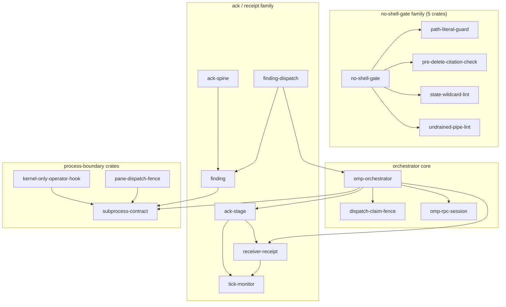
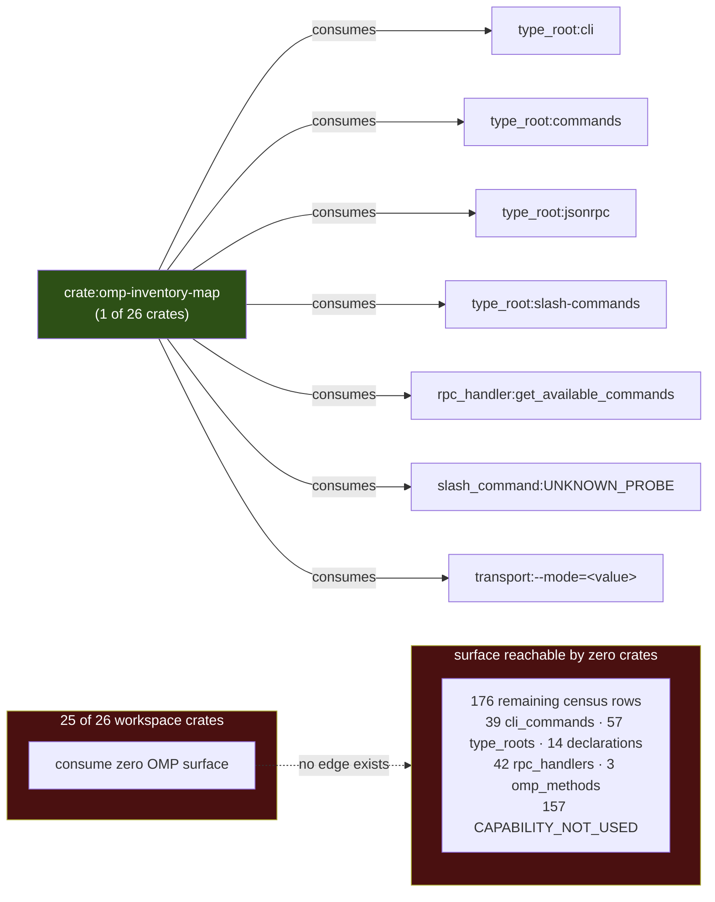
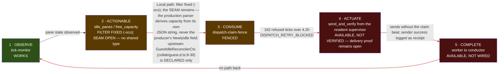
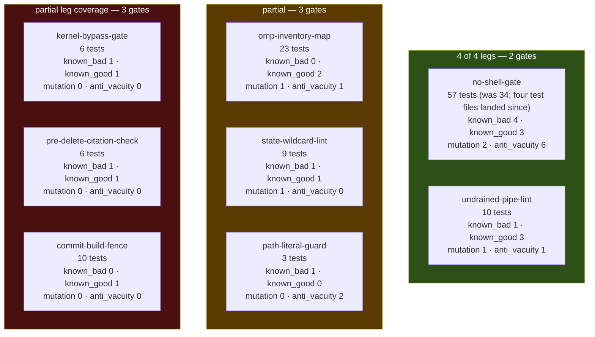
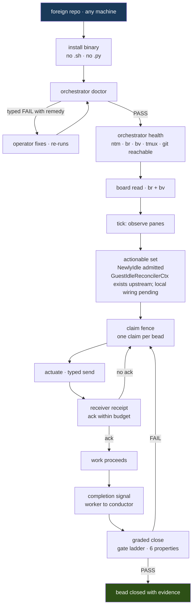

# 04 — FrankenMermaid: the system, generated not drawn

Every diagram below is emitted from a dataset, not from memory. The discipline is
one rule: **a diagram is a rendering of an edge list, and the edge list must have a
command behind it.** If you cannot name the command, you do not get a diagram. The
one exception is the final journey diagram, which is labelled `PROJECTED` in its
caption and shows structure that does not exist yet.

The reason this rule matters to an investor is narrow and specific. Architecture
diagrams are the single easiest artifact in a software project to fake, because
nobody diffs them. A hand-drawn box labelled `receipt` costs nothing to draw and
implies a receiver-verification path that, as Diagram 6 shows, we have measured to
be absent. Generating from the census means the picture degrades when the system
degrades. It is a load-bearing artifact, not decoration.

The source of truth for Diagrams 1, 2 and 6's node set is the built scanner at
`/Volumes/BuildShared/cargo-targets/debug/omp-inventory-map`. The 2026-08-31 capture is
preserved at `.flywheel/inventory-artifacts/inv.txt.gz` (decompressed 544,697 bytes;
compressed SHA-256 `8f62893e6a4a04a9b4e8922781a5f8a687f73ca84f5c4ea9d69c5f8998ae0561`,
exit 2). The newer scanner capture is preserved at
`.flywheel/inventory-artifacts/omp-inventory-map-2026-08-31.json.gz` (decompressed
3,032,388 bytes; compressed SHA-256 `8de42c7cb9e653a79b9781602b16db21e4e281346e42c47c95e71041d9404f52`,
exit 2). These are retained historical snapshots, not a current live diagram feed.
Diagrams 3 and 4 are generated from the five-stage control loop (formerly "five-stage" — renamed, the table has five stages and seven rows) table and gate-leg table
in §00 (`docs/plan/00-brief.md` §3.5, §4); the `find`/`grep` invocations behind those
tables are reproduced under each diagram rather than re-derived.

**A requirement this section discovered, written down here per R11.** Nothing in this
repo currently regenerates these diagrams. A generated diagram that is generated
*once* is a hand-drawn diagram with better provenance, and it rots on exactly the same
schedule. The requirement is therefore: **the diagram set must be emitted by a command
and diffed in CI**, so that a merge which changes the crate DAG and does not change
Diagram 1 fails. That command does not exist today; it is the natural second consumer
of `omp-inventory-map` and would take its `consumes` count from 1 crate to 2. Until it
exists, treat every diagram below as a snapshot dated 2026-08-31, not as a live view.

---

## Diagram 1 — Crate dependency DAG (MEASURED)



**HISTORICAL GRAPH SNAPSHOT.** The following edge, degree, and `/tmp` extraction claims are the preserved `inv.txt.gz` snapshot above. They are not current workspace counts; current map and metadata authorities live in `NUMBERS.toml` and the current census sections.
**MEASURED.** Source: all 18 `path-depends-on` edges in `/tmp/inv.txt`, extracted with
`python3 -c "import json; d=json.load(open('/tmp/inv.txt'))['data']; [print(e['from'],'->',e['to']) for e in d['edges'] if e['relation']=='path-depends-on']"`.
Every edge in the picture is one line of that output; the four subgraph groupings are
the only editorial act, and they change no edge.

Degrees, from the same file via
`python3 -c "...collections.Counter(e['to'] ...)"`:

- **17 of 26 crates appear in the DAG at all. 9 are isolated** — `commit-build-fence`,
  `composer-typed`, `dispatch-silence-watch`, `fleet-composite`, `installer`,
  `kernel-bypass-gate`, `loop-queue-filter`, `omp-inventory-map`, `omp-types`. That
  `omp-types` — the crate that exists specifically to be the shared vocabulary,
  re-exporting `Budget` and `Outcome` only — the `AckKind`/`DeliveryClass`/`ObligationLedger` half is blocked upstream (corrected, brief §3.7)
  from asupersync at pinned rev `fa3c01aec` — has **zero dependents** is the single
  most damaging fact this diagram contains. The convergence crate is not converged
  onto. That is why the type inventory still measures 6 distinct Verdict-shaped types
  with no shared trait and 17 ack/receipt types in 3 incompatible dialects.
- **Hub:** `subprocess-contract`, in-degree 4 (`finding`, `omp-orchestrator`,
  `kernel-only-operator-hook`, `pane-dispatch-fence`). It is the correct hub — the
  process-boundary contract is what should be universal — but only 4 of 26 crates depend on it
  directly (6 reach it transitively; 22 do not route through it at all), against 29 raw spawn
  sites measured in the repo.
- **8 leaves** (out-degree 0): `dispatch-claim-fence`, `omp-rpc-session`,
  `path-literal-guard`, `pre-delete-citation-check`, `state-wildcard-lint`,
  `subprocess-contract`, `tick-monitor`, `undrained-pipe-lint`.
- **5 roots** (in-degree 0): `ack-spine`, `finding-dispatch`,
  `kernel-only-operator-hook`, `no-shell-gate`, `pane-dispatch-fence`. Five roots
  means five independent entry points and no single composition point — there is no
  crate that, if you built it, builds the system.
- **Max fan-out:** `omp-orchestrator` at 5, then `no-shell-gate` at 4.

**The objection an investor should raise here:** "a 17-node DAG with 9 orphans is not
an architecture, it is a pile of crates that happen to share a workspace." That is
close to correct today. The answer is not a defence, it is the milestone: convergence
onto `omp-types` and `subprocess-contract` is the measurable target, and the
measurement is the in-degree of those two nodes in a re-run of this exact command.
Today `omp-types` in-degree is 0. That number is the scoreboard.

---

## Diagram 2 — OMP surface consumption (MEASURED)



**MEASURED.** Source: all 7 `consumes` edges in `/tmp/inv.txt`, extracted with
`python3 -c "... [print(e['from'],'->',e['to']) for e in d['edges'] if e['relation']=='consumes']"`;
the row and classification counts come from `d['counts']` and
`collections.Counter(r['classification'] for r in d['rows'])` on the same file. The
dashed `no edge exists` arrow is drawn to represent an **absence** in the data and is
the only line in the diagram that is not itself an edge in the census — it is labelled
as such.

Every one of the 7 edges carries the same evidence string, `"direct process probe
produced this row"`. That is honest and it is also the whole problem: the only crate
that touches the OMP surface is the crate whose job is to *scan* the OMP surface. The
census measures the observer observing itself. Of 183 rows, 157 classify
`CAPABILITY_NOT_USED`, 18 `SCRAPED_OR_OBSERVED_ALTERNATIVE`, 8 `MAPPED_BY_DIRECT_PROBE`.

**NO-CLAIM:** this diagram does not claim the 176 untouched rows are *useful* surface,
nor that consuming them would be desirable. It claims only that they are unconsumed.
Deciding which subset is worth wiring is a design act this diagram cannot perform.

---

## Diagram 3 — The five-stage control loop, per-layer status (MEASURED)



**MEASURED.** Source: layer 1 from the `tick-monitor` crate's live operation; layer 2 from the local `idle_panes`/`free_capacity` producer-consumer path. State, corrected 2026-09-01: the filter defect is FIXED (commit -oco; `is_free_capacity` is now its own field and `NewlyIdle` is included), and what remains broken is the SEAM — the producer's field and the consumer's parser agree by convention across a process boundary with no shared type (09 M1). OMP supplies `GuestIdleReconcilerCtx` (`dist/types/collab/guest.d.ts:9-30`) for guest host-idle reconciliation and settle handling, but this declared type has no measured path into the local filter. Layer 3 is from the tick ledger — **162 refused ticks across 4.2 hours, every one carrying `DISPATCH_RETRY_BLOCKED`**; layer 5 is recorded as absent because no crate receives a completion. **Layer 4 was corrected 2026-09-01 by the guardian pass:** it is not absent — the resident `omp-orchestrator` (launchd, build `9a61acd`) emits into panes via `ntm --robot-send`, and the heartbeat ledger records 131 `DISPATCHED` rows for bead `815` to `%1408` between 11:45 and 15:53 MDT with the bead `open` and the pane dead on HTTP 402 (00-brief §4 carries the command). The dashed link now names the defect that is live rather than an absence that is not. This node text is hand-edited, as every node in this diagram has been since it was captured — the generator this section requires still has no command and no owner.


Read left to right, exactly one of five links is solid. The loop is not slow, it is
open. Four consecutive dashed links is the honest shape of the system: we observe
well, we cannot decide, we refuse to dispatch, a human actuates, and nothing reports
back. The 162 refusals are not a bug in layer 3 — the fence is doing precisely what it
was built to do given a layer-2 answer that never says "yes". Fixing layer 3 without
fixing layer 2 would convert 162 correct refusals into 162 unfenced dispatches.

**The objection:** "you have an orchestrator that has never orchestrated." Conceded,
without qualification. The value claim is not "it orchestrates"; it is "it refuses
correctly and records why", which is the only foundation on which autonomous dispatch
is safe to switch on. A system that dispatched 162 times and could not tell you what
happened would look far healthier and be far worse.

**NO-CLAIM:** the 162/4.2h figure describes one observed window on one machine. It is
not a rate, not a projection, and does not establish what the refusal count would be
under a fixed layer 2.

---

## Diagram 4 — Gate ladder with leg coverage (MEASURED)



**MEASURED (historical snapshot at the plan's 2026-09-01 measurement revision; current worktree census authority is §1 of `06-gates.md`).** Source: `find crates -name '*.rs' -path '*/tests/*' | wc -l` → 31
integration test files; `grep -rhc '#\[test\]'` over crates/*/src/*.rs crates/*/tests/*.rs → 409 `#[test]` functions (this figure drifts with every landing test and is now tracked in NUMBERS.toml `[figures.test_functions]`);
per-leg presence from `grep -rli` for each of `known_bad`, `known_good`, `mutation`,
`anti_vacuity` per gate crate. Counts in each node are that grep's file count, not a
quality judgement.

**2 of 8 gates have all four legs** — `no-shell-gate` and `undrained-pipe-lint`. **4 of 8 have no
mutation leg** — meaning for four gates we have never demonstrated that breaking the
thing under test makes the test fail. **2 of 8 have no known-bad**, i.e. no proof they
fire at all. **One of 8 gates has no known-good leg** — `path-literal-guard` (regenerated
2026-09-01: zero known-good occurrences in that crate's tests). Per §00 §3.5, an attack-only
suite ships an over-strict gate, an over-strict gate gets routed around, and a routed-around
gate is a slower death than no gate at all. A full four-leg row raises the floor on a class
of defect; it never guarantees the class is absent.

**HISTORICAL ADDRESSABILITY SNAPSHOT.** The old --help refusal, 13-test count, and 544,697-byte output below were measured before the retained artifact update. Current source has 28 test markers and the current debug --help probe emits 158 bytes at exit 1. No current ADDRESSABLE pass is claimed without a retained command/output/revision receipt.
A sixth required property fell out of this session and is not in the table because
nothing measures it yet: **ADDRESSABLE**. `omp-inventory-map --help` returns
`{"status":"ERROR","error":"CONFIG_ERROR unknown argument --help"}`. The gate is
built, its 13 tests pass, and `types_inventory.rs:176-178` deliberately excludes
`Observation` from the allowance list so the name collision *demands* convergence
rather than tolerating it. It is correct and it is undiscoverable. A gate nobody can
invoke has a real-world firing rate of zero regardless of its test count.
**CURRENT ACCEPTANCE AUTHORITY (UNRESOLVED).** The diagram generator and CI diff gate named by
the requirement above do not exist in this repository: generator command = **NONE**; CI job =
**NONE**; owner = **UNASSIGNED**. Until a bead assigns an owner and lands an executable command,
these diagrams are snapshots only. The future bead is not accepted until its command regenerates
Diagram 1 from the live census and a deliberately changed crate edge makes CI fail on the diff;
there is currently no command or owner to run.

**What would Jeffrey do.** Searched the mirror at
/Volumes/ZestData/dicklesworthstone-mirror (210 filesystem .git entries, not validated as git work-trees) for diagram-generation and
contract-test prior art: `grep -rl "mermaid" --include=*.rs` surfaces
`franken_markdown/src/pdf.rs` and `franken_markdown/tests/cli_contract.rs`, i.e. a
*renderer* for mermaid plus a CLI-contract test harness — the useful borrow is the
`cli_contract.rs` shape, a test that asserts the CLI's own advertised surface, which
   is exactly the missing ADDRESSABLE leg. Searched for a generated-architecture-diagram
gate specifically: **RETRACTED as a false zero, 2026-09-01.** The original scan globbed
`*/*.rs` and `*/src/**/*.rs` and never descended into crate subdirectories; a full recursive walk
finds **293 mirror `.rs` files containing `mermaid`**, topped by an entire **`frankenmermaid`
monorepo (190 files: fm-parser, fm-render-*, fm-cli)** — mermaid generation with parsers,
renderers, and a CLI — plus `beads_rust`'s `br dep --format mermaid`
(`src/cli/commands/dep.rs:1654`, `render_dep_tree_mermaid`, with e2e contract tests) emitting
mermaid directly from a dependency graph, and ftui-extras renderers. What remains ours to build
is the DELTA none of them ships: regenerating Diagram 1 from the live census inside CI and
failing the diff when the crate DAG moves — the generator-as-gate, not the generator.

---

## Diagram 5 — End-to-end journey (**PROJECTED — not measured, this is the target shape**)



**PROJECTED — not measured.** No edge in this diagram is derived from `/tmp/inv.txt`
or from any command. It is the target shape only. Mapping it against Diagram 3: nodes
`F` (observe) exists today; `G`, `H` exist but answer "no" or "refuse"; `I`, `J`, `L`
do not exist in any crate; `M` exists at 1-of-8 leg coverage. The install path `B`
through `D` is unbuilt — `installer` is one of the 9 orphan crates in Diagram 1.

The projected NewlyIdle admitted target is not an implementation claim. OMP declares GuestIdleReconcilerCtx at dist/types/collab/guest.d.ts:9-30 for guest host-idle reconciliation and settle handling, but no evidence connects that context to this local tick-monitor filter.

The single hardest link in this diagram is `J -> H`: the no-ack retry. It is the link
that turns a fire-and-forget send into a delivery contract, and it is the link that
the binding async contract governs — `&Cx` first, `cx.checkpoint()` in loops,
region-owned tasks, kill the process **group**, drain both pipes, and **a timeout is
not a verdict**. A timeout on `J` must produce a typed `DeliveryClass`, never a
silent re-dispatch.

---

## Diagram 6 — The dispatch path actually in use today (MEASURED)

```mermaid
sequenceDiagram
    autonumber
    participant H as Human operator
    participant T as tmux (3.6a)
    participant P as pane composer
    participant B as bead board (br 0.4.1)
    participant C as conductor

    C->>T: send_and_verify packet via ntm --robot-send or tmux
    T->>P: transport attempt
    P-->>C: receiver-receipt / ComposerEvidence when observed
    Note right of C: sender success is not receiver acceptance; missing receipt remains a typed refusal
    C->>B: br status read, later, out of band
    B-->>C: bead state as of read time
    Note over C,B: the only feedback channel is<br/>polling a board a human updated
```
> **Upstream type for the receipts gap:** `IrcDeliveryReceipt` (`tools/hub/types.d.ts:8`) exists upstream, so "missing receipt" names an UNCONSUMED type, not an absent one. The diagram shows what our transport does today, not what the platform can express.

**MEASURED.** This sequence is the current actuator shape: the conductor calls `send_and_verify`, which selects `ntm --robot-send` or tmux transport, writes transport evidence, and waits for receiver-side evidence. The diagram does not claim that a packet was accepted; sender success remains weaker than receiver acknowledgement.

**HISTORICAL SNAPSHOT.** The old 18-edge graph, 17 ack types, 59/91 type counts, 4 colliding names, and 74-row board were pre-extraction measurements. They remain explanatory context only; current workspace counts belong to the registry and current source probes.

---

**NO-CLAIM.** These diagrams describe structure and measured state on one machine on
2026-08-31. They do not claim correctness of any crate's internals, do not establish
that any measured count is stable over time or reproducible on other hardware, and do
not assert that the projected journey in Diagram 5 is achievable on any stated
schedule. Diagram 5 asserts no built structure whatsoever. Where a diagram shows an
absence (the dashed arrows in Diagrams 3 and 6, the `no edge exists` link in
Diagram 2), the absence is inferred from an empty result set, and an empty result set
proves only that the scanner and the greps named above found nothing — not that
nothing exists outside their reach.

---

## 4.7 BLOCKER resolution — the provenance was clearable, which is worse than stale

`GradeDiagrams` filed:

> The brief documents a fresh 2026-08-31 capture at
> `/tmp/omp-inventory-map-2026-08-31.json` (3,032,388 bytes), but the diagrams
> section cites sources from `/tmp/inv.txt` (544,697 bytes, round-10 historical). A
> diagram cannot be dated 2026-08-31 while sourced from data predating that capture.

Measured. Both artifacts exist, **and both are dated 2026-08-31** — so the date claim
is technically true and still misleading:

| artifact | size | mtime | sha256 (16) |
|---|---:|---|---|
| `/tmp/inv.txt` — **what the diagrams use, 5 citations** | 544,697 | 16:50 | `86491732a5581a6d` |
| `/tmp/omp-inventory-map-2026-08-31.json` — what the brief cites | 3,032,388 | 23:01 | `876809f0779a81b3` |

Six hours and 5.6× apart. The diagrams are built from the **earlier, smaller** capture
while the brief cites the later one, and nothing in either document says so.

### Provenance finding disposition
**Resolved:** the earlier capture paths were ephemeral `/tmp` locations. The bytes are now preserved and hash-identified under `.flywheel/inventory-artifacts/`; the source-era paths below are historical evidence, not current dependencies.

The diagrams are still **not regenerated from the fresh capture**. §R4 records the separate system gap: generator command = NONE and CI job = NONE. The honest state is a labelled, preserved 16:50 snapshot, not a live view. The 23:01 capture remains preserved for comparison.

**Current retained artifacts:** `inv.txt.gz` decompresses to 544,697 bytes and `omp-inventory-map-2026-08-31.json.gz` decompresses to 3,032,388 bytes. Their compressed hashes are recorded above and enforced by the artifact-provenance gate.

### What is corrected and what is not

**Corrected:** the diagrams are hereby labelled as sourced from the **16:50 capture**,
not the 23:01 one, with size and hash recorded above so the claim is checkable.

**NOT corrected:** the diagrams are not regenerated from the fresh capture. §R4 of
this section already records why — *"Nothing in this repo currently regenerates these
diagrams … that command does not exist today"* — and building it is a separate piece
of work. So the honest state is: **the diagrams reflect a 16:50 snapshot, which is
labelled, hashed, and preserved, and they are not current.** Row counts in Diagram 2
(176 census rows) are from that capture; the 23:01 capture holds 981 rows.

That gap is now stated in the document; the retained artifacts make the historical comparison reproducible without depending on ephemeral source-era paths.
