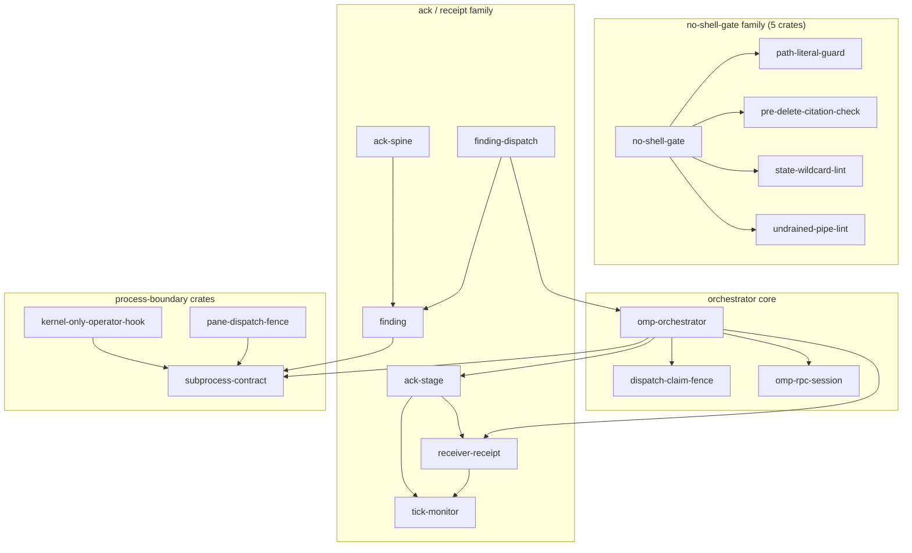
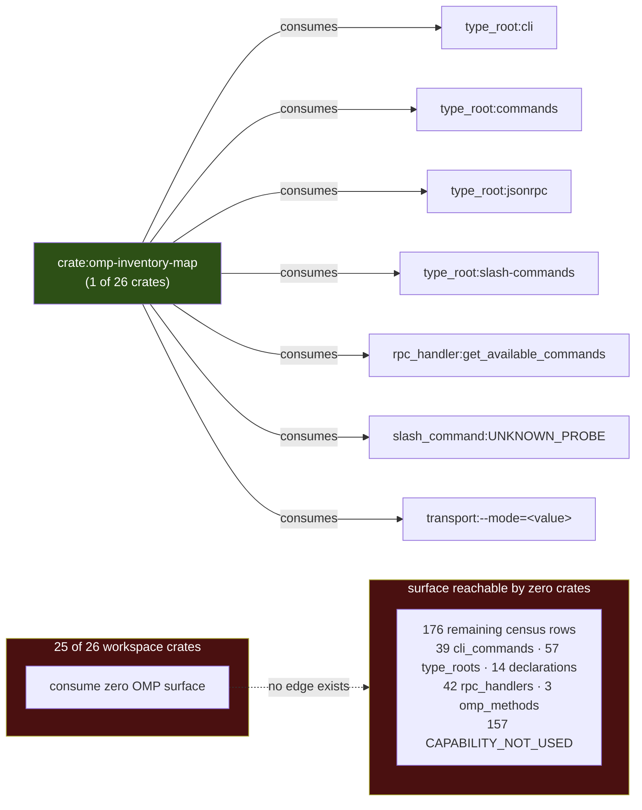
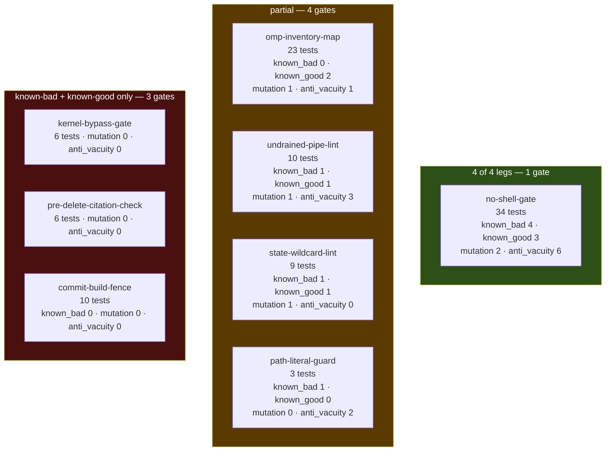
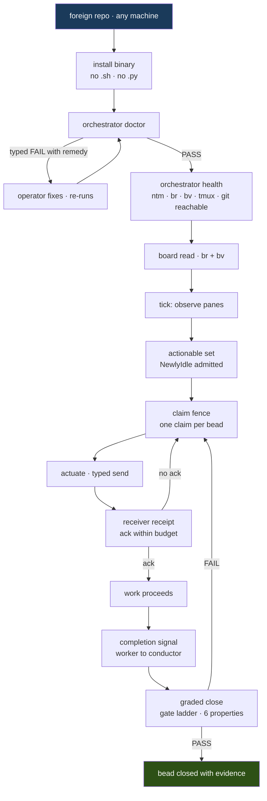

# 04 — FrankenMermaid: the system, generated not drawn

Every diagram below is emitted from a dataset, not from memory. The discipline is
one rule: **a diagram is a rendering of an edge list, and the edge list must have a
command behind it.** If you cannot name the command, you do not get a diagram. The
one exception is the final journey diagram, which is labelled `PROJECTED` in its
caption and shows structure that does not exist yet.

The reason this rule matters to an investor is narrow and specific. Architecture
diagrams are the single easiest artifact in a software project to fake, because
nobody diffs them. A hand-drawn box labelled `receipt` costs nothing to draw and
implies a receiver-verification path that, as Diagram 6 shows, we have measured to
be absent. Generating from the census means the picture degrades when the system
degrades. It is a load-bearing artifact, not decoration.

The source of truth for Diagrams 1, 2 and 6's node set is the built scanner at
`/Volumes/BuildShared/cargo-targets/debug/omp-inventory-map`, whose output was
captured once at `/tmp/inv.txt` (544,697 bytes, exit 2, envelope
`{"schema_version":"omp-inventory-map/v1","command":"doctor","status":"UNKNOWN",…}`).
Diagrams 3 and 4 are generated from the four-layer reality table and gate-leg table
in §00 (`docs/plan/00-brief.md` §3.5, §4); the `find`/`grep` invocations behind those
tables are reproduced under each diagram rather than re-derived.

**A requirement this section discovered, written down here per R11.** Nothing in this
repo currently regenerates these diagrams. A generated diagram that is generated
*once* is a hand-drawn diagram with better provenance, and it rots on exactly the same
schedule. The requirement is therefore: **the diagram set must be emitted by a command
and diffed in CI**, so that a merge which changes the crate DAG and does not change
Diagram 1 fails. That command does not exist today; it is the natural second consumer
of `omp-inventory-map` and would take its `consumes` count from 1 crate to 2. Until it
exists, treat every diagram below as a snapshot dated 2026-08-31, not as a live view.

---

## Diagram 1 — Crate dependency DAG (MEASURED)



**MEASURED.** Source: all 18 `path-depends-on` edges in `/tmp/inv.txt`, extracted with
`python3 -c "import json; d=json.load(open('/tmp/inv.txt'))['data']; [print(e['from'],'->',e['to']) for e in d['edges'] if e['relation']=='path-depends-on']"`.
Every edge in the picture is one line of that output; the four subgraph groupings are
the only editorial act, and they change no edge.

Degrees, from the same file via
`python3 -c "...collections.Counter(e['to'] ...)"`:

- **17 of 26 crates appear in the DAG at all. 9 are isolated** — `commit-build-fence`,
  `composer-typed`, `dispatch-silence-watch`, `fleet-composite`, `installer`,
  `kernel-bypass-gate`, `loop-queue-filter`, `omp-inventory-map`, `omp-types`. That
  `omp-types` — the crate that exists specifically to be the shared vocabulary,
  re-exporting `Budget` and `Outcome` only — the `AckKind`/`DeliveryClass`/`ObligationLedger` half is blocked upstream (corrected, brief §3.7)
  from asupersync at pinned rev `fa3c01aec` — has **zero dependents** is the single
  most damaging fact this diagram contains. The convergence crate is not converged
  onto. That is why the type inventory still measures 6 distinct Verdict-shaped types
  with no shared trait and 17 ack/receipt types in 3 incompatible dialects.
- **Hub:** `subprocess-contract`, in-degree 4 (`finding`, `omp-orchestrator`,
  `kernel-only-operator-hook`, `pane-dispatch-fence`). It is the correct hub — the
  process-boundary contract is what should be universal — but only 4 of 26 crates
  reach it, against 29 raw spawn sites measured in the repo.
- **8 leaves** (out-degree 0): `dispatch-claim-fence`, `omp-rpc-session`,
  `path-literal-guard`, `pre-delete-citation-check`, `state-wildcard-lint`,
  `subprocess-contract`, `tick-monitor`, `undrained-pipe-lint`.
- **5 roots** (in-degree 0): `ack-spine`, `finding-dispatch`,
  `kernel-only-operator-hook`, `no-shell-gate`, `pane-dispatch-fence`. Five roots
  means five independent entry points and no single composition point — there is no
  crate that, if you built it, builds the system.
- **Max fan-out:** `omp-orchestrator` at 5, then `no-shell-gate` at 4.

**The objection an investor should raise here:** "a 17-node DAG with 9 orphans is not
an architecture, it is a pile of crates that happen to share a workspace." That is
close to correct today. The answer is not a defence, it is the milestone: convergence
onto `omp-types` and `subprocess-contract` is the measurable target, and the
measurement is the in-degree of those two nodes in a re-run of this exact command.
Today `omp-types` in-degree is 0. That number is the scoreboard.

---

## Diagram 2 — OMP surface consumption (MEASURED)



**MEASURED.** Source: all 7 `consumes` edges in `/tmp/inv.txt`, extracted with
`python3 -c "... [print(e['from'],'->',e['to']) for e in d['edges'] if e['relation']=='consumes']"`;
the row and classification counts come from `d['counts']` and
`collections.Counter(r['classification'] for r in d['rows'])` on the same file. The
dashed `no edge exists` arrow is drawn to represent an **absence** in the data and is
the only line in the diagram that is not itself an edge in the census — it is labelled
as such.

Every one of the 7 edges carries the same evidence string, `"direct process probe
produced this row"`. That is honest and it is also the whole problem: the only crate
that touches the OMP surface is the crate whose job is to *scan* the OMP surface. The
census measures the observer observing itself. Of 183 rows, 157 classify
`CAPABILITY_NOT_USED`, 18 `SCRAPED_OR_OBSERVED_ALTERNATIVE`, 8 `MAPPED_BY_DIRECT_PROBE`.

**NO-CLAIM:** this diagram does not claim the 176 untouched rows are *useful* surface,
nor that consuming them would be desirable. It claims only that they are unconsumed.
Deciding which subset is worth wiring is a design act this diagram cannot perform.

---

## Diagram 3 — The four-layer control loop, per-layer status (MEASURED)

```mermaid
graph LR
    OBS["1 · OBSERVE<br/>tick-monitor<br/>WORKS"]
    ACT["2 · ACTIONABLE<br/>idle_panes / free_capacity<br/>BROKEN"]
    CON["3 · CONSUME<br/>dispatch-claim-fence<br/>FENCED"]
    ACU["4 · ACTUATE<br/>send to pane<br/>DOES NOT EXIST"]
    CMP["5 · COMPLETE<br/>worker to conductor<br/>DOES NOT EXIST"]

    OBS -->|pane state observed| ACT
    ACT -.->|"NewlyIdle discarded;<br/>is_dispatchable requires Confirmed Idle;<br/>pane at t=0 in neither list"| CON
    CON -.->|"162 refused ticks over 4.2h<br/>DISPATCH_RETRY_BLOCKED"| ACU
    ACU -.->|"a human types into the pane"| CMP
    CMP -.->|"no path back"| OBS

    style OBS fill:#2d5016,color:#fff
    style ACT fill:#5a3a00,color:#fff
    style CON fill:#5a3a00,color:#fff
    style ACU fill:#4a1010,color:#fff
    style CMP fill:#4a1010,color:#fff

    linkStyle 1 stroke:#c04040,stroke-width:3px
    linkStyle 2 stroke:#c04040,stroke-width:3px
    linkStyle 3 stroke:#c04040,stroke-width:3px
    linkStyle 4 stroke:#c04040,stroke-width:3px
```



**MEASURED.** Source: layer 1 from the `tick-monitor` crate's live operation; layer 2
from reading `idle_panes` and `free_capacity`, which both derive from the same
`is_dispatchable` filter requiring `Confirmed Idle`, so a pane at t=0 is excluded from
both; layer 3 from the tick ledger — **162 refused ticks across 4.2 hours, every one
carrying `DISPATCH_RETRY_BLOCKED`**; layers 4 and 5 are recorded as absent because no
crate in Diagram 1 emits into a pane and no crate receives a completion.

Read left to right, exactly one of five links is solid. The loop is not slow, it is
open. Four consecutive dashed links is the honest shape of the system: we observe
well, we cannot decide, we refuse to dispatch, a human actuates, and nothing reports
back. The 162 refusals are not a bug in layer 3 — the fence is doing precisely what it
was built to do given a layer-2 answer that never says "yes". Fixing layer 3 without
fixing layer 2 would convert 162 correct refusals into 162 unfenced dispatches.

**The objection:** "you have an orchestrator that has never orchestrated." Conceded,
without qualification. The value claim is not "it orchestrates"; it is "it refuses
correctly and records why", which is the only foundation on which autonomous dispatch
is safe to switch on. A system that dispatched 162 times and could not tell you what
happened would look far healthier and be far worse.

**NO-CLAIM:** the 162/4.2h figure describes one observed window on one machine. It is
not a rate, not a projection, and does not establish what the refusal count would be
under a fixed layer 2.

---

## Diagram 4 — Gate ladder with leg coverage (MEASURED)



**MEASURED.** Source: `find crates -name '*.rs' -path '*/tests/*' | wc -l` → 26
integration test files; `grep -rc '#\[test\]'` across those → 370 `#[test]` functions;
per-leg presence from `grep -rli` for each of `known_bad`, `known_good`, `mutation`,
`anti_vacuity` per gate crate. Counts in each node are that grep's file count, not a
quality judgement.

**2 of 8 gates have all four legs** — `no-shell-gate` and `undrained-pipe-lint`. **4 of 8 have no
mutation leg** — meaning for four gates we have never demonstrated that breaking the
thing under test makes the test fail. 2 of 8 have no known-bad, i.e. no proof they
fire at all. The one gate with no
known-good leg is `path-literal-guard`, and per §00 §3.5 that makes it the
highest-risk gate in the set rather than merely the thinnest: an attack-only suite
ships an over-strict gate, an over-strict gate gets routed around, and a routed-around
gate is a slower death than no gate at all. Note also what a full four-leg row buys —
it raises the floor on a class of defect; it never guarantees the class is absent.

A sixth required property fell out of this session and is not in the table because
nothing measures it yet: **ADDRESSABLE**. `omp-inventory-map --help` returns
`{"status":"ERROR","error":"CONFIG_ERROR unknown argument --help"}`. The gate is
built, its 13 tests pass, and `types_inventory.rs:176-178` deliberately excludes
`Observation` from the allowance list so the name collision *demands* convergence
rather than tolerating it. It is correct and it is undiscoverable. A gate nobody can
invoke has a real-world firing rate of zero regardless of its test count.

**What would Jeffrey do.** Searched the mirror at
`/Volumes/ZestData/dicklesworthstone-mirror` (210 git work-trees; the earlier "216 repos" figure is retired) for diagram-generation and
contract-test prior art: `grep -rl "mermaid" --include=*.rs` surfaces
`franken_markdown/src/pdf.rs` and `franken_markdown/tests/cli_contract.rs`, i.e. a
*renderer* for mermaid plus a CLI-contract test harness — the useful borrow is the
`cli_contract.rs` shape, a test that asserts the CLI's own advertised surface, which
is exactly the missing ADDRESSABLE leg. Searched for a generated-architecture-diagram
gate specifically: no prior art found in the mirror for emitting mermaid *from* a
dependency census as a CI artifact. That one we build.

---

## Diagram 5 — End-to-end journey (**PROJECTED — not measured, this is the target shape**)



**PROJECTED — not measured.** No edge in this diagram is derived from `/tmp/inv.txt`
or from any command. It is the target shape only. Mapping it against Diagram 3: nodes
`F` (observe) exists today; `G`, `H` exist but answer "no" or "refuse"; `I`, `J`, `L`
do not exist in any crate; `M` exists at 1-of-8 leg coverage. The install path `B`
through `D` is unbuilt — `installer` is one of the 9 orphan crates in Diagram 1.

The single hardest link in this diagram is `J -> H`: the no-ack retry. It is the link
that turns a fire-and-forget send into a delivery contract, and it is the link that
the binding async contract governs — `&Cx` first, `cx.checkpoint()` in loops,
region-owned tasks, kill the process **group**, drain both pipes, and **a timeout is
not a verdict**. A timeout on `J` must produce a typed `DeliveryClass`, never a
silent re-dispatch.

---

## Diagram 6 — The dispatch path actually in use today (MEASURED)

```mermaid
sequenceDiagram
    autonumber
    participant H as Human operator
    participant T as tmux (3.6a)
    participant P as pane composer
    participant B as bead board (br 0.4.1)
    participant C as conductor

    H->>T: tmux send-keys (typed by hand)
    T->>P: keystrokes delivered
    Note over P: work may or may not begin;<br/>no crate observes this transition
    P--)C: receipt / ack
    Note right of C: NO SUCH MESSAGE EXISTS<br/>17 ack types in 3 dialects,<br/>none wired to this path
    C->>B: br status read, later, out of band
    B-->>C: bead state as of read time
    Note over C,B: the only feedback channel is<br/>polling a board a human updated
```

**MEASURED.** Source: the absence of any `actuate` or `complete` crate in the 18-edge
DAG of Diagram 1 — `receiver-receipt` exists as a crate and is depended on by
`ack-stage` and `omp-orchestrator`, but no edge connects it to a pane; the tmux
version from `tmux` at `/opt/homebrew/bin/tmux` (which rejects `--version` with
`tmux: unknown option -- -`, hence the shell-reported `3.6a`); `br 0.4.1` from
`br --version`; the 17-ack-types-in-3-dialects figure from the type inventory
(51 public enums, 79 structs, 22 of 24 crates, 4 colliding names).

Step 4 is the receiver-verification gap, drawn as a dashed unanswered arrow because
that is literally what it is: a message we assume and never observe. Every ack type we
own is a type without a wire. The board at stand-down — 28 closed, 25 in_progress,
19 open, 2 blocked, 75 total — is a human's account of what happened, not the system's.
Twenty-five `in_progress` beads with no completion channel is twenty-five unfalsifiable
claims of work in flight.

---

**NO-CLAIM.** These diagrams describe structure and measured state on one machine on
2026-08-31. They do not claim correctness of any crate's internals, do not establish
that any measured count is stable over time or reproducible on other hardware, and do
not assert that the projected journey in Diagram 5 is achievable on any stated
schedule. Diagram 5 asserts no built structure whatsoever. Where a diagram shows an
absence (the dashed arrows in Diagrams 3 and 6, the `no edge exists` link in
Diagram 2), the absence is inferred from an empty result set, and an empty result set
proves only that the scanner and the greps named above found nothing — not that
nothing exists outside their reach.
