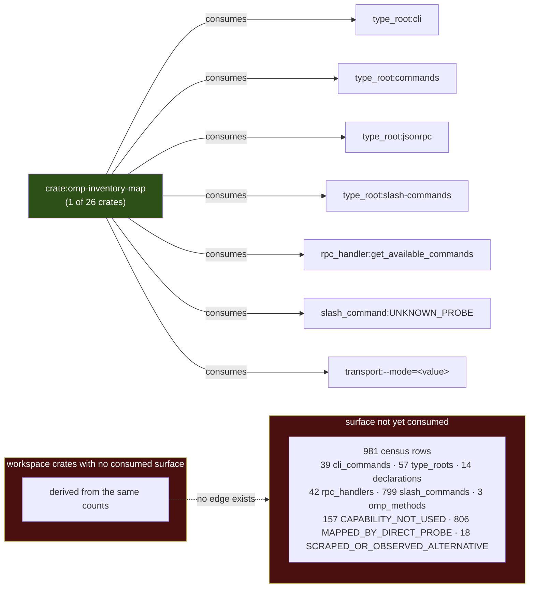
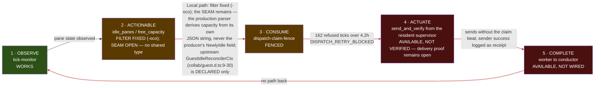
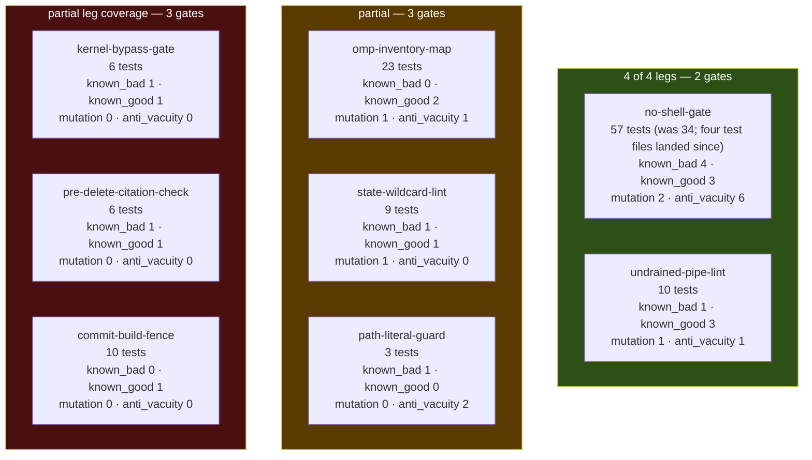
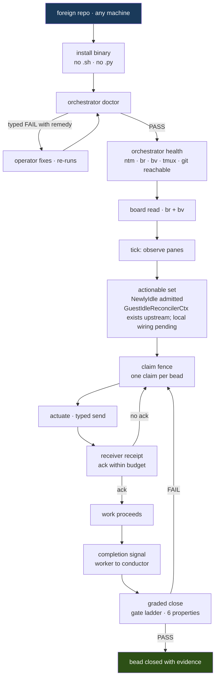

# 04 — FrankenMermaid: the system, generated not drawn

Every diagram below is emitted from a dataset, not from memory. The discipline is
one rule: **a diagram is a rendering of an edge list, and the edge list must have a
command behind it.** If you cannot name the command, you do not get a diagram. The
one exception is the final journey diagram, which is labelled `PROJECTED` in its
caption and shows structure that does not exist yet.

The reason this rule matters to an investor is narrow and specific. Architecture
diagrams are the single easiest artifact in a software project to fake, because
nobody diffs them. A hand-drawn box labelled `receipt` costs nothing to draw and
implies a receiver-verification path that, as Diagram 6 shows, we have measured to
be absent. Generating from the census means the picture degrades when the system
degrades. It is a load-bearing artifact, not decoration.

The source of truth for Diagram 1 is the current Cargo metadata snapshot recorded for this revision. The source of truth for Diagram 2 is the retained inventory-map JSON snapshot named below. Both are rendered by the reachable Rust frankenmermaid command; neither diagram is hand-drawn.

The regeneration command is:
cargo metadata --no-deps --format-version 1 --offline > .flywheel/diagram-artifacts/7wn9.3-cargo-metadata.json
cargo run -p omp-inventory-map --bin frankenmermaid -- --metadata .flywheel/diagram-artifacts/7wn9.3-cargo-metadata.json --inventory .flywheel/diagram-artifacts/7wn9.3-inventory-map.json --output-dir docs/plan/diagrams --write

Diagram 1 is generated from the current workspace graph. Diagram 2 is generated from the preserved inventory-map data counts; its source revision and hashes are recorded in the receipt. The generator has a check mode that refuses hand-edited drift.

Diagrams 3 and 4 are generated from the five-stage control loop and gate-leg tables in §00; the find and grep invocations behind those tables remain reproduced under each diagram rather than re-derived.

---

## Diagram 1 — Crate dependency DAG (MEASURED)

```mermaid
%% GENERATED BY frankenmermaid; source=cargo metadata; packages=81 path_dependency_edges=157
graph TD
    n0[ack-spine]
    n1[ack-stage]
    n2[admission-reason]
    n3[agent-mail-native]
    n4[asupersync-conformance]
    n5[bead-availability]
    n6[bead-holder]
    n7[cargo-lane-budget]
    n8[commit-build-fence]
    n9[composer-typed]
    n10[convergence-stamp]
    n11[crate-atom-gate]
    n12[crate-soundness-verify]
    n13[decision-ledger]
    n14[dispatch-claim-fence]
    n15[dispatch-saga]
    n16[dispatch-silence-watch]
    n17[dispatcher-deadman]
    n18[extraction-roster]
    n19[fast-dispatch]
    n20[finding]
    n21[finding-dispatch]
    n22[fleet-composite]
    n23[fleet-monitor]
    n24[fleet-reconcile]
    n25[fleet-truth]
    n26[fuzz-build-gate]
    n27[grader-attribution-gate]
    n28[inbox-monitor]
    n29[installer]
    n30[kernel-bypass-gate]
    n31[kernel-only-operator-hook]
    n32[lifecycle-event]
    n33[lifecycle-monitor]
    n34[loop-coverage]
    n35[loop-driver]
    n36[loop-queue-filter]
    n37[loop-switch]
    n38[loop-tick]
    n39[named-test-filter-gate]
    n40[no-shell-gate]
    n41[ntm-fleet-monitor]
    n42[omp-idle-dispatch]
    n43[omp-inventory-map]
    n44[omp-orchestrator]
    n45[omp-rpc-session]
    n46[omp-surface-consumption]
    n47[omp-types]
    n48[ompo-start]
    n49[oracle-compare]
    n50[oracle-pane-state-differential]
    n51[orchestration-tick-gate]
    n52[pane-dispatch-fence]
    n53[pane-dispatch-ready]
    n54[pane-oracle-diff]
    n55[pane-truth]
    n56[path-literal-guard]
    n57[plan-assemble]
    n58[porting-gate]
    n59[pre-delete-citation-check]
    n60[preregistration-gate]
    n61[r1-breadth-gate]
    n62[reap-finished-panes]
    n63[receiver-receipt]
    n64[refill-idle-panes]
    n65[response-envelope-check]
    n66[s1-coverage]
    n67[s2-gate]
    n68[scratch-home]
    n69[sender-identity]
    n70[silent-success-census]
    n71[staged-build-gate]
    n72[state-wildcard-lint]
    n73[subprocess-contract]
    n74[text-structure]
    n75[tick-dispatch]
    n76[tick-monitor]
    n77[undrained-pipe-lint]
    n78[verify-dispatch]
    n79[wired-but-inert-guard]
    n80[worker-oracle-gate]
    n0 --> n20
    n0 --> n36
    n0 --> n63
    n0 --> n68
    n0 --> n73
    n0 --> n76
    n1 --> n63
    n1 --> n76
    n2 --> n73
    n3 --> n47
    n3 --> n73
    n3 --> n76
    n4 --> n77
    n5 --> n73
    n6 --> n73
    n7 --> n73
    n11 --> n20
    n11 --> n36
    n11 --> n73
    n12 --> n73
    n15 --> n47
    n15 --> n52
    n16 --> n20
    n16 --> n73
    n17 --> n73
    n18 --> n73
    n19 --> n20
    n19 --> n36
    n19 --> n37
    n19 --> n73
    n19 --> n76
    n20 --> n73
    n21 --> n20
    n22 --> n73
    n23 --> n41
    n23 --> n73
    n23 --> n76
    n24 --> n73
    n24 --> n76
    n25 --> n20
    n25 --> n73
    n25 --> n76
    n26 --> n73
    n28 --> n3
    n28 --> n73
    n28 --> n76
    n29 --> n32
    n29 --> n71
    n29 --> n73
    n31 --> n32
    n31 --> n33
    n31 --> n73
    n32 --> n47
    n33 --> n32
    n34 --> n20
    n34 --> n36
    n34 --> n76
    n35 --> n37
    n35 --> n73
    n35 --> n76
    n36 --> n56
    n38 --> n20
    n38 --> n36
    n38 --> n73
    n38 --> n76
    n40 --> n4
    n40 --> n10
    n40 --> n11
    n40 --> n20
    n40 --> n44
    n40 --> n51
    n40 --> n56
    n40 --> n59
    n40 --> n60
    n40 --> n61
    n40 --> n71
    n40 --> n72
    n40 --> n73
    n40 --> n74
    n40 --> n77
    n41 --> n34
    n42 --> n20
    n42 --> n36
    n42 --> n73
    n42 --> n76
    n43 --> n73
    n43 --> n74
    n44 --> n0
    n44 --> n1
    n44 --> n3
    n44 --> n6
    n44 --> n9
    n44 --> n13
    n44 --> n14
    n44 --> n16
    n44 --> n20
    n44 --> n21
    n44 --> n32
    n44 --> n33
    n44 --> n36
    n44 --> n41
    n44 --> n45
    n44 --> n51
    n44 --> n52
    n44 --> n63
    n44 --> n69
    n44 --> n73
    n44 --> n74
    n44 --> n76
    n44 --> n80
    n46 --> n73
    n47 --> n73
    n49 --> n73
    n50 --> n49
    n50 --> n73
    n50 --> n76
    n51 --> n11
    n52 --> n73
    n53 --> n47
    n53 --> n73
    n53 --> n76
    n54 --> n49
    n54 --> n73
    n54 --> n76
    n55 --> n73
    n55 --> n73
    n55 --> n76
    n57 --> n60
    n58 --> n73
    n59 --> n20
    n60 --> n73
    n62 --> n53
    n62 --> n73
    n62 --> n76
    n63 --> n55
    n63 --> n76
    n64 --> n14
    n64 --> n20
    n64 --> n24
    n64 --> n36
    n64 --> n49
    n64 --> n73
    n64 --> n76
    n66 --> n73
    n68 --> n73
    n70 --> n73
    n70 --> n74
    n71 --> n73
    n75 --> n49
    n75 --> n73
    n75 --> n76
    n76 --> n32
    n76 --> n33
    n76 --> n47
    n78 --> n20
    n78 --> n73
    n79 --> n73
```



**GENERATED CURRENT GRAPH.** The block above is the exact output of frankenmermaid against Cargo metadata at the recorded revision: 81 packages and 157 path-dependency edges. Every rendered edge is one path dependency from that metadata input; no edge was drawn from memory.

The generator's check mode compares this output byte-for-byte and returns DIAGRAM_DRIFT when an edge is hand-edited. Empty or malformed metadata is a typed DIAGRAM_INPUT error, never a zero-edge pass.

**NO-CLAIM:** this diagram proves the metadata graph rendered at generation time. It does not prove that every package is semantically healthy, that a path dependency is desirable, or that the installed generator binary matches this source revision.

---

## Diagram 2 — OMP surface consumption (MEASURED)



**GENERATED FROM RETAINED INVENTORY DATA.** The block above is the exact output of frankenmermaid against the preserved inventory-map JSON. It carries rows=981 and workspace_crates=26 from data.rows and data.counts, plus the classification counts derived from the same rows.

The retained map is an input snapshot, not a current workspace census. A missing data object, missing counts, or empty rows is a typed refusal; the generator never emits a zero-count diagram for absent input.

**NO-CLAIM:** Diagram 2 reports the retained inventory snapshot's counts. It does not claim that the 26-crate snapshot is the current 81-package workspace or that the classifications are fresh.

---

## Diagram 3 — The five-stage control loop, per-layer status (MEASURED)



**MEASURED.** Source: layer 1 from the `tick-monitor` crate's live operation; layer 2 from the local `idle_panes`/`free_capacity` producer-consumer path. State, corrected 2026-09-01: the filter defect is FIXED (commit -oco; `is_free_capacity` is now its own field and `NewlyIdle` is included), and what remains broken is the SEAM — the producer's field and the consumer's parser agree by convention across a process boundary with no shared type (09 M1). OMP supplies `GuestIdleReconcilerCtx` (`dist/types/collab/guest.d.ts:GuestIdleReconcilerCtx`) for guest host-idle reconciliation and settle handling, but this declared type has no measured path into the local filter. Layer 3 is from the tick ledger — **162 refused ticks across 4.2 hours, every one carrying `DISPATCH_RETRY_BLOCKED`**; layer 5 is recorded as absent because no crate receives a completion. **Layer 4 was corrected 2026-09-01 by the guardian pass:** it is not absent — the resident `omp-orchestrator` (launchd, build `9a61acd`) emits into panes via `ntm --robot-send`, and the heartbeat ledger records 131 `DISPATCHED` rows for bead `815` to `%1408` between 11:45 and 15:53 MDT with the bead `open` and the pane dead on HTTP 402 (00-brief §4 carries the command). The dashed link now names the defect that is live rather than an absence that is not. This node text is hand-edited, as every node in this diagram has been since it was captured — the generator this section requires still has no command and no owner.


Read left to right, exactly one of five links is solid. The loop is not slow, it is
open. Four consecutive dashed links is the honest shape of the system: we observe
well, we cannot decide, we refuse to dispatch, a human actuates, and nothing reports
back. The 162 refusals are not a bug in layer 3 — the fence is doing precisely what it
was built to do given a layer-2 answer that never says "yes". Fixing layer 3 without
fixing layer 2 would convert 162 correct refusals into 162 unfenced dispatches.

**The objection:** "you have an orchestrator that has never orchestrated." Conceded,
without qualification. The value claim is not "it orchestrates"; it is "it refuses
correctly and records why", which is the only foundation on which autonomous dispatch
is safe to switch on. A system that dispatched 162 times and could not tell you what
happened would look far healthier and be far worse.

**NO-CLAIM:** the 162/4.2h figure describes one observed window on one machine. It is
not a rate, not a projection, and does not establish what the refusal count would be
under a fixed layer 2.

---

## Diagram 4 — Gate ladder with leg coverage (MEASURED)



**MEASURED (historical snapshot at the plan's 2026-09-01 measurement revision; current worktree census authority is §1 of `06-gates.md`).** Source: `find crates -name '*.rs' -path '*/tests/*' | wc -l` → 31
integration test files; `grep -rhc '#\[test\]'` over crates/*/src/*.rs crates/*/tests/*.rs → 409 `#[test]` functions (this figure drifts with every landing test and is now tracked in NUMBERS.toml `[figures.test_functions]`);
per-leg presence from `grep -rli` for each of `known_bad`, `known_good`, `mutation`,
`anti_vacuity` per gate crate. Counts in each node are that grep's file count, not a
quality judgement.

**2 of 8 gates have all four legs** — `no-shell-gate` and `undrained-pipe-lint`. **4 of 8 have no
mutation leg** — meaning for four gates we have never demonstrated that breaking the
thing under test makes the test fail. **2 of 8 have no known-bad**, i.e. no proof they
fire at all. **One of 8 gates has no known-good leg** — `path-literal-guard` (regenerated
2026-09-01: zero known-good occurrences in that crate's tests). Per §00 §3.5, an attack-only
suite ships an over-strict gate, an over-strict gate gets routed around, and a routed-around
gate is a slower death than no gate at all. A full four-leg row raises the floor on a class
of defect; it never guarantees the class is absent.

**HISTORICAL ADDRESSABILITY SNAPSHOT.** The old --help refusal, 13-test count, and 544,697-byte output below were measured before the retained artifact update. Current source has 28 test markers and the current debug --help probe emits 158 bytes at exit 1. No current ADDRESSABLE pass is claimed without a retained command/output/revision receipt.

**CURRENT ADDRESSABLE (bead `omp-orchestrator-plan-04-7wn9.1`).** `omp-inventory-map --help` is a versioned JSON envelope, exit 0, names `doctor`. Receipt: `crates/omp-inventory-map/artifacts/ADDRESSABLE.receipt.toml`. This is the Diagram 4 / 06 gate-leg ADDRESSABLE column for this crate; other diagram nodes stay unmeasured.

A sixth required property fell out of this session and is not in the table because
nothing measures it yet: **ADDRESSABLE**. `omp-inventory-map --help` returns
`{"status":"ERROR","error":"CONFIG_ERROR unknown argument --help"}`. The gate is
built, its 13 tests pass, and `types_inventory.rs:heading_built_its_13_tests_pass_and_types` deliberately excludes — HISTORICAL as of 2026-09-02.
`Observation` from the allowance list so the name collision *demands* convergence
rather than tolerating it. It is correct and it is undiscoverable. A gate nobody can
invoke has a real-world firing rate of zero regardless of its test count.
**CURRENT ACCEPTANCE AUTHORITY (MEASURED).** The Rust frankenmermaid generator is now reachable as `omp-inventory-map --bin frankenmermaid`. Its unit contract tests cover metadata edge counting, hand-edited drift refusal, inventory count rendering, and empty or missing input refusal.

The reproducible acceptance surface is:
    cargo test -p omp-inventory-map --bin frankenmermaid -- --nocapture
    cargo run -p omp-inventory-map --bin frankenmermaid -- --metadata .flywheel/diagram-artifacts/7wn9.3-cargo-metadata.json --inventory .flywheel/diagram-artifacts/7wn9.3-inventory-map.json --output-dir docs/plan/diagrams --check

The check command returns DIAGRAM_DRIFT for a hand-edited edge and DIAGRAM_INPUT_EMPTY or DIAGRAM_INPUT_MISSING for degenerate inputs. The generator is a trigger, not a prose claim: its output is checked byte-for-byte against the retained diagrams.

**What would Jeffrey do.** The useful prior art remains the mirror's frankenmermaid renderer and beads_rust's br dep Mermaid emitter. The local delta is now present: this repository has a Rust generator, a known-good metadata edge count, a drift gate, and an anti-vacuity refusal rather than a hand-maintained diagram.

---

## Diagram 5 — End-to-end journey (**PROJECTED — not measured, this is the target shape**)



**PROJECTED — not measured.** No edge in this diagram is derived from `/tmp/inv.txt`
or from any command. It is the target shape only. Mapping it against Diagram 3: nodes
`F` (observe) exists today; `G`, `H` exist but answer "no" or "refuse"; `I`, `J`, `L`
do not exist in any crate; `M` exists at 1-of-8 leg coverage. The install path `B`
through `D` is unbuilt — `installer` is one of the 9 orphan crates in Diagram 1.

The projected NewlyIdle admitted target is not an implementation claim. OMP declares GuestIdleReconcilerCtx at dist/types/collab/guest.d.ts:GuestIdleReconcilerCtx for guest host-idle reconciliation and settle handling, but no evidence connects that context to this local tick-monitor filter.

The single hardest link in this diagram is `J -> H`: the no-ack retry. It is the link
that turns a fire-and-forget send into a delivery contract, and it is the link that
the binding async contract governs — `&Cx` first, `cx.checkpoint()` in loops,
region-owned tasks, kill the process **group**, drain both pipes, and **a timeout is
not a verdict**. A timeout on `J` must produce a typed `DeliveryClass`, never a
silent re-dispatch.

---

## Diagram 6 — The dispatch path actually in use today (MEASURED)

```mermaid
sequenceDiagram
    autonumber
    participant H as Human operator
    participant T as tmux (3.6a)
    participant P as pane composer
    participant B as bead board (br 0.4.1)
    participant C as conductor

    C->>T: send_and_verify packet via ntm --robot-send or tmux
    T->>P: transport attempt
    P-->>C: receiver-receipt / ComposerEvidence when observed
    Note right of C: sender success is not receiver acceptance; missing receipt remains a typed refusal
    C->>B: br status read, later, out of band
    B-->>C: bead state as of read time
    Note over C,B: the only feedback channel is<br/>polling a board a human updated
```
> **Upstream type for the receipts gap:** `IrcDeliveryReceipt` (`tools/hub/types.d.ts:IrcDeliveryReceipt`) exists upstream, so "missing receipt" names an UNCONSUMED type, not an absent one. The diagram shows what our transport does today, not what the platform can express.

**MEASURED.** This sequence is the current actuator shape: the conductor calls `send_and_verify`, which selects `ntm --robot-send` or tmux transport, writes transport evidence, and waits for receiver-side evidence. The diagram does not claim that a packet was accepted; sender success remains weaker than receiver acknowledgement.

**HISTORICAL SNAPSHOT.** The old 18-edge graph, 17 ack types, 59/91 type counts, 4 colliding names, and 74-row board were pre-extraction measurements. They remain explanatory context only; current workspace counts belong to the registry and current source probes.

---

**NO-CLAIM.** These diagrams describe structure and measured state on one machine on
2026-08-31. They do not claim correctness of any crate's internals, do not establish
that any measured count is stable over time or reproducible on other hardware, and do
not assert that the projected journey in Diagram 5 is achievable on any stated
schedule. Diagram 5 asserts no built structure whatsoever. Where a diagram shows an
absence (the dashed arrows in Diagrams 3 and 6, the `no edge exists` link in
Diagram 2), the absence is inferred from an empty result set, and an empty result set
proves only that the scanner and the greps named above found nothing — not that
nothing exists outside their reach.

---

## 4.7 BLOCKER resolution — the diagrams are now generated and checkable

`GradeDiagrams`'s blocker was correct: the old diagrams were labelled snapshots with no generator command behind them. The blocker is resolved by the reachable Rust frankenmermaid binary and its byte-for-byte check mode.

## Provenance and regeneration

The diagrams now have named inputs, a source revision, a generator command, output hashes, and no obsolete capture-time label.

| input or output | bytes | SHA-256 |
|---|---:|---|
| current Cargo metadata JSON | 330886 | 54b36fdfcc043bcc1e4a2adc99a2ad26725ac49fff3cc911ff7df3720eada7c6 |
| retained inventory-map JSON | 3032388 | 876809f0779a81b31126564b2b166a7a883c4f5365b499561242013c7dd4c899 |
| generated Diagram 1 | 4687 | 777c0a03382cda921f02faefcc9540aec3f1950b6a9d4f64b3e3611c5617d402 |
| generated Diagram 2 | 1134 | aa67624261702cb2a6aa593150d46bfabdf3a39b99d3b733461fc92164792869 |
| source revision | — | b60cad3e4038a167a7effafb8ca8453403554df3 |

Write command:
cargo metadata --no-deps --format-version 1 --offline > .flywheel/diagram-artifacts/7wn9.3-cargo-metadata.json
cargo run -p omp-inventory-map --bin frankenmermaid -- --metadata .flywheel/diagram-artifacts/7wn9.3-cargo-metadata.json --inventory .flywheel/diagram-artifacts/7wn9.3-inventory-map.json --output-dir docs/plan/diagrams --write

Check command:
cargo run -p omp-inventory-map --bin frankenmermaid -- --metadata .flywheel/diagram-artifacts/7wn9.3-cargo-metadata.json --inventory .flywheel/diagram-artifacts/7wn9.3-inventory-map.json --output-dir docs/plan/diagrams --check

The generator refuses missing, malformed, or empty metadata and inventory inputs. Diagram 1 is current to the recorded Cargo metadata revision; Diagram 2 remains explicitly tied to the retained inventory snapshot and its counts.
