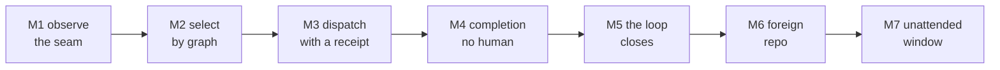

# 09 — Milestones, done-definitions, and how this plan is validated

Serves **R1** ("define what done looks like at each milestone") and **R3** ("something that could pass an 'investor' test — they can
beat up the plan, find any gaps, and pass or fail us"). Sections 01–08 describe a system. This section states the conditions under which
we are allowed to say it works, and the conditions under which this document should be rejected. Written 2026-08-31.

## 1. The done-definition template

**A milestone is closed by an OBSERVABLE, not by a claim** — not by a passing test suite, a commit, an agent reporting success, or a
human's recollection that it seemed to work. An observable is a command someone else can run and a result they can read without asking
us what it means. That is the output of the failure this project was stood down over: **20 mechanisms built, tested, hardened, and
called by nothing** (§01), every one with a green suite — evidence code does what its author thought, not that it runs. Every milestone
below is stated in this shape:

```
Mn — <one-sentence goal, future tense>
  OBSERVABLE      the command, and the result that closes it
  NOT IN SCOPE    what this milestone deliberately does not deliver
  STARTING POINT  MEASURED state today, with the deriving command
  RISK            the named way this milestone fails or lies
```

An observable is **admissible** only if it (1) is a command, not a description of a condition, (2) is runnable by someone who did not
build the thing — no undocumented environment, no "and then check the pane", (3) reads without interpretation, and (4) **fails on the
pre-milestone state.** Property 4 is the anti-vacuity leg from §06 applied to project management, and we owe it to a failure of our own:
brief §3.3 measured all 183 census rows carrying the four mandatory evidence fields with **zero missing** and exactly **one distinct
value** of `must_be_true` — satisfied syntactically, teaching nothing. A milestone whose observable already passes is that defect
wearing a Gantt chart.

**NO-CLAIM.** Property 4 makes an observable *discriminating*, not *sufficient* — an observable can fail-before, pass-after, and still
measure the wrong quantity. Guarding against that is §5's job.

## 2. The milestones

Seven, ordered by dependency — forced, not chosen: each consumes the capability the previous one produces, so there is no parallel path
here and no way to buy schedule with more agents.



`PROJECTED` — target-state chain, not measured data (rule 6); §04 carries the measured crate graph.

### M1 — One shared pane-state type will cross the observe→decide seam, so a filter change breaks the consumer at compile time

**OBSERVABLE.** `grep -rn "omp-types\|omp_types" crates/*/Cargo.toml | grep -v "^crates/omp-types/"` returns a non-empty result naming
both `tick-monitor` and `omp-orchestrator` — empty today. Second leg: a test feeding **real `tick-monitor` stdout** into the
`omp-orchestrator` parser, asserting a just-finished pane is visible as capacity. **NOT IN SCOPE.** Selection, dispatch, ack — M1
changes what the loop *sees*.

**STARTING POINT — with a recorded disagreement with the brief.** Brief §4 lists the *actionable* layer as **BROKEN** — "`idle_panes`
discards `NewlyIdle`; `free_capacity` derives from the same `is_dispatchable` filter." **I measured the current source and disagree:**

```
crates/tick-monitor/src/lib.rs:462-463   is_free_capacity() = ConfirmedIdle | NewlyIdle
crates/tick-monitor/src/main.rs:244      if live.is_free_capacity() && !excluded.contains(...)
crates/omp-orchestrator/src/lib.rs:461       .filter(|p| p.is_free_capacity)
strings ~/.local/bin/tick-monitor     | grep -c NEWLY_IDLE  -> 1
strings ~/.local/bin/omp-orchestrator | grep -c NEWLY_IDLE  -> 0
grep -rn '"NEWLY_IDLE"' crates/omp-orchestrator/src/main.rs -> 0 hits
grep -rn  "NEWLY_IDLE"  crates/omp-orchestrator/            -> 2 hits, both #[cfg(test)]
```

The producer emits `free_capacity` from its own predicate including `NewlyIdle`; the consumer counts its own field;
`crates/omp-orchestrator/src/lib.rs:451-457` comments the former defect, with a regression test at `src/main.rs:1049`. `MEASURED`: **the
filter defect is fixed in source** — the brief's row describes the tree at the 4h19m incident, not this commit, and should be amended in
place. What remains broken is the **seam**. `MEASURED`: the producer names the state; the production parser at `src/main.rs:383`
**never** does, deriving capacity from a JSON string list plus a `state == "IDLE"` fallback, so the NewlyIdle branch is exercised only
through a `#[cfg(test)]` constructor mapping a label production never reads. Three predicates agree by convention across a process
boundary with **no shared type and no end-to-end fixture** (`ls crates/omp-orchestrator/tests/` → `no_noop.rs`); `omp-orchestrator` has
no `path-depends-on` edge to `tick-monitor` (brief §3.4).

**RISK.** A live-seam refactor the repo has flagged as needing an owner: `crates/no-shell-gate/tests/wired_lanes.rs:679` records
`Observation` as "REQUIRES A DECISION not an allowance… the `free_capacity` seam". The failure mode is a partial migration adding a
shared type *beside* the two existing structs, producing three dialects where there were two — and the vocabulary that would collapse
the ack dialects is not merely unadopted but **blocked upstream**: `AckKind` and `DeliveryClass` sit behind `#[cfg(feature =
"messaging-fabric")]`, which needs `test-internals`, which upstream issue #46 removed from defaults, and `ObligationLedger` occurs zero
times. **NO-CLAIM.** M1 makes one defect class a compile error; a shared type with a wrong predicate is wrong in both crates.

### M2 — Selection will run through the graph kernel instead of queue recency

**OBSERVABLE.** A harness grep for `Command::new\("bv"\)` over `crates` (no extension filter — PV7) returns a hit outside `tests/`, plus
a differential test showing graph and recency selection choosing **different** beads on a fixture with a known blocking chain. Fails
today. **NOT IN SCOPE.** Dispatch — M2 decides *what* is worked; M3 delivers it.

**STARTING POINT.** `MEASURED` — the rule is enforced and the implementation is absent:

```
harness grep, pattern Command::new\("bv"\), path crates   -> No matches found
grep -rhoE 'Command::new\("[a-z...]+"\)' crates/ --include=*.rs | sort | uniq -c   # non-empty, so not a false zero
  11 git · 6 python3 · 6 br · 4 /bin/kill · 2 tmux · 2 /bin/sh · 1 strings · 1 omp · 1 grep · 1 cargo
```

`bv` is spawned **zero** times, while `crates/kernel-only-operator-hook/src/lib.rs:548` refuses raw queue reads with *"raw `br ready` is
blocked; use the `bv --robot-triage` queue kernel"*, allowlisted at `:24`. **We ship a prohibition whose sanctioned alternative nothing
calls**, and six `Command::new("br")` sites read the queue directly.

**RISK.** `bv v0.20.0` is at `/opt/homebrew/bin/bv`, not `~/.local/bin`; a foreign machine (M6) may lack it, so M2's dependency must be
a degradation path with a typed refusal, or M2 blocks M6. **NO-CLAIM.** Graph selection being *invoked* is not graph selection being
*better*: the differential leg proves the strategies differ, not that the graph wins.

### M3 — Dispatch will return an acknowledgement or a typed refusal, never a bare success

**OBSERVABLE.** A planted-known-bad fixture in which the transport reports success while no packet arrives, and the dispatcher's verdict
is a refusal rather than `Delivered` — closed when that test exists and fails when the ack check is removed (mutation leg).
**NOT IN SCOPE.** Detecting whether the worker *finished* (M4); M3 ends at "the packet provably arrived".

**STARTING POINT.** `MEASURED` — brief §4 lists actuate as **DOES NOT EXIST**: a human types into panes. Both polarities have fired.
`cp-z42vu` (`README.md:155`, `dispatch-silence-watch/src/lib.rs:10`): a send returned **`success:[4]` while the packet never arrived**;
the inverse fired the same session.

**RISK.** The available ack is *terminal inspection*: `receiver-receipt` spawns `tmux`
(`crates/receiver-receipt/src/bin/receiver-receipt.rs:19`), and reading a rendering is not a protocol. `ntm --robot-send` already
refuses codex panes with *"cod composer not visible"* (`cp-nq2s9`, `README.md:152`) — a screen-state guard misreporting as a delivery
error, a class a rendering-based ack inherits. **NO-CLAIM.** An ack proves *arrival*, not that the agent read or accepted it.

### M4 — Completion will be detected by the loop, not by a human looking

**OBSERVABLE.** A stored trace in which a bead moves to closed with **zero** human-originated events — `human_touch_count == 0`,
re-readable. **NOT IN SCOPE.** Whether the work is *good* (the verify gate), and autonomy end to end (M5).

**STARTING POINT.** `MEASURED` — the vocabulary exists, nothing reaches it, and brief §4 records that every completion this session was
found by a human looking.

```
harness grep "Finished" in crates -> 8 hits, ALL in ack-spine/src/followup.rs
harness grep "ack-spine|ack_spine" in crates/*/Cargo.toml -> only ack-spine's own package/bin/lib names
```

`FollowUpVerdict::Finished { bead_id, close_verdict }` is declared at `ack-spine/src/followup.rs:27`, distinguished from the
silent-past-deadline arm by a mutation leg at `:205`: a good type, a mutation test, **zero callers outside its own file**, in a crate
with **zero dependents** — occurrence 21 of the class.

**RISK.** A worker asserting `Finished` is a *claim*, and this plan's thesis is that claims are what fail. M4 must land the ack path
without letting worker-asserted done become the close condition, or it manufactures the false-completion signal the project exists to
eliminate. **NO-CLAIM.** M4 delivers *detection*; detection without verification is faster wrongness.

### M5 — The loop will close a bead end to end with no human in the trace

**OBSERVABLE.** The plan's headline claim, **never observed once**: ten consecutive closes from one recorded run where the union of
human-originated events is empty, every refusal in the window is accounted for by a named verdict, and the beads are independently
confirmable via `br list --status closed --json`. **NOT IN SCOPE.** Duration (M7) and portability (M6) — M5 is one closed loop, once,
ten times.

**STARTING POINT.** `MEASURED`: three of five layers in brief §4 are non-functional (actionable BROKEN, actuate and complete DO NOT
EXIST), and consume produced **162 consecutive refused ticks over 4.2 hours** (`DISPATCH_RETRY_BLOCKED`). Board right now:

```
for s in open in_progress blocked closed; do printf "%s " "$s"; br list --status $s | grep -c .; done
   open 19 · in_progress 22 · blocked 3 · closed 30
```

`MEASURED`: 74 beads, against the brief §3.7 stand-down snapshot of 75 (28/25/19/2) — the board moved mid-stand-down. Reported rather
than reconciled, because silently picking whichever number suits the sentence is the defect this document exists to prevent.

**RISK.** M5 is where maximum pressure belongs: everything before it is infrastructure demonstrable in isolation, while M5 is the first
milestone whose failure invalidates the thesis rather than delaying it, and there is **no evidence for or against it.** **NO-CLAIM.**
Ten closes is an existence proof, not a rate.

### M6 — A repository that is not this one will run the orchestrator on a machine that has never built it

**OBSERVABLE.** On a host with no build cache for this workspace, a documented install command followed by a first tick against a
foreign repo producing a readable verdict — closed by a transcript from that host that a third party can reproduce. **NOT IN SCOPE.**
Unattended operation (M7); M6 is one successful cold first tick elsewhere.

**STARTING POINT.** `MEASURED`: never attempted. The `installer` crate exists and is **isolated** — on neither side of any of the 18
`path-depends-on` edges (brief §3.4), so nothing consumes it. Host coupling shows in the binary table: `bv` under `/opt/homebrew`,
`cargo` a shim at `~/.rch/shims/cargo`, the mirror on `/Volumes/ZestData/…`.

**RISK.** Absolute paths and host assumptions invisible until the first foreign host, plus a per-binary version-probe map. `MEASURED`
here, twice, and **tmux is well-behaved** — brief §3.1 ("no handshake") and its first correction ("exits 0 while failing") are both
refuted:

```
tmux -V                              -> tmux 3.6a                       exit 0
tmux --version >out 2>err            -> stdout 0 bytes, stderr 158       exit 1
tmux --version 2>&1 | head -1        -> $?=0, PIPESTATUS=(1 0)    <- head's status, not tmux's
```

tmux fails, says so on stderr, writes nothing to stdout, returns 1. The "exits 0" was a probe reading `$?` after a pipeline; **the exit
code that lied was our harness, not the subject.** The hazard inverts: `--version` answers 8/9 of our binaries and `-V` answers 5/9, so
a probe treating non-zero as ABSENT records tmux — present, working, 3.6a — as MISSING, a false negative on the one binary through which
we read pane truth. Verified precedent, in `dicklesworthstone-mirror/pi_agent_rust/src/doctor.rs`, cited by **construct** because a bare
line number is unverifiable across checkouts — these constructs sit one line earlier in `~/Developer/pi_agent_rust` and its tests 22
lines earlier, which is what made three of us disagree about the "same" line: `fn check_tool` (`:924`), the naive success arm
`Ok(output) if output.status.success()` (`:950`), the two-signal arm combining `discovered_path.is_some()` with
`probe_failure_is_known_nonfatal` (`:967-968`), that predicate itself (`:1052`) whose one-tool allowlist `if tool.ne("sh")` (`:1057`) is
the gap, and the independent presence signal `fn which_tool` (`:1066`). The strongest part is that **both arms are pinned by tests** —
`check_tool_falls_back_when_probe_args_are_unsupported` (`:13948`) and `check_tool_reports_invocation_failure_for_broken_executable`
(`:13964`), the second being the leg we would skip, proving the fallback did not become a blanket amnesty. Verdict: **ADOPT the
two-signal structure and both tests, with a named gap** — the allowlist covers exactly one tool, so a doctor built on this code marks
tmux MISSING today. **NO-CLAIM.** M6 proves portability to one host and only "did install, once"; §07–§08 own the general case.

### M7 — The fleet will run unattended for a defined window with every refusal accounted for

**OBSERVABLE.** A window of stated length in which human-originated events are zero, every tick produced either progress or a named
refusal, and no refusal class recurs beyond its escalation threshold (`FINDING_THRESHOLD == 3`,
`crates/finding-dispatch/tests/recurrence.rs:83`). **NOT IN SCOPE.** Increasing the window — M7 is the first defensible number, not the
best one.

**STARTING POINT.** `MEASURED`: the longest unattended interval observed to date is a **failure** — 4h 19m of fleet idleness while every
watchdog reported healthy. We have an unattended duration; it is the duration of an undetected outage.

**RISK.** Goodhart, the sharpest risk here. **An unattended window achieved by widening tolerance is a regression that scores as
progress.** M7 is trivially closable by deleting refusals, so acceptance requires the refusal *inventory* to be non-empty and unchanged
in kind across the window — a silent loop and a healthy loop are the two states this project exists to distinguish. **NO-CLAIM.** M7
measures *survival*: a loop running unattended a day producing nothing satisfies M7 and is worthless.

## 3. Plan validation — how this document is checked

R3 wants a document an investor can pass or fail, so it must be checkable, not merely well written.

- **PV1 — Every number carries the command that derives it.** A bare number is a guess in a uniform.
- **PV2 — `MEASURED` and `PROJECTED` never share a sentence.** The best review finds a `MEASURED` that is a `PROJECTED`.
- **PV3 — Every load-bearing claim ends with a `NO-CLAIM`.** An unbounded claim is read as covering more than it does.
- **PV4 — Every milestone has an admissible observable** (§1). One that cannot be failed cannot be passed.
- **PV5 — Gate claims are floor-raises, never guarantees.** `guarantees`, `proves`, `makes impossible` in a gate header is itself a
  defect — the reader stops looking. Gates raise a defect class's cost, not its possibility.
- **PV6 — No unstated denominators.** Three measured instances. **"81 JSON-RPC methods, 17 of 81 used"** — inherited, no producing
  command, **not re-derivable** on 2026-08-31, retired at `AGENTS.md:247` (`grep -n "17 used\|81 JSON" AGENTS.md` returns only notices
  at 247, 582, 615). **A drift ratio where excluding a foreign binary decremented the wrong variable, turning `2/2` into `2/0`** (brief
  §6 rule 4). And **the brief's own gate headline**, "1 of 8 / 5 of 8", refuted by the table one line above it — corrected to 2 of 8 and
  4 of 8 (§5).
- **PV7 — A zero must be distinguished from a silence, and a not-found must name its search space.** A command that returns **empty
  instead of failing** is indistinguishable from a true zero, so every "nothing found" built on one is unfalsifiable. Three mechanisms
  `MEASURED` in one session — (a) and (c) by me, (b) by a sibling. (a) Shell `grep -r … --include='*.rs'` returns **0** for
  `forbid(unsafe_code)` in `crates` while the harness grep returns **55 files** for the identical pattern; dropping `--include` restores
  it. (b) An extension filter aimed at the wrong language — `--include='*.rs'` across `ntm`, **a Go repository** — returned zero, and
  structural absence was read as semantic absence; re-derived without the filter it is 93+ files, and the "no prior art" verdict it
  produced was false. (c) A pipeline launders a failure into a success: `tmux --version 2>&1 | head -1` yields `$?=0` with
  `PIPESTATUS=(1 0)`. So **"I grepped and got nothing" is not a finding** — a publishable not-found names the exact command *and* why
  that search space was the right one. Every zero in this section was re-derived with the harness grep (M2, M4, M6). The pattern is the
  finding: **four false-zero or mis-transcribed measurements in one session, three of them the conductor's, and every one caught by a
  sibling re-deriving rather than reading.** Re-derivation, not review, is what caught them — which is an argument for the loop this
  plan proposes.

- **PV8 — A citation names the construct, not just the line.** `doctor.rs:924` is unverifiable without knowing whether 924 is the
  function, the success arm, or the predicate; line numbers drift under a reformat and differ *between checkouts of the same repo*.
  `MEASURED`: the six constructs above sit at `:924/:950/:1052/:1057/:1066` in the mirror and one line earlier in
  `~/Developer/pi_agent_rust`, its tests 22 lines earlier — producing a three-way disagreement in which nobody was wrong. Write
  "`doctor.rs:950` (the naive success arm)": a named construct survives both.

**NO-CLAIM.** PV1–PV8 are necessary, not sufficient. A document can satisfy all eight and still be wrong about what matters. §5 exists
because rule-compliance is not correctness.

## 4. The self-check that runs against this plan

`PROJECTED` — design spec. A binary, `plan-check`, will read `docs/PLAN.md` and its sections, failing on:

| id | fails when | enforces |
|---|---|---|
| PC1 | a numeral appears in prose with no command in the same block | PV1 |
| PC2 | `guarantees` / `proves` / `makes impossible` appears within a gate section | PV5 |
| PC3 | an `Mn` milestone heading has no `OBSERVABLE` field | PV4 |
| PC4 | a sentence marked `MEASURED` contains a projection verb (`will`, `would`, `should`) | PV2 |
| PC5 | a section has no `NO-CLAIM` paragraph | PV3 |
| PC6 | a ratio appears whose denominator has no separate derivation | PV6 |
| PC7 | a zero-result claim names no search space, or no failure-vs-empty distinction | PV7 |
| PC8 | a `path:line` citation names no construct at that line | PV8 |

It will emit the repo's envelope — `{"schema_version":"plan-check/v1","command":"doctor","status":…}` — matching `omp-inventory-map/v1`
(brief §3.2) so one reader handles both, and satisfy **ADDRESSABLE** (brief §3.6): `plan-check --help` will name the command that runs
it, because `omp-inventory-map --help` returns `CONFIG_ERROR unknown argument --help`, and a correct, undiscoverable gate does not
exist. It ships a **known-bad leg** — planted bare number, planted `guarantees`, observable-less milestone — since known-good-only
fixtures are vacuity again.

**This checker does not exist.** `MEASURED`: `ls crates/ | grep plan-check` returns nothing; the workspace has 26 crates and none is
this one. It is the sharpest thing an investor can hold against this document: **a plan that asserts a discipline it does not enforce is
exactly the vacuity defect we found in our own census.** Brief §3.3 measured 183 rows meeting a four-field requirement with one distinct
value across all 183 — met and meaningless. §3 is in that position now: eight rules enforced by the author's attention.

**NO-CLAIM.** `plan-check` would enforce *form*. Nothing in this design detects a false `MEASURED` whose command was never run, or an
observable that is admissible and irrelevant. Those need a reader.

## 5. The grading rubric — how to fail us

Score each dimension PASS or FAIL. **We are asking to be failed on at least one** — a reviewer who passes all six has not read
adversarially, and a document engineered to pass all six is useless to us.

| dimension | PASS looks like | FAIL looks like |
|---|---|---|
| **The problem is real** | The failure class is shown with counts and a derivation, and it is a class rather than an anecdote | The pain is asserted, or one story is generalised into a market |
| **The measurement is honest** | Numbers re-derive; `MEASURED`/`PROJECTED` hold; retired figures stay retired; every not-found names its search space | A number that will not re-derive; a projection wearing `MEASURED`; a floating denominator; a not-found with no search space; a bare `path:line` with no construct |
| **The architecture is sound** | Typed transitions with refusal arms; a timeout is not a verdict; one vocabulary crosses each seam | Boolean success paths; convention-only seams; a refusal no consumer reads |
| **The gates actually bite** | Each gate has known-bad, known-good, mutation, anti-vacuity, and is ADDRESSABLE | Attack-only or defence-only suites; a gate no documented command runs; `guarantees` in a header |
| **The adoption path is credible** | A cold foreign host installs and takes a first tick, with degradation for absent dependencies | Installability asserted and never attempted; hard dependency on host-specific paths |
| **The team tells on itself** | The document names defects its own author committed, and records disagreement with its own brief | Every finding indicts a worker; no self-indictment; no open contradiction |

**Where we expect to fail today, stated first so a reviewer can check our self-assessment.** *Gates actually bite → FAIL*: `MEASURED`, 2
of 8 gates have all four legs and 4 of 8 have no mutation leg (brief §3.5, recomputed — its own headline said 1 and 5, refuted by the
table above it); `path-literal-guard` has a known-bad with **no known-good**, and over-strict gates get routed around, a slower death
than no gate. *Adoption path is credible → FAIL*: `MEASURED`, never attempted (M6); `installer` is isolated in the dependency graph.
*Architecture is sound → CONTESTED*: `MEASURED`, 6 Verdict-shaped types with no shared trait, 17 ack/receipt types in 3 dialects, 4
colliding names.

**NO-CLAIM.** This rubric grades *this document*, not the software. A document that passes all six describes a system that may still not
work — which is why M5 exists and why it is unproven.

## 6. What is proven and what is not

BANKED rows cite evidence; UNPROVEN rows name the experiment that settles them. No row sits between.

| BANKED — with evidence | UNPROVEN — with the experiment that settles it |
|---|---|
| The build-and-never-call class is real and frequent here — **20 occurrences**, plus a 21st found while writing M4 (harness grep `Finished` in `crates` → 8 hits all in `ack-spine/src/followup.rs`; harness grep of `crates/*/Cargo.toml` shows `ack-spine` has zero dependents) | **The loop can close without a human.** Never observed once. Settled by M5: ten consecutive closes from one recorded run with zero human-originated events. |
| Silent refusal is real — **162 consecutive refused ticks over 4.2h** (`DISPATCH_RETRY_BLOCKED`), and **178 ticks** of an idle-capacity alarm written to a file with one writer and zero readers | **The substrate installs elsewhere.** `MEASURED`: never attempted; `installer` is isolated in the 18-edge graph. Settled by M6: a cold foreign host, documented install, first tick, reproducible transcript. |
| Transport lies in both directions — `cp-z42vu` returned **`success:[4]`** with no packet delivered (`README.md:155`); the inverse fired the same session | **Verification is cheaper than review.** No instrumentation exists. Settled by recording human-seconds per closed bead before and after M4 on the same bead mix — that ratio is the whole economic argument and is unmeasured. |
| The evidence-field discipline can be satisfied vacuously — **183/183 rows complete, 1 distinct `must_be_true`** (brief §3.3) | **Graph selection beats recency.** `MEASURED`: `bv` is spawned zero times. Settled by M2's differential test plus a measured close-rate comparison on a fixed bead set. |
| The observe layer works and the NewlyIdle filter defect is **fixed in source** — `crates/omp-orchestrator/src/lib.rs:461`, regression test at `src/main.rs:1049` (contradicts brief §4; see M1) | **The seam cannot silently diverge again.** `MEASURED`: no shared type crosses it; production never names `NEWLY_IDLE` (`grep -rn '"NEWLY_IDLE"' crates/omp-orchestrator/src/main.rs` → 0). Settled by M1. |
| The one hard rule is enforced mechanically — a Rust gate walks `git ls-files` and fails on `.sh`/`.py`, exemption list empty | **The gates bite under attack.** `MEASURED`: 2 of 8 gates have four legs, 4 of 8 have no mutation leg. Settled by bringing all 8 to four legs plus ADDRESSABLE, and a planted-known-bad campaign per gate. |
| Failing closed with a remediation hint works — `fh` MCP returns a typed `SERVE_INPUT_STALE` naming the moved mirror HEAD (`5dec4212…` → `ecdea397…`) rather than an empty result | **This plan enforces its own discipline.** `MEASURED`: `ls crates/ \| grep plan-check` → empty. Settled by shipping `plan-check` (§4) with its known-bad fixture. |

**NO-CLAIM.** This section defines the conditions under which a milestone may be called done, and records what is and is not proven as
of 2026-08-31 on one repository and one machine. It does not establish that these are the right milestones, that seven is the right
number, that the ordering is minimal, or that closing all seven produces a system anyone wants. It makes no schedule claim — no date,
duration, or effort estimate appears above, because none is measured. The most important row here is `M5 — UNPROVEN`; no rigor elsewhere
substitutes for it.
